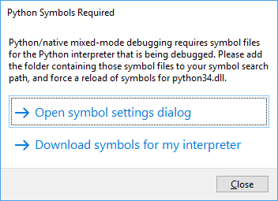
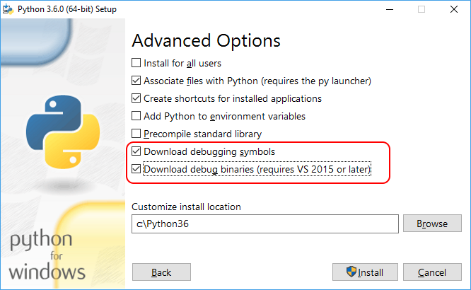
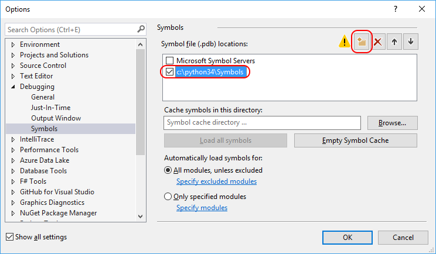

# Install debugging symbols for Python interpreters

To provide a full debugging experience, the [mixed-mode Python debugger](debugging-mixed-mode-c-cpp-python-in-visual-studio.md) in Visual Studio needs debug symbols for the Python interpreter being used to parse numerous internal data structures. For *python27.dll*, for example, the corresponding symbol file is *python27.pdb*; for *python36.dll*, the symbol file is *python36.pdb*. Each version of the interpreter also supplies symbol files for a variety of modules.

With Visual Studio 2017 and later, the Python 3 and Anaconda 3 interpreters automatically install their respective symbols and Visual Studio finds those symbols automatically. For Visual Studio 2015 and earlier, or when using other interpreters, you need to download symbols separately and then point Visual Studio to them through the **Tools** > **Options** dialog in the **Debugging** > **Symbols** tab. These steps are detailed in the following sections.

Visual Studio may prompt you when it needs symbols, typically when starting a mixed-mode debugging session. In this case, it displays a dialog with two choices:

- **Open symbol settings dialog** opens the **Options** dialog to the **Debugging** > **Symbols** tab.
- **Download symbols for my interpreter** opens this present documentation page, in which case, select **Tools** > **Options** and navigate to the **Debugging** > **Symbols** tab to continue.

    

## Download symbols

- Python 3.5 and later: acquire debug symbols through the Python installer. Select **Custom installation**, select **Next** to get to **Advanced Options**, then select the boxes for **Download debugging symbols** and **Download debug binaries**:

    

    The symbol files (*.pdb*) are then found in the root installation folder (symbol files for individual modules are in the *DLLs* folder as well). Because of this, Visual Studio finds them automatically, and no further steps are needed.

- Python 3.4.x and earlier: symbols are available as downloadable *.zip* files from the [official distributions](#official-distributions) or [Enthought Canopy](#enthought-canopy). After downloading, extract files to a local folder to continue, such as a *Symbols* folder within the Python folder.

    > [!Important]
    > Symbols differ between minor builds of Python, and between 32-bit and 64-bit builds, so you want to exactly match the versions. To check the interpreter being used, expand the **Python Environments** *node* under your project in **Solution Explorer** and note the environment name. Then switch to the **Python Environments** *window* and note the install location. Then open a command window in that location and start *python.exe*, which displays the exact version and whether it's 32-bit or 64-bit.

- For any other third-party Python distribution such as ActiveState Python: contact the authors of that distribution and request them to provide you with symbols. WinPython, for its part, incorporates the standard Python interpreter without changes, so use symbols from the official distribution for the corresponding version number.

## Point Visual Studio to the symbols

If you downloaded symbols separately, follow the steps below to make Visual Studio aware of them. If you installed symbols through the Python 3.5 or later installer, Visual Studio finds them automatically.

1. Select the **Tools** > **Options** menu and navigate to **Debugging** > **Symbols**.

1. Select the **Add** button on the toolbar (outlined below), enter the folder where you expanded the downloaded symbols (which is where *python.pdb* is located, such as *c:\python34\Symbols*, shown below), and select **OK**.

    

1. During a debugging session, Visual Studio might also prompt you for the location of a source file for the Python interpreter. If you've downloaded source files (from [python.org/downloads/](https://www.python.org/downloads/), for example), then you of course can point to them as well.

> [!Note]
> The symbol caching features shown in the dialog are used to create a local cache of symbols obtained from an online source. These features aren't needed with the Python interpreter symbols as symbols are already present locally. In any case, refer to [Specify symbols and source files in the Visual Studio debugger](../debugger/specify-symbol-dot-pdb-and-source-files-in-the-visual-studio-debugger.md) for details.

## Official distributions

| Python version | Downloads |
| --- | --- |
| 3.5 and later | Install symbols through the Python installer. |
| 3.4.4 | [32-bit](https://www.python.org/ftp/python/3.4.4/python-3.4.4-pdb.zip) - [64-bit](https://www.python.org/ftp/python/3.4.4/python-3.4.4.amd64-pdb.zip) |
| 3.4.3 | [32-bit](https://www.python.org/ftp/python/3.4.3/python-3.4.3-pdb.zip) - [64-bit](https://www.python.org/ftp/python/3.4.3/python-3.4.3.amd64-pdb.zip) |
| 3.4.2 | [32-bit](https://www.python.org/ftp/python/3.4.2/python-3.4.2-pdb.zip) - [64-bit](https://www.python.org/ftp/python/3.4.2/python-3.4.2.amd64-pdb.zip) |
| 3.4.1 | [32-bit](https://www.python.org/ftp/python/3.4.1/python-3.4.1-pdb.zip) - [64-bit](https://www.python.org/ftp/python/3.4.1/python-3.4.1.amd64-pdb.zip) |
| 3.4.0 | [32-bit](https://www.python.org/ftp/python/3.4.0/python-3.4.0-pdb.zip) - [64-bit](https://www.python.org/ftp/python/3.4.0/python-3.4.0.amd64-pdb.zip) |
| 3.3.5 | [32-bit](https://www.python.org/ftp/python/3.3.5/python-3.3.5-pdb.zip) - [64-bit](https://www.python.org/ftp/python/3.3.5/python-3.3.5.amd64-pdb.zip) |
| 3.3.4 | [32-bit](https://www.python.org/ftp/python/3.3.4/python-3.3.4-pdb.zip) - [64-bit](https://www.python.org/ftp/python/3.3.4/python-3.3.4.amd64-pdb.zip) |
| 3.3.3 | [32-bit](https://www.python.org/ftp/python/3.3.3/python-3.3.3-pdb.zip) - [64-bit](https://www.python.org/ftp/python/3.3.3/python-3.3.3.amd64-pdb.zip) |
| 3.3.2 | [32-bit](https://www.python.org/ftp/python/3.3.2/python-3.3.2-pdb.zip) - [64-bit](https://www.python.org/ftp/python/3.3.2/python-3.3.2.amd64-pdb.zip) |
| 3.3.1 | [32-bit](https://www.python.org/ftp/python/3.3.1/python-3.3.1-pdb.zip) - [64-bit](https://www.python.org/ftp/python/3.3.1/python-3.3.1.amd64-pdb.zip) |
| 3.3.0 | [32-bit](https://www.python.org/ftp/python/3.3.0/python-3.3.0-pdb.zip) - [64-bit](https://www.python.org/ftp/python/3.3.0/python-3.3.0.amd64-pdb.zip) |
| 2.7.15 | [32-bit](https://www.python.org/ftp/python/2.7.15/python-2.7.15-pdb.zip) - [64-bit](https://www.python.org/ftp/python/2.7.15/python-2.7.15.amd64-pdb.zip) |
| 2.7.14 | [32-bit](https://www.python.org/ftp/python/2.7.14/python-2.7.14-pdb.zip) - [64-bit](https://www.python.org/ftp/python/2.7.14/python-2.7.14.amd64-pdb.zip) |
| 2.7.13 | [32-bit](https://www.python.org/ftp/python/2.7.13/python-2.7.13-pdb.zip) - [64-bit](https://www.python.org/ftp/python/2.7.13/python-2.7.13.amd64-pdb.zip) |
| 2.7.12 | [32-bit](https://www.python.org/ftp/python/2.7.12/python-2.7.12-pdb.zip) - [64-bit](https://www.python.org/ftp/python/2.7.12/python-2.7.12.amd64-pdb.zip) |
| 2.7.11 | [32-bit](https://www.python.org/ftp/python/2.7.11/python-2.7.11-pdb.zip) - [64-bit](https://www.python.org/ftp/python/2.7.11/python-2.7.11.amd64-pdb.zip) |
| 2.7.10 | [32-bit](https://www.python.org/ftp/python/2.7.10/python-2.7.10-pdb.zip) - [64-bit](https://www.python.org/ftp/python/2.7.10/python-2.7.10.amd64-pdb.zip) |
| 2.7.9 | [32-bit](https://www.python.org/ftp/python/2.7.9/python-2.7.9-pdb.zip) - [64-bit](https://www.python.org/ftp/python/2.7.9/python-2.7.9.amd64-pdb.zip) |
| 2.7.8 | [32-bit](https://www.python.org/ftp/python/2.7.8/python-2.7.8-pdb.zip) - [64-bit](https://www.python.org/ftp/python/2.7.8/python-2.7.8.amd64-pdb.zip) |
| 2.7.7 | [32-bit](https://www.python.org/ftp/python/2.7.7/python-2.7.7-pdb.zip) - [64-bit](https://www.python.org/ftp/python/2.7.7/python-2.7.7.amd64-pdb.zip) |
| 2.7.6 | [32-bit](https://www.python.org/ftp/python/2.7.6/python-2.7.6-pdb.zip) - [64-bit](https://www.python.org/ftp/python/2.7.6/python-2.7.6.amd64-pdb.zip) |
| 2.7.5 | [32-bit](https://www.python.org/ftp/python/2.7.5/python-2.7.5-pdb.zip) - [64-bit](https://www.python.org/ftp/python/2.7.5/python-2.7.5.amd64-pdb.zip) |
| 2.7.4 | [32-bit](https://www.python.org/ftp/python/2.7.4/python-2.7.4-pdb.zip) - [64-bit](https://www.python.org/ftp/python/2.7.4/python-2.7.4.amd64-pdb.zip) |
| 2.7.3 | [32-bit](https://www.python.org/ftp/python/2.7.3/python-2.7.3-pdb.zip) - [64-bit](https://www.python.org/ftp/python/2.7.3/python-2.7.3.amd64-pdb.zip) |
| 2.7.2 | [32-bit](https://www.python.org/ftp/python/2.7.2/python-2.7.2-pdb.zip) - [64-bit](https://www.python.org/ftp/python/2.7.2/python-2.7.2.amd64-pdb.zip) |
| 2.7.1 | [32-bit](https://www.python.org/ftp/python/2.7.1/python-2.7.1-pdb.zip) - [64-bit](https://www.python.org/ftp/python/2.7.1/python-2.7.1.amd64-pdb.zip) |

## Enthought Canopy

Enthought Canopy provides symbols for its binaries starting from version 1.2. They are automatically installed alongside with the distribution, but you still need to manually add the folder containing them to symbol path as described earlier. For a typical per-user installation of Canopy, the symbols are located in *%UserProfile%\AppData\Local\Enthought\Canopy\User\Scripts* for the 64-bit version and *%UserProfile%\AppData\Local\Enthought\Canopy32\User\Scripts* for the 32-bit version.

Enthought Canopy 1.1 and earlier, as well as Enthought Python Distribution (EPD), do not provide interpreter symbols, and are therefore not compatible with mixed-mode debugging.
