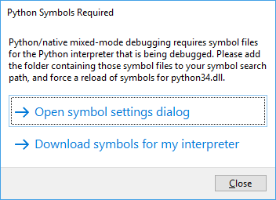

# Installing Debugging Symbols for Python Interpreters

To provide a full debugging experience, the [mixed-mode debugger](debugging-mixed-mode.md) in Python Tools for Visual Studio (PTVS) needs to parse numerous internal data structures within the Python interpreter being used. This requires debug symbols for the interpreter itself. For example, the corresponding symbol file for python27.dll is python27.pdb.

When PTVS detects that it needs symbols, it prompts you to either point to a folder containing symbol files or to download them:

 

You can download symbol files from the [official distribution](#official-distribution) or [Enthought Canopy](#enthought-canopy) as described below. If you're using a third-party Python distribution such as ActiveState Python, you'll need to contact the authors of that distribution and request them to provide you with symbols. (WinPython, however, incorporates the standard Python interpreter without changes, so use symbols from the official distribution for the corresponding version number.)

Once you've obtained the .pdb files for your interpreter, you make PTVS aware of them as follows so that they're automatically loaded when a debugging sessions starts:

1. Select the **Tools > Options** menu command, then navigate to **Debugging > Symbols**:

1. Select the Add button on the toolbar (the left-most button shown above, to the right of the ! icon), navigate to the folder containing the .pdb files, and select **OK**.

## Official distribution

With Python 3.5 and later, you can include debug symbols through the installer (both through a new installation or by modifying an existing one). Select **Custom installation**, select **Next** to get to **Advanced Options**, then and select the boxes for "Download debugging symbols** and **Download debug binaries**:

For Python 3.4.x and earlier, symbols are available as downloadable .zip files. After downloading, extract those files to a folder and follow the instructions in the previous section to register them with PTVS.

| Python version | Downloads | 
| --- | --- | 
| 3.4.4 | [32-bit](https://www.python.org/ftp/python/3.4.4/python-3.4.4-pdb.zip) - [64-bit](https://www.python.org/ftp/python/3.4.4/python-3.4.4.amd64-pdb.zip) |
| 3.4.3 | [32-bit](https://www.python.org/ftp/python/3.4.3/python-3.4.3-pdb.zip) - [64-bit](https://www.python.org/ftp/python/3.4.3/python-3.4.3.amd64-pdb.zip) |
| 3.4.2 | [32-bit](https://www.python.org/ftp/python/3.4.2/python-3.4.2-pdb.zip) - [64-bit](https://www.python.org/ftp/python/3.4.2/python-3.4.2.amd64-pdb.zip) |
| 3.4.1 | [32-bit](https://www.python.org/ftp/python/3.4.1/python-3.4.1-pdb.zip) - [64-bit](https://www.python.org/ftp/python/3.4.1/python-3.4.1.amd64-pdb.zip) |
| 3.4.0 | [32-bit](https://www.python.org/ftp/python/3.4.0/python-3.4.0-pdb.zip) - [64-bit](https://www.python.org/ftp/python/3.4.0/python-3.4.0.amd64-pdb.zip) |
| 3.3.5 | [32-bit](http://www.python.org/ftp/python/3.3.5/python-3.3.5-pdb.zip) - [64-bit](http://www.python.org/ftp/python/3.3.5/python-3.3.5.amd64-pdb.zip) |
| 3.3.4 | [32-bit](http://python.org/ftp/python/3.3.4/python-3.3.4-pdb.zip) - [64-bit](http://python.org/ftp/python/3.3.4/python-3.3.4.amd64-pdb.zip) |
| 3.3.3 | [32-bit](http://python.org/ftp/python/3.3.3/python-3.3.3-pdb.zip) - [64-bit](http://python.org/ftp/python/3.3.3/python-3.3.3.amd64-pdb.zip) |
| 3.3.2 | [32-bit](http://python.org/ftp/python/3.3.2/python-3.3.2-pdb.zip) - [64-bit](http://python.org/ftp/python/3.3.2/python-3.3.2.amd64-pdb.zip) |
| 3.3.1 | [32-bit](http://python.org/ftp/python/3.3.1/python-3.3.1-pdb.zip) - [64-bit](http://python.org/ftp/python/3.3.1/python-3.3.1.amd64-pdb.zip) |
| 3.3.0 | [32-bit](http://python.org/ftp/python/3.3.0/python-3.3.0-pdb.zip) - [64-bit](http://python.org/ftp/python/3.3.0/python-3.3.0.amd64-pdb.zip) |
| 2.7.11 | [32-bit](https://www.python.org/ftp/python/2.7.11/python-2.7.11-pdb.zip) - [64-bit](https://www.python.org/ftp/python/2.7.11/python-2.7.11.amd64-pdb.zip) |
| 2.7.10 | [32-bit](https://www.python.org/ftp/python/2.7.10/python-2.7.10-pdb.zip) - [64-bit](https://www.python.org/ftp/python/2.7.10/python-2.7.10.amd64-pdb.zip) |
| 2.7.9 | [32-bit](https://www.python.org/ftp/python/2.7.9/python-2.7.9-pdb.zip) - [64-bit](https://www.python.org/ftp/python/2.7.9/python-2.7.9.amd64-pdb.zip) |
| 2.7.8 | [32-bit](https://www.python.org/ftp/python/2.7.8/python-2.7.8-pdb.zip) - [64-bit](https://www.python.org/ftp/python/2.7.8/python-2.7.8.amd64-pdb.zip) |
| 2.7.7 | [32-bit](https://www.python.org/ftp/python/2.7.7/python-2.7.7-pdb.zip) - [64-bit](https://www.python.org/ftp/python/2.7.7/python-2.7.7.amd64-pdb.zip) |
| 2.7.6 | [32-bit](http://python.org/ftp/python/2.7.6/python-2.7.6-pdb.zip) - [64-bit](http://python.org/ftp/python/2.7.6/python-2.7.6.amd64-pdb.zip) |
| 2.7.5 | [32-bit](http://python.org/ftp/python/2.7.5/python-2.7.5-pdb.zip) - [64-bit](http://python.org/ftp/python/2.7.5/python-2.7.5.amd64-pdb.zip) |
| 2.7.4 | [32-bit](http://python.org/ftp/python/2.7.4/python-2.7.4-pdb.zip) - [64-bit](http://python.org/ftp/python/2.7.4/python-2.7.4.amd64-pdb.zip) |
| 2.7.3 | [32-bit](http://python.org/ftp/python/2.7.3/python-2.7.3-pdb.zip) - [64-bit](http://python.org/ftp/python/2.7.3/python-2.7.3.amd64-pdb.zip) |
| 2.7.2 | [32-bit](http://python.org/ftp/python/2.7.2/python-2.7.2-pdb.zip) - [64-bit](http://python.org/ftp/python/2.7.2/python-2.7.2.amd64-pdb.zip) |
| 2.7.1 | [32-bit](http://python.org/ftp/python/2.7.1/python-2.7.1-pdb.zip) - [64-bit](http://python.org/ftp/python/2.7.1/python-2.7.1.amd64-pdb.zip) |

## Enthought Canopy

Enthought Canopy provides symbols for its binaries starting from version 1.2. They are automatically installed alongside with the distribution, but you'll still need to manually add the folder containing them to symbol path as described earlier. For a typical per-user installation of Canopy, the symbols are located in `%UserProfile%\AppData\Local\Enthought\Canopy\User\Scripts` for the 64-bit version and `%UserProfile%\AppData\Local\Enthought\Canopy32\User\Scripts` for the 32-bit version.

Enthought Canopy 1.1 and earlier, as well as Enthought Python Distribution (EPD), do not provide interpreter symbols, and are therefore not compatible with mixed-mode debugging.