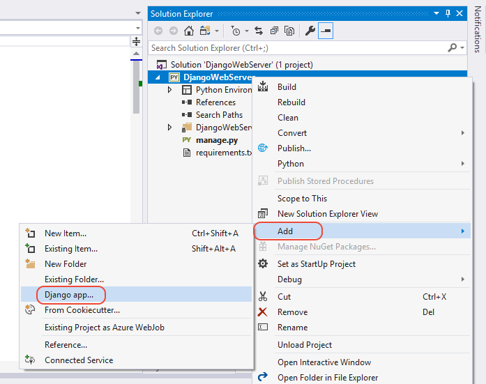
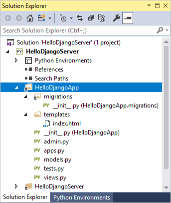
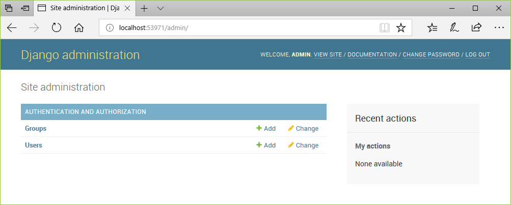
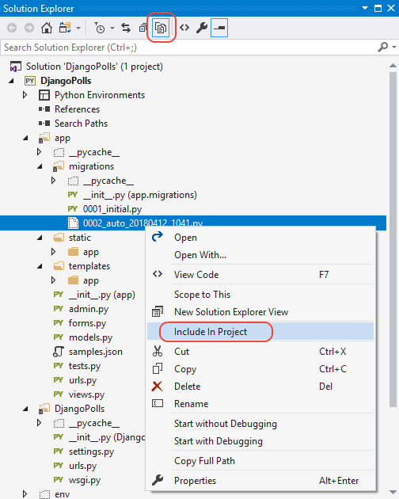

# Getting started with Django in Visual Studio

[Django](https://www.djangoproject.com/) is a high-level Python framework designed for rapid, secure, and scalable web development. Python support in Visual Studio provides several project templates that create the necessary structures for Django-based web apps.

| Template | Project contents |
| --- | --- |
| Blank Django Web Project<br/>(this article) | Minimal boilerplate code for a Django project with no apps. |
| [Django Web Project](python-django-web-application-project-template.md) | A full-featured Django project with an app containing three sample pages and a SQLite database. The template uses the Twitter Bootstrap framework for responsive web design. |
| Polls Django Web Project | A Django project with a Polls app. |

In Django terminology, a "Django project" is composed of several site-level configuration files along with one or more "apps" that you deploy to a web host to create a full web application. A Django project can contain multiple apps, and the same app can be in multiple Django projects. A Visual Studio project, for its part, can contain the Django project along with multiple apps. FOr the sake of simplicity, whenever this article refers to a "project" it's referring to the Visual Studio project. When it refers to the "Django project" portion of the web application, it uses "Django project" specifically.

> [!Note]
> The present article introduces many Django concepts by building a Django project and app from the ground up. The articles that discuss the other templates rely on this background.

## Create a project and examine the boilerplate code

The Blank Django Web Project creates a Visual Studio project around the code that you obtain using the `django-admin startproject <project_name>`.

1. In Visual Studio, select **File > New > Project**, search for "Django", and select the **Blank Django Web Project** template.

1. Enter a name for the project, such as "HelloDjangoProject".

1. Visual Studio prompts you with a dialog saying "This project requires external packages" because the template includes a `requirements.txt` file referencing the latest Django 1.x package. Select the option, **Install into a virtual environment**.

1. An **Add Virtual Environment** dialog appears. Select **Create** to accept the defaults.

1. Consent to administrator privileges if prompted, then be patient while Python creates the virtual environment.

1. Once project creation completes, examine the boilerplate Django project code (which is again the same as generated by `django-admin startproject <project_name>`):

    - In your project root is `manage.py`, the Django command-line administrative utility that Visual Studio automatically sets as the project startup file. On the command line, you run the utility using `python manage.py <command> [options]`, or use just `manage.py <command> [options]` from the Python interactive window in Visual Studio. You can also use `django-admin <command> [options]` or `python -m django <command> [options]`.

    - In your project is a folder named the same as the project. It contains the basic Django project files:

      - `__init.py`: an empty file that tells Python that this folder is a Python package.
      - `wsgi.py`: an entry point for WSGI-compatible web servers to serve your project. You typically leave this file as-is as it provides the hooks for production web servers.
      - `settings,py`: contains settings for Django project.
      - `urls.py`: contains a table of contents for the Django project.

    

As noted earlier, the Visual Studio template also adds a `requirements.txt` file to your project specifying the Django package dependency. The presence of this file is what invites you to create a virtual environment at the beginning of your project. The virtual environment is where you can install other packages as you develop your app, with the benefit that you can easily update `requirements.txt` from the environment. You can then use that file when you share your project via source control or deploy to a web server, so that recipients can easily restore the environment. (For more information, see [Using virtual environments](selecting-a-python-environment-for-a-project.md#using-virtual-environments).)

At this point, the basic Django project does not contain any apps. You create several apps in the process of following this walkthrough. Because you typically work with Django apps more than the Django project, you won't need to know much more about the boilerplate files at present. You can, however, find more information in the Django documentation:

- Server code: [Writing your first Django app, part 1](https://docs.djangoproject.com/en/2.0/intro/tutorial01/) (docs.djangoproject.com)
- Administrative utility: [django-admin and manage.py](https://docs.djangoproject.com/en/2.0/ref/django-admin/) (docs.djangoproject.com)

## Run the empty Django project

In Visual Studio, select **Debug > Start debugging** or use the **Web Server** button on the toolbar (the browser shown for you may vary):


Running the server means launching `manage.py runserver <port>`, which starts Django's built-in development server. If Visual Studio says "Failed to start debugger" with a message about having no startup file, right-click `manage.py` in **Solution Explorer** and select **Set as Startup File**.

When you start the server, you see a console window open that also displays the server log. Visual Studio also opens a browser to `http://localhost:<port>`. Because the Django project has no apps, however, Django shows only a default page to acknowledge that what you have so far is working fine:


In addition to the **Debug** menu commands and toolbar buttons, you can also launch the server by right-clicking your project in **Solution Explorer** and selecting the **Python > Run server** or **Python > Run debug server** commands. Both commands open a console window in which you see the local URL (localhost:port) for the running server. Open a browser to that URL to see the app.

When you're done, stop the server by closing the console window, or using the **Debug > Stop Debugging** command in Visual Studio.

## Create an app with a single page

What you have so far in the Visual Studio project is only a the site-level components of a Django project, which can run one or more Django apps. The next step is to create your first app.

A Django app is a separate Python package that contains standard files for different parts of the app:

| App part | Description |
| --- | --- |
| Views | What are typically thought of as web pages, which ultimately are defined by HTML that web browsers know how to display. A view is defined by a Python function whose responsibility is to render the HTML to send to the browser. |
| Templates | Blocks of HTML into which views add information dynamically to render a page. |
| Models | Data objects, identified by functions, from which views draw the data they render. Models are typically attached to an underlying data source, such as a database. |
| Migrations | The connection between a Django model to a database schema, which allow for changes made to the model (through the user interface of a view, for example), get propagated to the database. |

### Initializing the app structure

Visual Studio provides an integrated command to initialize a Django app along with item templates for Django 1.9 (and 1.4) apps.

- Templates: In **Solution Explorer**, right-click the project and select **Add > New item...**. In the **Add New Item** dialog, select the "Django 1.9 App" (or "Django 1.4 App") template, specify the app name in the **Name** field, and select **OK**.

- Integrated command: In **Solution Explorer**, right-click the project and select **Add > Django app...**. This command prompts you for a name and creates a Django 1.9 app.

    

Both methods create a folder using the name you provided (such as "HelloDjangoApp") containing the following items:



| Item | Description |
| --- | --- |
| `__init.py__` | The file that identifies the app as a package. |
| `migrations` | A folder containing an `__init.py__` file, indicating that the folder defines its own Python package. |
| `templates` | A folder containing a single file `index.html` template. Within that file is the token `{{ content }}` that can be replaced dynamically (Django refers to tokens as "variables"). |
| `views.py` | The Python file in which you create the functions for your views. Initially, this file contains only the statement, `from django.shortcuts import render`. |
| `models.py` | The Python file in which you create the functions for your models. Initially, this file contains only the statement, `from django.db import models`. |
| `admin.py` | The Python file in which you register models with Django. Initially, this file contains  only the statement, `from django.contrib import admin`. |
| `tests.py` | A Python file that contains the basic structure of unit tests. |
| `apps.py` | A Python file that defines a configuration class for the app (see below). |

The contents of `app.py` appears as follows when using the name "HelloDjangoApp":

```python
from django.apps import AppConfig

class HelloDjangoAppConfig(AppConfig):
    name = 'HelloDjango'
```

> [!Tip]
> Running the **Add > Django app...** command or using **Add > New Item...** with a Django app template produces the same files as does the Django command `manage.py startapp <app_name>`. The benefit to creating the app in Visual Studio is that the app folder is automatically integrated into the project. You can use the same Visual Studio command to create any number of apps in your project.

### Running the app from the Django project

At this point, if you start the server again in Visual Studio, you still see the default page. No app content appears because you need to define an app-specific page and add the app to the Django project:

1. In the HelloDjangoApp folder, Modify `views.py` to match the following, which defines a view for "index":

    ```python
    from django.shortcuts import render
    from django.http import HttpResponse

    def index(request):
        return HttpResponse("Hello, Django!")
    ```

1. In the HelloDjangoProject folder, modify `urls.py` by pasting the following code (you can retain the comments in the file if you like). The first entry in `urlPatterns` that starts with `'^$'` is the routing for the site root, "/"; the second, `'^home'` specifically routes "/home". You can have any number of routings to the same view:

    ```python
    from django.conf.urls import include, url
    import HelloDjangoApp.views

    urlpatterns = [
        url(r'^$', HelloDjangoApp.views.index, name='index'),
        url(r'^home', HelloDjangoApp.views.index, name='home')
    ]
    ```

1. Run the web server again to see the message "Hello, Django!" as defined by the view. Stop the server when you're done.

## Render a view using HTML

The `index` function in `views.py` as defined in the previous section generates nothing more than a plain-text HTTP response for the page. Most real-world web pages, of course, respond with rich HTML and JavaScript pages. Indeed, the primary reason to define a view using a function is so you can generated that content dynamically.

Because the argument to `HttpResponse` is just a string, you can build up HTML within a string. As a simple example, replace the `index` function with the following code, which generates an HTML response using dynamic content that's updated every time you refresh the page:

```python
from datetime import datetime

def index(request):
    now = datetime.now()

    html_content = "<html><head><title>Hello, Django</title></head><body>"
    html_content += "<strong>Hello Django!</strong> on " + now.strftime("%A, %d %B, %Y at %X")
    html_content += "</body></html>"

    return HttpResponse(html_content)
```

Run the server again to see a message like "**Hello Django!** on Monday, 02 April, 2018 at 12:03:36". Refresh the page to update the time and confirm that the content is being generated with each request. Stop the server when you're done.

## Render a view using a page template

Generating HTML in code works fine for small pages, but as pages get more sophisticated you typically want to maintain the static parts of your page, such as HTML, CSS, and JavaScript, as page templates into which you then insert dynamic, code-generated content. In the previous section, only the date and time from the `no.strftime` method is dynamic; all the other content can be placed in a page template.

A Django page template is an HTML that contains replacement tokens (variables) delineated by `{{` and `}}`, as in `{{ content }}`. Django's templating module then replaces tokens with dynamic content that you provide in code. (You can also use an inline template, but using a separate file is recommended to maintain a clean separation between markup and code.)

The following steps demonstrate the use of page templates:

1. Add the app to the site's `INSTALLED_APPS` list in `settings.py`, which tells the Django project that there's a folder of that name containing an app:

    ```python
    INSTALLED_APPS = [
        'HelloDjangoApp',
        # Other entries...
    ]
    ```

1. Make sure the the `TEMPLATES` object of `settings.py` also contains the following line, which instructs Django to look for templates in an installed app's `templates` folder:

    ```json
    'APP_DIRS': True,
    ```

1. Open the `templates/index.html` file in the app, which Visual Studio created with the app. The template contains one token `{{ content }}`.

    ```html
    <html>
    <head><title></title></head>

    <body>

    {{ content }}

    </body>
    </html>
    ```

1. With this template you can write the `index` function in the app's `views.py` file. First, add the following statement to the top of the file:

    ```python
    from django.shortcuts import render
    ```

    Then modify the `index` function as follows:

    ```python
    def index(request):
        from datetime import datetime
        now = datetime.now()

        return render(
            request,
            "index.html",  # Relative path from the 'templates' folder to the template file
            {
                'content': "<strong>Hello Django!</strong> on " + now.strftime("%A, %d %B, %Y at %X")
            }
        )
    ```

    This code takes advantage of the `django.shortcuts.render` helper function, which provides a simplified interface for working with page templates. Its second argument is the relative path to the template file within the app's `templates` folder. Typically, a template file is named for the page that uses it, if appropriate. You can also organize templates into subfolders within `templates`, in which case you prepend folder names to the filename argument.

1. Run the server and observe the output. You should see the message again, indicating that the template works

    If you see errors that the template cannot be found, make sure you added the app to the Django project's `settings.py` in the `INSTALLED_APPS` list. Without that entry, Django won't know to look in the app's `templates` folder.

1. Observe that the HTML you used in the `content` property renders only as plain text because the `render` function automatically escapes it. Ideally, you avoid using inline HTML in the first place. Formatting and styling should be kept in the markup and not in the code, and it's a simple matter to create additional tokens. For example, change `templates/index.html` to match the following (giving it a little formatting now):

    ```html
    <html>
        <head>
            <title>{{ title }}</title>
        </head>
        <body>
            <strong>{{ message }}</strong>{{ content }}
        </body>
    </html>
    ```

    Then write the `index` view function as follows:

    ```python
    def index(request):
        from datetime import datetime
        now = datetime.now()

        return render(
            request,
            "index.html",  # Relative path from the 'templates' folder to the template file
            {
                'title' : "Hello Django",
                'message' : "Hello Django!",
                'content' : " on " + now.strftime("%A, %d %B, %Y at %X")
            }
        )
    ```

1. Stop the server and restart it, observing that the page now renders properly.

> [!Tip]
> Using the `.html` extension for page template files is entirely optional, because you always identify the exact relative path to the file in the second argument to the `render` function. However, Visual Studio (and other editors) typically give you features like code completion and syntax coloration with `.html` files, which outweighs the fact that page templates are not strictly HTML.

For more capabilities of Django templates, such as includes and inheritance, see [The Django template language](https://docs.djangoproject.com/en/2.0/ref/templates/language/) in the Django documentation. You'll see a few of these later on.

## Adding static files to your app (such as CSS and JavaScript)

As you develop a Django app, you typically add many more Python, HTML, CSS, and JavaScript files. For each of these (as well as other files like `web.config` that you may need for deployment), Visual Studio provides convenient [item templates](python-item-templates.md) to get you started.

To access a template, go to **Solution Explorer**, right-click the folder in which you want to create the item, select **Add > New Item...**, select the desired template, specify a name for the file, and select **OK**. Adding an item in this manner automatically adds the file to your Visual Studio project.

Your Python files, of course, run on the server. Other files, such as CSS and JavaScript (and possibly some HTML) are *static* files because the server simply delivers them as-is when requested by a client.

The Django project is configured by default to serve static files from the app's `static` folder, thanks to these lines in the Django project's `settings.py`:

```python
# Static files (CSS, JavaScript, Images)
# https://docs.djangoproject.com/en/1.9/howto/static-files/

STATIC_URL = '/static/'

STATIC_ROOT = posixpath.join(*(BASE_DIR.split(os.path.sep) + ['static']))
```

You can organize files using any folder structure within `static` that you like, as you use relative paths within that folder whenever you refer to the files. To demonstrate this, the following steps add a CSS file to the app, then use stylesheet in the `index.html` template:

1. In **Solution Explorer**, right-click the "HelloDjangoApp" folder in the Visual Studio project, select **Add > New folder**, and name the folder `static`.

1. Right-click the `static` folder and select **Add > New item...**. In the dialog that appears, select the "Stylesheet" template, name the file `site.css`, and select **OK**. The `site.css` file appears in the project and is opened in the editor.

1. Make the contents of `site.css` match the following, and save the file:

    ```css
    .message {
        font-weight: 600;
        color: blue;
    }
    ```

1. Make the contents of the app's `templates/index.html` file match the following:

    ```html
    <html>
        <head>
            <title>{{ title }}</title>
             <!-- Instruct Django to load static files -->
            <link rel="stylesheet" type="text/css" href="" />
        </head>
        <body>
            <span class="message">{{ message }}</span>{{ content }}
        </body>
    </html>
    ```

    The `` line is essential before referring to static files in elements like `<head>` and `<body>`. In this case, "staticfiles" refers to a custom template tag set, specifically the one that allows you to use the `` syntax to refer to static files.  Without ``, you'll see an exception when the app runs.

    In any case, you can see that the markup here replaces the `<strong>` element with a `<span>` that references the `message` style, which gives you much more flexibility in styling the message element.

1. Run the server to observe the results. Stop the server when done.

You can add other CSS, JavaScript, and HTML files in your `static` folder however you want. A typical way to organize static files is to create subfolders named `fonts`, `scripts`, and `content` (for stylesheets and any other files). In each case, remember to include those folders in the relative path to the file in `{% static }` references.

## Adding a page to the app

Adding another page to the app means adding a Python function that defines the view, adding a template for the page's markup, and adding the necessary routing to the Django project's `urls.py` file. The following steps add an "About" page to the "HelloDjangoApp" project, and links to that page from the home page:

1. In **Solution Explorer**, right-click the app's `template` folder, select **Add > New item...**, select the "HTML Page" item template, name it `about.html`, and select **OK**.

1. Replace the contents of `about.html` with the following markup (don't worry about the explicit link; you replace it in the next section with a simple navigation bar):

    ```html
    <html>
        <head>
            <title>{{ title }}</title>
            
            <link rel="stylesheet" type="text/css" href="" />
        </head>
        <body>
            <div><a href="index">Home</a></div>
            {{ content }}
        </body>
    </html>
    ```

1. Open the app's `views.py` file and add a function named `about` that uses the template:

    ```python
    def about(request):
        return render(
            request,
            "about.html",
            {
                'title' : "About HelloDjangoApp",
                'content' : "Example app page for Django."
            }
        )
    ```

1. Open the Django project's `urls.py` file and add the following line to the `urlPatterns` array (you also need a comma at the end of the previous line):

    ```python
    url(r'^about', HelloDjangoApp.views.about, name='about')
    ```

1. Open the app's `templates/index.html` file and add the following line below the `<body>` element to link to the About page:

    ```html
    <div><a href="about">About</a></div>
    ```

1. Save all the file using the **File > Save All** menu command, or just press or Ctrl+Shift+S. (Technically, this step isn't needed as the next one automatically saves files; however, it's a good command to know about!)

1. Run the server to observe the results and check navigation between pages. Close the server when done.

## Use template inheritance to create a header and nav bar

Having an explicit link on each page is obviously not anything close to modern web design. Most modern sites use a consistent header for branding on every page along with a navigation bar that contains the most important page links, popup menus, and so on. To keep the header and nav bar consistent, however, you don't want to repeat the same code in every page template. You rather want to define the consistent parts of all your pages in one place.

Django's templating system provides two means for reusing specific elements across multiple templates: includes and inheritance.

Includes are other templates that you insert at a specific place in the referring template using the syntax `` where `<template_path>` points to the included template file relative to the `templates` folder, or you can use `../` or `./`. (You can also use a token for if you want to change the path dynamically in code.) Includes are typically used in the body of a page to pull in the shared template at a specific location on the page.

Interitance uses the `` at the beginning of a template to specify a shared base template that the referring template then builds upon. Inheritance is commonly used to define a shared layout, nav bar, and other structures for an app's pages, such that referring templates need only add or modify specific areas of the base template.

Those areas as called "blocks" and are delineated using `` and `` tags. If a referring template uses tags with the same block name, its block content replaces that of the base template.

The following steps demonstrate how inheritance works:

1. In the app's `templates` folder, create a new HTML file (using the **Add > New item...** context menu) called `layout.html`, and paste in the contents below. You can see that this template contains a block named "content" that is all that the referring pages need to replace:

    ```html
    <!DOCTYPE html>
    <html>
    <head>
        <meta charset="utf-8" />
        <title>{{ title }}</title>
        
        <link rel="stylesheet" type="text/css" href="" />
    </head>

    <body>
        <div class="navbar">
           <a href="/" class="navbar-brand">Hello Django</a>
           <a href="" class="navbar-item">Home</a>
           <a href="" class="navbar-item">About</a>
        </div>

        <div class="body-content">
    
            <hr/>
            <footer>
                <p>&copy; 2018</p>
            </footer>
        </div>
    </body>
    </html>
    ```

1. Add the following styles to the app's `static/site.css` file (this walkthrough isn't attempting to demonstrate responsive design here; these styles are simply to generate an interesting result):

    ```css
    .navbar {
        background-color: lightslategray;
        font-size: 1em;
        font-family: 'Trebuchet MS', 'Lucida Sans Unicode', 'Lucida Grande', 'Lucida Sans', Arial, sans-serif;    
        color: white;
        padding: 8px 5px 8px 5px;
    }

    .navbar a {
        text-decoration: none;
        color: inherit;
    }

    .navbar-brand {
        font-size: 1.2em;
        font-weight: 600;
    }

    .navbar-item {
        font-variant: small-caps;
        margin-left: 30px;
    }

    .body-content {
        padding: 5px;
        font-family:'Segoe UI', Tahoma, Geneva, Verdana, sans-serif;
    }
    ```

1. Modify `templates/index.html` to refer to the base template and override the content block. You can see that by using inheritance, this template becomes very simple:

    ```html
    
    
    <span class="message">{{ message }}</span>{{ content }}
    
    ```

1. Modify `templates/about.html` to also refer to the base template and override the content block:

    ```html
    
    
    {{ content }}
    
    ```

1. Run the server to observe the results. Close the server when done.

## The full Django App Project template

Now that you've explored the basics of Django by building an app upon the "Blank Django App Project" template in Visual Studio, you can easily understand the fuller app that's produced by the "Django Web Project" template:

- A Django project with a Django app that contains three pages.
- All three page templates inherit from a base page template.
- The Django app employs JavaScript libraries like jQuery and Bootstrap (for responsive design), which are located in the app's `static` folder. The Django project is already configured to serve static files.

In addition, the project template provides basic unit test structures for each page, basic authentication, and a default SQLite database. These additions are explored in later sections.

### Create a project from the template

1. In Visual Studio, select the **File > New > Project...** menu command, search for and select the "Django Web Project" template, specify a name and location for the project, and select **OK**.

1. Because the template includes a `requirements.txt` file, Visual Studio prompts asks where to install those dependencies. Choose the option, **Install into a virtual environment**, and in the **Add Virtual Environment** dialog select **Create** to accept the defaults.

1. Once Python finishes setting up the virtual environment, Visual Studio displays the contents of the template's `readme.html` file. Follow the instructions in that readme to create a Django super user (that is, an administrator) that you use later when exercising the authentication features of the app. To be specific, just right-click the Visual Studio project and select the **Python > Django Create Superuser** command, then follow the prompts.

1. select **Debug > Start debugging** or use the **Web Server** button on the toolbar to run the server:

    

1. The app created by the template has three pages, Home, About, and Contact, which you navigate between using the top menu. Take a minute or two to examine different parts of the app. To authenticate with the app through the **Log in** command, use the superuser credentials created in Step 3.

1. Stop the server when done by closing the console window.

### Examine what the template creates

At the broadest level, the "Django Web Project" template creates the following structure:

- Files in the project root:
  - `manage.py`, the Django administrative utility.
  - `db.sqlite3`, a default SQLite database.
  - `requirements.txt` containing a dependency on Django 1.x.
  - `readme.html`, a file that's displayed in Visual Studio after creating the a project. As noted in the previous section, follow the instructions here to create a super user (administrator) account for the app.
- The `app` folder contains all the app files, including views, models, tests, forms, templates and static files.
- The `FullDjango` (Django project) folder contains the typical Django project files: `__init.py__`, `settings.py`, `urls.py`, and `wsgi.py`. By using the project template, `settings.py` is already configured for the app and the database file, and `urls.py` is already configured with routes to all the app pages, including the login form.

#### Views and templates

As you observe when you run the project, the app contains three views: Home, About, and Contact. The code for these views are found in the `app/views` folder. Each view function simply calls django.shortcuts.render with the path to a template and a simple data object. For example, the About page is handled by the `about` function:

```python
def about(request):
    """Renders the about page."""
    assert isinstance(request, HttpRequest)
    return render(
        request,
        'app/about.html',
        {
            'title':'About',
            'message':'Your application description page.',
            'year':datetime.now().year,
        }
    )
```

Templates are located in the app's `templates/app` folder. The base template, `layout.html`, is the most extensive. It refers to all the necessary static files (JavaScript and CSS), defines a block named "content" that other pages override, and provides another block named "scripts". The following annotated excerpts from `layout.html` show these specific areas:

```html
<!DOCTYPE html>
<html>
<head>
    <meta charset="utf-8" />

    <!-- Define a viewport for Bootstrap's responsive rendering -->
    <meta name="viewport" content="width=device-width, initial-scale=1.0">
    <title>{{ title }} - My Django Application</title>

    <!-- Load the primary styles and scripts -->
    
    <link rel="stylesheet" type="text/css" href="" />
    <link rel="stylesheet" type="text/css" href="" />
    <script src=""></script>
</head>
<body>
    <!-- Navbar omitted -->

    <div class="container body-content">

<!-- "content" block that pages are expected to override -->

        <hr/>
        <footer>
            <p>&copy; {{ year }} - My Django Application</p>
        </footer>
    </div>

<!-- Additional scripts with a "scripts" block through which pages can
     add scripts of their own.  -->
    <script src=""></script>
    <script src=""></script>
    <script src=""></script>


</body>
</html>
```

The individual page template, which extend the base template `layout.html`, are `about.html`, `contact.html`, and `index.html`. The `about.html` is the simplest and shows the `` and `` tags:

```html




<h2>{{ title }}.</h2>
<h3>{{ message }}</h3>

<p>Use this area to provide additional information.</p>


```

`index.html` and `contact.html` use the same structure with addition content in the "content" block.

In the `templates/app` folder you also find a fourth page `login.html`, along with `loginpartial.html` that's brought into `layout.html` using the `` tag. These template files are discussed in the later section on authentication.

#### URL routing

When created by the "Django Web Project" template, the Django project's `urls.py` file appears as follows:

    ```python
    from datetime import datetime
    from django.conf.urls import url
    import django.contrib.auth.views

    import app.forms
    import app.views

    urlpatterns = [
        url(r'^$', app.views.home, name='home'),
        url(r'^contact$', app.views.contact, name='contact'),
        url(r'^about', app.views.about, name='about'),
        url(r'^login/$',
            django.contrib.auth.views.login,
            {
                'template_name': 'app/login.html',
                'authentication_form': app.forms.BootstrapAuthenticationForm,
                'extra_context':
                {
                    'title': 'Log in',
                    'year': datetime.now().year,
                }
            },
            name='login'),
        url(r'^logout$',
            django.contrib.auth.views.logout,
            {
                'next_page': '/',
            },
            name='logout'),
    ]
    ```

The first three URL patterns map directly to the `home`, `contact`, and `about` views in the app's `views.py` file. The patterns `^login/$` and `^logout$`, on the other hand, use built-in Django views instead of app-defined views. The calls to the `url` method also include extra data to customize the view. To see how those work, let's look at authentication next.

#### Authentication logic

Because authentication is a common need for web apps, the Visual Studio project template includes a basic authentication flow, making use of the features described in the Django documentation, [User authentication in Django](https://docs.djangoproject.com/en/2.0/topics/auth/). When using any of the Django project templates, Visual Studio includes all the necessary modules for authentication in the Django project's `settings.py`.

The following steps exercise the authentication flow and describe the part of the project that are involved:

1. If you have not already followed the instructions in the `readme.html` file in the project root to create a super user (administrator) account, do so now.

1. Run the app from Visual Studio using **Debug > Start debugging**. When the app appears in the browser, observe that **Log in** appears on the upper right of the nav bar.

1. Open `templates/app/layout.html` and observe that the `<div class="navbar ...>` element contains the tag, ``. The `` tag instructs Django's templating system to pull in the contents of the included file at this point in the containing template.

1. Open `templates/app/loginpartial.html` and observe how it use the conditional tag `` along with an `` tag to render different UI elements depending on whether the user has authenticated:

    ```html
    
    <form id="logoutForm" action="/logout" method="post" class="navbar-right">
        
        <ul class="nav navbar-nav navbar-right">
            <li><span class="navbar-brand">Hello {{ user.username }}!</span></li>
            <li><a href="javascript:document.getElementById('logoutForm').submit()">Log off</a></li>
        </ul>
    </form>

    

    <ul class="nav navbar-nav navbar-right">
        <li><a href="">Log in</a></li>
    </ul>

    
    ```

    > [!Tip]
    > The `` tag includes Django's built-in [cross-site request forgery (crsf) protection](https://docs.djangoproject.com/en/2.0/ref/csrf/) (Django docs). You typically add this tag to any element that involves POST, PUT, or DELETE request methods, such as a form, and the template rendering function (`render`) inserts the necessary protection.

1. Because no user is authenticated when you first start the app, this template code renders only the "Log in" link to the relative path "login". As specified in `urls.py` as shown in the previous section, that route is mapped to the `django.contrib.auth.views.login` view that is given the following data:

    ```python
    {
        'template_name': 'app/login.html',
        'authentication_form': app.forms.BootstrapAuthenticationForm,
        'extra_context':
        {
            'title': 'Log in',
            'year': datetime.now().year,
        }
    }
    ```

    Here, `template_name` identifies the template for the login page, in this case `templates/app/login.html`. The `extra_context` property is added to the default context data given to the template. Finally, `authentication_form` specifies a form class to use with the login' in the template it appears as the `form` object. The default value is `AuthenticationForm` (from `django.contrib.auth.views`); the Visual Studio project template instead uses the for defined in the app's `forms.py` file:

    ```python
    from django import forms
    from django.contrib.auth.forms import AuthenticationForm
    from django.utils.translation import ugettext_lazy as _

    class BootstrapAuthenticationForm(AuthenticationForm):
        """Authentication form which uses boostrap CSS."""
        username = forms.CharField(max_length=254,
                                   widget=forms.TextInput({
                                       'class': 'form-control',
                                       'placeholder': 'User name'}))
        password = forms.CharField(label=_("Password"),
                                   widget=forms.PasswordInput({
                                       'class': 'form-control',
                                       'placeholder':'Password'}))
    ```

    As you can see this form class derives from `AuthenticationForm` and overrides the username and password fields. The Visual Studio template includes this explicit code on the assumption that you'll likely want to customize the form, such as adding password strength validation.

1. When you navigate to the login page, then, the app renders the `login.html` template. The variables `{{ form.username }}` and `{{ form.password }}` render the `CharField` forms from `BootstrapAuthenticationForm`. There's also a built-in section to show validation errors, and a ready-made element for social logins if you choose to add those. Finally, 

    ```html
    

    

    <h2>{{ title }}</h2>
    <div class="row">
        <div class="col-md-8">
            <section id="loginForm">
                <form action="." method="post" class="form-horizontal">
                    
                    <h4>Use a local account to log in.</h4>
                    <hr />
                    <div class="form-group">
                        <label for="id_username" class="col-md-2 control-label">User name</label>
                        <div class="col-md-10">
                            {{ form.username }}
                        </div>
                    </div>
                    <div class="form-group">
                        <label for="id_password" class="col-md-2 control-label">Password</label>
                        <div class="col-md-10">
                            {{ form.password }}
                        </div>
                    </div>
                    <div class="form-group">
                        <div class="col-md-offset-2 col-md-10">
                            <input type="hidden" name="next" value="/" />
                            <input type="submit" value="Log in" class="btn btn-default" />
                        </div>
                    </div>
                    
                    <p class="validation-summary-errors">Please enter a correct user name and password.</p>
                    
                </form>
            </section>
        </div>
        <div class="col-md-4">
            <section id="socialLoginForm"></section>
        </div>
    </div>

    
    ```

1. When you submit the form, Django attempts to authenticate the credentials you provide (such as those of the super user). If authentication fails, you remain on the same page but `form.errors` set to true. If authentication is successful, Django navigates to the relative URL in the "next" field, `<input type="hidden" name="next" value="/" />`, which in this case is the home page (`/`).

1. Now, when the home page is rendered again, the `user.is_authenticated` property is true when the `loginpartial.html` template is rendered. As a result, you see the "Hello" message and "Log off". You can use `user.is_authenticated` in other parts of the app to check authentication.

1. To check whether the authenticated user is authorized to access specific resources, you'll need to retrieve user-specific permissions from your database for that user. For more details, see [Using the Django authentication system](https://docs.djangoproject.com/en/2.0/topics/auth/default/#permissions-and-authorization) (Django docs).

1. The super user or administrator, in particular, is authorized to access the built-in Django administrator interfaces using the relative URLs /admin/ and /admin/doc/. To enable these interfaces, open the Django project's `urls.py` and remove the comments from the following entries:

    ```python
    from django.conf.urls import include
    from django.contrib import admin
    admin.autodiscover()

    # ...
    urlpatterns = [
        # ...
        url(r'^admin/doc/', include('django.contrib.admindocs.urls')),
        url(r'^admin/', include(admin.site.urls)),
    ]
    ```

    When you restart the app you can navigate to /admin/ and /admin/doc/ and perform tasks like create additional user accounts.

    

1. The final part to the authentication flow is logging off. As you can see in `loginpartial.html`, the **Log off** link simply does a POST to the relative URL /login, which is handled by the built-in view `django.contrib.auth.views.logout` that doesn't display any UI and just navigates to the home page (as shown in `urls.py` for the "^logout$" pattern). If you want to display a log off page, first change the URL pattern as follows to add a "template_name" property and remove the "next_page" property:

    ```python
    url(r'^logout$',
        django.contrib.auth.views.logout,
        {
            'template_name': 'app/loggedoff.html',
            # 'next_page': '/',
        },
        name='logout')
    ```

    Then create `templates/app/loggedoff.html` with the following contents:

    ```html
    
    
    <h3>You have been logged off</h3>
    
    ```

## The Polls Django Web Project template

Having understood Visual Studio's "Django Web Project" template, you can now look at the third Django template, "Polls Django Web Project", which builds upon the same code base.

A project created using this template is effectively what you get by following the [Writing your first Django app](https://docs.djangoproject.com/en/2.0/intro/tutorial01/) tutorial in the Django docs. The web app consists of a public site that lets people view polls and vote in them, along with an added administrative interface through which you can manage polls. It uses the same authentication system as the "Django Web Project" template and makes more use of the database by implementing Django models as explored in the following sections.

### Create the project and initialize the database

1. In Visual Studio, select the **File > New > Project...** menu command, search for and select the "Polls Django Web Project" template, specify a name and location for the project, and select **OK**.

1. Because the template includes a `requirements.txt` file, Visual Studio prompts asks where to install those dependencies. Choose the option, **Install into a virtual environment**, and in the **Add Virtual Environment** dialog select **Create** to accept the defaults.

1. Once Python finishes setting up the virtual environment, Visual Studio displays the contents of the template's `readme.html` file. Follow the instructions in that readme to initialize the database and create a Django super user (that is, an administrator). To be specific, just right-click the Visual Studio project, select the **Python > Django Migrate** command, then right-click the project again, select the **Python > Django Create Superuser** command, and follow the prompts.

    The **Django Migrate** command specifically runs the `manage.py migrate` command, which runs any scripts in the `app/migrations` folder that haven't been run previously. In this case, the command runs rhe `0001_initial.py` script in that folder to set up the necessary schema in the database.

    The migration script itself was created by the `manage.py makemigrations` command, which scans the app's `models.py` file, compares it to the current state of the database, and then generates the necessary scripts to migrate the database schema to match the current models. This feature of Django is very powerful as you update and modify your models over time. By generating and running migrations, you keep the models and the database in sync with very little difficulty.

1. select **Debug > Start debugging** or use the **Web Server** button on the toolbar to run the server:

    

1. The app created by the template has three pages, Home, About, and Contact, which you navigate between using the top nav bar. Take a minute or two to examine different parts of the app (the About and Contact pages are very similar to the "Django Web Project" and aren't discussed further).

    Specifically select the **Administration** link in the nav bar, which displays a login screen to demonstrate that the administrative interface is authorized only to authenticated administrators. Use the super user credentials created in step 3 and you're routed to the /admin/ page, which is enabled by default when using this project template.

1. Stop the server when done by closing the console window.

### Examine the project contents

As noted before. much of what's in a project created from the "Polls Django Web Project" template should be familiar if you've explored the other project templates in Visual Studio. The following sections summarize the more significant changes and additions.

#### Database models

The models for the app, named Poll and Choice, are defined in `app/models.py`. Each is a Python class that derives from `django.db.models.Model`:

```python
from django.db import models
from django.db.models import Sum

class Poll(models.Model):
    """A poll object for use in the application views and repository."""
    text = models.CharField(max_length=200)
    pub_date = models.DateTimeField('date published')

    def total_votes(self):
        """Calculates the total number of votes for this poll."""
        return self.choice_set.aggregate(Sum('votes'))['votes__sum']

    def __unicode__(self):
        """Returns a string representation of a poll."""
        return self.text

class Choice(models.Model):
    """A poll choice object for use in the application views and repository."""
    poll = models.ForeignKey(Poll)
    text = models.CharField(max_length=200)
    votes = models.IntegerField(default=0)

    def votes_percentage(self):
        """Calculates the percentage of votes for this choice."""
        total = self.poll.total_votes()
        return self.votes / float(total) * 100 if total > 0 else 0

    def __unicode__(self):
        """Returns a string representation of a choice."""
        return self.text
```

As you can see, a Poll maintains a description in its `text` field and a publication date in `pub_date`. These are the only fields that exist for the Poll in the database; the `total_votes` field is calculated at runtime.

A Choice is related to a Poll through the `poll` field, contains a description in `text`, and maintains a count for that choice in `votes`. The `votes_percentage` field is calculated at runtime but is not found in the database.

You can confirm exactly what's stored in the database by examining the db.sqlite3 file in the project. There you'll see that a foreign key field like `poll` in the Choice model is actually stored as `poll_id`, but that's handled for you automatically. In general, working with your database in Django means working exclusively through your models so that Dhango can manage the underlying database on your behalf.

#### Seeding the database from samples.json

Initially, the database contains no polls. You can use the administrative interface to add polls, and you can also visit the /seed page on the running site to add polls defined in the app's `samples.json` file.

Specifically, the Django project's `urls.py` has an added URL pattern, `url(r'^seed', app.views.seed, name='seed'),`. The `seed` view in `app/views.py` loads the `samples.json` file and creates the necessary model objects. Django then automatically creates the matching records in the underlying database.

Note the use of the `@login_required` decorator to indicate the authorization level for the view.

```python
@login_required
def seed(request):
    """Seeds the database with sample polls."""
    samples_path = path.join(path.dirname(__file__), 'samples.json')
    with open(samples_path, 'r') as samples_file:
        samples_polls = json.load(samples_file)

    for sample_poll in samples_polls:
        poll = Poll()
        poll.text = sample_poll['text']
        poll.pub_date = timezone.now()
        poll.save()

        for sample_choice in sample_poll['choices']:
            choice = Choice()
            choice.poll = poll
            choice.text = sample_choice
            choice.votes = 0
            choice.save()

    return HttpResponseRedirect(reverse('app:home'))
```

To see the effect, run the app first to see that no polls yet exist. Then visit the /seed URL, and when the app returns to the home page you should see that polls have become available.

#### Using migrations

When you ran the `manage.py makemigrations` command (using the context menu in the Visual Studio) after creating the project, Django created the file `app/migrations/0001_initial.py` file. This file contains a script that creates the initial database tables.

Because you'll inevitably make changes to your models over time, Django makes it easy to keep the underlying database schema up to date with those models. The general workflow is as follows:

1. Make changes to the models in your `models.py` file.
1. In Visual Studio, right-click the project in **Solution Explorer** and select the **Python > Django Make Migrations** command. As before, this command which generates scripts in `app/migrations` to migrate the database from its current state to the new state, but does not affect the database itself.
1. Right-click the project again and select the **Python > Django Migrate** command, which applies the migrations to the database.

Django tracks which migrations have been applied to any given database, such that when you run the Migrate command, it applies whichever migrations are needed. This exceptionally helpful feature makes it very easy to initialize a new database simply by running the Migrate command with all the scripts in place. It also means you can make multiple model changes and migrations on a development computer, then apply the cumulative migrations to your production database all together.

If you forget to run Migrate after making changes to your models, Django fails at runtime with appropriate exceptions.

> [!Tip]
> Although newly generated scripts exist in the `app/migrations` folder and are be applied when running the Migrate command, they don't appear automatically in **Solution Explorer** because they've not been added to the Visual Studio project. To make them visible, first select the **Project > Show All Files** menu command or the toolbar button outlined in the image below, which makes the files appear in **Solution Explorer** with an dotted outline icon. Right-click the files you want and select **Include In Project**.
>
> 

To see the effect of changing a model, try the following:

1. Add an optional author field to the Poll model in `app/models.py` by adding the following line after the `pub_date` field:

    ```python
    author = models.CharField(max_length=100, blank=True)
    ```

1. Save the file, then right-click the Visual Studio project in **Solution Explorer** and select the **Python > Django Make Migrations** command.
1. Select the **Project > Show All Files** command to see the newly generated script in the `migrations` folder. Right-click that file and select **Include In Project**.
1. If desired, open that file to examine how Django scripts the change from the previous model state to the new state.
1. Right-click the Visual Studio project again and select **Python > Django Migrate** to apply the changes to the database.
1. Open the database in an appropriate viewer to confirm the change.

Overall, Django's migration feature means that you need never manage your database schema manually. Just make changes to your models, generate the migration scripts, and apply them with the Migrate command.

#### Views and models

Some of the views of the Polls app as generated by the "Polls Django Web Project" template, such as those for the About and Contact pages, are quite similar to those created by the "Django Web Project" template you already know. What's different in the Polls app is its home page makes use of the models, as do several added pages for voting and viewing poll results.

To begin with, the first line in the Django project's `urlpatterns` array in `urls.py` file is more than just a simple routing to an app view: it instead pulls in the app's own `urls.py` file:

```python
from django.conf.urls import url, include
import app.views

urlpatterns = [
    url(r'^', include('app.urls', namespace="app")),
    # ..
]
```

The `app/urls.py` file then contains some more interesting routing code (the comments are added to the file as generated by the project template):

```python
urlpatterns = [
    # Home page routing
    url(r'^$',
        app.views.PollListView.as_view(
            queryset=Poll.objects.order_by('-pub_date')[:5],
            context_object_name='latest_poll_list',
            template_name='app/index.html',),
        name='home'),

    # Routing for a poll page, which use URLs in the form <poll_id>/,
    # where the id number is captured as a group named "pk".
    url(r'^(?P<pk>\d+)/$',
        app.views.PollDetailView.as_view(
            template_name='app/details.html'),
        name='detail'),

    # Routing for <poll_id>/results pages, again using a capture group
    # named pk.
    url(r'^(?P<pk>\d+)/results/$',
        app.views.PollResultsView.as_view(
            template_name='app/results.html'),
        name='results'),

    # Routing for <poll_id>/vote pages, with the capture group named
    # poll_id this time, which becomes an argument passed to the view.
    url(r'^(?P<poll_id>\d+)/vote/$', app.views.vote, name='vote'),
]
```

If you're not familiar with regular expressions as used in the first argument to the `url` method, you can paste the expression into [regex101.com](https://regex101.com/) for an explanation in plain language. (You'll need to escape the forward slashes `/` by adding a back slash, `\`h before them; escaping isn't necessary in Python because of the `r` prefix on the string, meaning "raw").

The short of it is that the poll number in the URL gets translated into a property named the same as the capture group. Those properties are passed as arguments to the view.

You can also see that most of the views are not just direct references to a view function in `app/views.py`. Instead, most refer to a class in that same file that derives from `django.views.generic.ListView` or `django.views.generic.DetailView`. The base classes provide the `as_view` methods, which take a `template_name` argument to identify the template. The `ListView` base class, as used for the home page, also expects a `queryset` property containing the data and a `context_object_name` property with the variable name by which you want to refer to the data in the template, in this case `latest_poll_list`.

Now you can examine the `PollListView` for the home page, which is defined as follows in `app/views.py`:

```python
class PollListView(ListView):
    """Renders the home page, with a list of all polls."""
    model = Poll

    def get_context_data(self, **kwargs):
        context = super(PollListView, self).get_context_data(**kwargs)
        context['title'] = 'Polls'
        context['year'] = datetime.now().year
        return context
```

All that's done here is to identify the model that the view works with (Poll), and overrides the `get_context_data` method to add `title` and `year` values to the context.

The core of the template (`templates/app/index.html`) is as follows:

``html

<table class="table table-hover">
    <tbody>
        
        <tr>
            <td>
                <a href="">{{poll.text}}</a>
            </td>
        </tr>
        
    </tbody>
</table>

<!-- ... other content omitted ... -->

```

Put simply, the template receives the list of Poll objects in `latest_poll_list`, and then iterates through that list to create a table row that contains a link to each poll using the poll's `text` value. In the `` tag, "app:detail" refers to the url pattern in `app/urls.py` named "detail", using `poll.id` as an argument. The effect of this is that Django creates a URL using the appropriate pattern and uses that for the link. This bit of future-proofing means that you can change that URL pattern at any time and the generated links will automatically update to match.

The `PollDetailView` and `PollResultsView` classes in `app/views.py` (not shown here) look almost identical to `PollListView` except that they derive from `DetailView` instead. Their respective templates, `app/templates/details.html` and `app/templates/results.html` then place the appropriate fields from the models within various HTML controls. One unique piece in `details.html` is that the choices for a poll are contained within an HTML form that when submitted does a POST to the /vote URL. As seen earlier, that URL pattern is routed to `app.views.vote` which is implemented as follows:

```python
def vote(request, poll_id):
    """Handles voting. Validates input and updates the repository."""
    poll = get_object_or_404(Poll, pk=poll_id)
    try:
        selected_choice = poll.choice_set.get(pk=request.POST['choice'])
    except (KeyError, Choice.DoesNotExist):
        return render(request, 'app/details.html', {
            'title': 'Poll',
            'year': datetime.now().year,
            'poll': poll,
            'error_message': "Please make a selection.",
    })
    else:
        selected_choice.votes += 1
        selected_choice.save()
        return HttpResponseRedirect(reverse('app:results', args=(poll.id,)))
```

Here, the view doesn't have its own corresponding template like the other pages. Instead, it validates the selected poll, showing a 404 if the poll doesn't exist (just in case someone enters a URL like "vote/1a2b3c"). It then makes sure the voted choice is valid for the poll. If not, the `except` block just renders the details page again with an error message. If the choice is valid, then the view tallies the vote and redirects to the results page.

#### Custom administration interface

The last piece of the app that's included with the "Polls Django Web Project" template are custom extensions to the default Django administrative interface. The default interface provides for user and group management, but nothing more. The Polls project template adds features that allow you to manage polls as well.

First of all, the URL patterns in the Django project's `urls.py` has `url(r'^admin/', include(admin.site.urls)),` included by default; the admin/doc pattern is also included by commented out.

The app then contains the file `admin.py`, which Django automatically runs when you visit the administrative interface thanks to the inclusion of `djanfo.contrib.admin` in the `INSTALLED_APPS` array of `settings.py`. The code in that file, as provided by the project template, is as follows:

```python
from django.contrib import admin
from app.models import Choice, Poll

class ChoiceInline(admin.TabularInline):
    """Choice objects can be edited inline in the Poll editor."""
    model = Choice
    extra = 3

class PollAdmin(admin.ModelAdmin):
    """Definition of the Poll editor."""
    fieldsets = [
        (None, {'fields': ['text']}),
        ('Date information', {'fields': ['pub_date']}),
    ]
    inlines = [ChoiceInline]
    list_display = ('text', 'pub_date')
    list_filter = ['pub_date']
    search_fields = ['text']
    date_hierarchy = 'pub_date'

admin.site.register(Poll, PollAdmin)
```

As you can see, the `PollAdmin` class derives from `django.contrib.admin.ModelAdmin` and customizes a number of its fields using names from the `Poll` model, which it manages. These fields are described on [ModelAdmin options](https://docs.djangoproject.com/en/2.0/ref/contrib/admin/#modeladmin-options) in the Django documentaiton.

The call to `admin.site.register` then connects that class to the model (`Poll`) and includes it on the admin interface.

## Next steps

You've now explored the entirety of the "Blank Django Web Project", "Django Web Project", and "Polls Django Web Project" templates in Visual Studio. You've learned all the basics of Django such as using views and templates, and have explored routing, authentication, and using database models. You should now be able to create a web app of your own with any views and models that you need.

Running a web app on your development computer is just one step in making the app available to your customers. Next steps may include the following:

- Write unit tests in `tests.py`; the Visual Studio project templates provide starting points for these, and more information can be found on [Testing in Django](https://docs.djangoproject.com/en/2.0/topics/testing/) in the Django documentation.

- Customize the 404 page by creating a template named `templates/404.html`. When present, Django uses this template instead of its default one. FOr more information, see [Error views](https://docs.djangoproject.com/en/2.0/ref/views/#error-views) in the Django documentation.

- Deploy the web app to a production server, such as Azure App Service. See [Publish to Azure App Service](publishing-python-web-applications-to-azure-from-visual-studio.md), which includes specific changes needed for Django apps.

- Change the app from SQLite to a production-level data store such as PostgreSQL, MySQL, and SQL Server (all of which can be hosted on Azure). As described on [When to use SQLite](https://www.sqlite.org/whentouse.html) (sqlite.org), SQLite works fine for low to medium traffic sites with fewer than 100K hits/day, but is not recommended for higher volumes. It's also limited to a single computer, so it cannot be used in any multi-server scenario such as load-balancing and geo-replication. For information on Django's support for other databases, see [Database setup](https://docs.djangoproject.com/en/2.0/intro/tutorial02/#database-setup). You can also use the [Azure SDK for Python](azure-sdk-for-python.md) to work with Azure storage services like tables and blobs.

- Set up a continuous integration/continuous deployment pipeline on a service like Visual Studio Team Services (VSTS). In addition to working with source control (on VSTS, GitHub, or elsewhere), you can have VSTS automatically run your unit tests as a pre-requisite for release, and also configure the pipeline to deploy to a staging server for additional tests before deploying to production. VSTS, furthermore, integrates with monitoring solutions like App Insights and closes the whole cycle with agile planning tools. For more information, see:

  - [Create a CI/CD pipeline for Python with the Azure DevOps project](/vsts/build-release/apps/cd/azure/azure-devops-project-python?view=vsts)
  - [Python development in Azure with Visual Studio Team Services (video, 11m 21s)](https://azure.microsoft.com/resources/videos/connect-2017-python-development-in-azure-with-visual-studio-team-services/).


