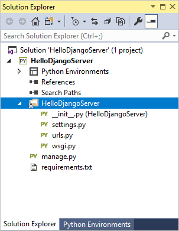

# Getting started with Django in Visual Studio

[Django](https://www.djangoproject.com/) is a high-level Python framework designed for rapid, secure, and scalable web development. Python support in Visual Studio provides several project templates that create Django-based web servers to which you can add Django apps.

| Template | Project contents |
| --- | --- |
| Blank Django Web Project<br/>(this article) | Minimal boilerplate code for a Django server with no apps. |
| [Django Web Project](python-django-web-application-project-template.md) | A full-featured Django server with an app containing three sample pages and a SQLite database. The template uses the Twitter Bootstrap framework for responsive web design. |
| Polls Django Web Project | A Django server with a Polls app. |

In Django terminology, a "Django project" is a configuration along with one or more "apps" that you deploy to a web host to create a web site. A Django project can contain multiple apps, and the same app can be in multiple Django projects. However, to avoid confusion with Visual Studio projects, this article refers to Django projects as a Django server.

> [!Note]
> The present article introduces many Django concepts by building a server and app from the ground up. The articles that discuss the other templates rely on this background.

## Create a project and examine the boilerplate server code

The Blank Django Web Project creates a Visual Studio project around the code that you obtain using the `django-admin startproject <project_name>`.

1. In Visual Studio, select **File > New > Project**, search for "Django", and select the **Blank Django Web Project** template.

1. Enter a name for the project, such as "HelloDjangoServer".

1. Visual Studio prompts you with a dialog saying "This project requires external packages" because the template includes a `requirements.txt` file referencing the latest Django 1.x package. Select the option, **Install into a virtual environment**.

1. An **Add Virtual Environment** dialog appears. Select **Create** to accept the defaults.

1. Consent to administrator privileges if prompted, then be patient while Python creates the virtual environment.

1. Once project creation completes, examine the boilerplate server code (which is again the same as generated by `django-admin startproject <project_name>`):

    - In your project root is `manage.py`, the Django command-line administrative utility that Visual Studio automatically sets as the project startup file. On the command line, you run the utility using `python manage.py <command> [options]`, or use just `manage.py <command> [options]` from the Python interactive window in Visual Studio. You can also use `django-admin <command> [options]` or `python -m django <command> [options]`.

    - In your project is a folder named the same as your project, which defines a Python package for the server. It contains four files:

      - `__init.py`: an empty file that tells Python that this folder is a Python package.
      - `wsgi.py`: an entry point for WSGI-compatible web servers to serve your project. You typically leave this file as-is.
      - `settings,py`: contains settings for Django server.
      - `urls.py`: contains a table of contents for for server.

    

As noted earlier, the Visual Studio template also adds a `requirements.txt` file to your project specifying the Django package dependency. The presence of this file is what invites you to create a virtual environment at the beginning of your project. The virtual environment is where you can install other packages as you develop your app, with the benefit that you can easily update `requirements.txt` from the environment. You can then use that file when you share your project via source control or deploy to a web server, so that recipients can easily restore the environment. (For more information, see [Using virtual environments](selecting-a-python-environment-for-a-project.md#using-virtual-environments).)

At this point, the basic server project does not contain any apps. You create several apps in the process of following this walkthrough. Because you typically work with apps more than the server, you won't need to know much more about the boilerplate files at present. You can, however, find more information in the Django documentation:

- Server code: [Writing your first Django app, part 1](https://docs.djangoproject.com/en/2.0/intro/tutorial01/) (docs.djangoproject.com)
- Administrative utility: [django-admin and manage.py](https://docs.djangoproject.com/en/2.0/ref/django-admin/) (docs.djangoproject.com)

## Run the empty server

In Visual Studio, select **Debug > Start debugging** or use the **Web Server** button on the toolbar (the browser shown for you may vary):


Running the server means launching `manage.py runserver <port>`. If Visual Studio says "Failed to start debugger" with a message about having no startip file, right-click `manage.py` in **Solution Explorer** and select **Set as Startup File**.

When you start the server, you see a console window open that also displays the server log. Visual Studio also opens a browser to `http://localhost:<port>`. Because the server has no apps, however, Django shows only a default page to acknowledge that what you have so far is working fine:


In addition to the **Debug** menu commands and toolbar buttons, you can also launch the server by right-clicking your project in **Solution Explorer** and selecting the **Python > Run server** or **Python > Run debug server** commands. Both commands open a console window in which you see the local URL (localhost:port) for the running server. Open a browser to that URL to see the app.

When you're done, stop the server by closing the console window, or using the **Debug > Stop Debugging** command in Visual Studio.

## Create an app with a single page

What you have so far in the Visual Studio project is only a Django server, which can run one or more Django apps. The next step is to create your first app.

A Django app is a separate Python package that contains standard files for different parts of the app:

| App part | Description |
| --- | --- |
| Views | What are typically thought of as web pages, which ultimately are defined by HTML that web browsers know how to display. A view is defined by a Python function whose responsibility is to render the HTML to send to the browser. |
| Templates | Blocks of HTML into which views add information dynamically to render a page. |
| Models | Data objects, identified by functions, from which views draw the data they render. Models are typically attached to an underlying data source, such as a database. |
| Migrations | The connection between a Django model to a database schema, which allow for changes made to the model (through the user interface of a view, for example), get propagated to the database. |

### Initializing the app structure

Visual Studio provides an integrated command to initialize a Django app along with item templates for Django 1.9 (and 1.4) apps.

- Templates: In **Solution Explorer**, right-click the project and select **Add > New item...**. In the **Add New Item** dialog, select the "Django 1.9 App" (or "Django 1.4 App") template, specify the app name in the **Name** field, and select **OK**.

- Integrated command: In **Solution Explorer**, right-click the project and select **Add > Django app...**. This command prompts you for a name and creates a Django 1.9 app.

    

Both methods create a folder using the name you provided (such as "HelloDjangoApp") containing the following items:


| Item | Description |
| --- | --- |
| `__init.py__` | The file that identifies the app as a package. |
| `migrations` | A folder containing an `__init.py__` file, indicating that the folder defines its own Python package. |
| `templates` | A folder containing a single file `index.html` template. Within that file is the token `{{ content }}` that can be replaced dynamically (Django refers to tokens as "variables"). |
| `views.py` | The Python file in which you create the functions for your views. Initially, this file contains only the statement, `from django.shortcuts import render`. |
| `models.py` | The Python file in which you create the functions for your models. Initially, this file contains only the statement, `from django.db import models`. |
| `admin.py` | The Python file in which you register models with Django. Initially, this file contains  only the statement, `from django.contrib import admin`. |
| `tests.py` | A Python file that contains the basic structure of unit tests. |
| `apps.py` | A Python file that defines a configuration class for the app (see below). |

The contents of `app.py` appears as follows when using the name "HelloDjangoApp":

```python
from django.apps import AppConfig

class HelloDjangoAppConfig(AppConfig):
    name = 'HelloDjango'
```

> [!Tip]
> Running the **Add > Django app...** command or using **Add > New Item...** with a Django app template produces the same files as does the Django command `manage.py startapp <app_name>`. The benefit to creating the app in Visual Studio is that the app folder is automatically integrated into the project. You can use the same Visual Studio command to create any number of apps in your project.

### Running the app from the server

At this point, if you start the server again in Visual Studio, you still see the default server page. No app content appears because you need to define an app-specific page and add the app to the server:

1. In the HelloDjangoApp folder, Modify `views.py` to match the following, which defines a view for "index":

    ```python
    from django.shortcuts import render
    from django.http import HttpResponse

    def index(request):
        return HttpResponse("Hello, Django!")
    ```

1. In the HelloDjangoServer folder, modify `urls.py` by pasting the following code (you can retain the comments in the file if you like). The first entry in `urlPatterns` that starts with `'^$'` is the routing for the site root, "/"; the second, `'^home'` specifically routes "/home". You can have any number of routings to the same view:

    ```python
    from django.conf.urls import include, url
    import HelloDjangoApp.views

    urlpatterns = [
        url(r'^$', HelloDjangoApp.views.index, name='index'),
        url(r'^home', HelloDjangoApp.views.index, name='home')
    ]
    ```

1. Run the web server again to see the message "Hello, Django!" as defined by the view. Stop the server when you're done. 

## Render a view using HTML

The `index` function in `views.py` as defined in the previous section generates nothing more than a plain-text HTTP response for the page. Most real-world web pages, of course, respond with rich HTML and JavaScript pages. Indeed, the primary reason to define a view using a function is so you can generated that content dynamically.

Because the argument to `HttpResponse` is just a string, you can build up HTML within a string. As a simple example, replace the `index` function with the following code, which generates an HTML response using dynamic content that's updated every time you refresh the page:

```python
from datetime import datetime

def index(request):
    now = datetime.now()

    html_content = "<html><head><title>Hello, Django</title></head><body>"
    html_content += "<strong>Hello Django!</strong> on " + now.strftime("%A, %d %B, %Y at %X")
    html_content += "</body></html>"

    return HttpResponse(html_content)
```

Run the server again to see a message like "**Hello Django!** on Monday, 02 April, 2018 at 12:03:36". Refresh the page to update the time and confirm that the content is being generated with each request. Stop the server when you're done.

## Render a view using a page template

Generating HTML in code works fine for small pages, but as pages get more sophisticated you typically want to maintain the static parts of your page, such as HTML, CSS, and JavaScript, as page templates into which you then insert dynamic, code-generated content. In the previous section, only the date and time from the `no.strftime` method is dynamic; all the other content can be placed in a page template.

A Django page template is an HTML that contains replacement tokens (variables) delineated by `{{` and `}}`, as in `{{ content }}`. Django's templating module then replaces tokens with dynamic content that you provide in code. (You can also use an inline template, but using a separate file is recommended to maintain a clean separation between markup and code.)

The following steps demonstrate the use of page templates:

1. Add the app to the site's `INSTALLED_APPS` list in `settings.py`, which tells the server that there's a folder of that name containing an app:

    ```python
    INSTALLED_APPS = [
        'HelloDjangoApp',
        # Other entries...
    ]
    ```

1. Make sure the the `TEMPLATES` object of `settings.py` also contains the following line, which instructs Django to look for templates in an installed app's `templates` folder:

    ```json
    'APP_DIRS': True,
    ```

1. Open the `templates/index.html` file in the app, which Visual Studio created with the app. The template contains one token `{{ content }}`.

    ```html
    <html>
    <head><title></title></head>

    <body>

    {{ content }}

    </body>
    </html>
    ```

1. With this template you can write the `index` function in the app's `views.py` file. First, add the following statement to the top of the file:

    ```python
    from django.shortcuts import render
    ```

    Then modify the `index` function as follows:

    ```python
    def index(request):
        from datetime import datetime
        now = datetime.now()

        return render(
            request,
            "index.html",  # Relative path from the 'templates' folder to the template file
            {
                'content': "<strong>Hello Django!</strong> on " + now.strftime("%A, %d %B, %Y at %X")
            }
        )
    ```

    This code takes advantage of the `django.shortcuts.render` helper function, which provides a simplified interface for working with page templates. Its second argument is the relative path to the template file within the app's `templates` folder. Typically, a template file is named for the page that uses it, if appropriate. You can also organize templates into subfolders within `templates`, in which case you prepend folder names to the filename argument.

1. Run the server and observe the output. You should see the message again, indicating that the template works

    If you see errors that the template cannot be found, make sure you added the app to the server's `settings.py` in the `INSTALLED_APPS` list. Without that entry, Django won't know to look in the app's `templates` folder.

1. Observe that the HTML you used in the `content` property renders only as plain text because the `render` function automatically escapes it. Ideally, you avoid using inline HTML in the first place. Formatting and styling should be kept in the markup and not in the code, and it's a simple matter to create additional tokens. For example, change `templates/index.html` to match the following (giving it a little formatting now):

    ```html
    <html>
        <head>
            <title>{{ title }}</title>
        </head>
        <body>
            <strong>{{ message }}</strong>{{ content }}
        </body>
    </html>
    ```

    Then write the `index` view function as follows:

    ```python
    def index(request):
        from datetime import datetime
        now = datetime.now()

        return render(
            request,
            "index.html",  # Relative path from the 'templates' folder to the template file
            {
                'title' : "Hello Django",
                'message' : "Hello Django!",
                'content' : " on " + now.strftime("%A, %d %B, %Y at %X")
            }
        )
    ```

1. Stop the server and restart it, observing that the page now renders properly.

> [!Tip]
> Using the `.html` extension for page template files is entirely optional, because you always identify the exact relative path to the file in the second argument to the `render` function. However, Visual Studio (and other editors) typically give you features like code completion and syntax coloration with `.html` files, which outweighs the fact that page templates are not strictly HTML.

For more capabilities of Django templates, such as includes and inheritance, see [The Django template language](https://docs.djangoproject.com/en/2.0/ref/templates/language/) in the Django documentation. You'll see a few of these later on.

## Adding static files to your app (such as CSS and JavaScript)

As you develop a Django app, you typically add many more Python, HTML, CSS, and JavaScript files. For each of these (as well as other files like `web.config` that you may need for deployment), Visual Studio provides convenient [item templates](python-item-templates.md) to get you started.

To access a template, go to **Solution Explorer**, right-click the folder in which you want to create the item, select **Add > New Item...**, select the desired template, specify a name for the file, and select **OK**. Adding an item in this manner automatically adds the file to your Visual Studio project.

Your Python files, of course, run on the server. Other files, such as CSS and JavaScript (and possibly some HTML) are *static* files because the server simply delivers them as-is when requested by a client.

The Django server is configured by default to serve static files from the app's `static` folder, thanks to these lines in the server's `settings.py`:

```python
# Static files (CSS, JavaScript, Images)
# https://docs.djangoproject.com/en/1.9/howto/static-files/

STATIC_URL = '/static/'

STATIC_ROOT = posixpath.join(*(BASE_DIR.split(os.path.sep) + ['static']))
```

You can organize files using any folder structure within `static` that you like, as you use relative paths within that folder whenever you refer to the files. To demonstrate this, the following steps add a CSS file to the app, then use stylesheet in the `index.html` template:

1. In **Solution Explorer**, right-click the "HelloDjangoApp" folder in the Visual Studio project, select **Add > New folder**, and name the folder `static`.

1. Right-click the `static` folder and select **Add > New item...**. In the dialog that appears, select the "Stylesheet" template, name the file `site.css`, and select **OK**. The `site.css` file appears in the project and is opened in the editor.

1. Make the contents of `site.css` match the following, and save the file:

    ```css
    .message {
        font-weight: 600;
        color: blue;
    }
    ```

1. Make the contents of the app's `templates/index.html` file match the following:

    ```html
    <html>
        <head>
            <title>{{ title }}</title>
             <!-- Instruct Django to load static files -->
            <link rel="stylesheet" type="text/css" href="" />
        </head>
        <body>
            <span class="message">{{ message }}</span>{{ content }}
        </body>
    </html>
    ```

    The `` line is essential before referring to static files in elements like `<head>` and `<body>`. In this case, "staticfiles" refers to a custom template tag set, specifically the one that allows you to use the `` syntax to refer to static files.  Without ``, you'll see an exception when the server runs. 

    In any case, you can see that the markup here replaces the `<strong>` element with a `<span>` that references the `message` style, which gives you much more flexibility in styling the message element.

1. Run the server to observe the results. Stop the server when done.

You can add other CSS, JavaScript, and HTML files in your `static` folder however you want. A typical way to organize static files is to create subfolders named `fonts`, `scripts`, and `content` (for stylesheets and any other files). In each case, remember to include those folders in the relative path to the file in `{% static }` references.

## Adding a page to the app

Adding another page to the app means adding a Python function that defines the view, adding a template for the page's markup, and adding the necessary routing to the server's `urls.py` file. The following steps add an "About" page to the "HelloDjangoApp" project, and links to that page from the home page:

1. In **Solution Explorer**, right-click the app's `template` folder, select **Add > New item...**, select the "HTML Page" item template, name it `about.html`, and select **OK**.

1. Replace the contents of `about.html` with the following markup (don't worry about the explicit link; you replace it in the next section with a simple navigation bar):

    ```html
    <html>
        <head>
            <title>{{ title }}</title>
            
            <link rel="stylesheet" type="text/css" href="" />
        </head>
        <body>
            <div><a href="index">Home</a></div>
            {{ content }}
        </body>
    </html>
    ```

1. Open the app's `views.py` file and add a function named `about` that uses the template:

    ```python
    def about(request):
        return render(
            request,
            "about.html",
            {
                'title' : "About HelloDjangoApp",
                'content' : "Example app page for Django."
            }
        )
    ```

1. Open the server's `urls.py` file and add the following line to the `urlPatterns` array (you also need a comma at the end of the previous line):

    ```python
    url(r'^about', HelloDjangoApp.views.about, name='about')
    ```

1. Open the app's `templates/index.html` file and add the following line below the `<body>` element to link to the About page:

    ```html
    <div><a href="about">About</a></div>
    ```

1. Save all the file using the **File > Save All** menu command, or just press or Ctrl+Shift+S. (Technically, this step isn't needed as the next one automatically saves files; however, it's a good command to know about!)

1. Run the server to observe the results and check navigation between pages. Close the server when done.

## Use template inheritance to create a header and nav bar

Having an explicit link on each page is obviously not anything close to modern web design. Most modern sites use a consistent header for branding on every page along with a navigation bar that contains the most important page links, popup menus, and so on. To keep the header and nav bar consistent, however, you don't want to repeat the same code in every page template. You rather want to define the consistent parts of all your pages in one place.

Django's templating system provides two means for reusing specific elements across multiple templates: includes and inheritance.

Includes are other templates that you insert at a specific place in the referring template using the syntax `` where `<template_path>` points to the included template file relative to the `templates` folder, or you can use `../` or `./`. (You can also use a token for if you want to change the path dynamically in code.) Includes are typically used in the body of a page to pull in the shared template at a specific location on the page.

Interitance uses the `` at the beginning of a template to specify a shared base template that the referring template then builds upon. Inheritance is commonly used to define a shared layout, nav bar, and other structures for an app's pages, such that referring templates need only add or modify specific areas of the base template.

Those areas as called "blocks" and are delineated using `` and `` tags. If a referring template uses tags with the same block name, its block content replaces that of the base template.

The following steps demonstrate how inheritance works:

1. In the app's `templates` folder, create a new HTML file (using the **Add > New item...** context menu) called `layout.html`, and paste in the contents below. You can see that this template contains a block named "content" that is all that the referring pages need to replace:

    ```html
    <!DOCTYPE html>
    <html>
    <head>
        <meta charset="utf-8" />
        <title>{{ title }}</title>
        
        <link rel="stylesheet" type="text/css" href="" />
    </head>

    <body>
        <div class="navbar">
           <a href="/" class="navbar-brand">Hello Django</a>
           <a href="" class="navbar-item">Home</a>
           <a href="" class="navbar-item">About</a>
        </div>

        <div class="body-content">
    
            <hr/>
            <footer>
                <p>&copy; 2018</p>
            </footer>
        </div>
    </body>
    </html>
    ```

1. Add the following styles to the app's `static/site.css` file (this walkthrough isn't attempting to demonstrate responsive design here; these styles are simply to generate an interesting result):

    ```css
    .navbar {
        background-color: lightslategray;
        font-size: 1em;
        font-family: 'Trebuchet MS', 'Lucida Sans Unicode', 'Lucida Grande', 'Lucida Sans', Arial, sans-serif;    
        color: white;
        padding: 8px 5px 8px 5px;
    }

    .navbar a {
        text-decoration: none;
        color: inherit;
    }

    .navbar-brand {
        font-size: 1.2em;
        font-weight: 600;
    }

    .navbar-item {
        font-variant: small-caps;
        margin-left: 30px;
    }

    .body-content {
        padding: 5px;
        font-family:'Segoe UI', Tahoma, Geneva, Verdana, sans-serif;
    }
    ```

1. Modify `templates/index.html` to refer to the base template and override the content block. You can see that by using inheritance, this template becomes very simple:

    ```html
    
    
    <span class="message">{{ message }}</span>{{ content }}
    
    ```

1. Modify `templates/about.html` to also refer to the base template and override the content block:

    ```html
    
    
    {{ content }}
    
    ```

1. Run the server to observe the results. Close the server when done.

## The full Django App template

Now that you've explored the basics of Django by building an app upon the "Blank Django App Project" template in Visual Studio, you're can easily understand the fuller app that's produced by the "Django App Project" template.

Given what you've learned with the previous sections of this walkthrough, much of what you see in an app produced from the "Django App Project" will be familiar. For example, the template creates an app with three pages, the templates for which inherit from a base template. The app employs JavaScript libraries like jQuery and Bootstrap (for responsive design), which are located in the app's `static` folder. And the project template provides basic unit test structures for each page.

In addition, the project template also provides basic authentication and a default SQLite database, which you explore in later sections.

### Create a project from the template

1. In Visual Studio, select the **File > New > Project...** menu command, search for and select the "Django App Project" template, specify a name and location for the project, and select **OK**.

1. Because the template includes a `requirements.txt` file, Visual Studio prompts asks where to install those dependencies. Choose the option, **Install into a virtual environment**, and in the **Add Virtual Environment** dialog select **Create** to accept the defaults.

1. Once Python finishes setting up the virtual environment, Visual Studio displays the contents of the template's `readme.html` file. Follow the instructions in that readme to create a superuser for the database that the template also creates.

1. select **Debug > Start debugging** or use the **Web Server** button on the toolbar to run the server:

    

1. The app created by the template has three pages, Home, About, and Contact, which you navigate between using the top menu. Take a minute or two to examine different parts of the app. To authenticate with the app through the **Log in** command, use the superuser credentials created in Step 3.

1. Stop the server when done by closing the console window.

### Examine what the template creates

At the broadest level, the "Django App Project" template creates the following structure:

- Files in the project root:

  - `manage.py`, the Django administrative utility.
  - `db.sqlite3`, a default SQLite database.
  - `requirements.txt` containing a dependency on Django 1.x.
  - `readme.html`, a file that's displayed in Visual Studio automatically and describes using a command in Visual Studio to create a superuser for the database (which also serves as a login for the app).

- The `app` folder contains all the app files, including views, models, tests, forms, templates and static files.

- The `FullDjango` (server) folder contains the typical Django server files: `__init.py__`, `settings.py`, `urls.py`, and `wsgi.py`. By using the project template, `settings.py` is already configured for the app and the database file, and `urls.py` is already configured with routes to all the app pages, including the login form.

The sections that follow go into more detail on specific areas.

#### Views and templates

As you observe when you run the server, the app contains three views: Home, About, and Contact. The code for these views are found in the `app/views` folder, where each view function simply refers to a template.

Templates are located in the app's `templates/app` folder. The base template is `layout.html`, which is extended by `about.html`, `contact.html`, and `index.html` along with a fourth page, `login.html`. The `loginpartial.html` is brought into `layout.html` using the `` tag, and demonstrates the use of conditional templating, as described later.

#### URL routing

    ```python
    from datetime import datetime
    from django.conf.urls import url
    import django.contrib.auth.views

    import app.forms
    import app.views

    urlpatterns = [
        url(r'^$', app.views.home, name='home'),
        url(r'^contact$', app.views.contact, name='contact'),
        url(r'^about', app.views.about, name='about'),
        url(r'^login/$',
            django.contrib.auth.views.login,
            {
                'template_name': 'app/login.html',
                'authentication_form': app.forms.BootstrapAuthenticationForm,
                'extra_context':
                {
                    'title': 'Log in',
                    'year': datetime.now().year,
                }
            },
            name='login'),
        url(r'^logout$',
            django.contrib.auth.views.logout,
            {
                'next_page': '/',
            },
            name='logout'),
    ]
    ```