# Edit Python code

Because you spend much of your development time in the code editor, [Python support in Visual Studio](installing-python-support-in-visual-studio.md) provides functionality to help you be more productive. Features include IntelliSense syntax highlighting, auto-completion, signature help, method overrides, search, and navigation.

The editor is also integrated with the **Interactive** window in Visual Studio, making it easy to exchange code between the two. See [Tutorial Step 3: Use the Interactive REPL window](tutorial-working-with-python-in-visual-studio-step-03-interactive-repl.md) and [Use the Interactive window - Send to Interactive command](python-interactive-repl-in-visual-studio.md#send-to-interactive-command) for details.

For general documentation on editing code in Visual Studio, see [Features of the code editor](../ide/writing-code-in-the-code-and-text-editor.md). Also see [Outlining](../ide/outlining.md), which helps you stay focused on particular sections of your code.

You can also use the Visual Studio **Object Browser** (**View** > **Other Windows** > **Object Browser** or **Ctrl**+**W** > **J**) for inspecting Python classes defined in each module and the functions defined in those classes.

## IntelliSense

IntelliSense provides [completions](#completions), [signature help](#signature-help), [quick info](#quick-info), and [code coloring](#code-coloring). Visual Studio 2017 versions 15.7 and later also support [type hints](#type-hints).

To improve performance, IntelliSense in Visual Studio 2017 version 15.5 and earlier depends on a completion database that's generated for each Python environment in your project. Databases may need refreshing if you add, remove, or update packages. Database status is shown in the **Python Environments** window (a sibling of **Solution Explorer**) on the **IntelliSense** tab (see [Environments window reference](python-environments-window-tab-reference.md)).

Visual Studio 2017 version 15.6 and later uses a different means to provide IntelliSense completions that are not dependent on the database.

### Completions

Completions appear as statements, identifiers, and other words that may be appropriately entered at the current location in the editor. What's shown in the list is based on context and is filtered to omit incorrect or distracting options. Completions are often triggered by typing different statements (such as `import`) and operators (including a period), but you can have them appear at anytime by typing **Ctrl**+**J** > **Space**.


When a completion list is open, you can search for the completion you want using the arrow keys, the mouse, or by continuing to type. As you type more letters, the list is further filtered to show likely completions. You can also use shortcuts such as:

- Typing letters that are not at the start of the name, such as 'parse' to find 'argparse'
- Typing only letters that are at the start of words, such as 'abc' to find 'AbstractBaseClass' or 'air' to find 'as_integer_ratio'
- Skipping letters, such as 'b64' to find 'base64'

Some examples:

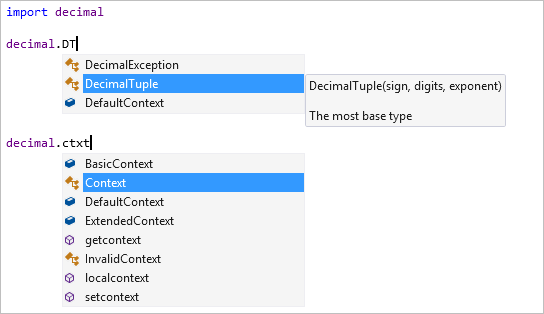

Member completions appear automatically when you type a period after a variable or value, along with the methods and attributes of the potential types. If a variable could be more than one type, the list includes all possibilities from all types, with extra information to indicate which types support each completion. Where a completion is supported by all possible types, it is shown without annotation.

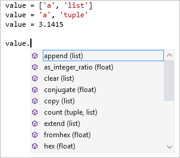

By default, "dunder" members (members beginning and ending with a double underscore) are not shown. In general, such members should not be accessed directly. If you need one, however, typing the leading double underscore adds these completions to the list:

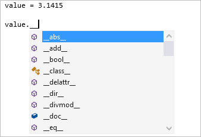

The `import` and `from ... import` statements display a list of modules that can be imported. With `from ... import`, the list includes members that can be imported from the specified module.

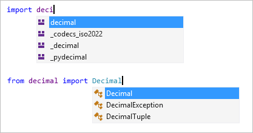

The `raise` and `except` statements display lists of classes likely to be error types. The list may not include all user-defined exceptions, but helps you find suitable built-in exceptions quickly:

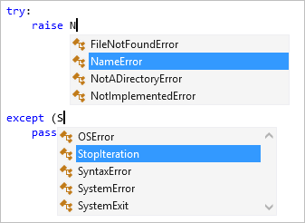

Typing @ starts a decorator and shows potential decorators. Many of these items aren't usable as decorators; check the library documentation to determine which to use.

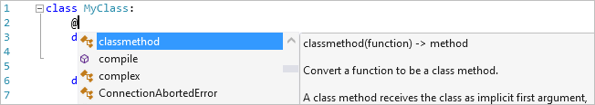

> [!Tip]
> You can configure the behavior of completions through **Tools** > **Options** > **Text Editor** > **Python** > **Advanced**. Among these, **Filter list based on search string** applies filtering of completion suggestions as you type (default is checked), and **Member completion displays intersection of members** shows only completions that are supported by all possible types (default is unchecked). See [Options - completion results](python-support-options-and-settings-in-visual-studio.md#completion-results).

### Type hints

*Visual Studio 2017 version 15.7 and later.*

"Type hints" in Python 3.5+ ([PEP 484](https://www.python.org/dev/peps/pep-0484/) (python.org) is an annotation syntax for functions and classes that indicate the types of arguments, return values, and class attributes. IntelliSense displays type hints when you hover over functions calls, arguments, and variables that have those annotations.

In the example below, the `Vector` class is declared as `List[float]`, and the `scale` function contains type hints for both its arguments and return value. Hovering over a call to that function shows the type hints:

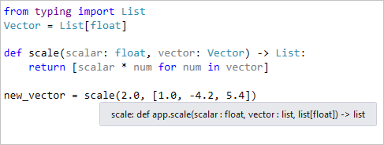

In the following example, you can see how the annotated attributes of the `Employee` class appear in the IntelliSense completion popup for an attribute:

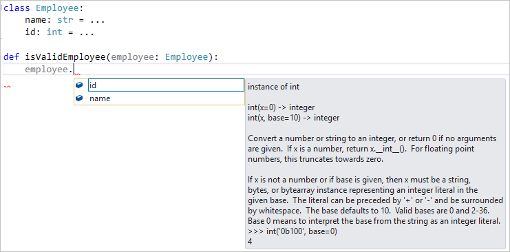

It's also helpful to validate type hints throughout your project, because errors won't normally appear until run time. For this purpose, Visual Studio integrates the industry standard MyPy tool through the context menu command **Python** > **Run Mypy** in **Solution Explorer**:

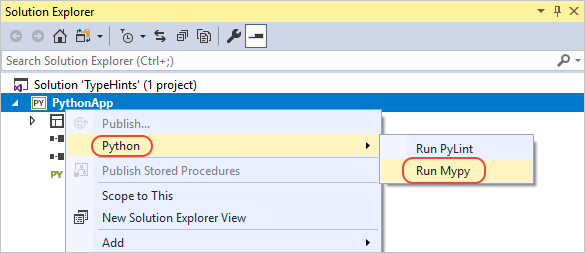

Running the command prompts you to install the mypy package, if needed. Visual Studio then runs mypy to validate type hints in every Python file in the project. Errors appear in the Visual Studio **Error List** window. Selecting an item in the window navigates to the appropriate line in your code.

As a simple example, the following function definition contains a type hint to indicate that the `input` argument is type `str`, whereas the call to that function attempts to pass an integer:

```python
def commas_to_colons(input: str):
    items = input.split(',')
    items = [x.strip() for x in items]
    return ':'.join(items)

commas_to_colons(1)
```

Using the **Run Mypy** command on this code generates the following error:


::: moniker range="vs-2017"
> [!Tip]
> For versions of Python before 3.5, Visual Studio also displays type hints that you supply through Typeshed *stub files* (*.pyi*). You can use stub files whenever you don't want to include type hints directly in your code, or when you want to create type hints for a library that doesn't use them directly. For more information, see [Create stubs for Python modules](https://github.com/python/mypy/wiki/Creating-Stubs-For-Python-Modules) in the mypy project wiki.
>
> At present, Visual Studio doesn't support type hints in comments.
::: moniker-end
::: moniker range=">=vs-2019"
> [!Tip]
> For versions of Python before 3.5, Visual Studio also displays type hints that you supply through Typeshed *stub files* (*.pyi*). You can use stub files whenever you don't want to include type hints directly in your code, or when you want to create type hints for a library that doesn't use them directly. For more information, see [Create stubs for Python modules](https://github.com/python/mypy/wiki/Creating-Stubs-For-Python-Modules) in the mypy project wiki.
>
> Visual Studio includes a bundles set of Typeshed files for Python 2 and 3, so additional downloads aren't necessary. However, if you want to use a different set of files, you can specify the path in the **Tools** > **Options** > **Python** > **Language Server** options. See [Options - Language Server](python-support-options-and-settings-in-visual-studio.md#language-server-options).
>
> At present, Visual Studio doesn't support type hints in comments.
::: moniker-end

### Signature help

When writing code that calls a function, signature help appears when you type the opening `(` and displays available documentation and parameter information. You can also make it appear with **Ctrl**+**Shift**+**Space** inside a function call. The information displayed depends on the documentation strings in the function's source code, but includes any default values.

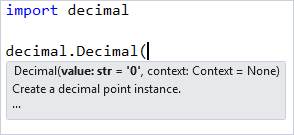

> [!Tip]
> To disable signature help, go to **Tools** > **Options** > **Text Editor** > **Python** > **General** and clear **Statement completion** > **Parameter information**.

### Quick info

Hovering the mouse pointer over an identifier displays a Quick Info tooltip. Depending on the identifier, Quick Info may display the potential values or types, any available documentation, return types, and definition locations:

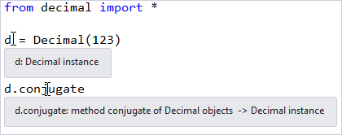

### Code coloring

Code coloring uses information from code analysis to color variables, statements, and other parts of your code. For example, variables that refer to modules or classes may be shown in a different color than functions or other values, and parameter names appear in a different color than local or global variables. (By default, functions are not shown in bold):

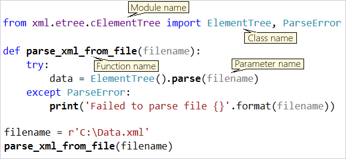

To customize the colors, go to **Tools** > **Options** > **Environment** > **Fonts and Colors** and modify the **Python** entries in the **Display items** list:

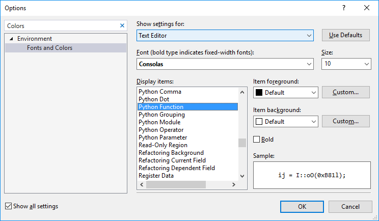

> [!Tip]
> To disable code coloring, go to **Tools** > **Options** > **Text Editor** > **Python** > **Advanced** and clear **Miscellaneous Options** > **Color names based on type**. See [Options - Miscellaneous options](python-support-options-and-settings-in-visual-studio.md#miscellaneous-options).

## Code snippets

Code snippets are fragments of code that can be inserted into your files by typing a shortcut and pressing **Tab**, or using the **Edit** > **IntelliSense** > **Insert Code Snippet** and **Surround With** commands, selecting **Python**, then selecting the desired snippet.

For example, `class` is a shortcut for a code snippet that inserts a class definition. You see the snippet appear in the auto-completion list when you type `class`:

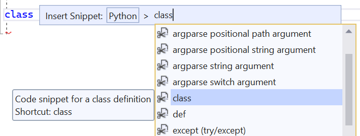

Pressing **Tab** generates the rest of the class. You can then type over the name and bases list, moving between the highlighted fields with **Tab**, then press **Enter** to begin typing the body.

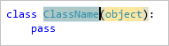

### Menu commands

When you use the **Edit** > **IntelliSense** > **Insert Code Snippet** menu command, you first select **Python**, then select a snippet:

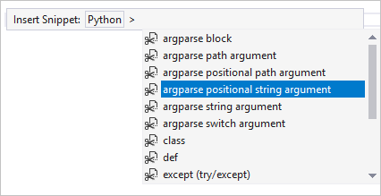

The **Edit** > **IntelliSense** > **Surround With** command, similarly, places the current selection in the text editor inside a chosen structural element. For example, suppose you had a bit of code like the following:

```python
sum = 0
for x in range(1, 100):
    sum = sum + x
```

Selecting this code and choosing the **Surround With** command displays a list of available snippets. Choosing **def** from the list places the selected code within a function definition, and you can use the **Tab** key to navigate between the highlighted function name and arguments:

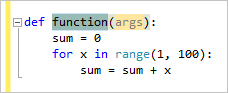

### Examine available snippets

You can see the available code snippets in the **Code Snippets Manager**, opened by using **Tools** > **Code Snippets Manager** menu command and selecting **Python** as the language:

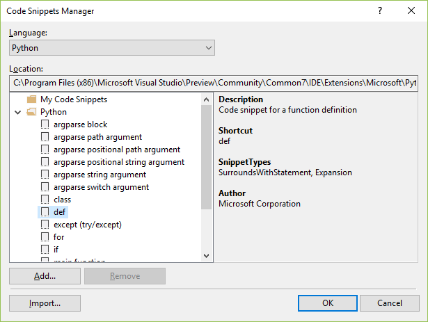

To create your own snippets, see [Walkthrough: Create a code snippet](../ide/walkthrough-creating-a-code-snippet.md).

If you write a great code snippet that you'd like to share, feel free to post it in a gist and [let us know](https://github.com/Microsoft/PTVS/issues). We may be able to include it in a future release of Visual Studio.

## Navigate your code

Python support in Visual Studio provides several means to quickly navigate within your code, including libraries for which source code is available: the [navigation bar](#navigation-bar), [**Go To Definition**](#go-to-definition), [**Navigate To**](#navigate-to), and [**Find All References**](#find-all-references). You can also use the Visual Studio [**Object Browser**](../ide/viewing-the-structure-of-code.md#BKMK_ObjectBrowser).

### Navigation bar

The navigation bar is displayed at the top of each editor window and includes a two-level list of definitions. The left drop-down contains top-level class and function definitions in the current file; the right drop-down displays a list of definitions within the scope shown in the left. As you move around in the editor, the lists update to show your current context, and you can also select an entry from these lists to jump directly to.

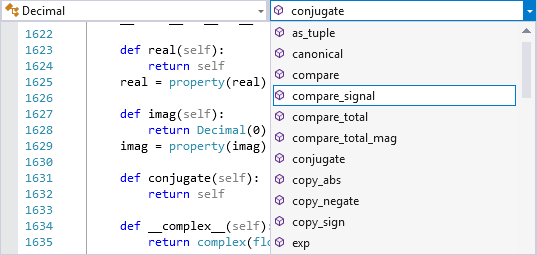

> [!Tip]
> To hide the navigation bar, go to **Tools** > **Options** > **Text Editor** > **Python** > **General** and clear **Settings** > **Navigation bar**.

### Go To Definition

**Go To Definition** quickly jumps from the use of an identifier (such as a function name, class, or variable), to the source code where it's defined. You invoke it by right-clicking an identifier and selecting **Go To Definition** or, by placing the caret in the identifier and pressing **F12**. It works across your code and external libraries provided that source code is available. If library source code is not available, **Go To Definition** jumps to the relevant `import` statement for a module reference, or displays an error.

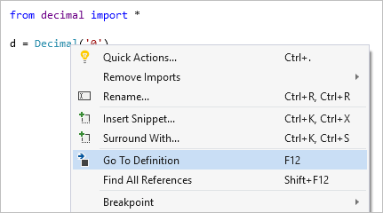

### Navigate To

The **Edit** > **Navigate To** command (**Ctrl**+**,**) displays a search box in the editor where you can type any string and see possible matches in your code that defines a function, class, or variable containing that string. This feature provides a similar capability as **Go To Definition** but without having to locate a use of an identifier.

Double-clicking any name, or selecting with arrow keys and **Enter**, navigates to the definition of that identifier.

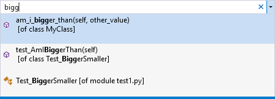

### Find All References

**Find All References** is a helpful way of discovering where any given identifier is both defined and used, including imports and assignments. You invoke it by right-clicking an identifier and selecting **Find All References**, or by placing the caret in the identifier and pressing **Shift**+**F12**. Double-clicking an item in the list navigates to its location.

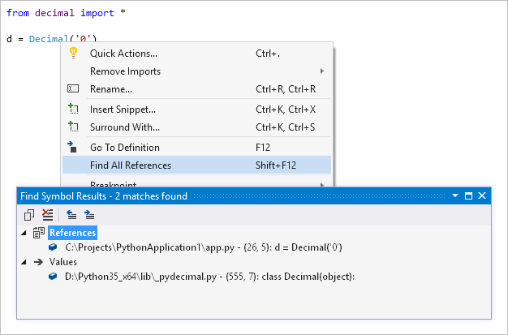

## See also

- [Formatting](formatting-python-code.md)
- [Refactoring](refactoring-python-code.md)
- [Use a linter](linting-python-code.md)
