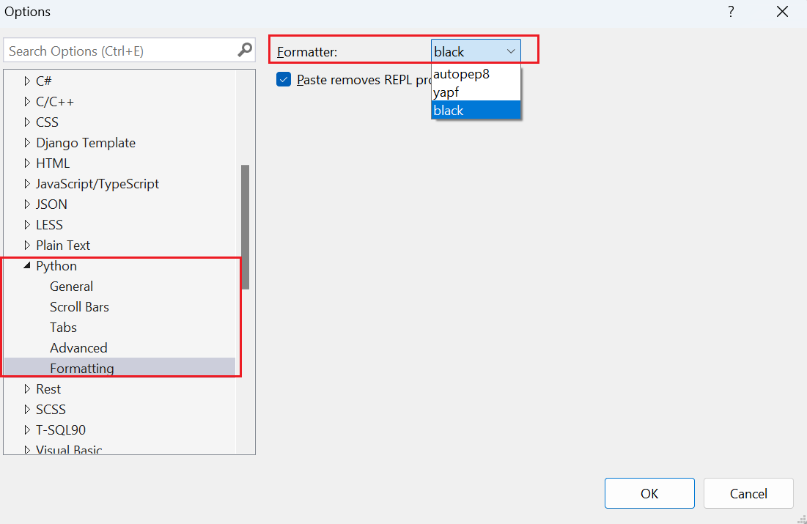

# Format Python code

Visual Studio lets you quickly reformat code to match pre-configured formatting options.

- To format a selection: select **Edit** > **Advanced** > **Format Selection** or press **Ctrl**+**E** > **F**.
- To format the whole file: select **Edit** > **Advanced** > **Format Document** or press **Ctrl**+**E** > **D**.

Options are set through **Tools** > **Options** > **Text Editor** > **Python** > **Formatting** and its nested tabs. You need to select **Show all settings** for these options to appear:



Formatting options by default are set to match a superset of the [PEP 8 style guide](https://www.python.org/dev/peps/pep-0008/). The **General** tab determines when formatting is applied; settings for the other three tabs are described in this article.

[Python support in Visual Studio](installing-python-support-in-visual-studio.md) also adds the useful [**Fill Comment Paragraph**](#fill-comment-paragraph-command) command to the **Edit** > **Advanced** menu as described in a later section.

## Spacing

**Spacing** controls where spaces are inserted or removed around various language constructs. Each option has three possible values:

- Checked: ensures the spacing is applied.
- Cleared: removes any spacing.
- Indeterminate: leaves original formatting in place.

Examples for the various options are provided in the following tables:

| Class definitions option | Checked | Cleared |
| --- | --- | --- |
| **Insert space between a class declaration's name and bases list** | `class X (object): pass` | `class X(object): pass` |
| **Insert space within bases list parentheses** | `class X( object ): pass` | `class X(object): pass` |
| **Insert space within empty bases list parentheses** | `class X( ): pass` | `class X(): pass` |

<br/>

| Function definitions option | Checked | Cleared |
| --- | --- | --- |
| **Insert space between a function declaration's name and parameter list** | `def X (): pass` | `def X(): pass` |
| **Insert space within parameter list parentheses** | `def X( a, b ): pass` | `def X(a, b): pass` |
| **Insert space within empty parameter list parentheses** | `def X( ): pass` | `def X(): pass` |
| **Insert spaces around '=' in default parameter values** | `includes X(a = 42): pass` | `includes X(a=42): pass` |
| **Insert space before and after return annotation operators** | `includes X() -> 42: pass` | `includes X()->42: pass` |

<br/>

| Operators option | Checked | Cleared |
| --- | --- | --- |
| **Insert spaces around binary operators** | `a + b` | `a+b` |
| **Insert spaces around assignments** | `a = b` | `a=b` |

<br/>

| Expression spacing option | Checked | Cleared |
| --- | --- | --- |
| **Insert space between a function call's name and argument list** | `X ()` | `X()` |
| **Insert space within empty argument list parentheses** | `X( )` | `X()` |
| **Insert space within argument list parentheses** | `X( a, b )` | `X(a, b)` |
| **Insert space within parentheses of expression** | `( a )` | `(a)` |
| **Insert space within empty tuple parentheses** | `( )` | `()` |
| **Insert space within tuple parentheses** | `( a, b )` | `(a, b)` |
| **Insert space within empty square brackets** | `[ ]` | `[]` |
| **Insert spaces within square brackets of lists** | `[ a, b ]` | `[a, b]` |
| **Insert space before open square bracket** | `x [i]` | `x[i]` |
| **Insert space within square brackets** | `x[ i ]` | `x[i]` |

<br/>

## Statements

The **Statements** options control automatic rewriting of various statements into more Pythonic forms.

| Option | Before formatting | After formatting |
| --- | --- | --- |
| **Place imported modules on new line** | `import sys, pickle` | `import sys`<br/>`import pickle` |
| **Remove unnecessary semicolons** | `x = 42;` | `x = 42` |
| **Place multiple statements on new lines** | `x = 42; y = 100` | `x = 42`<br/>`y = 100` |

## Wrapping

**Wrapping** lets you set the **Maximum comment width** (default is 80). If the **Wrap comments that are too wide** option is set, Visual Studio reformats comments to not exceed that maximum width.

```python
# Wrapped to 40 columns
# There should be one-- and preferably
# only one --obvious way to do it.
```

```python
# Not-wrapped:
# There should be one-- and preferably only one --obvious way to do it.
```

## Fill Comment Paragraph command

**Edit** > **Advanced** > **Fill Comment Paragraph** (**Ctrl**+**E** > **P**) reflows and formats comment text, combining short lines together and breaking up long ones.

For example:

```python
# foo
# bar
# baz
```

changes to:

```python
# foo bar baz
```

```python
# This is a very long long long long long long long long long long long long long long long long long long long comment
```

changes to:

```python
# This is a very long long long long long long long long long long long long
# long long long long long long long comment
```
