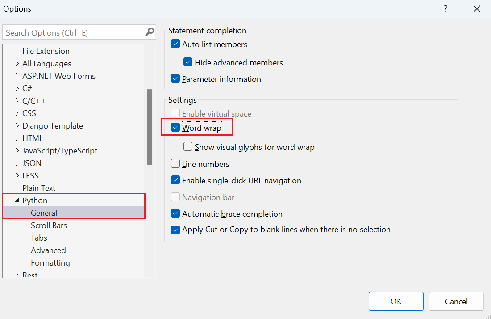

# Automatically reformat Python code in Visual Studio

Visual Studio lets you quickly reformat code to match specific formatter standards.

## Choose a formatter

You can set your source code formatter through **Tools** > **Options** > **Text Editor** > **Python** > **Formatting**. Python Tools in Visual Studio support source code formatting with autopep8, Black formatter, and yapf.

[Python support in Visual Studio](installing-python-support-in-visual-studio.md) also adds the useful [**Fill Comment Paragraph**] command to the **Edit** > **Advanced** menu as described in a later section.

## Apply format to selection or file

To format a selection:

- Select **Edit** > **Advanced** > **Format Selection**
- Or, press **Ctrl**+**E** > **F**.

To format the whole file:

- Select **Edit** > **Advanced** > **Format Document**
- Or, press **Ctrl**+**E** > **D**.

## Word wrap

You can enable word wrapping in **Tools** > **Options** > **Text Editor** > **Python** > **Formatting** > **General**.

## Format comment text

**Edit** > **Advanced** > **Fill Comment Paragraph** (**Ctrl**+**E** > **P**) reflows and formats comment text, combining short lines together and breaking up long ones.

| Reformat | Example 1                                                                                                                         |
| :------- | :-------------------------------------------------------------------------------------------------------------------------------- |
| Before   | `# This is a very long long long long long long long long long long long long long long long long long long long comment`         |
| After    | `# This is a very long long long long long long long long long long long long` `# long long long long long long long comment` |

| Reformat | Example 2                       |
| :------- | :------------------------------ |
| Before   | `# foo` `# bar` `# baz` |
| After    | `# foo bar baz`                 |
