# Getting Started with Python in Visual Studio

Once you have Visual Studio installed with the Python workload (Visual Studio 2017), or with the Python Tools for Visual Studio (Visual Studio 2015 and earlier), you're ready to explore the Python development experience.

In this walkthrough you'll create a new empty Python application, choose a Python environment to work with, and then start writing some code to see IntelliSense at work. You'll then work with the interactive REPL window for a short time to create more code, then complete the program and run it both by itself and in the debugger.

> [!Note]
> This walkthrough explores the Python experience in Visual Studio 2017; other versions will be similar but can differ in the details.

## Create a new Python project

Python support in Visual Studio includes a number of [project templates](python-projects-in-visual-studio.md) to get you started with different types of projects, including web applications using the Bottle, Flask, and Django frameworks along with Azure Cloud Services. For the purposes of this walkthrough, however, we'll start with an empty project.

1. In Visual Studio, select **File > New Project**, which brings up the **New Project** dialog. This is where you can browse and select a template and specify the folder in which to create the project.

1. Python templates can be found under the **Templates > Other Languages > Python** on the left, or by simply searching on "Python":

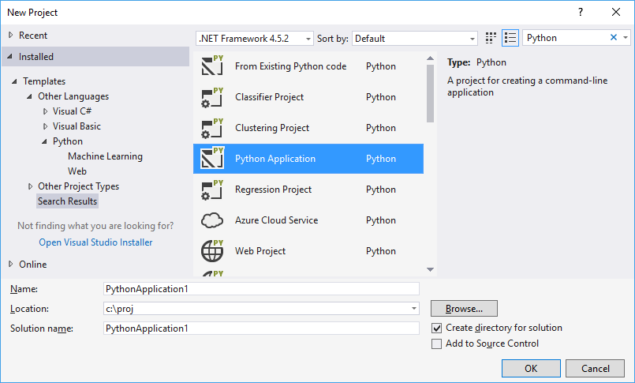

1. Select the "Python Application" template, specify a folder for the project, and select **OK**. (If you want to create a local repository for your project right away, also select the **Add to source control** option).

1. After a few moments, you'll see the project open in the Visual Studio Solution Explorer window. Here you can browse the files and folders in your project, as well as manage environments.

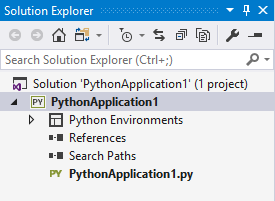

1. Expand the **Python Environments** node and you'll see which Python interpreter is the current default for this project. If you also expand that interpreter node, you'll see a list of libraries available in that environment:

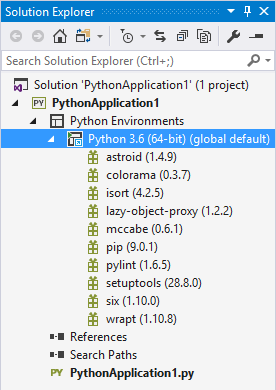

1. If you're using Visual Studio 2015 or earlier, you won't have a Python interpreter installed by default. Refer to [selecting and installing a Python interpreter](python-environments.md#selecting-and-installing-python-interpreters) for this process.

We'll explore more about environments a little later; for now, let's write and run a little code.

### Going deeper

- [Python Projects in Visual Studio](python-projects-in-visual-studio.md).
- [Web Project Templates](template-web.md)
- [Django Web Project Template](template-django.md)
- [Azure Cloud Service Template](template-azure-cloud-service.md)


## Writing and running code

1. After creating a new "Python Application" project, a default empty file named `PythonApplication1.py` is open in the Visual Studio editor. To rename it, right-click the file in Solution Explorer and select **Rename**, and change the name to `hello.py`.

1. Start typing `print("Hello world")` and notice how Visual Studio IntelliSense displays auto-completion options along the way. The outlined option in the drop-down list is the default completion that's used when you press the Tab key. This can be very helpful when longer statements or identifiers are involved.

    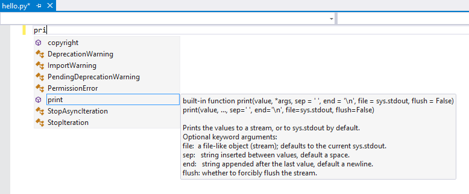

1. IntelliSense shows different information depending on the statement you're using, the function you're calling, and so forth. With the `print` function, typing `(` to make the call pops up full usage information for that function and even bolds the current argument that you need to provide (**value** as shown here):

    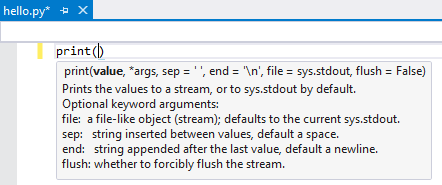

1. Complete the statement so it matches the following:

    ```python
        print("Hello world")
    ```

1. To run the code, select the **Start** button on the toolbar shown below, press F5, or select **Debug > Start Debugging** menu item.

    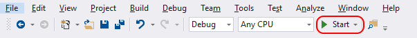

> [!Note]
> If you see a message in Visual Studio 2015 or earlier that there aren't any interpreters, see [selecting and installing a Python interpreter](python-environments.md#selecting-and-installing-python-interpreters) as one is not installed by default.

1. Visual Studio will run the code using the default environment in the project and show the results in a command window. Press a key to close that window and end the debugging session.

    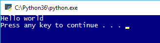

1. In addition to statements, and functions, IntelliSense provide completions for `import` statements. This helps you easily discover what modules are available in your environment, and the members available in that module. In the editor, delete the `print` line and start typing `import`. You'll see a list of modules appear:

    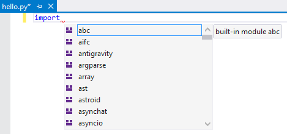

1. Complete the line by typing or selecting `sys`.

1. On the next line, type `from` to again see a list of modules:

    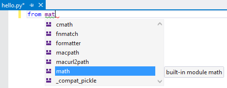

1. Select or type `math`, then continue typing with a space and `import`, which displays the module members:

    

1. Finish by importing the `sin`, `cos`, and `radians` members, noticing the auto-completions available for each. When you're done, your code should appear as follows:

    ```python  
        import sys  
        from math import sin, cos, radians          
    ```

> [!Tip]
> Completions work with substrings as you type, matching parts of words, letters at the beginning of words, and even skipped characters. See [Editing Code - Completions](code-editing.md#completions) for details.

In the next step we'll work with the interactive REPL window to write some code that we can test immediately without running the debugger.

### Going deeper

- [Editing Code](code-editing.md)
- [Formatting Code](code-formatting.md)
- [Refactoring Code](code-refactoring.md)
- [Using PyLint](code-pylint.md)


## Using the interactive REPL window

The Visual Studio interactive window for Python provides a rich read-evaluate-print-loop experience that greatly shortens the usual edit-build-debug cycle. It is similar to the REPL experience of the Python command line, but provides a few additional features as you'll see here.

1. Open the interactive window by selecting **View > Other Windows > Python Interactive Windows** from the main Visual Studio menu. The window opens with the usual >>> Python REPL prompt. Note that you can use the drop-down menu on the toolbar to change the environment at any time:

    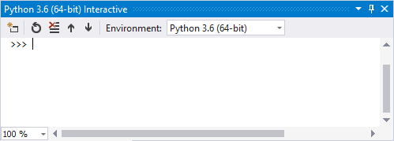

1. Enter a few statements (like `print("hello")`) and expressions (like `123/567`) to see immediate results:

    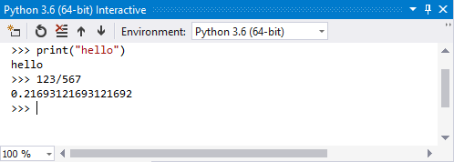

1. When you start writing a multiline statement, like a function definition, the interactive window shows the ... prompt for continuing lines, which, unlike the command-line REPL, provides automatic indentation:

    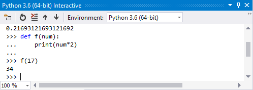

1. The interactive window provides a full history of everything you've entered, and improves upo the command-line REPL with multiline history items. For example, you can easily recall the entire definition of the `f` function above as a single unit and easily change the name to `make_double`, rather than re-creating the function line by line.

1. Another very helpful feature is the ability to quickly send multiple lines of code from an editor window to the interactive window, where you can work with it in the rapid REPL environment rather than writing other code to run in the debugger. To see this, start by adding the following code to your hello.py file that's open in the editor:

    ```python
        def make_dot_string(x):  
            return ' ' * int(10 * cos(radians(x)) + 10) + 'o'
    ```

1. Select all the code in hello.py (including the `import` statements), right-click, and select **Send to Interactive** (Ctrl+Enter). The code is immediately pasted into the interactive window and run. Because the code defines a function, you can quickly test that function by calling it a few times:

    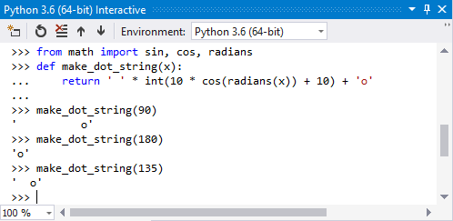

1. **Send to Interactive** effectively allows you to paste multiple lines of code (such as something you find online) into the interactive window, which can't be done directly. For example, copy the code below and try pasting (Ctrl+V) into the interactive window and you'll see that nothing happens. But you can paste it into the editor, select it, and used the **Send to Interactive** command to watch it run.

    ```python
        for i in range(360):
            s = make_dot_string(i)  
            print(s) 
   ```

    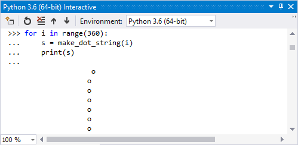

1. Because the function definition is again in the REPL history as a single unit, it's easy to go back and make whatever changes you want and then test the function again.

1. When you're satisfied with code you're written, you can select it in the interactive window, right-click and select **Copy Code**, and then paste into the editor. The special feature of the **Copy Code** command is that it automatically omits any output as well as the >>> and ... prompt text. For example, using the command with the selection show below:

    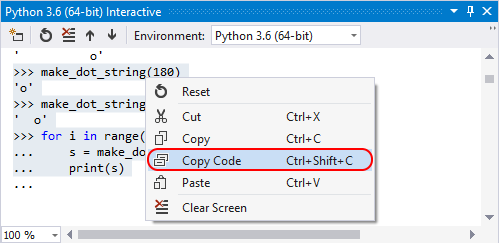

    will paste in only the following:

    ```python
        make_dot_string(180)
        make_dot_string(135)
        for i in range(360):
            s = make_dot_string(i)  
            print(s) 
    ```

1. Finally, the interactive window provides a number of meta-commands that allow you to load files, reset the environment without losing the history, and inserting comments as you go along. See [Interactive Windows - meta-commands](interactive-repl.md#meta-commands) for details.

### Going deeper

- [Using the Interactive window](interactive-repl.md)
- [Using IPython REPL](interactive-repl-ipython.md)

## Running code in the debugger


```python  
from math import sin, cos, radians  
import sys  
  
def make_dot_string(x):  
    return ' ' * int(10 * cos(radians(x)) + 10) + 'o'  
  
assert make_dot_string(90) == "          o"  
assert make_dot_string(180) == "o"  
  
def main():  
for i in range(360):
    s = make_dot_string(i)  
    print(s)  
  
if __name__ == "__main__":  
    sys.exit(int(main() or 0))  
```  


To go deeper, see [Debugging](debugging.md).

## Setting up a Python environment

Python code always runs within a particular Python *environment*, consisting of an interpreter, a library (typically the Python Standard Library), and a set of installed packages. Together these determine which language constructs and syntax are valid, what operating-system functionality you can access, and which packages you can use.

Installing the Python workload in Visual Studio 2017 includes the Python 3.4 environment by default; you can also install different environments through the Visual Studio 2017 installer. For Visual Studio 2015 and earlier, you need to select an install at least on interpreter of your choice.

For the purposes of this walkthrough, be sure to have Python 3.4 or higher installed.

1. To set Python 3.4 as the default, select the **Python


### Going deeper

- [Python Environments](python-environments.md).


## Next steps

In this walkthrough you've touched on the main elements of the Python experience in Visual Studio. To go deeper, explore the following topics in the documentation:

- [Publishing a Python web application to Azure](publishing-to-azure.md)
- [Editing Code)](code-editing.md)
- [Interactive Python (REPL) window](interactive-repl.md)
- [Debugging](debugging.md)
- [Profiling](profiling.md)
- [Unit Testing](unit-testing.md)
