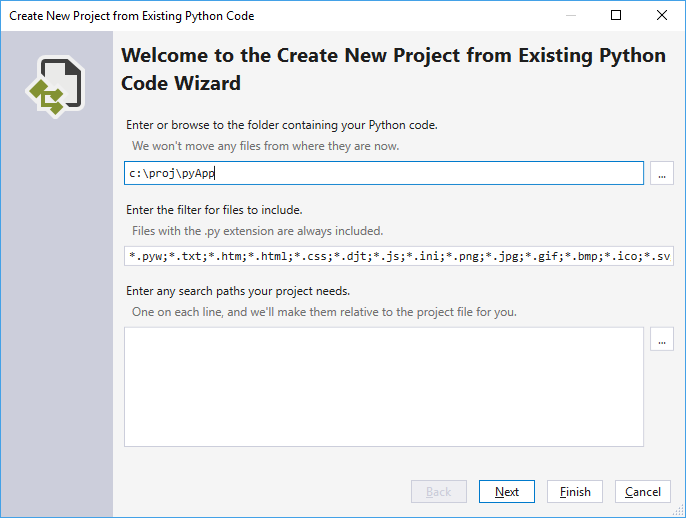
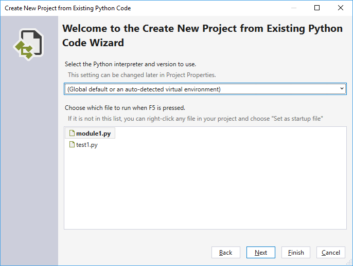
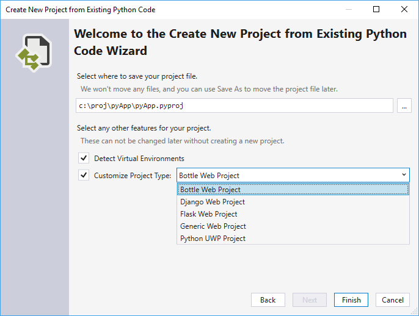

1. Launch Visual Studio and select **File > New > Project**.

1. In the **New Project** dialog, search for "Python", select the "From Existing Python code" template, give the project a name and location, and select **OK**.

1. In the wizard that appears, set the path to your existing code, set a filter for file types, and specify any search paths that your project requires, then select **Next**. If you don't know what search paths are, leave that field blank.

    

1. In the next dialog, select the startup file for your project and select **Next**. (If desired, select an environment; otherwise accept the defaults.) Note that the dialog shows only files in the root folder; if the file you want is in a subfolder, leave the startup file blank and set it later in Solution Explorer (described below).

    

1. Select the location in which to save the project file (which is a `.pyproj` file on disk). If applicable, you can also include auto-detection of virtual environments and customize the project for different web frameworks. If you're unsure of these options, leave them set to the defaults.

    

1. Select **Finish** and Visual Studio creates the project and opens it in Solution Explorer. If you want to move the `.pyproj` file elsewhere, select it in Solution Explorer and choose **File > Save As**. This action updates file references in the project but does not move any code files.

1. To set a different startup file, locate the file in Solution Explorer, right-click, and select **Set as Startup File**.