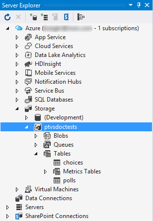
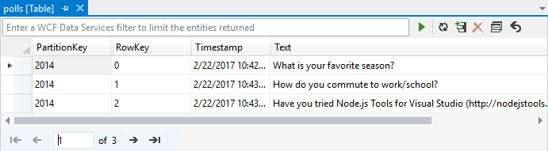

## Explore the Azure Table Storage

It's easy to view and edit storage tables using **Server Explorer** in Visual Studio, provided that you have the Azure SDK Tools installed as listed in the [prerequisites](#prerequisites).

1. Select **View > Server Explorer**, expand **Azure > Storage**, and locates your storage account.
1. If you don't see your account, right-click **Storage** and select **Attach External Storage...**, then enter your account name and key, which should create a node for your account.

  

1. Under your account, expand **Tables** and then double-click on the **polls** or **choices** table to view their contents and add, remove, or edit entries.

  