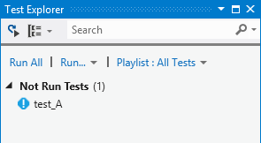
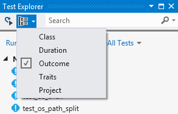
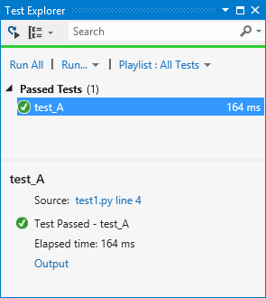
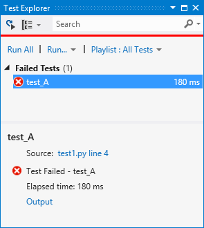
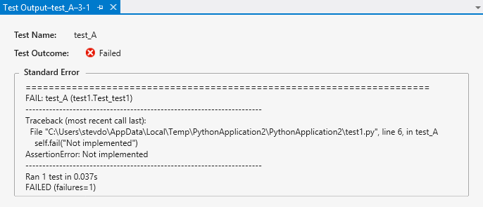
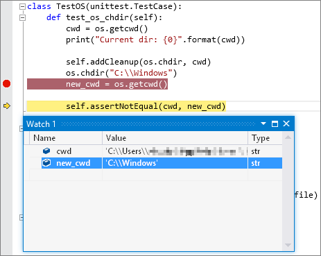

## Discover and view tests

By convention, Visual Studio identifies tests as methods whose names start with `test`. To see this behavior, do the following:

1. Open a [Python project](../../managing-python-projects-in-visual-studio.md) loaded in Visual Studio, right-click your project, select **Add** > **New Item**, then select **Python Unit Test** followed by **Add**.

1. This action creates a *test1.py* file with code that imports the standard `unittest` module, derives a test class from `unittest.TestCase`, and invokes `unittest.main()` if you run the script directly:

    ```python

    import unittest

    class Test_test1(unittest.TestCase):
        def test_A(self):
            self.fail("Not implemented")

    if __name__ == '__main__':
        unittest.main()
    ```

1. Save the file if necessary, then open **Test Explorer** with the **Test** > **Windows** > **Test Explorer** menu command.

1. **Test Explorer** searches your project for tests and displays them as shown below. Double-clicking a test opens its source file.

    

1. As you add more tests to your project, you can organize the view in **Test Explorer** using the **Group by** menu on the toolbar:

    

1. You can also enter text in the **Search** field to filter tests by name.

For more information on the `unittest` module and writing tests, see the [Python 2.7 documentation](https://docs.python.org/2/library/unittest.html) or the [Python 3.7 documentation](https://docs.python.org/3/library/unittest.html) (python.org).

## Run tests

In **Test Explorer** you can run tests in a variety of ways:

- **Run All** clearly runs all shown tests (subject to filters).
- The **Run** menu gives you commands to run failed, passed, or not run tests as a group.
- You can select one or more tests, right-click, and select **Run Selected Tests**.

Tests run in the background and **Test Explorer** updates each test's status as it completes:

- Passing tests show a green tick and the time taken to run the test:

    

- Failed tests show a red cross with an **Output** link that shows console output and `unittest` output from the test run:

    

    

## Debug tests

Because unit tests are pieces of code, they are subject to bugs just like any other code and occasionally need to be run in a debugger. In the debugger you can set breakpoints, examine variables, and step through code. Visual Studio also provides diagnostic tools for unit tests.

To start debugging, set an initial breakpoint in your code, then right-click the test (or a selection) in **Test Explorer** and select **Debug Selected Tests**. Visual Studio starts the Python debugger as it would for application code.



You can also use the **Analyze Code Coverage for Selected Tests**. For more information, see [Use code coverage to determine how much code is tested](../../../test/using-code-coverage-to-determine-how-much-code-is-being-tested.md).

### Known issues

- When starting debugging, Visual Studio appears to start and stop debugging, and then start again. This behavior is expected.
- When debugging multiple tests, each one is run independently, which interrupts the debugging session.
- Visual Studio intermittently fails to start a test when debugging. Normally, attempting to debug the test again succeeds.
- When debugging, it is possible to step out of a test into the `unittest` implementation. Normally, the next step runs to the end of the program and stops debugging.
