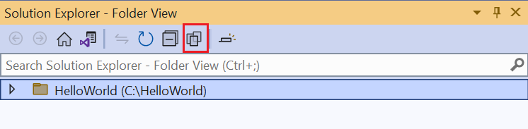
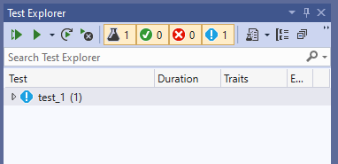
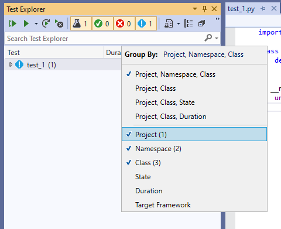

## Select the test framework for a Python project

Visual Studio supports two testing frameworks for Python, [unittest](https://docs.python.org/3/library/unittest.html) and [pytest](https://pytest.org/en/latest/) (available in Visual Studio 2019 starting with version 16.3). By default, no framework is selected when you create a Python project. To specify a framework, right-click on the project name in Solution Explorer and select the **Properties** option. This opens the project designer, which allows you to configure tests through the **Test** tab. From this tab, you can select the test framework that you want to use for your project. 

* For the **unittest** framework, the project's root directory is used for test discovery. This location, as well as the text pattern for identifying tests, can be modified on the **Test** tab to user specified values.
* For the **pytest** framework, testing options such as test location and filename patterns are specified using the standard pytest .ini configuration file. See the [pytest reference documentation](https://docs.pytest.org/en/latest/reference.html#ini-options-ref) for more details.

Once you've saved your framework selection and settings, test discovery is initiated in the Test Explorer. If the Test Explorer window is not already open, navigate to the toolbar and select **Test** > **Test Explorer**.

## Configure testing for Python without a project
Visual Studio allows you to run and test existing Python code without a project, by [opening a folder](../../quickstart-05-python-visual-studio-open-folder.md) with Python code. Under these circumstances, you'll need to use a **PythonSettings.json** file to configure testing. 
1. Open your existing Python code using the **Open a Local Folder** option. 

   

1. Within the Solution Explorer window, click the **Show All Files** icon to show all files in the current folder.

   

1. Navigate to the **PythonSettings.json** file within the **Local Settings** folder. If you don't see this file in the **Local Settings** folder, create it manually.
   
1. Add the field **TestFramework** to the settings file and set it to **pytest** or **unittest** depending on the testing framework you want to use.

    ```json
    {
    "TestFramework": "unittest",
    "UnitTestRootDirectory": "testing",
    "UnitTestPattern": "test_*.py"
    }
    ```

    > [!Note]
    > For the **unittest** framework, if the fields **UnitTestRootDirectory** and **UnitTestPattern** are not specified in the PythonSettings.json file, they are added and assigned default values of "." and "test*.py" respectively.

1. If your folder contains a **src** directory that is separate from the folder that contains your tests, specify the path to the **src** folder using the **SearchPaths** field in your **PythonSettings.json** file.

    ```json
    {
    "TestFramework": "unittest",
    "UnitTestRootDirectory": "testing",
    "UnitTestPattern": "test_*.py",
    "SearchPaths": [ ".\\src"]
    }
    ```

1. Save your changes to the PythonSettings.json file to initiate test discovery for the specified framework. 
   > [!Note]
   > If the Test Explorer window is already open **CTRL** + **R,A** also triggers discovery.

## Discover and view tests

By default, Visual Studio identifies **unittest** and **pytest** tests as methods whose names start with `test`. To see test discovery, do the following:

1. Open a [Python project](../../managing-python-projects-in-visual-studio.md).

1. Once the project is loaded in Visual Studio, right-click your project in Solution Explorer and select the **unittest** or **pytest** framework from the Properties **Test** tab.
   > [!Note]
   > If you use the pytest framework, you can specify test location and filename patterns using the standard pytest .ini configuration file. By default, the workspace/project folder is used, with a pattern of `test_*py` and `*_test.py`. See the [pytest reference documentation](https://docs.pytest.org/en/latest/reference.html#ini-options-ref) for more details.

1. After the framework is selected, right-click the project again and select **Add** > **New Item**, then select **Python Unit Test** followed by **Add**.

1. This action creates a *test_1.py* file with code that imports the standard `unittest` module, derives a test class from `unittest.TestCase`, and invokes `unittest.main()` if you run the script directly:

    ```python
    import unittest

    class Test_test1(unittest.TestCase):
        def test_A(self):
            self.fail("Not implemented")

    if __name__ == '__main__':
        unittest.main()
    ```

1. Save the file if necessary, then open **Test Explorer** with the **Test** > **Test Explorer** menu command.

1. **Test Explorer** searches your project for tests and displays them as shown below. Double-clicking a test opens its source file.

     

1. As you add more tests to your project, you can organize the view in **Test Explorer** using the **Group By** menu on the toolbar:

     

1. You can also enter text in the **Search** field to filter tests by name.

For more information on the `unittest` module and writing tests, see the [Python 2.7 documentation](https://docs.python.org/2/library/unittest.html) or the [Python 3.7 documentation](https://docs.python.org/3/library/unittest.html) (python.org).

## Run tests

In **Test Explorer** you can run tests in a variety of ways:

- **Run All** clearly runs all shown tests (subject to filters).
- The **Run** menu gives you commands to run failed, passed, or not run tests as a group.
- You can select one or more tests, right-click, and select **Run Selected Tests**.

Tests run in the background and **Test Explorer** updates each test's status as it completes:

- Passing tests show a green tick and the time taken to run the test:

    

- Failed tests show a red cross with an **Output** link that shows console output and `unittest` output from the test run:

    

    

## Debug tests

Because unit tests are pieces of code, they are subject to bugs just like any other code and occasionally need to be run in a debugger. In the debugger you can set breakpoints, examine variables, and step through code. Visual Studio also provides diagnostic tools for unit tests.

> [!Note]
> By default, test debugging uses the ptvsd 4 debugger. If you would like to instead use ptvsd 3, you can select the **Use Legacy Debugger** option on **Tools** > **Options** > **Python** > **Debugging**. 

To start debugging, set an initial breakpoint in your code, then right-click the test (or a selection) in **Test Explorer** and select **Debug Selected Tests**. Visual Studio starts the Python debugger as it would for application code.


You can also use the **Analyze Code Coverage for Selected Tests**. For more information, see [Use code coverage to determine how much code is tested](../../../test/using-code-coverage-to-determine-how-much-code-is-being-tested.md).
