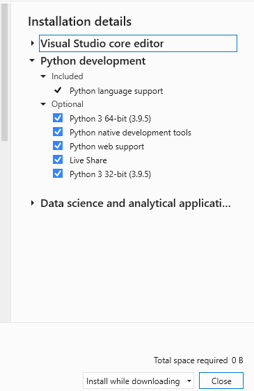
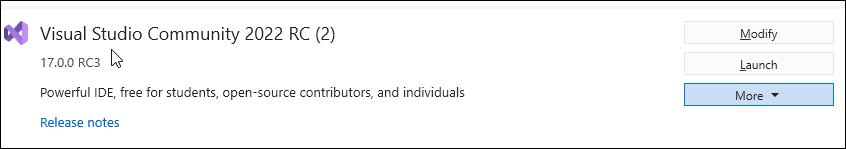

# How to install Python support in Visual Studio on Windows

 [!INCLUDE [Visual Studio](~/includes/applies-to-version/vs-windows-only.md)]

To install Python support for Visual Studio (also known as Python Tools for Visual Studio or PTVS), follow the instructions in the section that matches your version of Visual Studio:
:::moniker range=">=vs-2022"

-[Visual Studio 2022](#visual-studio-2022)
:::moniker-end
:::moniker range="vs-2019"

- [Visual Studio 2019](#visual-studio-2019)
:::moniker-end

To quickly test Python support after following the installation steps, open the **Python Interactive** window by pressing **Alt**+**I** and entering `2+2`. If you don't see the output of `4`, recheck your steps.

> [!Tip]
> The Python workload includes the helpful Cookiecutter extension that provides a graphical user interface to discover templates, input template options, and create projects and files. For details, see [Use Cookiecutter](using-python-cookiecutter-templates.md).

> [!Note]
> Python support isn't presently available in Visual Studio for Mac, but is available on Mac and Linux through Visual Studio Code. See [questions and answers](overview-of-python-tools-for-visual-studio.md#questions-and-answers).

:::moniker range=">=vs-2022"

## Visual Studio 2022

:::moniker-end
:::Moniker range="vs-2019"

## Visual Studio 2019

:::moniker-end

1. Download and run the latest Visual Studio installer. If you have Visual Studio installed already, run the Visual Studio Installer, select the **Modify** option (see [Modify Visual Studio](../install/modify-visual-studio.md)) and go to step 2.

    :::moniker range=">=vs-2022"
  
   >[!div class="nextstepaction"]
   > [Install Visual Studio 2022 Community](https://visualstudio.microsoft.com/thank-you-downloading-visual-studio/?sku=Community&rel=17)

    >[!Tip]
    > The Community edition is for individual developers, classroom learning, academic research, and open source development. For other users, install [Visual Studio 2022 Professional](https://visualstudio.microsoft.com/thank-you-downloading-visual-studio/?sku=Professional&rel=17) or [Visual Studio 2022 Enterprise](https://visualstudio.microsoft.com/thank-you-downloading-visual-studio/?sku=Enterprise&rel=17)

    :::moniker-end
    :::moniker range="vs-2019"

   >[!div class="nextstepaction"]
   > [Install Visual Studio 2019 Community](https://visualstudio.microsoft.com/thank-you-downloading-visual-studio/?sku=Community&rel=15&rid=34347&utm_source=docs&utm_medium=clickbutton&utm_campaign=python_gettingstarted)

    >[!Tip]
    > The Community edition is for individual developers, classroom learning, academic research, and open source development. For other uses, install [Visual Studio 2019 Professional](https://visualstudio.microsoft.com/thank-you-downloading-visual-studio/?sku=Professional&rel=15&rid=34347&utm_source=docs&utm_medium=clickbutton&utm_campaign=python_gettingstarted) or [Visual Studio 2019 Enterprise](https://visualstudio.microsoft.com/thank-you-downloading-visual-studio/?sku=Enterprise&rel=15&rid=34347&utm_source=docs&utm_medium=clickbutton&utm_campaign=python_gettingstarted).

    :::moniker-end

1. The Visual Studio installer provides you a list of workloads that are groups of related options for specific development areas. For Python, select the **Python development** workload.

   Optional: if you're working with data science, also consider the **Data science and analytical applications** workload. This workload includes support for the Python, R, and F# languages. For more information, see [Data science and analytical applications workload](data-science-and-analytical-applications-workload.md).

   .

1. On the right side of the installer, choose other options if you want. Skip this step to accept the default options.
   :::moniker range=">=vs-2022"

   

   :::moniker-end

   :::moniker range="vs-2019"

   

   :::moniker-end

 | Option | Description |
   | --- | --- |
| Python distributions | Choose any combination of the available options, such as 32-bit and 64-bit variants of the Python 2, Python 3, Miniconda, Anaconda2, and Anaconda3 distributions that you plan to work with. Each includes the distribution's interpreter, runtime, and libraries. Anaconda, specifically, is an open data science platform that includes a wide range of pre-installed packages. (You can return to the Visual Studio installer at any time to add or remove distributions.) **Note**: If you've installed a distribution outside of the Visual Studio installer, there's no need to check the equivalent option here. Visual Studio automatically detects existing Python installations. See [The Python Environments window](managing-python-environments-in-visual-studio.md#the-python-environments-window). Also, if a newer version of Python is available than what's shown in the installer, you can install that version separately and Visual Studio will detect it. |
| **Cookiecutter template support** | Installs the Cookiecutter graphical UI to discover templates, input template options, and create projects and files. See [Use the Cookiecutter extension](using-python-cookiecutter-templates.md). |
| **Python web support** | Installs tools for web development including HTML, CSS, and JavaScript editing support, along with templates for projects using the Bottle, Flask, and Django frameworks. See [Python web project templates](python-web-application-project-templates.md). |
| **Python native development tools** | Installs the C++ compiler and other necessary components to develop native extensions for Python. See [Create a C++ extension for Python](working-with-c-cpp-python-in-visual-studio.md). Also install the **Desktop development with C++** workload for full C++ support. |

After installation, the installer provides options to modify, launch, repair, or uninstall Visual Studio. The **Modify** button changes to **Update** when updates to Visual Studio are available for any installed components. (The **Modify** option is then available on the drop-down menu.) You can also launch Visual Studio and the installer from the Windows **Start** menu by searching on "Visual Studio".

:::moniker range=">=vs-2022"

   

:::moniker-end
:::moniker range="vs-2019"

   

:::moniker-end

### Troubleshooting

To fix problems while installing or running Python in Visual Studio, try the following steps:

- Determine whether the same error occurs using the Python CLI, that is, running *python.exe* from a command prompt.
- Use the [**Repair**](../install/repair-visual-studio.md) option in the Visual Studio installer.
- Repair or reinstall Python through **Settings** > **Apps & features** in Windows.

**Example error**: Failed to start interactive process: System.ComponentModel.Win32Exception (0x80004005): Unknown error (0xc0000135) at Microsoft.PythonTools.Repl.PythonInteractiveEvaluator.d__43.MoveNext().

You may see errors when attempting to install or update Python itself, such as `PackageId:CPython39.Exe.x64;PackageAction:DownloadPackage;ReturnCode:0x80070193`. These errors occur when the download or install of Python from https://python.org fails. This could be due to network timeouts, corporate firewall policy, VPN configuration, anti-virus, or other problems. See if a retry helps, and if not, see if you can download the Python runtime directly from https://python.org and install it manually.

## Install locations

:::moniker range=">=vs-2022"

By default, the Python support installs for all users on a computer.

For Visual Studio 2022, the Python workload installs in *%ProgramFiles%\Microsoft Visual Studio\\<VS_version>\\<VS_edition>Common7\IDE\Extensions\Microsoft\Python* where &lt;VS_version&gt; is 2022 and &lt;VS_edition&gt; is Community, Professional, or Enterprise.

:::moniker-end
:::moniker range="<=vs-2019"

By default, the Python support installs for all users on a computer.

For Visual Studio 2019 and Visual Studio 2017, the Python workload installs in *%ProgramFiles(x86)%\Microsoft Visual Studio\\<VS_version>\\<VS_edition>Common7\IDE\Extensions\Microsoft\Python* where &lt;VS_version&gt; is 2019 or 2017 and &lt;VS_edition&gt; is Community, Professional, or Enterprise.

:::moniker-end

