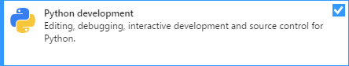
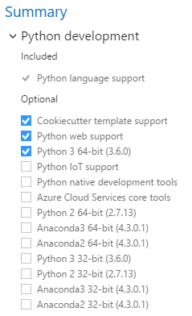
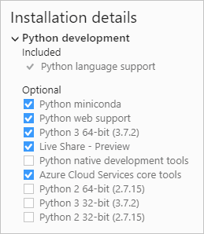
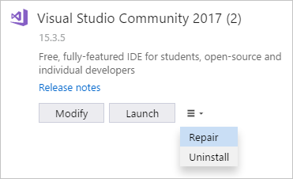
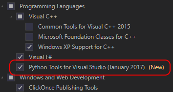

# How to install Python support in Visual Studio on Windows

To install Python support for Visual Studio (also known as Python Tools for Visual Studio or PTVS), follow the instructions in the section that matches your version of Visual Studio:

- [Visual Studio 2017 and Visual Studio 2019](#visual-studio-2017-and-2019)
- [Visual Studio 2015](#visual-studio-2015)
- [Visual Studio 2013 and earlier](#visual-studio-2013-and-earlier)

To quickly test Python support after following the installation steps, open the **Python Interactive** window by pressing **Alt**+**I** and entering `2+2`. If you don't see the output of `4`, recheck your steps.

> [!Tip]
> The Python workload includes the helpful Cookiecutter extension that provides a graphical user interface to discover templates, input template options, and create projects and files. For details, see [Use Cookiecutter](using-python-cookiecutter-templates.md).

> [!Note]
> Python support is not presently available in Visual Studio for Mac, but is available on Mac and Linux through Visual Studio Code. See [questions and answers](overview-of-python-tools-for-visual-studio.md#questions-and-answers).

## Visual Studio 2019 and Visual Studio 2017

1. Download and run the latest Visual Studio installer. If you have Visual Studio installed already, run the Visual Studio Installer, select the **Modify** option (see [Modify Visual Studio](../install/modify-visual-studio.md)) and go to step 2.

    > [!div class="nextstepaction"]
    > [Install Visual Studio 2019 Community](https://visualstudio.microsoft.com/thank-you-downloading-visual-studio/?sku=Community&rel=15&rid=34347&utm_source=docs&utm_medium=clickbutton&utm_campaign=python_gettingstarted)

    >[!Tip]
    > The Community edition is for individual developers, classroom learning, academic research, and open source development. For other uses, install [Visual Studio 2019 Professional](https://visualstudio.microsoft.com/thank-you-downloading-visual-studio/?sku=Professional&rel=15&rid=34347&utm_source=docs&utm_medium=clickbutton&utm_campaign=python_gettingstarted) or [Visual Studio 2019 Enterprise](https://visualstudio.microsoft.com/thank-you-downloading-visual-studio/?sku=Enterprise&rel=15&rid=34347&utm_source=docs&utm_medium=clickbutton&utm_campaign=python_gettingstarted).

1. The installer presents you with a list of workloads, which are groups of related options for specific development areas. For Python, select the **Python development** workload.

    

    ::: moniker range="vs-2017"
    Optional: if you're working with data science, also consider the **Data science and analytical applications** workload. This workload includes support for the Python, R, and F# languages. For more information, see [Data science and analytical applications workload](data-science-and-analytical-applications-workload.md).

    > [!Note]
    > The Python and Data Science workloads are available only with Visual Studio 2017 version 15.2 and later.

    ::: moniker-end

    ::: moniker range=">=vs-2019"
    Optional: if you're working with data science, also consider the **Data science and analytical applications** workload. This workload includes support for the Python and F# languages. For more information, see [Data science and analytical applications workload](data-science-and-analytical-applications-workload.md).
    ::: moniker-end

1. On the right side of the installer, chose additional options if desired. Skip this step to accept the default options.

    ::: moniker range="vs-2017"
    
    ::: moniker-end

    ::: moniker range=">=vs-2019"
    
    ::: moniker-end

    ::: moniker range="<=vs-2017"
    | Option | Description |
    | --- | --- |
    | Python distributions | Choose any combination of the available options, such as 32-bit and 64-bit variants of the Python 2, Python 3, Miniconda, Anaconda2, and Anaconda3 distributions that you plan to work with. Each includes the distribution's interpreter, runtime, and libraries. Anaconda, specifically, is an open data science platform that includes a wide range of pre-installed packages. (You can return to the Visual Studio installer at any time to add or remove distributions.)  **Note**: If you've installed a distribution outside of the Visual Studio installer, there's no need to check the equivalent option here. Visual Studio automatically detects existing Python installations. See [The Python Environments window](managing-python-environments-in-visual-studio.md#the-python-environments-window). Also, if a newer version of Python is available than what's shown in the installer, you can install that version separately and Visual Studio will detect it. |
    | **Cookiecutter template support** | Installs the Cookiecutter graphical UI to discover templates, input template options, and create projects and files. See [Use the Cookiecutter extension](using-python-cookiecutter-templates.md). |
    | **Python web support** | Installs tools for web development including HTML, CSS, and JavaScript editing support, along with templates for projects using the Bottle, Flask, and Django frameworks. See [Python web project templates](python-web-application-project-templates.md). |
    | **Python IoT support** | Supports Windows IoT Core development using Python. |
    | **Python native development tools** | Installs the C++ compiler and other necessary components to develop native extensions for Python. See [Create a C++ extension for Python](working-with-c-cpp-python-in-visual-studio.md). Also install the **Desktop development with C++** workload for full C++ support. |
    | **Azure Cloud Services core tools** | Provides additional support for developer Azure Cloud Services in Python. See [Azure cloud service projects](python-azure-cloud-service-project-template.md). |
    ::: moniker-end

    ::: moniker range=">=vs-2019"
    | Option | Description |
    | --- | --- |
    | Python distributions | Choose any combination of the available options, such as 32-bit and 64-bit variants of the Python 2, Python 3, Miniconda, Anaconda2, and Anaconda3 distributions that you plan to work with. Each includes the distribution's interpreter, runtime, and libraries. Anaconda, specifically, is an open data science platform that includes a wide range of pre-installed packages. (You can return to the Visual Studio installer at any time to add or remove distributions.)  **Note**: If you've installed a distribution outside of the Visual Studio installer, there's no need to check the equivalent option here. Visual Studio automatically detects existing Python installations. See [The Python Environments window](managing-python-environments-in-visual-studio.md#the-python-environments-window). Also, if a newer version of Python is available than what's shown in the installer, you can install that version separately and Visual Studio will detect it. |
    | **Cookiecutter template support** | Installs the Cookiecutter graphical UI to discover templates, input template options, and create projects and files. See [Use the Cookiecutter extension](using-python-cookiecutter-templates.md). |
    | **Python web support** | Installs tools for web development including HTML, CSS, and JavaScript editing support, along with templates for projects using the Bottle, Flask, and Django frameworks. See [Python web project templates](python-web-application-project-templates.md). |
    | **Python native development tools** | Installs the C++ compiler and other necessary components to develop native extensions for Python. See [Create a C++ extension for Python](working-with-c-cpp-python-in-visual-studio.md). Also install the **Desktop development with C++** workload for full C++ support. |
    | **Azure Cloud Services core tools** | Provides additional support for developer Azure Cloud Services in Python. See [Azure cloud service projects](python-azure-cloud-service-project-template.md). |
    ::: moniker-end

1. After installation, the installer provides options to modify, launch, repair, or uninstall Visual Studio. The **Modify** button changes to **Update** when updates to Visual Studio are available for any installed components. (The **Modify** option is then available on the drop-down menu.) You can also launch Visual Studio and the installer from the Windows **Start** menu by searching on "Visual Studio".

    

### Troubleshooting

If you encounter problems installing or running Python in Visual Studio, try the following:

- Determine whether the same error occurs using the Python CLI, that is, running *python.exe* from a command prompt.
- Use the [**Repair**](../install/repair-visual-studio.md) option in the Visual Studio installer.
- Repair or reinstall Python through **Settings** > **Apps & features** in Windows.

**Example error**: Failed to start interactive process: System.ComponentModel.Win32Exception (0x80004005): Unknown error (0xc0000135) at Microsoft.PythonTools.Repl.PythonInteractiveEvaluator.d__43.MoveNext().

## Visual Studio 2015

1. Run the Visual Studio installer through **Control Panel > Programs and Features**, selecting **Microsoft Visual Studio 2015** and then **Change**.

1. In the installer, select **Modify**.

1. Select **Programming Languages** > **Python Tools for Visual Studio** and then **Next**:

    

1. Once Visual Studio setup is complete, [install a Python interpreter of your choice](installing-python-interpreters.md). Visual Studio 2015 supports only Python 3.5 and earlier; later versions generate a message like **Unsupported Python version 3.6**). If you already have an interpreter installed and Visual Studio doesn't detect it automatically, see [Manually identify an existing environment](managing-python-environments-in-visual-studio.md#manually-identify-an-existing-environment).

## Visual Studio 2013 and earlier

1. Install the appropriate version of Python Tools for Visual Studio for your version of Visual Studio:

    - Visual Studio 2013: [PTVS 2.2 for Visual Studio 2013](https://github.com/Microsoft/PTVS/releases/v2.2). The **File** > **New Project** dialog in Visual Studio 2013 gives you a shortcut for this process.
    - Visual Studio 2012: [PTVS 2.1 for Visual Studio 2012](https://pytools.codeplex.com/downloads/get/920478)
    - Visual Studio 2010: [PTVS 2.1 for Visual Studio 2010](https://pytools.codeplex.com/downloads/get/920479)

1. [Install a Python interpreter of your choice](installing-python-interpreters.md). If you already have an interpreter installed and Visual Studio doesn't detect it automatically, see [Manually identify an existing environment](managing-python-environments-in-visual-studio.md#manually-identify-an-existing-environment).

## Install locations

By default, Python support is installed for all users on a computer.

For Visual Studio 2019 and Visual Studio 2017, the Python workload is installed in *%ProgramFiles(x86)%\Microsoft Visual Studio\\<VS_version>\\<VS_edition>Common7\IDE\Extensions\Microsoft\Python* where &lt;VS_version&gt; is 2019 or 2017 and &lt;VS_edition&gt; is Community, Professional, or Enterprise.

For Visual Studio 2015 and earlier, installation paths are as follows:

- 32-bit:
  - Path: *%Program Files(x86)%\Microsoft Visual Studio \<VS_ver>\Common7\IDE\Extensions\Microsoft\Python Tools for Visual Studio\\<PTVS_ver>*
  - Registry location of path: **HKEY_LOCAL_MACHINE\Software\Microsoft\PythonTools\\<VS_ver>\InstallDir**
- 64-bit:
  - Path: *%Program Files%\Microsoft Visual Studio \<VS_ver>\Common7\IDE\Extensions\Microsoft\Python Tools for Visual Studio\\<PTVS_ver>*
  - Registry location of path: **HKEY_LOCAL_MACHINE\Software\Wow6432Node\Microsoft\PythonTools\\<VS_ver>\InstallDir**

where:

- &lt;VS_ver&gt; is:
  - 14.0 for Visual Studio 2015
  - 12.0 for Visual Studio 2013
  - 11.0 for Visual Studio 2012
  - 10.0 for Visual Studio 2010
- &lt;PTVS_ver&gt; is a version number, such as 2.2, 2.1, 2.0, 1.5, 1.1, or 1.0.

### User-specific installations (1.5 and earlier)

Python Tools for Visual Studio 1.5 and earlier allowed installation for the current user only, in which case the installation path is *%LocalAppData%\Microsoft\VisualStudio\\<VS_ver>\Extensions\Microsoft\Python Tools for Visual Studio\\<PTVS_ver>* where &lt;VS_ver&gt; and &lt;PTVS_ver&gt; are the same as described above.
