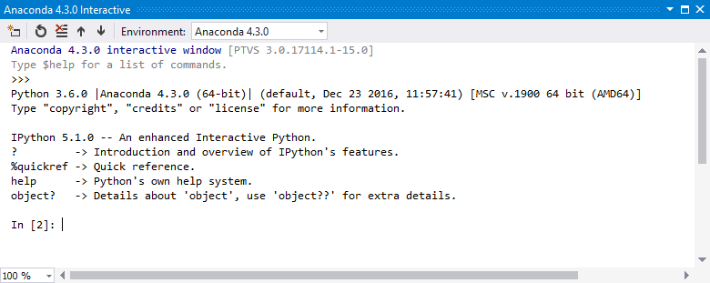
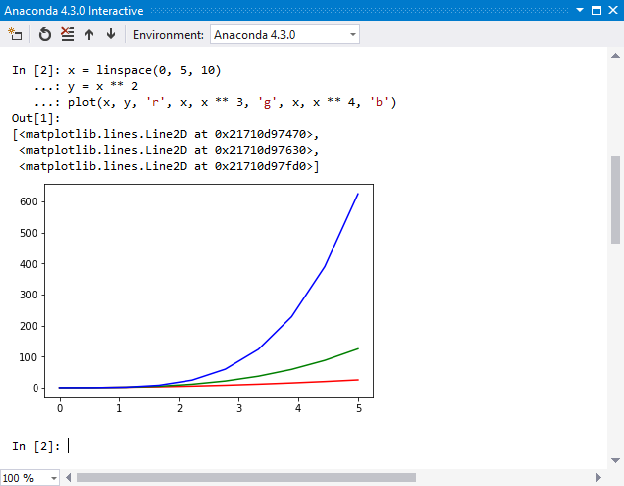
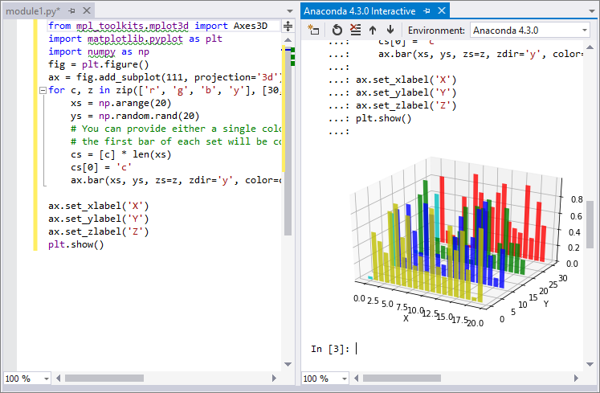

# Use IPython in the Interactive window

The Visual Studio **Interactive** window in IPython mode is an advanced yet user-friendly interactive development environment that has Interactive Parallel Computing features. This article walks through using IPython in the Visual Studio **Interactive** window, in which all of the regular [Interactive window](python-interactive-repl-in-visual-studio.md) features are also available.

For this walkthrough you should have the [Anaconda](https://www.continuum.io) environment installed, which includes IPython and the necessary libraries.

> [!Note]
> IronPython does not support IPython, despite the fact that you can select it on the **Interactive Options** form. For more information see the [feature request](https://github.com/Microsoft/PTVS/issues/84).

1. Open Visual Studio, switch to the **Python Environments** window (**View** > **Other Windows** > **Python Environments**), and select an Anaconda environment.

2. Examine the **Packages (Conda)** tab (which may appear as **pip** or **Packages**) for that environment to make sure that `ipython` and `matplotlib` are listed. If not, install them here. (See [Python Environments windows - Packages tab](python-environments-window-tab-reference.md).)

3. Select the **Overview** tab and select **Use IPython interactive mode**. (In Visual Studio 2015, select **Configure interactive options** to open the **Options** dialog, then set **Interactive Mode** to **IPython**, and select **OK**).

4. Select **Open interactive window** to bring up the **Interactive** window in IPython mode. You may need to reset the window if you have just changed the interactive mode; you might also need to press **Enter** if only a >>> prompt appears, so that you get a prompt like **In [2]**.

    

5. Enter the following code:

   ```python
   import matplotlib.pyplot as plt
   import numpy as np

   x = np.linspace(0, 5, 10)
   y = x ** 2
   plt.plot(x, y, 'r', x, x ** 3, 'g', x, x ** 4, 'b')
   ```

6. After entering the last line, you should see an inline graph (which you can resize by dragging on the lower right-hand corner if desired).

    

7. Instead of typing in the REPL, you can instead write code in the editor, select it, right-click, and select the **Send to Interactive** command (or press **Ctrl**+**Enter**). Try pasting the code below into a new file in the editor, selecting it with **Ctrl**+**A**, then sending to the **Interactive** window. (Visual Studio sends the code as one unit to avoid giving you intermediate or partial graphs. And if you don't have a Python project open with a different environment selected, Visual Studio opens an **Interactive** window for whatever environment is selected as your default in the **Python Environments** window.)

    ```python
    from mpl_toolkits.mplot3d import Axes3D
    import matplotlib.pyplot as plt
    import numpy as np
    fig = plt.figure()
    ax = fig.add_subplot(111, projection='3d')
    for c, z in zip(['r', 'g', 'b', 'y'], [30, 20, 10, 0]):
        xs = np.arange(20)
        ys = np.random.rand(20)
        # You can provide either a single color or an array. To demonstrate this,
        # the first bar of each set is colored cyan.
        cs = [c] * len(xs)
        cs[0] = 'c'
        ax.bar(xs, ys, zs=z, zdir='y', color=cs, alpha=0.8)

    ax.set_xlabel('X')
    ax.set_ylabel('Y')
    ax.set_zlabel('Z')
    plt.show()
    ```

    

8. To see the graphs outside of the **Interactive** window, run the code instead using the **Debug** > **Start without Debugging** command.

IPython has many other useful features such as escaping to the system shell, variable substitution, capturing output, etc. Refer to the [IPython documentation](https://ipython.org/documentation.html) for more.

## See also

- To use Jupyter easily and without installation, try the free [Azure Notebooks hosted service](https://notebooks.azure.com/) that lets you keep and share your notebooks with others.

- The [Azure Data Science Virtual Machine](/azure/machine-learning/data-science-virtual-machine/overview) is also pre-configured to run Jupyter notebooks along with a wide range of other data science tools.
