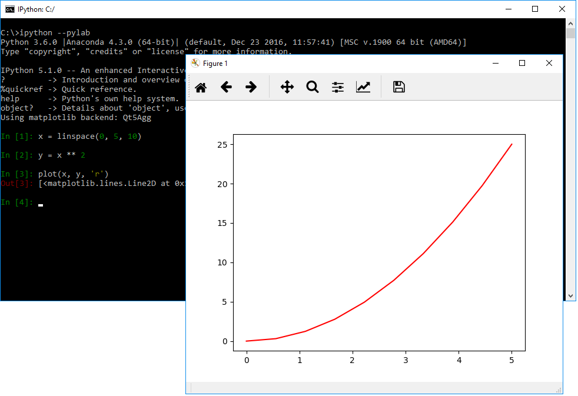
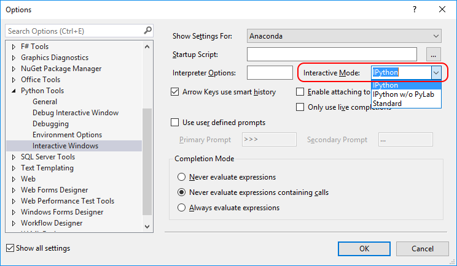
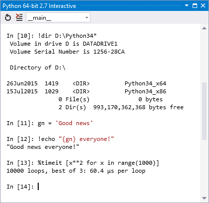
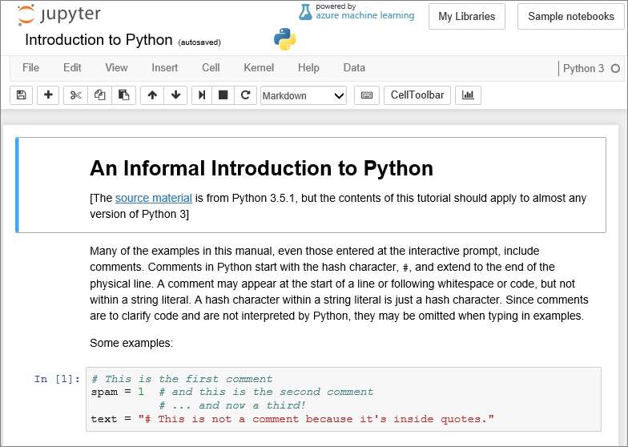

# Using Python in the Interactive Window

The Visual Studio interactive window in IPython mode is an advanced yet user-friendly interactive development environment that has Interactive Parallel Computing features. In this topic we'll walk through using IPython in the Visual Studio interactive window. For this you should have the [Anaconda](https://www.continuum.io) environment is installed, which includes IPython and the necessary libraries.

> [!Note]
> IronPython does not support IPython, despite the fact that you can select it on the Interactive Options form. You can upvote the [feature request](https://github.com/Microsoft/PTVS/issues/84) or implement it if you'd like.

1. Make sure the IPython package is installed correctly by going to your Python installation directory and starting IPython in Pylab mode:

  ```bash
  ipython --pylab
  ```

1. Enter the following:

  ```python
  x = linspace(0, 5, 10)
  y = x ** 2
  plot(x, y, 'r')
  ```

1. If everything is configured properly, you should see something like this:

    

1. Open Visual Studio, switch to the Python Environments window (**View > Other Windows > Python Environments**), and select your Python environment.
1. Look at the **pip** tab and ensure that `IPython` and `matplotlib` are listed. If not, install them here.
1. Select the **Overview** tab, select **Configure interactive options**, set **Interactive Mode** to IPython, and select **OK**:

    

1. Select **Open interactive window** to bring up the interactive window in IPython mode with PyLab. You may need to reset the window if you have just changed the interactive mode:

    

1. Enter the following code:

  ```python
  x = linspace(0, 5, 10)
  y = x ** 2
  plot(x, y, 'r', x, x ** 3, 'g', x, x ** 4, 'b')
  ```

1. After entering the last line, you should see an inline graph (which you can resize by dragging on the lower right-hand corner) if desired.

    

1. Instead of typing in the REPL, you can instead write code in the editor, select it, right-click, and select the **Send to interactive** command (Ctrl-E,E). Try pasting the code below into the editor, selecting it with Ctrl-A, then sending to the interactive window. (Note that when Visual Studio sends code to the interactive window, it sends it as one unit to avoid giving you intermediate or partial graphs.)

    ```python
    from mpl_toolkits.mplot3d import Axes3D
    import matplotlib.pyplot as plt
    import numpy as np
    fig = plt.figure()
    ax = fig.add_subplot(111, projection='3d')
    for c, z in zip(['r', 'g', 'b', 'y'], [30, 20, 10, 0]):
        xs = np.arange(20)
        ys = np.random.rand(20)
        # You can provide either a single color or an array. To demonstrate this,
        # the first bar of each set will be colored cyan.
        cs = [c] * len(xs) 
        cs[0] = 'c' 
        ax.bar(xs, ys, zs=z, zdir='y', color=cs, alpha=0.8)

    ax.set_xlabel('X') 
    ax.set_ylabel('Y') 
    ax.set_zlabel('Z') 
    plt.show()
    ```

    

1. To see the graphs outside of the interactive window, run the code instead using the **Debug > Start without Debugging** command.
    
1. IPython has a number of useful features such as escaping to the system shell, variable substitution, capturing output, etc. Please refer to the IPython reference guide for further information:

    

1. You can also use IPython in "notebook" mode where you can use any browser on any OS as the canvas. The back-end IPython engine can be local on your machine, or remote. Azure has support for running [IPython on a Windows or Linux VM](https://docs.microsoft.com/azure/virtual-machines/virtual-machines-linux-jupyter-notebook). Also see the [Azure Notebooks Preview](https://notebooks.azure.com) for free Jupyter Notebooks as a Service on Azure:

    
