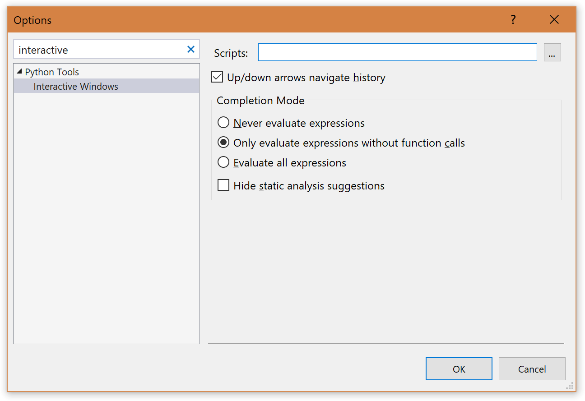
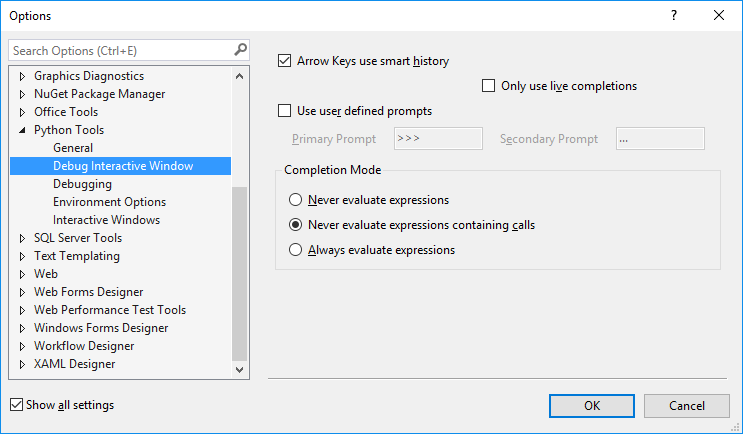

# Working with the Python Interactive Window

Visual Studio provides an interactive read-evaluate-print loop (REPL) window for each of your Python environments, which improves upon the REPL you get with `python.exe` on the command line. The interactive window (opened with the **View > Other Windows > &lt;environment&gt; Interactive** menu commands) lets you to enter arbitrary Python code and see immediate results, which helps you learn and experiment with APIs, and to interactively develop working code to include in your projects.

Visual Studio has a number of Python REPL modes to choose from:

| REPL | Description | Editing | Debugging | Images |
| --- | --- | --- | --- | --- |
| Standard | Default REPL, talks to Python directly | Standard editing (multiline, etc). | Yes, via `$attach` | No |
| Debug | Default REPL, talks to debugged Python process | Standard editing | Only debugging | No |
| IPython | REPL talks to IPython backend | IPython commands, Pylab conveniences | No | Yes, inline in REPL |
| IPython w/o Pylab | REPL talks to IPython backend | Standard IPython | No | Yes, separate window | 

This topic describes the **Standard** and **Debug** REPL modes. For details on IPython modes, see [Using the IPython REPL](interactive-repl-ipython.md).

For an introduction to the Python interactive Window, see [Getting Started with Python in Visual Studio, Part 5: Interactive REPL](https://youtu.be/yc2CROtTsC0?list=PLReL099Y5nRdLgGAdrb_YeTdEnd23s6Ff) (youtube.com, 2m51s).

> [!VIDEO https://www.youtube.com/embed/yc2CROtTsC0]

## Opening an interactive window

There are several ways to open the interactive window for an environment.

First, switch to the Python Environments window (**View > Other Windows > Python Environments** or Ctrl-K,Ctrl-`) and select the **Open Interactive Window** command or button for a chosen environment.

Second, the **View > Other Windows** has **Interactive** commands for each of your environments, typically shown near the bottom of the menu:

Third, you can open an interactive window on the starup file in your project, or for a stand-alone file, by selecting the **Debug > Execute [Project | File] in Python Interactive** menu command (Shift+Alt+F5):

Finally, you can select code in file and use the [send code to interactive command](#send-code-to-interactive) command described below.

## Interactive window options

You can control various aspects of the interactive window through the **Configure interactive window** in the Python Environments window, or through **Tools > Options > Python Tools > Interactive Windows**:

Note that there is also a separate set of options for the **Debug Interactive Window**, which controls behavior when using during a debugging session:

## Using the interactive window

Once the interactive window is open, you can start entering code line-by-line at the `>>>` prompt. The interactive window executes each line as you enter it, which includes importing modules, defining variables, and so on. You can see this in the first two lines shown in the graphic below:

The exception is when a statement ends in a colon, as with the `for` statement above, because the interactive window knows that it needs additional lines of code before it can properly execute the code block. In this case, the line prompt changes to `...` indicating that you need to enter additional lines for the block, as shown on the fourth and fifth lines in the graphic above. When you press Enter on a blank line, the interactive window closes the block and executes it in the interpreter.

> [!Tip]
> The interactive window improves upon the usual Python command-line REPL experience by automatically indenting statements that belong to a surrounding scope. Its history (recalled with the up arrow) also provides multiline items, whereas the command-line REPL provides only single lines.

The interactive window is a great way to try out a new library. You can import the library, inspect the sub packages, classes, and functions.  Python can tell you all of this info through its `help()` function.  Also, Python support in Visual Studio gives you suggestions and documentation based on its code modeling used in the editor, which it does without needing to execute the library.  When you do execute code, Visual Studio uses information from the Python runtime to improve these suggestions.  

The interactive window also supports several meta-commands. All meta-commands start with `$`, and you can type `$help` to get a list of the meta-commands and `$help <command>` to get usage details for a specific command.

| Meta-command | Description |
| --- | --- |
| `$$` | Inserts a comment, which is helpful to comment code throughout your session. |
| `$attach` | Attaches the Visual Studio debugger to the REPL window process to enable debugging. |
| `$cls`, `$clear` | Clears the contents of the editor window, leaving history and execution context intact. |
| `$help` | Display a list of commands, or help on a specific command. |
| `$load` | Loads commands from file and executes until complete. |
| `$mod` | Switches the current scope to the specified module name. |
| `$reset` | Resets the execution environment to the initial state, but keeps history. |
| `$wait` | Waits for at least the specified number of milliseconds. |

The commands are also extensible via MEF (the Managed Extensibility Framework for .NET).

## Switching scopes

By default, the interactive window for a project is scoped to the project's startup file as if you ran it from the command prompt. For a stand-alone file, it's scopes to that file. At any time, however, drop-down menu along the top of the interactive window lets you change scope at any time during your REPL session:

Once you import a module, such as typing `import os`, you'll see options in the drop-down to switch into any scope in that module. You'll also see a message in the interactive window indicating the new scope, so you can keep track of how you got to a certain state during your session.

Entering `dir()` in a scope displays valid identifiers in that scope, including function names, classes, and variables. For example, using `$mod importlib` followed by `dir()` shows the following:

<a name="sending-code-to-interactive"</a>
## Send code to interactive command

In addition to working within the interactive window directly, you can select code in the editor, right-click, and choose **Send to Interactive**:

This is useful for for iterative or evolutionary code development, including testing your code as you develop it. For example, once you've sent a piece of code to the interactive window and seen its output, you can press the up arrow to show the code again, modify it, and test it quickly by pressing Ctrl+Enter. (Pressing Enter at the end of input executes it, but pressing Enter in the middle of input inserts a newline.) Once you have the code you want, you can easily copy it back into your project file.

You can also select code, right-click, and select **Send to Defining Module**, which searches the interactive process to find the module that matches the current file being edited. If the command finds the correct module, then it uses the `$mod` meta-command to switch to that module (which becomes part of the interactive window's session history), and pastes the selection into the interactive window for evaluation. This shortcuts the process of copying code in the editor, switching scopes in the interactive window, and pasting manually.

## IntelliSense behavior

The interactive window includes IntelliSense based on the live objects, unlike the code editor in which IntelliSense is based on source code analysis only. This makes suggestions more correct in the interactive window, especially with dynamically-generated code. The drawback is that functions with side-effects (such a logging messages) may impact your development experience.

If this is a problem, change the settings under **Tools > Options > Python Tools > Interactive Windows** in the **Completion Mode** group:

- **Never evaluate expressions**: Uses normal IntelliSense engine will be used for suggestions.
- **Never evaluate expressions containing calls** (default): Simple expressions such as `a.b` are evaluated but expressions involving calls, such as `a().b` use the normal engine.
- **Always evaluate expressions**: Executes the complete expression to get suggestions, regardless of whether it may have side-effects.