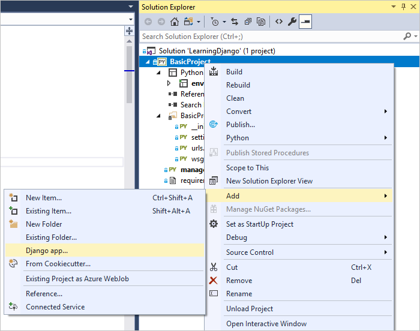
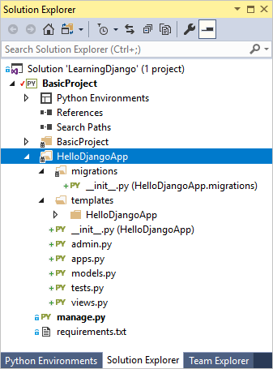
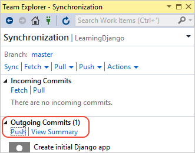
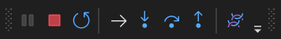
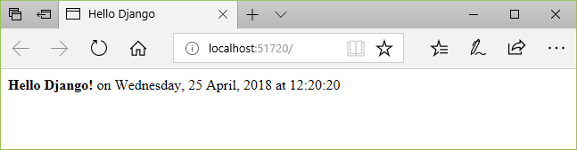

# Step 2: Create a Django app with views and page templates

**Previous step: [Create a Visual Studio project and solution](learn-django-in-visual-studio-step-01-project-and-solution.md)**

What you have so far in the Visual Studio project are only the site-level components of a Django *project*, which can run one or more Django *apps*. The next step is to create your first app with a single page.

In this step you now learn how to:

> [!div class="checklist"]
> - Create a Django app with a single page (step 2-1)
> - Run the app from the Django project (step 2-2)
> - Render a view using HTML (step 2-3)
> - Render a view using a Django page template (step 2-4)

## Step 2-1: Create an app with a default structure

A Django app is a separate Python package that contains a set of related files for a specific purpose. A Django project can contain any number of apps, which reflects the fact that a web host can serve any number of separate entry points from a single domain name. For example, a Django project for a domain like contoso.com might contain one app for `www.contoso.com`, a second app for support.contoso.com, and a third app for docs.contoso.com. In this case, the Django project handles site-level URL routing and settings (in its *urls.py* and *settings.py* files), while each app has its own distinct styling and behavior through its internal routing, views, models, static files, and administrative interface.

A Django app typically begins with a standard set of files. Visual Studio provides item templates to initialize a Django app within a Django project, along with an integrated menu command that serves the same purpose:

- Templates: In **Solution Explorer**, right-click the project and select **Add** > **New item**. In the **Add New Item** dialog, select the **Django 1.9 App** template, specify the app name in the **Name** field, and select **OK**.

- Integrated command: In **Solution Explorer**, right-click the project and select **Add** > **Django app**. This command prompts you for a name and creates a Django 1.9 app.

    

Using either method, create an app with the name "HelloDjangoApp". The result is a folder in your project with that name that contains items as described in the table that follows.



::: moniker range="vs-2017"
| Item | Description |
| --- | --- |
| **\_\_init\_\_.py** | The file that identifies the app as a package. |
| **migrations** | A folder in which Django stores scripts that update the database to align with changes to the models. Django's migration tools then apply the necessary changes to any previous version of the database so that it matches the current models. Using migrations, you keep your focus on your models and let Django handle the underlying database schema. Migrations are discussed in step 6; for now, the folder simply contains an *\_\_init\_\_.py* file (indicating that the folder defines its own Python package). |
| **templates** | A folder for Django page templates containing a single file *index.html* within a folder matching the app name. (In Visual Studio 2017 15.7 and earlier, the file is contained directly under *templates* and step 2-4 instructs you to create the subfolder.) Templates are blocks of HTML into which views can add information to dynamically render a page. Page template "variables," such as `{{ content }}` in *index.html*, are placeholders for dynamic values as explained later in this article (step 2). Typically Django apps create a namespace for their templates by placing them in a subfolder that matches the app name. |
| **admin.py** | The Python file in which you extend the app's administrative interface (see step 6), which is used to seed and edit data in a database. Initially, this file contains only the statement, `from django.contrib import admin`. By default, Django includes a standard administrative interface through entries in the Django project's *settings.py* file, which you can turn on by uncommenting existing entries in *urls.py*. |
| **apps.py** | A Python file that defines a configuration class for the app (see below, after this table). |
| **models.py** | Models are data objects, identified by functions, through which views interact with the app's underlying database (see step 6). Django provides the database connection layer so that apps don't need to concern themselves with those details. The *models.py* file is a default place in which to create your models, and initially contains only the statement, `from django.db import models`. |
| **tests.py** | A Python file that contains the basic structure of unit tests. |
| **views.py** | Views are what you typically think of as web pages, which take an HTTP request and return an HTTP response. Views typically render as HTML that web browsers know how to display, but a view doesn't necessarily have to be visible (like an intermediate form). A view is defined by a Python function whose responsibility is to render the HTML to send to the browser. The *views.py* file is a default place in which to create views, and initially contains only the statement, `from django.shortcuts import render`. |
::: moniker-end

::: moniker range=">=vs-2019"
| Item | Description |
| --- | --- |
| **\_\_init\_\_.py** | The file that identifies the app as a package. |
| **migrations** | A folder in which Django stores scripts that update the database to align with changes to the models. Django's migration tools then apply the necessary changes to any previous version of the database so that it matches the current models. Using migrations, you keep your focus on your models and let Django handle the underlying database schema. Migrations are discussed in the [Django documentation](https://docs.djangoproject.com/en/3.2/topics/migrations/); for now, the folder simply contains an *\_\_init\_\_.py* file (indicating that the folder defines its own Python package). |
| **templates** | A folder for Django page templates containing a single file *index.html* within a folder matching the app name. (In Visual Studio 2017 15.7 and earlier, the file is contained directly under *templates* and step 2-4 instructs you to create the subfolder.) Templates are blocks of HTML into which views can add information to dynamically render a page. Page template "variables," such as `{{ content }}` in *index.html*, are placeholders for dynamic values as explained later in this article (step 2). Typically Django apps create a namespace for their templates by placing them in a subfolder that matches the app name. |
| **admin.py** | The Python file in which you extend the app's administrative interface, which is used to seed and edit data in a database. Initially, this file contains only the statement, `from django.contrib import admin`. By default, Django includes a standard administrative interface through entries in the Django project's *settings.py* file, which you can turn on by uncommenting existing entries in *urls.py*. |
| **apps.py** | A Python file that defines a configuration class for the app (see below, after this table). |
| **models.py** | Models are data objects, identified by functions, through which views interact with the app's underlying database. Django provides the database connection layer so that apps don't need to concern themselves with those details. The *models.py* file is a default place in which to create your models, and initially contains only the statement, `from django.db import models`. |
| **tests.py** | A Python file that contains the basic structure of unit tests. |
| **views.py** | Views are what you typically think of as web pages, which take an HTTP request and return an HTTP response. Views typically render as HTML that web browsers know how to display, but a view doesn't necessarily have to be visible (like an intermediate form). A view is defined by a Python function whose responsibility is to render the HTML to send to the browser. The *views.py* file is a default place in which to create views, and initially contains only the statement, `from django.shortcuts import render`. |
::: moniker-end

The contents of *apps.py* appears as follows when using the name "HelloDjangoApp":

```python
from django.apps import AppConfig

class HelloDjangoAppConfig(AppConfig):
    name = 'HelloDjango'
```

### Question: Is creating a Django app in Visual Studio any different from creating an app on the command line?

Answer: Running the **Add** > **Django app** command or using **Add** > **New Item** with a Django app template produces the same files as the Django command `manage.py startapp <app_name>`. The benefit to creating the app in Visual Studio is that the app folder and all its files are automatically integrated into the project. You can use the same Visual Studio command to create any number of apps in your project.

## Step 2-2: Run the app from the Django project

At this point, if you run the project again in Visual Studio (using the toolbar button or **Debug** > **Start Debugging**), you still see the default page. No app content appears because you need to define an app-specific page and add the app to the Django project:

1. In the *HelloDjangoApp* folder, modify *views.py* to match the code below, which defines a view named "index":

    ```python
    from django.shortcuts import render
    from django.http import HttpResponse

    def index(request):
        return HttpResponse("Hello, Django!")
    ```

1. In the *BasicProject* folder (created in step 1), modify *urls.py* to at least match the following code (you can retain the instructive comments if you like):

    ```python
    from django.conf.urls import include, url
    import HelloDjangoApp.views

    # Django processes URL patterns in the order they appear in the array
    urlpatterns = [
        url(r'^$', HelloDjangoApp.views.index, name='index'),
        url(r'^home$', HelloDjangoApp.views.index, name='home'),
    ]
    ```

    Each URL pattern describes the views to which Django routes specific site-relative URLs (that is, the portion that follows `https://www.domain.com/`). The first entry in `urlPatterns` that starts with the regular expression `^$` is the routing for the site root, "/". The second entry, `^home$` specifically routes "/home". You can have any number of routings to the same view.

1. Run the project again to see the message **Hello, Django!** as defined by the view. Stop the server when you're done.

### Commit to source control

Because you've made changes to your code and have tested them successfully, now is a great time to review and commit your changes to source control. Later steps in this tutorial remind you of appropriate times to commit to source control again, and refer you back to this section.

1. Select the changes button along the bottom of Visual Studio (circled below), which navigates to **Team Explorer**.

    

1. In **Team Explorer**, enter a commit message like "Create initial Django app" and select **Commit All**. When the commit is complete, you see a message **Commit \<hash> created locally. Sync to share your changes with the server.** If you want to push changes to your remote repository, select **Sync**, then select **Push** under **Outgoing Commits**. You can also accumulate multiple local commits before pushing to remote.

    

### Question: What is the 'r' prefix before the routing strings for?

Answer: The 'r' prefix on a string in Python means "raw," which instructs Python to not escape any characters within the string. Because regular expressions use many special characters, using the 'r' prefix makes those strings much easier to read than if they contained a number of '\\' escape characters.

### Question: What do the ^ and $ characters mean in the URL routing entries?

Answer: In the regular expressions that define URL patterns, ^ means "start of line" and $ means "end of line," where again the URLs are relative to the site root (the part that follows `https://www.domain.com/`). The regular expression `^$` effectively means "blank" and therefore matches the full URL `https://www.domain.com/` (nothing added to the site root). The pattern `^home$` matches exactly `https://www.domain.com/home/`. (Django doesn't use the trailing / in pattern matching.)

If you don't use a trailing $ in a regular expression, as with `^home`, then URL pattern matches *any* URL that begins with "home" such as "home", "homework", "homestead", and "home192837".

To experiment with different regular expressions, try online tools such as [regex101.com](https://regex101.com) at [pythex.org](https://www.pythex.org).

## Step 2-3: Render a view using HTML

The `index` function that you have so far in *views.py* generates nothing more than a plain-text HTTP response for the page. Most real-world web pages, of course, respond with rich HTML pages that often incorporate live data. Indeed, the primary reason to define a view using a function is so you can generate that content dynamically.

Because the argument to `HttpResponse` is just a string, you can build up any HTML you like within a string. As a simple example, replace the `index` function with the following code (keeping the existing `from` statements), which generates an HTML response using dynamic content that's updated every time you refresh the page:

```python
from datetime import datetime

def index(request):
    now = datetime.now()

    html_content = "<html><head><title>Hello, Django</title></head><body>"
    html_content += "<strong>Hello Django!</strong> on " + now.strftime("%A, %d %B, %Y at %X")
    html_content += "</body></html>"

    return HttpResponse(html_content)
```

Run the project again to see a message like "**Hello Django!** on Monday, 16 April, 2018 at 16:28:10". Refresh the page to update the time and confirm that the content is being generated with each request. Stop the server when you're done.

> [!Tip]
> A shortcut to stopping and restarting the project is to use the **Debug** > **Restart** menu command (**Ctrl**+**Shift**+**F5**) or the **Restart** button on the debugging toolbar:
>
> 

## Step 2-4: Render a view using a page template

Generating HTML in code works fine for very small pages, but as pages get more sophisticated you typically want to maintain the static HTML parts of your page (along with references to CSS and JavaScript files) as "page templates" into which you then insert dynamic, code-generated content. In the previous section, only the date and time from the `now.strftime` call is dynamic, which means all the other content can be placed in a page template.

A Django page template is a block of HTML that can contain any number of replacement tokens called "variables" that are delineated by `{{` and `}}`, as in `{{ content }}`. Django's templating module then replaces variables with dynamic content that you provide in code.

The following steps demonstrate the use of page templates:

1. Under the *BasicProject* folder, which contains the Django project, open *settings.py* file and add the app name, "HelloDjangoApp", to the `INSTALLED_APPS` list. Adding the app to the list tells the Django project that there's a folder of that name containing an app:

    ```python
    INSTALLED_APPS = [
        'HelloDjangoApp',
        # Other entries...
    ]
    ```

1. Also in *settings.py*, make sure the `TEMPLATES` object contains the following line (included by default), which instructs Django to look for templates in an installed app's *templates* folder:

    ```json
    'APP_DIRS': True,
    ```

1. In the *HelloDjangoApp* folder, open the *templates/HelloDjangoApp/index.html* page template file (or *templates/index.html* in VS 2017 15.7 and earlier), to observe that it contains one variable, `{{ content }}`:

    ```html
    <html>
    <head><title></title></head>

    <body>

    {{ content }}

    </body>
    </html>
    ```

1. In the *HelloDjangoApp* folder, open *views.py* and replace the `index` function with the following code that uses the `django.shortcuts.render` helper function. The `render` helper provides a simplified interface for working with page templates. Be sure to keep all existing `from` statements.

    ```python
    from django.shortcuts import render   # Added for this step

    def index(request):
        now = datetime.now()

        return render(
            request,
            "HelloDjangoApp/index.html",  # Relative path from the 'templates' folder to the template file
            # "index.html", # Use this code for VS 2017 15.7 and earlier
            {
                'content': "<strong>Hello Django!</strong> on " + now.strftime("%A, %d %B, %Y at %X")
            }
        )
    ```

    The first argument to `render`, as you can see, is the request object, followed by the relative path to the template file within the app's *templates* folder. A template file is named for the view it supports, if appropriate. The third argument to `render` is then a dictionary of variables that the template refers to. You can include objects in the dictionary, in which case a variable in the template can refer to `{{ object.property }}`.

1. Run the project and observe the output. You should see a similar message to that seen in step 2-2, indicating that the template works.

    Observe, however, that the HTML you used in the `content` property renders only as plain text because the `render` function automatically escapes that HTML. Automatic escaping prevent accidental vulnerabilities to injection attacks: developers often gather input from one page and use it as a value in another through a template placeholder. Escaping also serves as a reminder that it's again best to keep HTML in the page template and out of the code. Fortunately, it's a simple matter to create additional variables where needed. For example, change *index.html* with *templates* to match the following markup, which adds a page title and keeps all formatting in the page template:

    ```html
    <html>
        <head>
            <title>{{ title }}</title>
        </head>
        <body>
            <strong>{{ message }}</strong>{{ content }}
        </body>
    </html>
    ```

    Then write the `index` view function as follows, to provide values for all the variables in the page template:

    ```python
    def index(request):
        now = datetime.now()

        return render(
            request,
            "HelloDjangoApp/index.html",  # Relative path from the 'templates' folder to the template file
            # "index.html", # Use this code for VS 2017 15.7 and earlier
            {
                'title' : "Hello Django",
                'message' : "Hello Django!",
                'content' : " on " + now.strftime("%A, %d %B, %Y at %X")
            }
        )
    ```

1. Stop the server and restart the project, and observe that the page now renders properly:

    

1. <a name="template-namespacing"></a>Visual Studio 2017 version 15.7 and earlier: As a final step, move your templates into a subfolder named the same as your app, which creates a namespace and avoids potential conflicts with other apps you might add to the project. (The templates in VS 2017 15.8+ do this for you automatically.) That is, create a subfolder in *templates* named *HelloDjangoApp*, move *index.html* into that subfolder, and modify the `index` view function to refer to the template's new path, *HelloDjangoApp/index.html*. Then run the project, verify that the page renders properly, and stop the server.

1. Commit your changes to source control and update your remote repository, if desired, as described under [step 2-2](#commit-to-source-control).

### Question: Do page templates have to be in a separate file?

Answer: Although templates are usually maintained in separate HTML files, you can also use an inline template. Using a separate file is recommended, however, to maintain a clean separation between markup and code.

### Question: Must templates use the .html file extension?

Answer: The *.html* extension for page template files is entirely optional, because you always identify the exact relative path to the file in the second argument to the `render` function. However, Visual Studio (and other editors) typically give you features like code completion and syntax coloration with *.html* files, which outweighs the fact that page templates are not strictly HTML.

In fact, when you're working with a Django project, Visual Studio automatically detects when the HTML file you're editing is actually a Django template, and provides certain auto-complete features. For example, when you start typing a Django page template comment, `{#`, Visual Studio automatically gives you the closing `#}` characters. The **Comment Selection** and **Uncomment Selection** commands (on the **Edit** > **Advanced** menu and on the toolbar) also use template comments instead of HTML comments.

### Question: When I run the project, I see an error that the template cannot be found. What's wrong?

Answer: If you see errors that the template cannot be found, make sure you added the app to the Django project's *settings.py* in the `INSTALLED_APPS` list. Without that entry, Django won't know to look in the app's *templates* folder.

### Question: Why is template namespacing important?

Answer: When Django looks for a template referred to in the `render` function, it uses whatever file it finds first that matches the relative path. If you have multiple Django apps in the same project that use the same folder structures for templates, it's likely that one app will unintentionally use a template from another app. To avoid such errors, always create a subfolder under an app's *templates* folder that matches the name of the app to avoid any and all duplication.

## Next steps

> [!div class="nextstepaction"]
> [Serve static files, add pages, and use template inheritance](learn-django-in-visual-studio-step-03-serve-static-files-and-add-pages.md)

## Go deeper

- [Writing your first Django app, part 1 - views](https://docs.djangoproject.com/en/2.0/intro/tutorial01/#write-your-first-view) (docs.djangoproject.com)
- For more capabilities of Django templates, such as includes and inheritance, see [The Django template language](https://docs.djangoproject.com/en/2.0/ref/templates/language/) (docs.djangoproject.com)
- [Regular expression training on inLearning](https://www.linkedin.com/learning/topics/regular-expressions) (LinkedIn)
- Tutorial source code on GitHub: [Microsoft/python-sample-vs-learning-django](https://github.com/Microsoft/python-sample-vs-learning-django)
