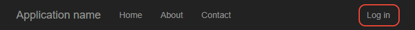
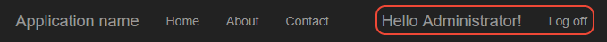
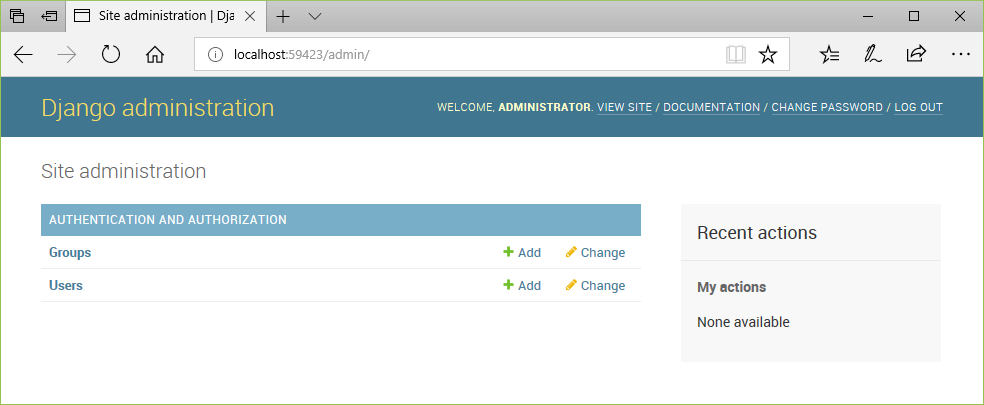
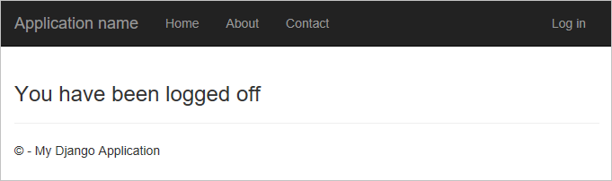

# Step 5: Authenticate users in Django

**Previous step: [Use the full Django Web Project template](learn-django-in-visual-studio-step-04-full-django-project-template.md)**

::: moniker range="vs-2017"
Because authentication is a common need for web apps, the "Django Web Project" template includes a basic authentication flow. (The "Polls Django Web Project" template discussed in step 6 of this tutorial also includes the same flow.) When using any of the Django project templates, Visual Studio includes all the necessary modules for authentication in the Django project's *settings.py*.
::: moniker-end

::: moniker range=">=vs-2019"
Because authentication is a common need for web apps, the "Django Web Project" template includes a basic authentication flow. When using any of the Django project templates, Visual Studio includes all the necessary modules for authentication in the Django project's *settings.py*.
::: moniker-end

In this step you learn:

> [!div class="checklist"]
> - How to use the authentication flow provided in the Visual Studio templates (step 5-1)

## Step 5-1: Use the authentication flow

The following steps exercise the authentication flow and describe the parts of the project that are involved:

1. If you've not already followed the instructions in the *readme.html* file in the project root to create a super user (administrator) account, do so now.

1. Run the app from Visual Studio using **Debug** > **Start Debugging** (**F5**). When the app appears in the browser, observe that **Log in** appears on the upper right of the nav bar.

    

1. Open *templates/app/layout.html* and observe that the `<div class="navbar ...>` element contains the tag ``. The `` tag instructs Django's templating system to pull in the contents of the included file at this point in the containing template.

1. Open *templates/app/loginpartial.html* and observe how it uses the conditional tag `` along with an `` tag to render different UI elements depending on whether the user has authenticated:

    ```html
    
    <form id="logoutForm" action="/logout" method="post" class="navbar-right">
        
        <ul class="nav navbar-nav navbar-right">
            <li><span class="navbar-brand">Hello {{ user.username }}!</span></li>
            <li><a href="javascript:document.getElementById('logoutForm').submit()">Log off</a></li>
        </ul>
    </form>

    

    <ul class="nav navbar-nav navbar-right">
        <li><a href="">Log in</a></li>
    </ul>

    
    ```

1. Because no user is authenticated when you first start the app, this template code renders only the "Log in" link to the relative path "login". As specified in *urls.py* (as shown in the previous section), that route is mapped to the `django.contrib.auth.views.login` view. That view receives the following data:

    ```python
    {
        'template_name': 'app/login.html',
        'authentication_form': app.forms.BootstrapAuthenticationForm,
        'extra_context':
        {
            'title': 'Log in',
            'year': datetime.now().year,
        }
    }
    ```

    Here, `template_name` identifies the template for the login page, in this case *templates/app/login.html*. The `extra_context` property is added to the default context data given to the template. Finally, `authentication_form` specifies a form class to use with the login; in the template it appears as the `form` object. The default value is `AuthenticationForm` (from `django.contrib.auth.views`); the Visual Studio project template instead uses the form defined in the app's *forms.py* file:

    ```python
    from django import forms
    from django.contrib.auth.forms import AuthenticationForm
    from django.utils.translation import ugettext_lazy as _

    class BootstrapAuthenticationForm(AuthenticationForm):
        """Authentication form which uses boostrap CSS."""
        username = forms.CharField(max_length=254,
                                   widget=forms.TextInput({
                                       'class': 'form-control',
                                       'placeholder': 'User name'}))
        password = forms.CharField(label=_("Password"),
                                   widget=forms.PasswordInput({
                                       'class': 'form-control',
                                       'placeholder':'Password'}))
    ```

    As you can see, this form class derives from `AuthenticationForm` and specifically overrides the username and password fields to add placeholder text. The Visual Studio template includes this explicit code on the assumption that you likely want to customize the form, such as adding password strength validation.

1. When you navigate to the login page, then, the app renders the *login.html* template. The variables `{{ form.username }}` and `{{ form.password }}` render the `CharField` forms from `BootstrapAuthenticationForm`. There's also a built-in section to show validation errors, and a ready-made element for social logins if you choose to add those services.

    ```html
    

    

    <h2>{{ title }}</h2>
    <div class="row">
        <div class="col-md-8">
            <section id="loginForm">
                <form action="." method="post" class="form-horizontal">
                    
                    <h4>Use a local account to log in.</h4>
                    <hr />
                    <div class="form-group">
                        <label for="id_username" class="col-md-2 control-label">User name</label>
                        <div class="col-md-10">
                            {{ form.username }}
                        </div>
                    </div>
                    <div class="form-group">
                        <label for="id_password" class="col-md-2 control-label">Password</label>
                        <div class="col-md-10">
                            {{ form.password }}
                        </div>
                    </div>
                    <div class="form-group">
                        <div class="col-md-offset-2 col-md-10">
                            <input type="hidden" name="next" value="/" />
                            <input type="submit" value="Log in" class="btn btn-default" />
                        </div>
                    </div>
                    
                    <p class="validation-summary-errors">Please enter a correct user name and password.</p>
                    
                </form>
            </section>
        </div>
        <div class="col-md-4">
            <section id="socialLoginForm"></section>
        </div>
    </div>

    
    ```

1. When you submit the form, Django attempts to authenticate your credentials (such as the super user's credentials). If authentication fails, you remain on the current page but `form.errors` set to true. If authentication is successful, Django navigates to the relative URL in the "next" field, `<input type="hidden" name="next" value="/" />`, which in this case is the home page (`/`).

1. Now, when the home page is rendered again, the `user.is_authenticated` property is true when the *loginpartial.html* template is rendered. As a result, you see a **Hello (username)** message and **Log off**. You can use `user.is_authenticated` in other parts of the app to check authentication.

    

1. To check whether the authenticated user is authorized to access specific resources, you need to retrieve user-specific permissions from your database. For more information, see [Using the Django authentication system](https://docs.djangoproject.com/en/2.0/topics/auth/default/#permissions-and-authorization) (Django docs).

1. The super user or administrator, in particular, is authorized to access the built-in Django administrator interfaces using the relative URLs "/admin/" and "/admin/doc/". To enable these interfaces, do the following:

    1. Install the docutils Python package into your environment. A great way to do this is to add "docutils" to your *requirements.txt* file, then in **Solution Explorer**, expand the project, expand the **Python Environments** node, then right-click the environment you're using an select **Install from requirements.txt**.

    1. Open the Django project's *urls.py* and remove the default comments from the following entries:

        ```python
        from django.conf.urls import include
        from django.contrib import admin
        admin.autodiscover()

        # ...
        urlpatterns = [
            # ...
            url(r'^admin/doc/', include('django.contrib.admindocs.urls')),
            url(r'^admin/', include(admin.site.urls)),
        ]
        ```

    1. In the Django project's *settings.py* file, navigate to the `INSTALLED_APPS` collection and add `'django.contrib.admindocs'`.

    1. When you restart the app, you can navigate to "/admin/" and "/admin/doc/" and perform tasks like creating additional user accounts.

        

1. The final part to the authentication flow is logging off. As you can see in *loginpartial.html*, the **Log off** link simply does a POST to the relative URL "/login", which is handled by the built-in view `django.contrib.auth.views.logout`. This view doesn't display any UI and just navigates to the home page (as shown in *urls.py* for the "^logout$" pattern). If you want to display a logoff page, first change the URL pattern as follows to add a "template_name" property and remove the "next_page" property:

    ```python
    url(r'^logout$',
        django.contrib.auth.views.logout,
        {
            'template_name': 'app/loggedoff.html',
            # 'next_page': '/',
        },
        name='logout')
    ```

    Then create *templates/app/loggedoff.html* with the following (minimal) contents:

    ```html
    
    
    <h3>You have been logged off</h3>
    
    ```

    The result appears as follows:

    

1. When you're all done, stop the server and once again commit your changes to source control.

### Question: What is the purpose of the  tag that appears in the \<form\> elements?

Answer: The `` tag includes Django's built-in [cross-site request forgery (csrf) protection](https://docs.djangoproject.com/en/2.0/ref/csrf/) (Django docs). You typically add this tag to any element that involves POST, PUT, or DELETE request methods, such as a form. The template rendering function (`render`) then inserts the necessary protection.

## Next steps

::: moniker range="vs-2017"
- [Use the Polls Django Web Project template](learn-django-in-visual-studio-step-06-polls-django-web-project-template.md)
::: moniker-end

::: moniker range=">=vs-2019"
> [!Note]
> If you've been committing your Visual Studio solution to source control throughout the course of this tutorial, now is a good time to do another commit. Your solution should match the tutorial source code on GitHub: [Microsoft/python-sample-vs-learning-django](https://github.com/Microsoft/python-sample-vs-learning-django).

You've now explored the entirety of the "Blank Django Web Project" and "Django Web Project" templates in Visual Studio. You've learned all the basics of Django such as using views and templates, and have explored routing, authentication, and using database models. You should now be able to create a web app of your own with any views and models that you need.

Running a web app on your development computer is just one step in making the app available to your customers. Next steps may include the following tasks:

- Deploy the web app to a production server, such as Azure App Service. See [Publish to Azure App Service](publishing-python-web-applications-to-azure-from-visual-studio.md).

- Customize the 404 page by creating a template named *templates/404.html*. When present, Django uses this template instead of its default one. For more information, see [Error views](https://docs.djangoproject.com/en/2.0/ref/views/#error-views) in the Django documentation.

- Write unit tests in *tests.py*; the Visual Studio project templates provide starting points for these, and more information can be found on [Writing your first Django app, part 5 - testing](https://docs.djangoproject.com/en/2.0/intro/tutorial05/) and [Testing in Django](https://docs.djangoproject.com/en/2.0/topics/testing/) in the Django documentation.

- Change the app from SQLite to a production-level data store such as PostgreSQL, MySQL, and SQL Server (all of which can be hosted on Azure). As described on [When to use SQLite](https://www.sqlite.org/whentouse.html) (sqlite.org), SQLite works fine for low to medium traffic sites with fewer than 100K hits/day, but is not recommended for higher volumes. It's also limited to a single computer, so it cannot be used in any multi-server scenario such as load-balancing and geo-replication. For information on Django's support for other databases, see [Database setup](https://docs.djangoproject.com/en/2.0/intro/tutorial02/#database-setup). You can also use the [Azure SDK for Python](/azure/python/) to work with Azure storage services like tables and blobs.

- Set up a continuous integration/continuous deployment pipeline on a service like Azure DevOps. In addition to working with source control (via Azure Repos or GitHub, or elsewhere), you can configure an Azure DevOps Project to automatically run your unit tests as a pre-requisite for release, and also configure the pipeline to deploy to a staging server for additional tests before deploying to production. Azure DevOps, furthermore, integrates with monitoring solutions like App Insights and closes the whole cycle with agile planning tools. For more information, see [Create a CI/CD pipeline for Python with the Azure DevOps project](/azure/devops-project/azure-devops-project-python?view=vsts&preserve-view=true) and also the general [Azure DevOps documentation](/azure/devops/?view=vsts&preserve-view=true).
::: moniker-end
## Go deeper

- [User authentication in Django](https://docs.djangoproject.com/en/2.0/topics/auth/) (docs.djangoproject.com)
- Tutorial source code on GitHub: [Microsoft/python-sample-vs-learning-django](https://github.com/Microsoft/python-sample-vs-learning-django)
