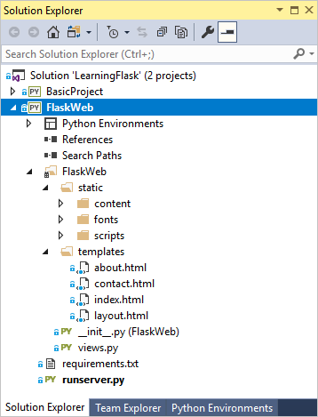
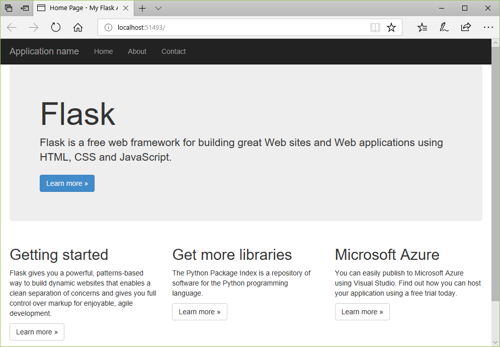
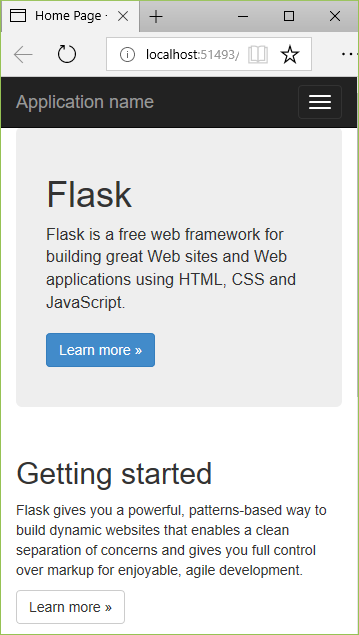

# Step 4: Use the full Flask Web Project template

**Previous step: [Serve static files, add pages, and use template inheritance](learn-flask-visual-studio-step-03-serve-static-files-add-pages.md)**

Now that you've explored the basics of Flask by building an app upon the "Blank Flask App Project" template in Visual Studio, you can easily understand the fuller app that's produced by the "Flask Web Project" template.

In this step you now:

> [!div class="checklist"]
> - Create a fuller Flask web app using the "Flask Web Project" template and examine the project structure (step 4-1)
> - Understand the views and page templates created by the project template, which consist of three pages that inherit from a base page template and that employs static JavaScript libraries like jQuery and Bootstrap (step 4-2)
> - Understand the URL routing provided by the template (step 4-3)

This article applies also to the "Flask/Jade Web Project" template, which produces an app that's identical to that of the "Flask Web Project" using the Jade templating engine instead of Jinja. Additional details are included at the end of this article.

## Step 4-1: Create a project from the template

1. In Visual Studio, go to **Solution Explorer**, right-click the **LearningFlask** solution created earlier in this tutorial, and select **Add** > **New Project**. (Alternately, if you want to use a new solution, select **File** > **New** > **Project** instead.)

1. In the new project dialog, search for and select the **Flask Web Project** template, call the project "FlaskWeb", and select **OK**.

1. Because the template again includes a *requirements.txt* file, Visual Studio asks where to install those dependencies. Choose the option, **Install into a virtual environment**, and in the **Add Virtual Environment** dialog select **Create** to accept the defaults.

1. Once Visual Studio finishes setting up the virtual environment, set the **FlaskWeb** project to be the default for the Visual Studio solution by right-clicking that project in **Solution Explorer** and selecting **Set as Startup Project**. The startup project, which is shown in bold, is what's run when you start the debugger.

    

1. Select **Debug** > **Start Debugging** (**F5**) or use the **Web Server** button on the toolbar to run the server:

    

1. The app created by the template has three pages, Home, About, and Contact, which you navigate between using the nav bar. Take a minute or two to examine different parts of the app. To authenticate with the app through the **Log in** command, use the superuser credentials created earlier.

    

1. The app created by the "Flask Web Project" template uses Bootstrap for responsive layout that accommodates mobile form factors. To see this responsiveness, resize the browser to a narrow view so that the content renders vertically and the nav bar turns into a menu icon:

    

1. You can leave the app running for the sections that follow.

    If you want to stop the app and [commit changes to source control](learn-flask-visual-studio-step-02-create-app.md#commit-to-source-control), first open the **Changes** page in **Team Explorer**, right-click the folder for the virtual environment (probably **env**), and select **Ignore these local items**.

### Examine what the template creates

The "Flask Web Project" template creates the structure below. The contents are very similar to what you created in previous steps. The difference is that the "Flask Web Project" template contains more structure in the *static* folder because it includes jQuery and Bootstrap for responsive design. The template also adds a Contact page. Overall, if you've followed the previous steps in this tutorial, everything from the template should be familiar.

- Files in the project root:
  - *runserver.py*, a script to run the app in a development server.
  - *requirements.txt* containing a dependency on Flask 0.x.
- The *FlaskWeb* folder contains all the app files:
  - *\_\_init.py\_\_* marks the app code as a Python module, creates the Flask object, and imports the app's views.
  - *views.py* contains the code to render pages.
  - The *static* folder contains subfolders named *content* (CSS files), *fonts* (font files), and *scripts* (JavaScript files).
  - The *templates* folder contains a *layout.html* base template along with *about.html*, *contact.html*, and *index.html* for specific pages that each extend *layout.html*.

### Question: Is it possible to share a virtual environment between Visual Studio projects?

Answer: Yes, but do so with the awareness that different projects likely use different packages over time, and therefore a shared virtual environment must contain all the packages for all projects that use it.

Nevertheless, to use an existing virtual environment, do the following:

1. When prompted to install dependencies in Visual Studio, select **I will install them myself** option.
1. In **Solution Explorer**, right-click the **Python Environments** node and select **Add Existing Virtual Environment**.
1. Navigate to and select the folder containing the virtual environment, then select **OK**.

## Step 4-2: Understand the views and page templates created by the project template

As you observe when you run the project, the app contains three views: Home, About, and Contact. The code for these views is found in the *FlaskWeb/views.py*. Each view function simply calls `flask.render_template` with the path to a template and a variable list of arguments for the values to give to the template. For example, the About page is handled by the `about` function (whose decorator provides the URL routing):

```python
@app.route('/about')
def about():
    """Renders the about page."""
    return render_template(
        'about.html',
        title='About',
        year=datetime.now().year,
        message='Your application description page.'
    )
```

The `home` and `contact` functions are nearly identical, with similar decorators and slightly different arguments.

Templates are located in the app's *templates* folder. The base template, *layout.html*, is the most extensive. It refers to all the necessary static files (JavaScript and CSS), defines a block named "content" that other pages override, and provides another block named "scripts". The following annotated excerpts from *layout.html* show these specific areas:

```html
<!DOCTYPE html>
<html>
<head>
    <meta charset="utf-8" />

    <!-- Define a viewport for Bootstrap's responsive rendering -->
    <meta name="viewport" content="width=device-width, initial-scale=1.0">
    <title>{{ title }} - My Flask Application</title>

    <link rel="stylesheet" type="text/css" href="/static/content/bootstrap.min.css" />
    <link rel="stylesheet" type="text/css" href="/static/content/site.css" />
    <script src="/static/scripts/modernizr-2.6.2.js"></script>
</head>

<body>
    <!-- Navbar omitted -->

    <div class="container body-content">
        <!-- "content" block that pages are expected to override -->
        
        <hr />
        <footer>
            <p>&copy; {{ year }} - My Flask Application</p>
        </footer>
    </div>

    <!-- Additional scripts; use the "scripts" block to add page-specific scripts.  -->
    <script src="/static/scripts/jquery-1.10.2.js"></script>
    <script src="/static/scripts/bootstrap.js"></script>
    <script src="/static/scripts/respond.js"></script>
    

</body>
</html>
```

The individual page templates, *about.html*, *contact.html*, and *index.html*, each extend the base template *layout.html*. *about.html* is the simplest and shows the `` and `` tags:

```html




<h2>{{ title }}.</h2>
<h3>{{ message }}</h3>

<p>Use this area to provide additional information.</p>


```

*index.html* and *contact.html* use the same structure and provide lengthier content in the "content" block.

## The Flask/Jade Web Project template

As noted at the beginning of this article, Visual Studio provide a "Flask/Jade Web Project" template, which creates an application that's visually identical to what's produced by the "Flask Web Project". The primary difference is that it uses the Jade templating engine, which is an extension to Jinja that implements the same concepts with a more succinct language. Specifically, Jade uses keywords instead of tags enclosed in  delimiters, for example, and lets you refer to CSS styles and HTML elements using keywords.

To enable Jade, the project template first includes the pyjade package in *requirements.txt*.

The app's *\_\_init\_\_.py* file contains a line to

```python
app.jinja_env.add_extension('pyjade.ext.jinja.PyJadeExtension')
```

In the *templates* folder, you see *.jade* files instead of *.html* templates, and the views in *views.py* refer to these files in their calls to `flask.render_template`. Otherwise the views code is the same.

Opening one of the *.jade* files, you can see the more succinct expression of a template. For example, here's the contents of *templates/layout.jade* as created by the "Flask/Jade Web Project" template:

```jade
doctype html
html
  head
    meta(charset='utf-8')
    meta(name='viewport', content='width=device-width, initial-scale=1.0')
    title #{title} - My Flask/Jade Application
    link(rel='stylesheet', type='text/css', href='/static/content/bootstrap.min.css')
    link(rel='stylesheet', type='text/css', href='/static/content/site.css')
    script(src='/static/scripts/modernizr-2.6.2.js')
  body
    .navbar.navbar-inverse.navbar-fixed-top
      .container
        .navbar-header
          button.navbar-toggle(type='button', data-toggle='collapse', data-target='.navbar-collapse')
            span.icon-bar
            span.icon-bar
            span.icon-bar
          a.navbar-brand(href='/') Application name
        .navbar-collapse.collapse
          ul.nav.navbar-nav
            li
              a(href='/') Home
            li
              a(href='/about') About
            li
              a(href='/contact') Contact
    .container.body-content
      block content
      hr
      footer
        p &copy; #{year} - My Flask/Jade Application

    script(src='/static/scripts/jquery-1.10.2.js')
    script(src='/static/scripts/bootstrap.js')
    script(src='/static/scripts/respond.js')

    block scripts
```

And here's the contents of *templates/about.jade*, showing the use of `#{ <name>}` for placeholders:

```jade
extends layout

block content
  h2 #{title}.
  h3 #{message}
  p Use this area to provide additional information.
```

Feel free to experiment with both Jinja and Jade syntaxes to see which one works best for you.

## Next steps

> [!div class="nextstepaction"]
> [The Polls Flask Web Project template](learn-flask-visual-studio-step-05-polls-flask-web-project-template.md)

## Go deeper

- [Writing your first Flask app, part 4 - forms and generic views](https://docs.djangoproject.com/en/2.0/intro/tutorial04/) (docs.djangoproject.com)
- [Jade on GitHib (Documentation)](https://github.com/liuliqiang/pyjade) (github.com)
- Tutorial source code on GitHub: [Microsoft/python-sample-vs-learning-flask](https://github.com/Microsoft/python-sample-vs-learning-flask)
