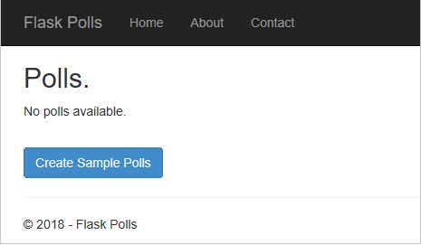
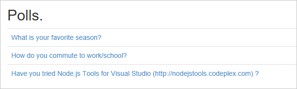
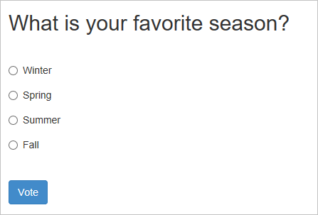
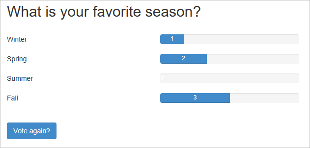

# Step 5: Use the Polls Flask Web Project template

**Previous step: [Use the full Flask Web Project template](learn-flask-visual-studio-step-04-full-flask-project-template.md)**

Having understood Visual Studio's "Flask Web Project" template, you can now look at the third Flask template, "Polls Flask Web Project", which builds upon the same code base.

In this step you learn how to:

> [!div class="checklist"]
> - Create a project from the template and initialize the database (step 5-1)
> - Understand the data models (step 5-2)
> - Understand the backing data stores (step 5-3)
> - Understand the poll detail and results views (step 5-4)

Visual Studio also provides the "Polls Flask/Jade Web Project" template which produces an identical app, but uses the Jade extension for the Jinja templating engine. For details, see [Step 4 - The Flask/Jade Web Project template](learn-flask-visual-studio-step-04-full-flask-project-template.md#the-flaskjade-web-project-template).

## Step 5-1: Create the project

1. In Visual Studio, go to **Solution Explorer**, right-click the **LearningFlask** solution created earlier in this tutorial, and select **Add** > **New Project**. (Alternately, if you want to use a new solution, select **File** > **New** > **Project** instead.)

1. In the new project dialog, search for and select the **Polls Flask Web Project** template, call the project "FlaskPolls", and select **OK**.

1. Like the other project templates in Visual Studio, the "Polls Flask Web Project" template includes a *requirements.txt* file, Visual Studio asks where to install those dependencies. Choose the option, **Install into a virtual environment**, and in the **Add Virtual Environment** dialog select **Create** to accept the defaults. (This template requires Flask as well as the azure-storage and pymongo packages; the "Polls Flask/Jade Web Project" also requires pyjade.)

1. Set the **FlaskPolls** project to be the default for the Visual Studio solution by right-clicking that project in **Solution Explorer** and selecting **Set as Startup Project**. The startup project, which is shown in bold, is what's run when you start the debugger.

1. Select **Debug** > **Start Debugging** (**F5**) or use the **Web Server** button on the toolbar to run the server:

    

1. The app created by the template has three pages, Home, About, and Contact, which you navigate between using the top nav bar. Take a minute or two to examine different parts of the app (the About and Contact pages are very similar to the "Flask Web Project" and aren't discussed further).

    

1. On the home page, the **Create Sample Polls** button initializes the app's data store with three different polls that are described in *models/samples.json* page. By default, the app uses an in-memory database (as shown on the About page), which is reset each time the app is restarted. The app also contains code to work with Azure Storage and Mongo DB, as described later in this article.

1. Once you've initialized the data store, you can vote in the different polls as shown on the home page (the nav bar and footer are omitted for brevity):

    

1. Selecting a poll displays its specific choices:

    

1. Once you vote, the app shows a results page and allows you to vote again:

    

1. You can leave the app running for the sections that follow.

    If you want to stop the app and [commit changes to source control](learn-flask-visual-studio-step-02-create-app.md#commit-to-source-control), first open the **Changes** page in **Team Explorer**, right-click the folder for the virtual environment (probably **env**), and select **Ignore these local items**.

### Examine the project contents

As noted before. much of what's in a project created from the "Polls Flask Web Project" template (and the "Polls Flask/Jade Web Project" template) should be familiar if you've explored the other project templates in Visual Studio. The additional steps in this article summarize the more significant changes and additions, namely data models and additional views.

## Step 5-2: Understand the data models

The data models for the app are Python classes named Poll and Choice, which are defined in *models/\_\_init\_\_.py*. A Poll represents a question, for which a collection of Choice instances represent the available answers. A Poll also maintains the total number of votes (for any choice) and a method to calculate statistics that are used to generate views:

```python
class Poll(object):
    """A poll object for use in the application views and repository."""
    def __init__(self, key=u'', text=u''):
        """Initializes the poll."""
        self.key = key
        self.text = text
        self.choices = []
        self.total_votes = None

    def calculate_stats(self):
        """Calculates some statistics for use in the application views."""
        total = 0
        for choice in self.choices:
            total += choice.votes
        for choice in self.choices:
            choice.votes_percentage = choice.votes / float(total) * 100 \
                if total > 0 else 0
        self.total_votes = total

class Choice(object):
    """A poll choice object for use in the application views and repository."""
    def __init__(self, key=u'', text=u'', votes=0):
        """Initializes the poll choice."""
        self.key = key
        self.text = text
        self.votes = votes
        self.votes_percentage = None
```

These data models are generic abstractions that allow the app's views to work against different types of backing data stores, which are described in the next step.

## Step 5-3: Understand the backing data stores

The app created by the "Polls Flask Web Project" template can run against a data store in memory, in Azure table storage, or in a Mongo DB database.

The data storage mechanism works as follows:

1. The repository type is specified through the `REPOSITORY_NAME` environment variable, which can be set to "memory", "azuretablestore", or "mongodb". A bit of code in *settings.py* retrieves the name, using "memory" as the default. If you want to change the backing store, you have to set the environment variable and restart the app.

    ```python
    from os import environ
    REPOSITORY_NAME = environ.get('REPOSITORY_NAME', 'memory')
    ```

1. The *settings.py* code then initializes a `REPOSITORY_SETTINGS` object. If you want to use Azure table store or Mondo DB, you must first initialize those data stores elsewhere, then set the necessary environment variables that tell the app how to connect to the store:

    ```python
    if REPOSITORY_NAME == 'azuretablestorage':
        REPOSITORY_SETTINGS = {
            'STORAGE_NAME': environ.get('STORAGE_NAME', ''),
            'STORAGE_KEY': environ.get('STORAGE_KEY', ''),
            'STORAGE_TABLE_POLL': environ.get('STORAGE_TABLE_POLL', 'polls'),
            'STORAGE_TABLE_CHOICE': environ.get('STORAGE_TABLE_CHOICE', 'choices'),
        }
    elif REPOSITORY_NAME == 'mongodb':
        REPOSITORY_SETTINGS = {
            'MONGODB_HOST': environ.get('MONGODB_HOST', None),
            'MONGODB_DATABASE': environ.get('MONGODB_DATABASE', 'polls'),
            'MONGODB_COLLECTION': environ.get('MONGODB_COLLECTION', 'polls'),
        }
    elif REPOSITORY_NAME == 'memory':
        REPOSITORY_SETTINGS = {}
    else:
        raise ValueError('Unknown repository.')
    ```

1. In *views.py*, the app calls a factory method to initialize a `Repository` object using the data store's name and settings:

    ```python
    from FlaskPolls.models import PollNotFound
    from FlaskPolls.models.factory import create_repository
    from FlaskPolls.settings import REPOSITORY_NAME, REPOSITORY_SETTINGS

    repository = create_repository(REPOSITORY_NAME, REPOSITORY_SETTINGS)
    ```

1. The `factory.create_repository` method is found in *models\factory.py*, which just imports the appropriate repository module, then creates a `Repository` instance:

    ```python
    def create_repository(name, settings):
        """Creates a repository from its name and settings. The settings
        is a dictionary where the keys are different for every type of repository.
        See each repository for details on the required settings."""
        if name == 'azuretablestorage':
            from .azuretablestorage import Repository
        elif name == 'mongodb':
            from .mongodb import Repository
        elif name == 'memory':
            from .memory import Repository
        else:
            raise ValueError('Unknown repository.')

        return Repository(settings)
    ```

1. The implementations of the `Repository` class that are specific to each data store can be found in *models\azuretablestorage.py*, *models\mongodb.py*, and *models\memory.py*. The Azure storage implementation uses the azure-storage package; the Mongo DB implementation uses the pymongo package. As noted in step 5-1, both packages are included in the project template's *requirements.txt* file. Exploring the details is left as an exercise for the reader.

In short, the `Repository` class abstracts the specifics of data store, and the app uses environment variables at run time to select and configure which of three implementations to use.

The following steps add support for a different data store than the three provided by the project template, if so desired:

1. Copy *memory.py* to a new file so that you have the basic interface for the `Repository` class.
1. Modify the implementation of the class as suits the data store you're using.
1. Modify *factory.py* to add another `elif` case that recognizes the name for your added data store and imports the appropriate module.
1. Modify *settings.py* to recognize another name in the `REPOSITORY_NAME` environment variable and to initialize `REPOSITORY_SETTINGS` accordingly.

### Seed the data store from samples.json

Initially, any chosen data store contains no polls, so the app's home page shows the message **No polls available** along with the **Create Sample Polls** button. Once you select the button, however, the view changes to display available polls. This switch happens through conditional tags in *templates\index.html* (some blank lines omitted for brevity):

```html


<h2>{{title}}.</h2>


<table class="table table-hover">
    <tbody>
        
        <tr>
            <td>
                <a href="/poll/{{poll.key}}">{{poll.text}}</a>
            </td>
        </tr>
        
    </tbody>
</table>

<p>No polls available.</p>
<br />
<form action="/seed" method="post">
    <button class="btn btn-primary" type="submit">Create Sample Polls</button>
</form>


```

The `polls` variable in the template comes from a call to `repository.get_polls`, which returns nothing until the data store is initialized.

Selecting the **Create Sample Polls** button navigates to the /seed URL. The handler for that route is defined in  *views.py*:

```python
@app.route('/seed', methods=['POST'])
def seed():
    """Seeds the database with sample polls."""
    repository.add_sample_polls()
    return redirect('/')
```

The call to `repository.add_sample_polls()` ends up in one of the specific `Repository` implementations for your chosen data store. Each implementation calls the `_load_samples_json` method found in *models\_\_init\_\_.py* to load the *models\samples.json* file into memory, then iterates through that data to create the necessary `Poll` and `Choice` objects in the data store.

Once that process is complete, the `redirect('/')` statement in the `seed` method navigates back to the home page. Because `repository.get_polls` now returns a data object, the conditional tags in *templates\index.html* now renders a table containing the polls.

### Question: How does one add new polls to the app?

Answer: The app as provided through the project template doesn't include a facility for adding or editing polls. You can modify *models\samples.json* to create new initialization data, but doing would mean resetting the data store. To implement editing features, you need to extend the `Repository` class interface with methods to create the necessary `Choice` and `Poll` instances, then implement a UI in additional pages that use those methods.

## Step 5-4: Understand the poll detail and results views

Most of the views generated by the "Polls Flask Web Project" and "Polls Flask/Jade Web Project" templates, such as the views for the About and Contact pages, are quite similar to views created by the "Flask Web Project" (or "Flask/Jade Web Project") template you worked with earlier in this tutorial. In the previous section you also learned how the home page is implemented to show either the initialization button or the list of polls.

What remains here is to examine the voting (details) and results view of an individual poll.

When you select a poll from the home page, the app navigates to the URL /poll/\<key\> where *key* is the unique identifer for a poll. In *views.py* you can see that the `details` function is assigned to handle that URL routing for both GET and requests. You can also see that using `<key>` in the URL route both maps any route of that form to the same function and generates an argument to the function of that same name:

```python
@app.route('/poll/<key>', methods=['GET', 'POST'])
def details(key):
    """Renders the poll details page."""
    error_message = ''
    if request.method == 'POST':
        try:
            choice_key = request.form['choice']
            repository.increment_vote(key, choice_key)
            return redirect('/results/{0}'.format(key))
        except KeyError:
            error_message = 'Please make a selection.'

    return render_template(
        'details.html',
        title='Poll',
        year=datetime.now().year,
        poll=repository.get_poll(key),
        error_message=error_message,
    )
```

To show a poll (GET requests), this function simply calls upon *templates\details.html*, which iterates over the poll's `choices` array, creating a radio button for each.

```html




<h2>{{poll.text}}</h2>
<br />


<p class="text-danger">{{error_message}}</p>


<form action="/poll/{{poll.key}}" method="post">
    
    <div class="radio">
        <label>
            <input type="radio" name="choice" id="choice{{choice.key}}" value="{{choice.key}}" />
            {{ choice.text }}
        </label>
    </div>
    
    <br />
    <button class="btn btn-primary" type="submit">Vote</button>
</form>


```

Because the **Vote** button has `type="submit"`, selecting it generates a POST request back to the same URL that's routed to the `details` function once more. This time, however, it extracts the choice from the form data and redirects to /results/\<choice\>.

The /results/\<key\> URL is then routed to the `results` function in *views.py*, which then calls the poll's `calculate_stats` method and employs *templates\results.html* for the rendering:

```python
@app.route('/results/<key>')
def results(key):
    """Renders the results page."""
    poll = repository.get_poll(key)
    poll.calculate_stats()
    return render_template(
        'results.html',
        title='Results',
        year=datetime.now().year,
        poll=poll,
    )
```

The *results.html* template, for its part, simply iterates through the poll's choices and generates an progress bar for each:

```html




<h2>{{poll.text}}</h2>
<br />


<div class="row">
    <div class="col-sm-5">{{choice.text}}</div>
    <div class="col-sm-5">
        <div class="progress">
            <div class="progress-bar" role="progressbar" aria-valuenow="{{choice.votes}}" aria-valuemin="0" aria-valuemax="{{poll.total_votes}}" style="width: {{choice.votes_percentage}}%;">
                {{choice.votes}}
            </div>
        </div>
    </div>
</div>


<br />
<a class="btn btn-primary" href="/poll/{{poll.key}}">Vote again?</a>


```

## Next steps

> [!Note]
> If you've been committing your Visual Studio solution to source control throughout the course of this tutorial, now is a good time to do another commit. Your solution should match the tutorial source code on GitHub: [Microsoft/python-sample-vs-learning-flask](https://github.com/Microsoft/python-sample-vs-learning-flask).

You've now explored the entirety of the "Blank Flask Web Project", "Flask[/Jade] Web Project", and "Polls Flask[/Jade] Web Project" templates in Visual Studio. You've learned all the basics of Flask such as using views, templates, and routing, and have seen how to use backing data stores. You should now be able to get started on a web app of your own with any views and models that you need.

Running a web app on your development computer is just one step in making the app available to your customers. Next steps may include the following tasks:

- Deploy the web app to a production server, such as Azure App Service. See [Publish to Azure App Service](publishing-python-web-applications-to-azure-from-visual-studio.md).

- Add a repository implementation that uses another production-level data store such as PostgreSQL, MySQL, and SQL Server (all of which can be hosted on Azure). You can also use the [Azure SDK for Python](/azure/python/) to work with Azure storage services like tables and blobs as well as Cosmos DB.

- Set up a continuous integration/continuous deployment pipeline on a service like Azure DevOps. In addition to working with source control (via Azure Repos or GitHub, or elsewhere), you can configure an Azure DevOps Project to automatically run your unit tests as a pre-requisite for release, and also configure the pipeline to deploy to a staging server for additional tests before deploying to production. Azure DevOps, furthermore, integrates with monitoring solutions like App Insights and closes the whole cycle with agile planning tools. For more information, see [Create a CI/CD pipeline for Python with Azure DevOps Projects](/azure/devops-project/azure-devops-project-python?view=vsts) and also the general [Azure DevOps documentation](/azure/devops/?view=vsts).
