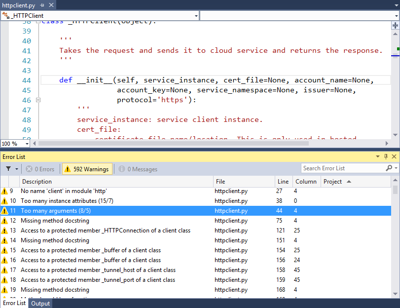

# Use PyLint to check Python code

[PyLint](https://www.pylint.org/), a widely used tool that checks for errors in Python code and encourages good Python coding patterns, is integrated into Visual Studio for Python projects.

## Run PyLint

Just right-click a Python project in **Solution Explorer** and select **Python** > **Run PyLint**:


Using this command prompts you to install PyLint into your active environment if it's not already present.

PyLint warnings and errors appear in the **Error List** window:



Double-clicking an error takes you directly to the source code that generated the issue.

> [!Tip]
> See the [PyLint features reference](https://pylint.readthedocs.io/en/latest/technical_reference/features.html) for a detailed list of all the PyLint output messages.

## Set PyLint command-line options

The [command-line options](https://pylint.readthedocs.io/en/latest/user_guide/run.html#command-line-options) section of the PyLint documentation describes how to control PyLint's behavior through a *.pylintrc* configuration file. Such a file can be placed in the root of a Python project in Visual Studio or elsewhere depending on how widely you want those settings applied (see the [command-line options](https://pylint.readthedocs.io/en/latest/user_guide/run.html#command-line-options) for details).

For example, to suppress the "missing docstring" warnings shown in the previous image with a *.pylintrc* file in a project, do the  steps:

1. On the command line, navigate to your project root (which has your *.pyproj* file) and run the following command to generate a commented configuration file:

   ```command
   pylint --generate-rcfile > .pylintrc
   ```

1. In Visual Studio Solution Explorer, right-click your project, select **Add** > **Existing Item**, navigate to the new *.pylintrc* file, select it, and select **Add**.

1. Open the file for editing, which has several settings you can work with. To disable a warning, locate the `[MESSAGES CONTROL]` section, then locate the `disable` setting in that section. There's a long string of specific messages, to which you can append whichever warnings you want. In the example here, append `,missing-docstring` (including the delineating comma).

1. Save the *.pylintrc* file and run PyLint again to see that the warnings are now suppressed.

> [!Tip]
> To use a *.pylintrc* file from a network share, create an environment variable named `PYLINTRC` with the value of the filename on the network share using a UNC path or a mapped drive letter. For example, `PYLINTRC=\\myshare\python\.pylintrc`.
