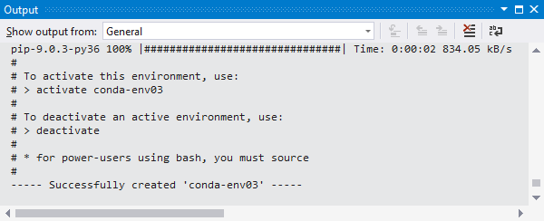
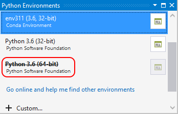
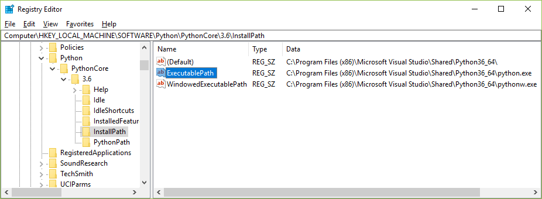

# How to create and manage Python environments in Visual Studio

A Python *environment* is a context in which you run Python code and includes global, virtual, and conda environments. An environment consists of an interpreter, a library (typically the Python Standard Library), and a set of installed packages. These components together determine which language constructs and syntax are valid, what operating-system functionality you can access, and which packages you can use.

In Visual Studio on Windows, you use the **Python Environments** window, as described in this article, to manage environments and select one as the default for new projects. Other aspects of environments are found in the following articles:

- For any given project, you can [select a specific environment](selecting-a-python-environment-for-a-project.md) rather than use the default.

- For details on creating and using virtual environments for Python projects, see [Use virtual environments](selecting-a-python-environment-for-a-project.md#use-virtual-environments).

- If you want to install packages in an environment, refer to the [Packages tab reference](python-environments-window-tab-reference.md#packages-tab).

- To install another Python interpreter, see [Install Python interpreters](installing-python-interpreters.md). In general, if you download and run an installer for a mainline Python distribution, Visual Studio detects that new installation and the environment appears in the **Python Environments** window and can be selected for projects.

If you're new to Python in Visual Studio, the following articles also provide from general background:

- [Work with Python in Visual Studio](overview-of-python-tools-for-visual-studio.md)
- [Install Python support in Visual Studio](installing-python-support-in-visual-studio.md)

> [!Note]
> You can't manage environments for Python code that is opened only as a folder using the **File** > **Open** > **Folder** command. Instead, [Create a Python project from existing code](quickstart-01-python-in-visual-studio-project-from-existing-code.md) to enjoy the environment features of Visual Studio.

## The Python Environments window

*(The screenshots shown in this section represent Visual Studio 15.8. You may see different UI depending on your version of Visual Studio.)*

The environments that Visual Studio knows about are displayed in the **Python Environments** window. To open the window, use one of the following methods:

- Select the **View** > **Other Windows** > **Python Environments** menu command.
- Right-click the **Python Environments** node for a project in **Solution Explorer** and select **View All Python Environments**:

    

In either case, the **Python Environments** window appears alongside **Solution Explorer**:


Visual Studio looks for installed global environments using the registry (following [PEP 514](https://www.python.org/dev/peps/pep-0514/)), along with virtual environments and conda environments (see [Types of environments](#types-of-environments)). If you don't see an expected environment in the list, see [Manually identify an existing environment](#manually-identify-an-existing-environment).

When you select an environment in the list, Visual Studio displays various properties and commands for that environment on the **Overview** tab. For example, you can see in the image above that the interpreter's location is *C:\Python36-32*. The four commands at the bottom of the **Overview** tab each open a command prompt with the interpreter running. For more information, see [Python Environments window tab reference - Overview](python-environments-window-tab-reference.md#overview-tab).

Use the drop-down list below the list of environments to switch to different tabs such as **Packages**, and **IntelliSense**. These tabs are also described in the [Python Environments window tab reference](python-environments-window-tab-reference.md).

Selecting an environment does not change its relation to any projects. The default environment, shown in boldface in the list, is the one that Visual Studio uses for any new projects. To use a different environment with new projects, use the **Make this the default environment for new projects** command. Within the context of a project you can always select a specific environment. For more information, see [Select an environment for a project](selecting-a-python-environment-for-a-project.md).

To the right of each listed environment is a control that opens an **Interactive** window for that environment. (In Visual Studio 2017 15.5 and earlier, another control appears that refreshes the IntelliSense database for that environment. See [Environments window tab reference](python-environments-window-tab-reference.md#intellisense-tab) for details about the database.)

> [!Tip]
> When you expand the **Python Environments** window wide enough, you get a fuller view of your environments that you may find more convenient to work with.
>
> 

> [!Note]
> Although Visual Studio respects the system-site-packages option, it doesn't provide a way to change it from within Visual Studio.

|   |   |
|---|---|
|  | [Watch a video (Microsoft Virtual Academy)](https://mva.microsoft.com/en-US/training-courses/python-tools-for-visual-studio-2017-18121?l=qrDmN4LWE_8305918567) on Python environments in Visual Studio (2m 35s).|

### What if no environments appear?

If no environments appear, it means Visual Studio failed to detect any Python installations in standard locations. For example, you may have installed Visual Studio 2017 but cleared all the interpreter options in the installer options for the Python workload. Similarly, you may have installed Visual Studio 2015 or earlier but did not install an interpreter manually (see [Install Python interpreters](installing-python-interpreters.md)).

If you know you have a Python interpreter on your computer but Visual Studio (any version) did not detect it, then use the **+ Custom** command to specify its location manually. See the next section, [Manually identify an existing environment](#manually-identify-an-existing-environment).

> [!Tip]
> Visual Studio detects updates to an existing interpreter, such as upgrading Python 2.7.11 to 2.7.14 using the installers from python.org. During the installation process, the older environment disappears from the **Python Environments** list before the update appears in its place.
>
> However, if you manually move an interpreter and its environment using the file system, Visual Studio won't know the new location. For more information, see [Move an interpreter](installing-python-interpreters.md#move-an-interpreter).

### Types of environments

Visual Studio can work with global, virtual, and conda environments.

#### Global environments

Each Python installation (for example, Python 2.7, Python 3.6, Python 3.7, Anaconda 4.4.0, etc., see [Install Python interpreters](installing-python-interpreters.md)) maintains its own *global environment*. Each environment is composed of the specific Python interpreter, its standard library, a set of pre-installed packages, and any additional packages you install while that environment is activated. Installing a package into a global environment makes it available to all projects using that environment. If the environment is located in a protected area of the file system (within *c:\program files*, for example), then installing packages requires administrator privileges.

Global environments are available to all projects on the computer. In Visual Studio, you select one global environment as the default, which is used for all projects unless you specifically choose a different one for a project. For more information, see [Select an environment for a project](selecting-a-python-environment-for-a-project.md).

#### Virtual environments

Although working in a global environment is an easy way to get started, that environment will, over time, become cluttered with many different packages that you've installed for different projects. Such clutter makes it difficult to thoroughly test an application against a specific set of packages with known versions, which is exactly the kind of environment you'd set up on a build server or web server. Conflicts can also occur when two projects require incompatible packages or different versions of the same package.

For this reason, developers often create a *virtual environment* for a project. A virtual environment is a subfolder in a project that contains a copy of a specific interpreter. When you activate the virtual environment, any packages you install are installed only in that environment's subfolder. When you then run a Python program within that environment, you know that it's running against only those specific packages.

Visual Studio provides direct support for creating a virtual environment for a project. For example, if you open a project that contains a *requirements.txt*, or create a project from a template that includes that file, Visual Studio prompts you to automatically create a virtual environment and install those dependencies.

At any time within an open project, you can create a new virtual environment. In **Solution Explorer**, expand the project node, right-click **Python Environments**, and select "Add Virtual Environment." For more information, see [Create a virtual environment](selecting-a-python-environment-for-a-project.md#create-a-virtual-environment).

Visual Studio also provides a command to generate a *requirements.txt* file from a virtual environment, making it easy to recreate the environment on other computers. For more information, see [Use virtual environments](selecting-a-python-environment-for-a-project.md#use-virtual-environments).

#### Conda environments

A conda environment is one created using the `conda` tool, or with integrated conda management in Visual Studio 2017 version 15.7 and higher. (Requires Anaconda or Miniconda; Anaconda is available through the Visual Studio installer, see [Installation - Visual Studio 2017](installing-python-support-in-visual-studio.md#visual-studio-2017).)

1. Select **+ Create conda environment** in the **Python Environments** window, which opens a **Create new conda environment** tab:

    

1. Enter a name for the environment in the **Name** field, select a base Python interpreter in the **Python** field, and select **Create**.

1. The **Output** window shows progress for the new environment, with a few CLI instructions once creation is complete:

    

1. Within Visual Studio, you can activate a conda environment for a project as you would any other environment as described on [Select an environment for a project](selecting-a-python-environment-for-a-project.md).

1. To install packages in the environment, use the [Packages tab](python-environments-window-tab-reference.md#packages-tab).

> [!Note]
> For best results with conda environments, use conda 4.4.8 or later (conda versions are different from Anaconda versions). Install Anaconda 5.1 from the Visual Studio 2017 installer.

To see the conda version, where conda environments are stored, and other information, run `conda info` at an Anaconda command prompt (that is, a command prompt where Anaconda is in the path):

```cli
conda info
```

Your conda environment folders appear as follows:

```output
       envs directories : c:\anaconda3\envs
                          C:\Users\user\AppData\Local\conda\conda\envs
                          C:\Users\user\.conda\envs
```

Because conda environments are not stored with a project, they act similarly to global environments. For example, installing a new package into a conda environment makes that package available to all projects using that environment.

For Visual Studio 2017 version 15.6 and earlier, you can use conda environments by pointing to them manually as described under [Manually identify an existing environment](#manually-identify-an-existing-environment).

Visual Studio 2017 version 15.7 and later detects conda environments automatically and displays them in the **Python Environments** window as described in the next section.

## Manually identify an existing environment

Use the following steps to identify an environment that's installed in a non-standard location (including conda environments in Visual Studio 2017 version 15.6 and earlier):

1. Select **+ Custom** in the **Python Environments** window, which opens the **Configure** tab:

    

1. Enter a name for the environment in the **Description** field.

1. Enter or browse (using **...**) to the path of the interpreter in the **Prefix path** field.

1. If Visual Studio detects a Python interpreter at that location (such as the path shown below for a conda environment), it enables the **Auto Detect** command. Selecting **Auto Detect** completes the remaining fields. You can also complete those fields manually.

    

    

1. Once the fields contain the values you want, select **Apply** to save the configuration. You can now use the environment like any other within Visual Studio.

1. If you need to remove a manually identified environment, select the **Remove** command on the **Configure** tab. Auto-detected environments do not provide this option. For more information, see [Configure tab](python-environments-window-tab-reference.md#configure-tab).

## Fix or delete invalid environments

If Visual Studio finds registry entries for an environment, but the path to the interpreter is invalid, then the **Python Environments** window shows the name with a strikeout font:



To correct an environment you wish to keep, first try using its installer's **Repair** process. The installers for standard Python 3.x, for example, include that option.

To correct an environment that doesn't have a repair option, or to remove an invalid environment, use the following steps to modify the registry directly. Visual Studio automatically updates the **Python Environments** window when you make changes to the registry.

1. Run *regedit.exe*.
1. Navigate to **HKEY_LOCAL_MACHINE\SOFTWARE\Python** for 32-bit interpreters, or **HKEY_LOCAL_MACHINE\SOFTWARE\WOW6432Node\Python** for 64-bit interpreters. For IronPython, look for **IronPython** instead.
1. Expand the node that matches the distribution, such as **PythonCore** for CPython or **ContinuumAnalytics** for Anaconda. For IronPython, expand the version number node.
1. Inspect the values under the **InstallPath** node:

    

    - If the environment still exists on your computer, change the value of **ExecutablePath** to the correct location. Also correct the **(Default)** and **WindowedExecutablePath** values as necessary.
    - If the environment no longer exists on your computer and you want to remove it from the **Python Environments** window, delete the parent node of **InstallPath**, such as **3.6** in the image above.

## See also

- [Install Python interpreters](installing-python-interpreters.md)
- [Select an interpreter for a project](selecting-a-python-environment-for-a-project.md)
- [Use requirements.txt for dependencies](managing-required-packages-with-requirements-txt.md)
- [Search paths](search-paths.md)
- [Python Environments window reference](python-environments-window-tab-reference.md)
