# Python environments

A Python *environment* is a context in which you run Python code. An environment consists of an interpreter, a library (typically the Python Standard Library), and a set of installed packages. These components together determine which language constructs and syntax are valid, what operating-system functionality you can access, and which packages you can use.

In Visual Studio, you manage all of your environments using the [Python environments window](#managing-python-environments-in-visual-studio) as described in this article. For any given project, you select an environment to use for running code, debugging, checking syntax, displaying import and member completions, and any other tasks that are specific to the interpreter and installed libraries. Visual Studio also maintains an IntelliSense database for each environment that provides for auto-completion when entering code.

Visual Studio also provides support for virtual environments, `requirements.txt` files, and search paths.

**Note**: if you're new to Python in Visual Studio, see the following articles for necessary background:

- [Working with Python in Visual Studio](overview-of-python-tools-for-visual-studio.md)
- [Installing Python support in Visual Studio](installing-python-support-in-visual-studio.md)

## Global and virtual environments

There are two types of Python environments: global and virtual.

**Global environments**: Each Python installation (for example, Python 2.7, Python 3.6, and Anaconda 4.4.0, see [selecting and installing Python interpreters](#selecting-and-installing-python-interpreters) maintains its own environment. Each environment is composed of the specific Python interpreter, its standard library, and a set of pre-installed packages. Installing a package into a global environment makes it available to all projects using that environment. If the environment is located in a protect area of the file system (within `c:\program files`, for example), then installing packages requires administrator privileges.

Global environments are available to all projects on the computer. In Visual Studio, you select one global environment as the default, which is used for all projects unless you specifically choose a different one for a project. For more information, see [Selecting an environment for a project](#selecting-an-environment-for-a-project).

**Virtual environments**: Because packages installed into a global environment are available to all projects that use that environment, conflicts may occur when two projects require incompatible packages or different versions of the same package. Virtual environments avoid such conflicts by using the interpreter and standard library from a global environment but maintaining their own package stores in isolated folders.

In Visual Studio, you can create a virtual environment for a specific project, which is stored in a subfolder in the project (see [creating virtual environments](#creating-virtual-environments). The project file also identifies the virtual environment. Visual Studio also records any packages that you install into that virtual environment in the project's `requirements.txt` file. If you then share the project and other developers open it on their computers, Visual Studio provides the option to recreate the virtual environment.

### Selecting and installing Python interpreters

By default, installing the Python development workload in Visual Studio 2017 also installs Python 3 (64-bit). You can optionally choose to install 32-bit and 64-bit versions of Python 2, Python 3, Anaconda 2, and Anaconda 3, as described in [Installation](installing-python-support-in-visual-studio.md). You can also manually install any of the interpreters listed in the following table.

For Visual Studio 2015 and earlier, you must manually install one of the interpreters.

Visual Studio (all versions) automatically creates an environment for each installed Python interpreter by checking the registry (following [PEP 514 - Python registration in the Windows registry](https://www.python.org/dev/peps/pep-0514/)). If Visual Studio does not detect an installed environment, see [Creating an environment for an existing interpreter](#creating-an-environment-for-an-existing-interpreter).

| Interpreter | Description |
| --- | --- |
| [CPython](https://www.python.org/) | The "native" and most commonly-used interpreter, available in 32-bit and 64-bit versions (32-bit recommended). Includes the latest language features, maximum Python package compatibility, full debugging support, and interop with [IPython](http://ipython.org/). See also: [Should I use Python 2 or Python 3?](http://wiki.python.org/moin/Python2orPython3). Note that Visual Studio 2015 and earlier do not support Python 3.6 and can give the error "Unsupported python version 3.6". Use Python 3.5 or earlier instead. |
| [IronPython](https://github.com/IronLanguages/ironpython2) | A .NET implementation of Python, available in 32-bit and 64-bit versions, providing C#/F#/Visual Basic interop, access to .NET APIs, standard Python debugging (but not C++ mixed-mode debugging), and mixed IronPython/C# debugging. IronPython, however, does not support virtual environments. |
| [Anaconda](https://www.continuum.io) | An open data science platform powered by Python, and includes the latest version of CPython and most of the difficult-to-install packages. We recommend it if you can't otherwise decide. |
| [PyPy](http://www.pypy.org/) | A high-performance tracing JIT implementation of Python that's good for long-running programs and situations where you identify performance issues but cannot find other resolutions. Works with Visual Studio but with limited support for advanced debugging features. |
| [Jython](http://www.jython.org/) | An implementation of Python on the Java Virtual Machine (JVM). Similar to IronPython, code running in Jython can interact with Java classes and libraries, but may not be able to use many libraries intended for CPython. Works with Visual Studio but with limited support for advanced debugging features. |

Developers that want to provide new forms of detection for Python environments, see [PTVS Environment Detection](https://github.com/Microsoft/PTVS/wiki/Extensibility-Environments) (github.com).

## Managing Python environments in Visual Studio

To open the Python Environments window, select the **View > Other Windows > Python Environments** menu command or right-click the **Python Environments** node for a project in Solution Explorer and select **View All Python Environments**:

    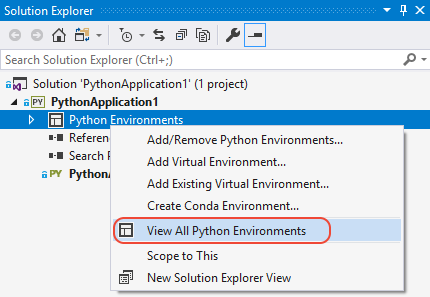

In either case, the Python Environments window appears as a sibling tab to Solution Explorer:

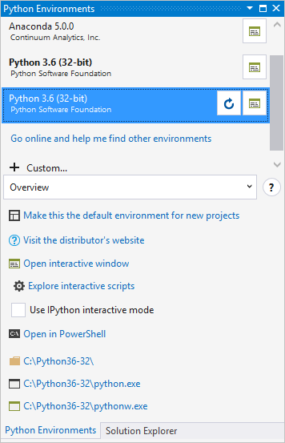

The example above shows that Python 3.4 (32-bit CPython) is installed along with 32-bit and 64-bit versions of IronPython 2.7. The default environment in boldface is Python 3.4, which is used for any new projects. If you don't see any environments listed, it means that you've installed Python Tools for Visual Studio in Visual Studio 2015 or earlier, but haven't installed a Python interpreter (see [Selecting and installing Python interpreters](#selecting-and-installing-python-interpreters) above). The **+ Custom...** command lets you [create an environment for an existing interpreter](#create-an-environment-for-an-existing-interpreter).

To the right of each listed environment is a control that opens an interactive window for that environment. Another control may appear that refreshes the IntelliSense database for that environment.

Below the list of environments is a drop-down selector for the **Overview**, **Packages**, and **IntelliSense** options described later in this section. If you expand the **Python Environments** window wide enough, these options are shown as tabs, which you may find more convenient to work with:

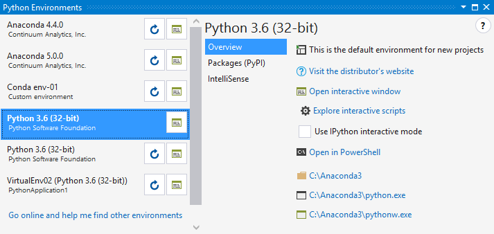

> [!Note]
> Although Visual Studio respects the system-site-packages option, it doesn't provide a way to change it from within Visual Studio.

For a video introduction to managing environments in Visual Studio, see [Managing Python Environments](https://mva.microsoft.com/en-US/training-courses/python-tools-for-visual-studio-2017-18121?l=qrDmN4LWE_8305918567) (Microsoft Virtual Academy, 2m35s).

> [!VIDEO https://mva.microsoft.com/en-US/training-courses-embed/python-tools-for-visual-studio-2017-18121/Video-Managing-Python-Environments-qrDmN4LWE_8305918567]

### Creating an environment for an existing interpreter

If Visual Studio does not locate an interpreter (such as when it's installed in a non-standard location), you can create and environment as follows:

1. Select **+ Custom...** in the [Python Environments window](#managing-python-environments-in-visual-studio), which creates a new environment and opens the [**Configure** tab](#configure-tab) described below.)

    

1. Enter a name for the environment in the **Description** field.
1. Enter or browse to the path of the interpreter in the **Prefix path** field.
1. Select **Auto Detect** to have Visual Studio complete the remaining fields, or complete them manually.
1. Select **Apply** to save the environment.
1. If you need to remove the environment, select the **Remove** command on the **Configure** tab. Auto-detected environments do not provide this option. See the next section for more information.

### Moving an existing interpreter

If you move an existing interpreter to a new location on the file system, Visual Studio doesn't automatically detect the change and you must update its environment manually:

- If you originally created an environment for that interpreter, edit that environment to point to the new location.

- If the environment was originally auto-detected, it was installed on the computer with a distinct installer program that created the registry entries that Visual Studio examines. In this case, first restore the Python interpreter to its original location. Then uninstall it using the installer, which clears the registry entries. Then reinstall the interpreter at the desired location. Restart Visual Studio and it should auto-detect the new location. This process ensures that any other side effects of the installer are properly applied.

### Overview tab

Provides basic information and commands for the environment:

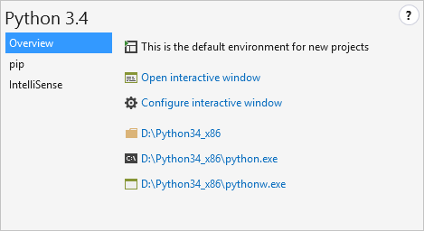

| Command | Description |
| --- | --- |
| Make this environment the default for new projects | Sets the active environment, which may cause Visual Studio to briefly become non-responsive while it loads the IntelliSense database. Environments with many packages may be non-responsive for longer. |
| Visit the distributor's website | Opens a browser to the URL provided by the Python distribution. Python 3.x, for example, goes to python.org. |
| Open interactive window | Opens the [interactive (REPL) window](interactive-repl.md) for this environment within Visual Studio, applying any [startup scripts (see below)](#startup-scripts). |
| Explore interactive scripts | See [startup scripts](#startup-scripts). |
| Use IPython interactive mode | When set, opens the interactive window with IPython by default. This enabled inline plots as well as the extended IPython syntax such as `name?` to view help and `!command` for shell commands. This option is recommended when using an Anaconda distribution, as it requires extra packages. For more information, see [Using IPython in the Interactive Window](interactive-repl-ipython.md). |
| Open in PowerShell | Starts the interpreter in a PowerShell command window. |
| (Folder links) | Provide you quick access to the environment's installation folder, the python.exe interpreter, and the pythonw.exe interpreter. The first opens in Windows Explorer, the latter two open a console window. |

#### Startup scripts

As you use interactive windows in your everyday workflow, you likely develop helper functions that you use regularly. For example, you may create a function that opens a DataFrame in Excel, and then save that code as a startup script so that it's always available in the interactive window.

Startup scripts contain code that the interactive window loads and runs automatically, including imports, function definitions, and literally anything else. Such scripts are referenced in two ways:

1. When you install an environment, Visual Studio creates a folder `Documents\Visual Studio 2017\Python Scripts\<environment>` where &lt;environment&gt' matches the name of the environment. You can easily navigate to the environment-specific folder with the **Explore interactive scripts** command. When you start the interactive window for that environment, it loads and runs whatever `.py` files are found here in alphabetical order.

1. The **Scripts** control in **Tools > Options > Python Tools > Interactive Windows** tab (see [Interactive windows options](options.md#interactive-windows-options)) is intended to specify an additional folder for startup scripts that are loaded and run in all environments. However, this feature doesn't work at present.

### Configure tab

If shown, contains details as described in the table below. If this tab isn't present, it means that Visual Studio is managing all the details automatically.

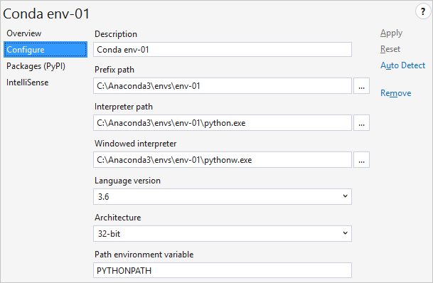

| Field | Description |
| --- | --- |
| **Description** | The name to give the environment. |
| **Prefix path** | The base folder location of the interpreter. By filling this value and clicking **Auto Detect**, Visual Studio attempts to fill in the other fields for you. |
| **Interpreter path** | The path to the interpreter executable, commonly the prefix path followed by `python.exe` |
| **Windowed interpreter** | The path to the non-console executable, often the prefix path followed by `pythonw.exe`. |
| **Library path** | Specifies the root of the standard library, but this value may be ignored if Visual Studio is able to request a more accurate path from the interpreter. |
| **Language version** | Selected from the drop-down menu. |
| **Architecture** | Normally detected and filled in automatically, otherwise specifies 32-bit or 64-bit. |
| **Path environment variable** | The environment variable that the interpreter uses to find search paths. Visual Studio changes the value of the variable when starting Python so that it contains the project's search paths. Typically this property should be set to `PYTHONPATH`, but some interpreters use a different value. |

### pip tab

Manages the packages installed in the environment, allowing you to also search for and install new ones (including any dependencies). Searching filters your currently installed packages and [PyPI](https://pypi.python.org). You can also directly enter any `pip install` command in the search box, including flags such as `--user` or `--no-deps`.

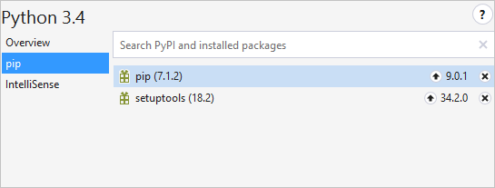

Installing a package creates subfolders within the environment's `Lib` folder on the file system. For example, if you have Python 3.6 installed in `c:\Python36`, packages are installed in `c:\Python36\Lib`; if you have Anaconda3 installed in `c:\Program Files\Anaconda3` then packages are installed in `c:\Program Files\Anaconda3\Lib`.

In the latter case, because the environment is located in a protected area of the file system, `c:\Program Files`, Visual Studio must run `pip install` elevated to allow it to create package subfolders. When elevation is required, Visual Studio displays the prompt, "Administrator privileges may be required to install, update or remove packages for this environment":

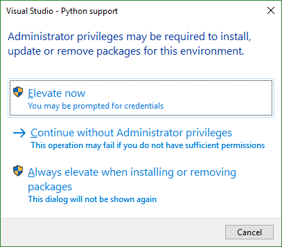

**Elevate now** grants administrative privileges to pip for a single operation, subject also to any operating system prompts for permissions. Selecting **Continue without Administrator privileges** attempts to install the package, but pip fails when trying to create folders with output such as "error: could not create 'C:\Program Files\Anaconda3\Lib\site-packages\png.py': Permission denied."

Selecting **Always elevate when installing or removing packages** prevents the dialog from appearing for the environment in question. To make the dialog appear again, go to **Tools > Options > Python Tools > General** and select the button, **Reset all permanently hidden dialogs**.

In that same options tab, you can also select **Always run pip as administrator** to suppress the dialog for all environments. See [Options - General tab](options.md#general-options).

### IntelliSense tab

Shows the current status of the IntelliSense completion database:

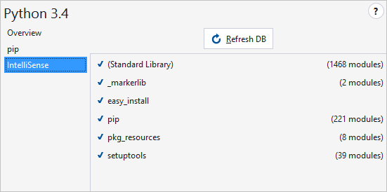

The database contains metadata for all the environment's libraries and improves IntelliSense speed and reduces memory usage. When Visual Studio detects a new environment (or you add one), it automatically begins to compile the database by analyzing the library source files. This process can take anywhere from a minute to an hour or more depending on what's installed. (Anaconda, for example, comes with many libraries and takes some time to compile the database.) Once complete, you get detailed IntelliSense and don't need to refresh the database again (with the **Refresh DB** button) until you install more libraries.

Libraries for which data haven't been compiled are marked with a **!**; if an environment's database isn't complete, a **!** also appears next to it in the main environment list.

## Selecting an environment for a project

Project-specific environments ensure that a project always runs in a particular environment, ignoring the default global environment. For example, if the global default environment is CPython but a project requires IronPython and certain libraries that aren't installed in the global environment, then a project-specific environment is necessary.

Project environments are listed in Solution Explorer under the Python Environments node. The bold entry is currently active, and Visual Studio uses it for debugging, import and member completions, syntax checking, and any other tasks that require an environment:


To activate a different environment for the project, right-click that environment and select **Activate Environment**.

Any global environment can be added as a project environment by right-clicking **Python Environments** and selecting **Add/Remove Python Environments...**. From the displayed list you can select or deselect those environments that are available in your project.

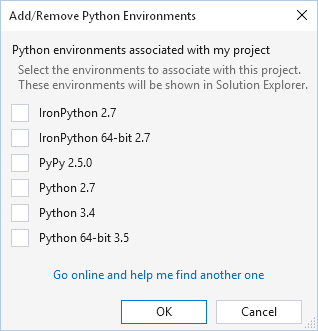

In Solution Explorer, you can also expand the environment to show its installed packages (those you can import and use in your code when the environment is active):

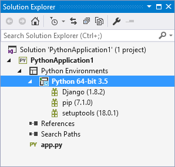

To install new packages, right-click the environment, select **Install Python Package...**, and enter the name of the desired package. Packages (and dependencies) are downloaded from the [Python Package Index (PyPI)](https://pypi.python.org/pypi), where you can also search for available packages. Visual Studio's status bar and output window shows information about the install. To uninstall a package, right-click it select **Remove**.

> [!Note]
> Python's package management support is currently under development by the core Python development team. The displayed entries may not always be accurate, and installation and uninstallation may not be reliable or available. Visual Studio uses the pip package manager if available, and downloads and installs it when required. Visual Studio can also use the easy_install package manager. Packages installed using pip or easy_install from the command line are also displayed.

> [!Tip]
> A common situation where pip fails to install a package is when the package includes source code for native components in `*.pyd` files. Without the required version of Visual Studio installed, pip cannot compile these components. The error message displayed in this situation is `error: Unable to find vcvarsall.bat`. `easy_install` is often able to download pre-compiled binaries, and you can download a suitable compiler for older versions of Python from [http://aka.ms/VCPython27](http://aka.ms/VCPython27). For more details, see [How to deal with the pain of "unable to find vcvarsallbat"](https://blogs.msdn.microsoft.com/pythonengineering/2016/04/11/unable-to-find-vcvarsall-bat/) on the Python tools team blog.

## Creating virtual environments

1. Right-click **Python Environments** in Solution Explorer and select **Add Virtual Environment...**, which brings up the following:

    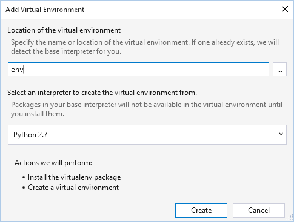

1. Specify a name to create the virtual environment in your project path, or a full path to create it elsewhere. (To ensure maximum compatibility with other tools, use only letters and numbers in the name.)

1. Select a global environment as the base interpreter and click **Create**. If `pip` and `virtualenv` or `venv` packages are not available, they are downloaded and installed.

    If the provided path is an existing virtual environment, the base interpreter is detected and the create button changes to **Add**:

    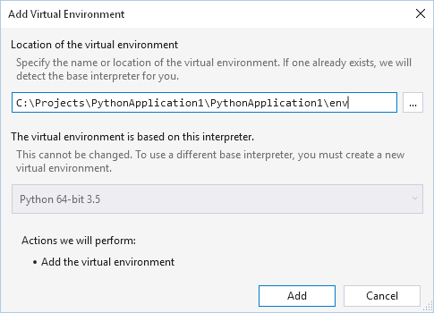

An existing virtual environment can also be added by right-clicking **Python Environments** in Solution Explorer and selecting **Add Existing Virtual Environment...**. Visual Studio automatically detects the base interpreter using the `orig-prefix.txt` file in the environment's `lib` directory.

Once a virtual environment is added to your project, it appears in the **Python Environments** window, you can activate it like any other environment, and you can manage its packages. Right-clicking it and selecting **Remove** either removes the reference to the environment, or deletes the environment and all its files on disk (but not the base interpreter).

Note that one drawback to virtual environments is that they contain hard-coded file paths and thus cannot easily be shared or transported to other development computers. Fortunately, you can use the `requirements.txt` file as described in the next section to allow recipients of your project to easily restore the environment.

## Managing required packages (requirements.txt)

If you're sharing a project with others, using a build system, or plan to [publish it to Microsoft Azure](template-azure-cloud-service.md), you need to specify the external packages that the project requires. The recommended approach is to use a [requirements.txt file](http://pip.readthedocs.org/en/latest/user_guide.html#requirements-files) (readthedocs.org) that contains a list of commands for pip that installs the required versions of dependent packages.

Technically, any filename may be used to track requirements (by using `-r <full path to file>` when installing a package), but Visual Studio provides specific support for `requirements.txt`:

- If you've loaded a project that contains `requirements.txt` and wish to install all the packages listed in that file, expand the **Python Environments** node in **Solution Explorer**, then right-click an environment node and select **Install from requirements.txt**:

    

- If you already have all the necessary packages installed in a project, you can right-click an environment in Solution Explorer and select **Generate requirements.txt** to create the necessary file. If the file already exists, a prompt appears for how to update it:

    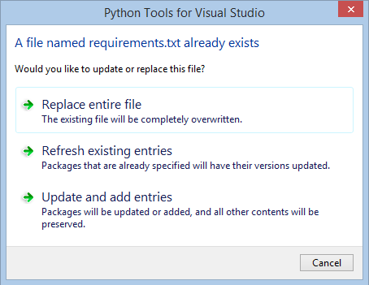

  - **Replace entire file** removes all items, comments, and options that exist.
  - **Refresh existing entries** detects package requirements and updates the version specifiers to match the version you currently have installed.
  - **Update and add entries** refreshes any requirements that are found, and adds all other packages to the end of the file.

Because `requirements.txt` files are intended to freeze the requirements of your project, all installed packages are written with precise versions. Using precise versions ensures that you can easily reproduce your environment on another computer. Packages are included even if they were installed with a version range, as a dependency of another package, or with an installer other than pip.

If a `requirements.txt` file exists when adding a new virtual environment, the **Add Virtual Environment** dialog displays an option to install the packages automatically, making it easy to recreate an environment on another computer:

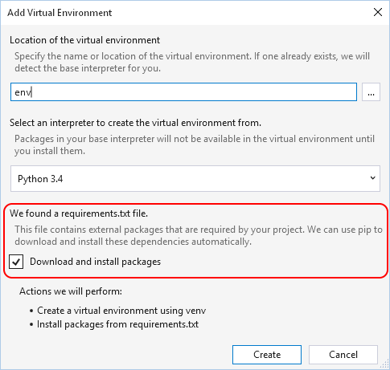

If a package cannot be installed by pip and it appears in a `requirements.txt` file, the entire installation fails. In this case, manually edit the file to exclude this package or to use [pip's options](http://pip.readthedocs.org/en/latest/reference/pip_install.html#requirements-file-format) to refer to an installable version of the package. For example, you may prefer to use [`pip wheel`](http://pip.readthedocs.org/en/latest/reference/pip_wheel.html) to compile a dependency and add the `--find-links <path>` option to your `requirements.txt`:

```output
C:\Project>pip wheel azure
Downloading/unpacking azure
    Running setup.py (path:C:\Project\env\build\azure\setup.py) egg_info for package azure

Building wheels for collected packages: azure
    Running setup.py bdist_wheel for azure
    Destination directory: c:\project\wheelhouse
Successfully built azure
Cleaning up...

C:\Project>type requirements.txt
--find-links wheelhouse
--no-index
azure==0.8.0

C:\Project>pip install -r requirements.txt -v
Downloading/unpacking azure==0.8.0 (from -r requirements.txt (line 3))
    Local files found: C:/Project/wheelhouse/azure-0.8.0-py3-none-any.whl
Installing collected packages: azure
Successfully installed azure
Cleaning up...
    Removing temporary dir C:\Project\env\build...
```

## Search paths

With typical Python usage, the `PYTHONPATH` environment variable (or `IRONPYTHONPATH`, etc.) provides the default search path for module files. That is, when you use an `from <name> import...` or `import <name>` statement, Python searches the following locations in order for a matching name:

1. Python's built-in modules.
1. The folder containing the Python code you're running.
1. The "module search path" as defined by the applicable environment variable. (See [The Module Search Path](https://docs.python.org/2/tutorial/modules.html#the-module-search-path) and [Environment variables](https://docs.python.org/2/using/cmdline.html#envvar-PYTHONPATH) in the core Python documentation.)

Visual Studio ignores the search path environment variable, however, even when the variable is set for the entire system. It's ignored, in fact, precisely *because* it's set for the entire system and thus raises certain questions that cannot be answered automatically: Are the referenced modules meant for Python 2.7 or Python 3.3? Are they going to override standard library modules? Is the developer aware of this behavior or is it a malicious hijacking attempt?

Visual Studio thus provides a means to specify search paths directly in both environments and projects. Code that you run or debug in Visual Studio receives search paths in the value of `PYTHONPATH` (and other equivalent variables). By adding search paths, Visual Studio inspects the libraries in those locations and builds IntelliSense databases for them (constructing the database may take some time depending on the number of libraries).

To add a search path, right-click on the **Search Paths** item in Solution Explorer, select **Add Folder to Search Path...**, and select the folder to include. This path is used for any environment associated with the project. (You may see errors if the environment is based on Python 3 and you attempt to add a search path to Python 2.7 modules.)

Files with a `.zip` or `.egg` extension can also be added as search paths by selecting **Add Zip Archive to Search Path...**. As with folders, the contents of these files are scanned and made available to IntelliSense.

If you are regularly using the same search paths and the contents do not often change, it may be more efficient to install it into your site-packages folder. The search path is then analyzed and stored in the IntelliSense database, is always be associated with the intended environment, and does not require a search path to be added to each project.
