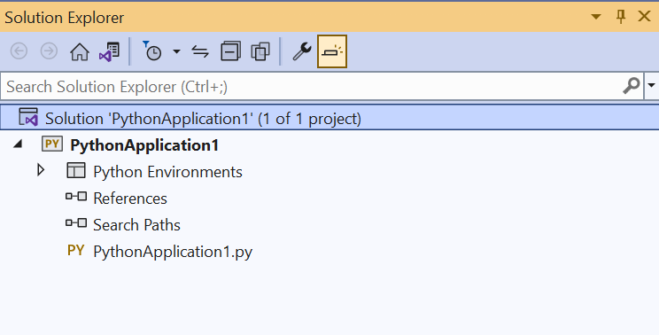
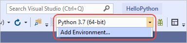
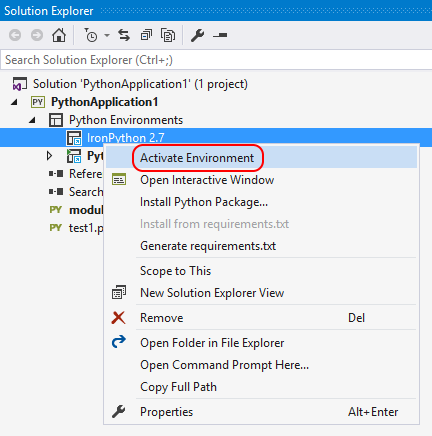
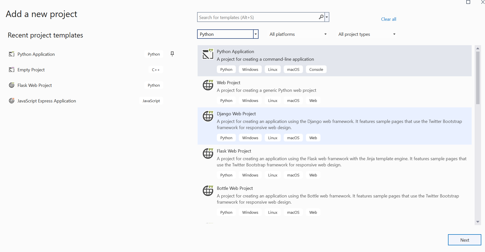
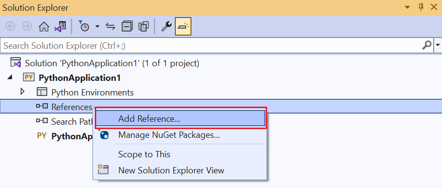

# Python projects in Visual Studio

Python applications are typically defined using only folders and files, but this structure can become complex as applications become larger and perhaps involve auto-generated files, JavaScript for web applications, and so on. A Visual Studio project helps manage this complexity. The project (a *.pyproj* file) identifies all the source and content files associated with your project, contains build information for each file, maintains the information to integrate with source-control systems, and helps you organize your application into logical components.



In addition, projects are always managed within a Visual Studio *solution*, which can contain any number of projects that might reference one another. For example, a Python project can reference a C++ project that implements an extension module. With this relationship, Visual Studio automatically builds the C++ project (if necessary) when you start debugging the Python project. (For a general discussion, see [Solutions and projects in Visual Studio](../ide/solutions-and-projects-in-visual-studio.md).)

Visual Studio provides a variety of Python project templates to quickly set up a number of application structures, including a template to create a project from an existing folder tree and a template to create a clean, empty project. See [Project templates](#project-templates) for an index.

<a name="lightweight-usage-project-free"></a>

::: moniker range=">=vs-2019"
> [!Tip]
> Visual Studio 2019 supports opening a folder containing Python code and running that code without creating Visual Studio project and solution files. For more information, see [Quickstart: Open and run Python code in a folder](quickstart-05-python-visual-studio-open-folder.md). There are, however, benefits to using a project file, as explained in this section.
::: moniker-end

> [!Tip]
> Without a project, all versions of Visual Studio work well with Python code. For example, you can open a Python file by itself and enjoy auto-complete, IntelliSense, and debugging (by right-clicking in the editor and selecting **Start with Debugging**). Because such code always uses the default global environment, however, you may see incorrect completions or errors if the code is meant for a different environment. Furthermore, Visual Studio analyzes all files and packages in the folder from which the single file is opened, which could consume considerable CPU time.
>
> It's a simple matter to create a Visual Studio project from existing code, as described in [Create a project from existing files](#create-project-from-existing-files).

 [Deep Dive: Use source control with Python projects](https://youtu.be/Aq8eqApnugM) (youtube.com, 8m 55s).

## Add files, assign a startup file, and set environments

As you develop your application, you typically need to add new files of different types to the project. Adding such files is done by right-clicking the project and selecting **Add** > **Existing Item** with which you browse for a file to add, or **Add** > **New Item**, which brings up a dialog with a variety of item templates. As described on the [item templates](python-item-templates.md) reference, options include empty Python files, a Python class, a unit test, and various files related to web applications. You can explore these options with a test project to learn what's available in your version of Visual Studio.

Each Python project has one assigned start-up file, shown in boldface in **Solution Explorer**. The startup file is the file that's run when you start debugging (**F5** or **Debug** > **Start Debugging**) or when you run your project in the **Interactive** window (**Shift**+**Alt**+**F5** or **Debug** > **Execute Project in Python Interactive**). To change it, right-click the new file and select **Set as Startup Item** (or **Set as Startup File** in older versions of Visual Studio).

> [!Tip]
> If you remove the selected startup file from a project and don't select a new one, Visual Studio doesn't know what Python file to start with when you try to run the project. In this case, Visual Studio 2017 version 15.6 and later shows an error; earlier versions either open an output window with the Python interpreter running, or you see the output window appear but then disappear almost immediately. If you encounter any of these behaviors, check that you have an assigned startup file.
>
> If you want to keep the output window open for any reason, right-click your project, select **Properties**, select the **Debug** tab, then add `-i` to the **Interpreter Arguments** field. This argument causes the interpreter to go into interactive mode after a program completes, thereby keeping the window open until you enter **Ctrl**+**Z** > **Enter** to exit.

::: moniker range="vs-2017"
A new project is always associated with the default global Python environment. To associate the project with a different environment (including virtual environments), right-click the **Python Environments** node in the project, select **Add/Remove Python Environments**, and select the ones you want.
::: moniker-end
::: moniker range=">=vs-2019"
A new project is always associated with the default global Python environment. To associate the project with a different environment (including virtual environments), right-click the **Python Environments** node in the project, select **Add Environment..**, and select the ones you want. You can also use the environments drop-down control on the toolbar to select and environment or add another one to the project.


::: moniker-end

To change the active environment, right-click the desired environment in **Solution Explorer** and select **Activate Environment** as shown below. For more information, see [Select an environment for a project](selecting-a-python-environment-for-a-project.md).



<a name="project-types"></a>

## Project templates

Visual Studio gives you a number of ways to set up a Python project, either from scratch or from existing code. To use a template, select the **File** > **New** > **Project** menu command or right-click the solution in **Solution Explorer** and select **Add** > **New Project**, both of which bring up the **New Project** dialog below. To see Python-specific templates, either search on "Python" or select the **Installed** > **Python** node:



::: moniker range="<=vs-2017"

The following table summarizes the templates available in Visual Studio 2017 (not all templates are available in all previous versions):

| Template | Description |
| --- | --- |
| [**From existing Python code**](#create-project-from-existing-files) | Creates a Visual Studio project from existing Python code in a folder structure.  |
| **Python Application** | A basic project structure for a new Python application with a single, empty source file. By default, the project runs in the console interpreter of the default global environment, which you can change by [assigning a different environment](selecting-a-python-environment-for-a-project.md). |
| [**Web projects**](python-web-application-project-templates.md) | Projects for web apps based on various frameworks including Bottle, Django, and Flask. |
| **IronPython Application** | Similar to the Python Application template, but uses IronPython by default enabling .NET interop and mixed-mode debugging with .NET languages. |
| **IronPython WPF Application** | A project structure using IronPython with Windows Presentation Foundation XAML files for the application's user interface. Visual Studio provides a XAML UI designer, code-behind can be written in Python, and the application runs without displaying a console. |
| **IronPython Silverlight Web Page** | An IronPython project that runs in a browser using Silverlight. The application's Python code is included in the web page as script. A boilerplate script tag pulls down some JavaScript code that initializes IronPython running inside of Silverlight, from which your Python code can interact with the DOM. |
| **IronPython Windows Forms Application** | A project structure using IronPython with UI created using code with Windows Forms. The application runs without displaying a console. |
| **Background Application (IoT)** | Supports deploying Python projects to run as background services on devices. Visit the [Windows IoT Dev Center](https://dev.windows.com/en-us/iot) for more information. |
| **Python Extension Module** | This template appears under Visual C++ if you've installed the **Python native development tools** with the Python workload in Visual Studio 2017 or later (see [Installation](installing-python-support-in-visual-studio.md)). It provides the core structure for a C++ extension DLL, similar to what's described on [Create a C++ extension for Python](working-with-c-cpp-python-in-visual-studio.md). |
::: moniker-end

::: moniker range=">=vs-2019"

The following table summarizes the templates available in Visual Studio 2019 (not all templates are available in all previous versions):

| Template | Description |
| --- | --- |
| [**From existing Python code**](#create-project-from-existing-files) | Creates a Visual Studio project from existing Python code in a folder structure.  |
| **Python Application** | A basic project structure for a new Python application with a single, empty source file. By default, the project runs in the console interpreter of the default global environment, which you can change by [assigning a different environment](selecting-a-python-environment-for-a-project.md). |
| [**Web projects**](python-web-application-project-templates.md) | Projects for web apps based on various frameworks including Bottle, Django, and Flask. |
| **IronPython Application** | Similar to the Python Application template, but uses IronPython by default enabling .NET interop and mixed-mode debugging with .NET languages. |
| **IronPython WPF Application** | A project structure using IronPython with Windows Presentation Foundation XAML files for the application's user interface. Visual Studio provides a XAML UI designer, code-behind can be written in Python, and the application runs without displaying a console. |
| **IronPython Silverlight Web Page** | An IronPython project that runs in a browser using Silverlight. The application's Python code is included in the web page as script. A boilerplate script tag pulls down some JavaScript code that initializes IronPython running inside of Silverlight, from which your Python code can interact with the DOM. |
| **IronPython Windows Forms Application** | A project structure using IronPython with UI created using code with Windows Forms. The application runs without displaying a console. |
| **Background Application (IoT)** | Supports deploying Python projects to run as background services on devices. Visit the [Windows IoT Dev Center](https://dev.windows.com/en-us/iot) for more information. |
| **Python Extension Module** | This template appears under Visual C++ if you've installed the **Python native development tools** with the Python workload in Visual Studio 2017 or later (see [Installation](installing-python-support-in-visual-studio.md)). It provides the core structure for a C++ extension DLL, similar to what's described on [Create a C++ extension for Python](working-with-c-cpp-python-in-visual-studio.md). |
::: moniker-end

> [!Note]
> Because Python is an interpreted language, Python projects in Visual Studio don't produce a stand-alone executable like other compiled language projects (C#, for example). For more information, see [questions and answers](overview-of-python-tools-for-visual-studio.md#questions-and-answers).

<a name="create-project-from-existing-files"></a>

### Create a project from existing files

> [!Important]
> The process described here does not move or copy the original source files. If you want to work with a copy, duplicate the folder first.

[!INCLUDE[project-from-existing](includes/project-from-existing.md)]

## Linked files

Linked files are files that are brought into a project but typically reside outside of the application's project folders. They appear in **Solution Explorer** as normal files with an overlaid shortcut icon: 

Linked files are specified in the *.pyproj* file using the `<Compile Include="...">` element. Linked files are implicit  if they use a relative path outside of the directory structure, or explicit if they use paths within **Solution Explorer**:

```xml
<Compile Include="..\test2.py">
    <Link>MyProject\test2.py</Link>
</Compile>
```

Linked files are ignored under any of the following conditions:

- The linked file contains Link metadata and the path specified in the Include attribute lives within the project directory
- The linked file duplicates a file that exists within the project hierarchy
- The linked file contains Link metadata and the Link path is a relative path outside of the project hierarchy
- The link path is rooted

### Work with linked files

To add an existing item as a link, right-click the folder in the project where you wish to add the file, then select **Add** > **Existing Item**. In the dialog that appears, select a file and choose **Add as Link** from the drop-down on the **Add** button. Provided that there are no conflicting files, this command creates a link in the selected folder. However, the link is not added if there is already a file with the same name or a link to that file already exists in the project.

If you attempt to link to a file that already exists in the project folders, it is added as a normal file and not as a link. To convert a file into a link, select **File** > **Save As** to save the file to a location outside of the project hierarchy; Visual Studio automatically converts it into a link. Similarly, a link can be converted back by using **File** > **Save As** to save the file somewhere within the project hierarchy.

If you move a linked file in **Solution Explorer**, the link is moved but the actual file is unaffected. Similarly, deleting a link removes the link without affecting the file.

Linked files cannot be renamed.

## References

Visual Studio projects support adding references to projects and extensions, which appear under the **References** node in **Solution Explorer**:



Extension references typically indicate dependencies between projects and are used to provide IntelliSense at design time or linking at compile time. Python projects use references in a similar fashion, but due to the dynamic nature of Python they are primarily used at design time to provide improved IntelliSense. They can also be used for deployment to Microsoft Azure to install additional dependencies.

### Extension modules

A reference to a *.pyd* file enables IntelliSense for the generated module. Visual Studio loads the *.pyd* file into the Python interpreter and introspects its types and functions. It also attempts to parse the doc strings for functions to provide signature help.

If at any time the extension module is updated on disk, Visual Studio reanalyzes the module in the background. This action has no effect on run-time behavior but some completions aren't available until analysis is complete.

You may also need to add a [search path](search-paths.md) to the folder containing the module.

### .NET projects

When working with IronPython, you can add references to .NET assemblies to enable IntelliSense. For .NET projects in your solution, right-click the **References** node in your Python project, select **Add Reference**, select the **Projects** tab, and browse to the desired project. For DLLs that you've downloaded separately, select the **Browse** tab instead and browse to the desired DLL.

Because references in IronPython are not available until a call to `clr.AddReference('<AssemblyName>')` is made, you also need to add an appropriate `clr.AddReference` call to the assembly, typically at the beginning of your code. For example, the code created by the **IronPython Windows Forms Application** project template in Visual Studio includes two calls at the top of the file:

```python
import clr
clr.AddReference('System.Drawing')
clr.AddReference('System.Windows.Forms')

from System.Drawing import *
from System.Windows.Forms import *

# Other code omitted
```

### WebPI projects

You can add references to WebPI product entries for deployment to Microsoft Azure Cloud Services where you can install additional components via the WebPI feed. By default, the feed displayed is Python-specific and includes Django, CPython, and other core components. You can also select your own feed as shown below. When publishing to Microsoft Azure, a setup task installs all of the referenced products.

> [!IMPORTANT]
> WebPI projects is not available in Visual Studio 2017 or Visual Studio 2019.


