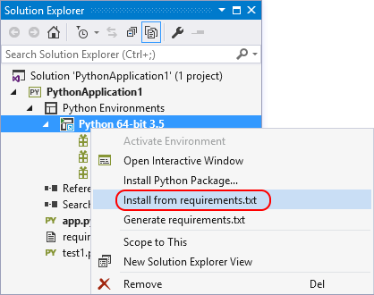
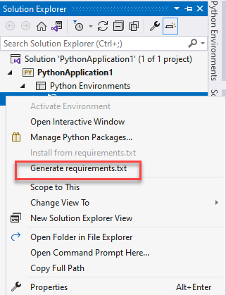
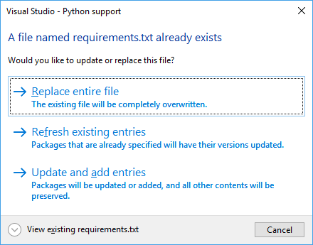

# Manage required Python packages with requirements.txt

 [!INCLUDE [Visual Studio](~/includes/applies-to-version/vs-windows-only.md)]

If you share a project with others, use a build system, or plan to copy the project to any other location where you need to restore an environment, you need to specify the external packages that the project requires. The recommended approach is to use a [requirements.txt file](https://pip.readthedocs.org/en/latest/user_guide.html#requirements-files) (readthedocs.org) that contains a list of commands for pip that installs the required versions of dependent packages. The most common command is `pip freeze > requirements.txt`, which records an environment's current package list into *requirements.txt*.

Technically, any filename may be used to track requirements (by using `-r <full path to file>` when installing a package), but Visual Studio provides specific support for *requirements.txt*:

- If you've loaded a project that contains *requirements.txt* and wish to install all the packages listed in that file, expand the **Python Environments** node in **Solution Explorer**, then right-click an environment node and select **Install from requirements.txt**:

    

- If you want to install the dependencies in a virtual environment, create and activate that environment first, then use the **Install from requirements.txt** command. For more information on creating a virtual environment, see [Use virtual environments](selecting-a-python-environment-for-a-project.md#use-virtual-environments).

- If you already have all the necessary packages installed in an environment, you can right-click that environment in **Solution Explorer** and select **Generate requirements.txt** to create the necessary file. If the file already exists, a prompt appears for how to update it:

    :::moniker range=">=vs-2022"
    
    :::moniker-end

    :::moniker range="<=vs-2019"
    
    :::moniker-end

    

  - **Replace entire file** removes all items, comments, and options that exist.
  - **Refresh existing entries** detects package requirements and updates the version specifiers to match the version you currently have installed.
  - **Update and add entries** refreshes any requirements that are found, and adds all other packages to the end of the file.

The *requirements.txt* files contain precise versions of all installed packages, and you can use these files to freeze the requirements of an environment. Using precise versions, you can easily reproduce your environment on another computer. The requirements files include packages even if they were installed with a version range, as a dependency of another package, or with an installer other than pip.

If pip doesn't install a package, and the package appears in a *requirements.txt* file, the entire installation fails. In this case, manually edit the file to exclude this package or to use [pip's options](https://pip.readthedocs.org/en/latest/reference/pip_install.html#requirements-file-format) to refer to an installable version of the package. For example, you may prefer to use [`pip wheel`](https://pip.readthedocs.org/en/latest/reference/pip_wheel.html) to compile a dependency and add the `--find-links <path>` option to your *requirements.txt*:

```output
C:\Project>pip wheel azure
Downloading/unpacking azure
    Running setup.py (path:C:\Project\env\build\azure\setup.py) egg_info for package azure

Building wheels for collected packages: azure
    Running setup.py bdist_wheel for azure
    Destination directory: c:\project\wheelhouse
Successfully built azure
Cleaning up...

C:\Project>type requirements.txt
--find-links wheelhouse
--no-index
azure==0.8.0

C:\Project>pip install -r requirements.txt -v
Downloading/unpacking azure==0.8.0 (from -r requirements.txt (line 3))
    Local files found: C:/Project/wheelhouse/azure-0.8.0-py3-none-any.whl
Installing collected packages: azure
Successfully installed azure
Cleaning up...
    Removing temporary dir C:\Project\env\build...
```

## See also

- [Manage Python environments in Visual Studio](managing-python-environments-in-visual-studio.md)
- [Select an interpreter for a project](selecting-a-python-environment-for-a-project.md)
- [Search paths](search-paths.md)
- [Python Environments window reference](python-environments-window-tab-reference.md)
