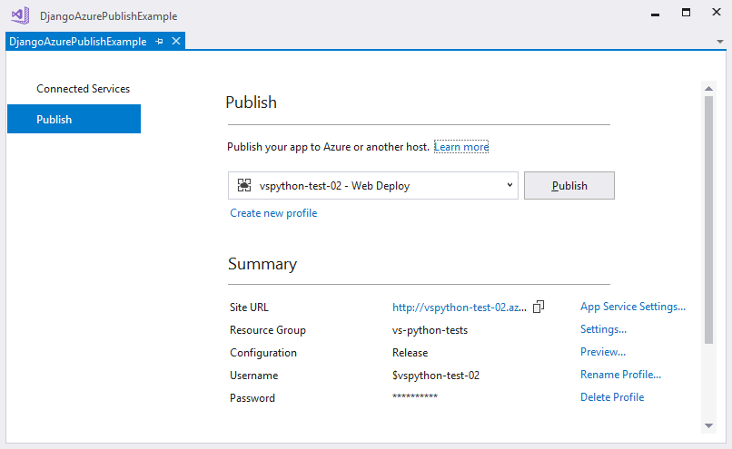

# Working with Python in Visual Studio on Windows

Python is a popular programming language that is reliable, flexible, easy to learn, free to use on all operating systems, and supported by both a strong developer community and many free libraries. Python supports all manners of development, including web applications, web services, desktop apps, scripting, and scientific computing, and is used by many universities, scientists, casual developers, and professional developers alike. You can learn more about the language on [python.org](https://www.python.org) and [Python for Beginners](https://www.python.org/about/gettingstarted/).

Visual Studio is a powerful Python IDE on Windows. Visual Studio provides [open-source](https://github.com/Microsoft/ptvs) support for the Python language through the Python Development and Data Science workloads (Visual Studio 2017) and the free Python Tools for Visual Studio extension (Visual Studio 2015 and earlier).

Python is not presently supported in Visual Studio for Mac, but is available on Mac and Linux through Visual Studio Code (see [questions and answers](#questions-and-answers)).

To get started:

- Follow the [installation instructions](installing-python-support-in-visual-studio.md) to set up the Python workload.
- Familiarize yourself with the Python capabilities of Visual Studio through the sections in this article. You can also [Watch a video series (Microsoft Virtual Academy)](https://mva.microsoft.com/en-US/training-courses/python-tools-for-visual-studio-2017-18121) for an introduction to Python in Visual Studio (22 minutes total).
- Go through one or more of the Quickstarts to create a project. If you're unsure, start with [Create a web app with Flask](../ide/quickstart-python.md?context=visualstudio/python/default).
- Follow the [Working with Python in Visual Studio](tutorial-working-with-python-in-visual-studio-step-01-create-project.md) tutorial for a full end-to-end experience.

## Support for multiple interpreters

Visual Studio's **Python Environments** window (shown below in a wide, expanded view) gives you a single place to manage all of your global Python environments, conda environments, and virtual environments. Visual Studio automatically detects installations of Python in standard locations, and allows you to configure custom installations. With each environment, you can easily manage packages, open an interactive window for that environment, and access environment folders.

For more information:

- Video (2m 35s): [Managing Python Environments](https://mva.microsoft.com/en-US/training-courses/python-tools-for-visual-studio-2017-18121?l=qrDmN4LWE_8305918567)
- Docs: [Managing Python environments](managing-python-environments-in-visual-studio.md)
- Docs: [Python Environments window reference](python-environments-window-tab-reference.md)

## Rich editing, IntelliSense, and code comprehension

Visual Studio provides a first-class Python editor, including syntax coloring, auto-complete across all your code and libraries, code formatting, signature help, refactoring, linting (shown below), and type hints. Visual Studio also provides unique features like class view, Go to Definition, Find All References, and code snippets. Direct integration with the [Interactive Window](#interactive-window) helps you quickly develop Python code that's already saved in a file.

For more information:

- Video (2m 30s): [Editing Python code](https://mva.microsoft.com/en-US/training-courses/python-tools-for-visual-studio-2017-18121?l=r2iQH5LWE_4605918567)
- Docs: [Editing Python code](editing-python-code-in-visual-studio.md)
- Docs: [Code formatting](formatting-python-code.md)
- Docs: [Refactoring](refactoring-python-code.md)
- Docs: [Linting](linting-python-code.md)
- General Visual Studio feature docs: [Features of the code editor](../ide/writing-code-in-the-code-and-text-editor.md)

## Interactive Window

For every Python environment known to Visual Studio, you can easily open the same interactive (REPL) environment for a Python interpreter directly within Visual Studio, rather than using a separate command prompt. You can easily switch between environments as well.

Visual Studio also provides tight integration between the Python code editor and the interactive window. The **Ctrl+Enter** keyboard shortcut conveniently sends the current line of code (or code block) in the editor to the interactive window, then moves to the next line (or block). **Ctrl+Enter** lets you easily step through code without having to run the debugger. You can also send selected code to the interactive window with the same keystroke, and easily paste code from the interactive window into the editor. Together, these capabilities allow you to work out details for a segment of code in the interactive window and easily save the results in a file in the editor.

Visual Studio also supports IPython/Jupytr in the REPL, including inline plots, .NET, and Windows Presentation Foundation (WPF).

For more information:

- Video (2m 22s: [Python Interactive Window](https://mva.microsoft.com/en-US/training-courses/python-tools-for-visual-studio-2017-18121?l=gJYKY5LWE_4605918567)
- Docs: [Interactive Window](python-interactive-repl-in-visual-studio.md)
- Docs: [IPython in Visual Studio](interactive-repl-ipython.md)

## Project system, and project and item templates

Visual Studio helps you manage the complexity of a project as it grows over time. A project is much more than a folder structure: it includes an understanding of how different files are used and how they relate to each other. Visual Studio helps you distinguish app code, test code, web pages, JavaScript, build scripts, and so on, which then enable file-appropriate features. A Visual Studio solution, moreover, helps you manage multiple related projects, such as a Python project and a C++ extension project.

Project and item templates automate the process of setting up different types of projects and files, saving you valuable time and relieving you from managing intricate and error-prone details. Visual Studio provides templates for web, Azure, data science, console, and other types of projects, along with templates for files like Python classes, unit tests, Azure web configuration, HTML, and even Django apps.

For more information:

- Docs: [Managing Python projects](managing-python-projects-in-visual-studio.md)
- Docs: [Item templates reference](python-item-templates.md)
- Docs: [Python project templates](managing-python-projects-in-visual-studio.md#project-templates)
- Docs: [Working with C++ and Python](working-with-c-cpp-python-in-visual-studio.md)
- General Visual Studio feature docs: [Project and item templates](../ide/creating-project-and-item-templates.md#visual-studio-templates)
- General Visual Studio feature docs: [Solutions and Projects in Visual Studio](../ide/solutions-and-projects-in-visual-studio.md)

## Full-featured debugging

One of Visual Studio's strengths is its powerful debugger. For Python in particular, Visual Studio includes Python/C++ mixed-mode debugging, remote debugging on Linux, remote debugging on Azure, debugging within the Interactive Window, and debugging Python unit tests.

For more information:

- Video: [Debugging Python 3m 32s](https://mva.microsoft.com/en-US/training-courses/python-tools-for-visual-studio-2017-18121?l=Ep5dp5LWE_3805918567)
- Docs: [Debugging Python](debugging-python-in-visual-studio.md)
- Docs: [Python/C++ mixed-mode debugging](debugging-mixed-mode-c-cpp-python-in-visual-studio.md)
- Docs: [Remote debugging on Linux](debugging-python-code-on-remote-linux-machines.md)
- Docs: [Remote debugging on Azure](debugging-remote-python-code-on-azure.md)
- General Visual Studio feature docs: [Feature Tour of the Visual Studio Debugger](../debugger/debugger-feature-tour.md)

## Profiling tools with comprehensive reporting

Profiling explores how time is being spent within your application. Visual Studio supports profiling with CPython-based interpreters and includes the ability to compare performance between different profiling runs.

For more information:

- Video: [Profiling Python 3m 00s](https://mva.microsoft.com/en-US/training-courses/python-tools-for-visual-studio-2017-18121?l=s6FoC6LWE_1005918567)
- Docs: [Python profiling tools](profiling-python-code-in-visual-studio.md)
- General Visual Studio feature docs: [Profiling Feature Tour](../profiling/profiling-feature-tour.md). (Not all Visual Studio profiling features are available for Python).

## Unit testing tools

Discover, run, and manage tests in Visual Studio Test Explorer, and easily debug unit tests.

For more information:

- Video: [Testing Python 2m 31s](https://mva.microsoft.com/en-US/training-courses/python-tools-for-visual-studio-2017-18121?l=hb46k6LWE_405918567)
- Docs: [Unit testing tools for Python](unit-testing-python-in-visual-studio.md)
- General Visual Studio feature docs: [Unit test your code](../test/unit-test-your-code.md).

## Publishing to Azure and Azure SDK for Python

Visual Studio provides integrated support for publishing web apps and cloud services to Azure. Visual Studio includes essential `web.config` item templates for both dynamic and static content. The Python workload also includes the Azure SDK for Python, which simplifies consuming Azure services from Windows, Mac OS X, and Linux apps.

For more information:

- Docs: [Publishing to Azure](publishing-python-web-applications-to-azure-from-visual-studio.md)
- Docs: [Azure SDK for Python](azure-sdk-for-python.md)

## Python training on Microsoft Virtual Academy

|   |   |
|---|---|
|  | <ul><li>[Introduction to Programming with Python](https://mva.microsoft.com/en-US/training-courses/introduction-to-programming-with-python-8360?l=lqhuMxFz_8904984382)</li><li>[Python Beginner: Strings and Functions](https://mva.microsoft.com/en-US/training-courses/python-beginner-strings-and-functions-18015)</li><li>[Python Fundamentals: List and Loops](https://mva.microsoft.com/en-US/training-courses/python-fundamentals-lists-and-loops-18019)</li><li>[Top Python Questions](https://mva.microsoft.com/en-US/training-courses/python-tools-for-visual-studio-2017-18121)</li></ul> |

## Questions and answers

**Q. Is Python support available with Visual Studio for Mac?**

A. Not at this time, but you can up vote the request on [UserVoice](https://visualstudio.uservoice.com/forums/563332-visual-studio-for-mac/suggestions/18670291-python-tools-for-visual-studio-mac). The [Visual Studio for Mac](/visualstudio/mac/) documentation identifies the current types of development that it does support. In the meantime, Visual Studio Code on Windows, Mac, and Linux [works well with Python through available extensions](https://code.visualstudio.com/docs/languages/python).

**Q. What can I use to build UI with Python?**

A. The main offering in this area is the [Qt Project](https://www.qt.io/qt-for-application-development/), with bindings for Python known as [PySide (the official binding)](http://wiki.qt.io/PySide) (also see [PySide downloads](https://download.qt.io/official_releases/pyside/.)) and [PyQt](https://wiki.python.org/moin/PyQt). At present, Python support in Visual Studio does not include any specific tools for UI development.

**Q. Can a Python project produce a stand-alone executable?**

A. Python is generally an interpreted language, with which code is run on demand in a suitable Python-capable environment such as Visual Studio and web servers. Visual Studio itself does not at present provide the means to create a stand-alone executable, which essentially means a program with an embedded Python interpreter. However, there are various means within the Python community to create executables as described on [StackOverflow](http://stackoverflow.com/questions/5458048/how-to-make-a-python-script-standalone-executable-to-run-without-any-dependency). CPython also supports being embedded within a native application, as described on the blog post, [Using CPython's Embeddable Zip File](https://blogs.msdn.microsoft.com/pythonengineering/2016/04/26/cpython-embeddable-zip-file/).

## Features matrix

Python features can be installed in the following editions of Visual Studio as described in the [installation guide](installing-python-support-in-visual-studio.md):

- [Visual Studio 2017 (all editions)](https://www.visualstudio.com/vs/)
- Visual Studio 2015 (all editions)
- Visual Studio 2013 Community Edition
- Visual Studio 2013 Express for Web, Update 2 or higher
- Visual Studio 2013 Express for Desktop, Update 2 or higher
- Visual Studio 2013 (Pro edition or higher)
- Visual Studio 2012 (Pro edition or higher)
- Visual Studio 2010 SP1 (Pro edition or higher; .NET 4.5 required)

Visual Studio 2015 and earlier are available at [visualstudio.com/vs/older-downloads/](https://www.visualstudio.com/vs/older-downloads/).

> [!Important]
> Features are fully supported and maintained for only the latest version of Visual Studio. Features are available in older versions but are not actively maintained.

| Python Support | 2017 | 2015 | 2013 Comm | 2013 Desktop | 2013 Web | 2013 Pro+ | 2012 Pro+ | 2010 SP1 Pro+ |
| --- | --- | --- | --- | --- | --- | --- | --- | ---|
| Manage multiple interpreters | &#10004; | &#10004; | &#10004; | &#10004; | &#10004; | &#10004; | &#10004; | &#10004; |
| Auto-detect popular interpreters | &#10004; | &#10004; | &#10004; | &#10004; | &#10004; | &#10004; | &#10004; | &#10004; |
| Add custom interpreters | &#10004; | &#10004; | &#10004; | &#10004; | &#10004; | &#10004; | &#10004; | &#10004; |
| Virtual Environments | &#10004; | &#10004; | &#10004; | &#10004; | &#10004; | &#10004; | &#10004; | &#10004; |
| Pip/Easy Install | &#10004; | &#10004; | &#10004; | &#10004; | &#10004; | &#10004; | &#10004; | &#10004; |
 

| Project System | 2017 | 2015 | 2013 Comm | 2013 Desktop | 2013 Web | 2013 Pro+ | 2012 Pro+ | 2010 SP1 Pro+ |
| --- | --- | --- | --- | --- | --- | --- | --- | ---|
| New project from existing code | &#10004; | &#10004; | &#10004; | &#10004; | &#10004; | &#10004; | &#10004; | &#10004; |
| Show all files | &#10004; | &#10004; | &#10004; | &#10004; | &#10004; | &#10004; | &#10004; | &#10004; |
| Source control | &#10004; | &#10004; | &#10004; | &#10004; | &#10004; | &#10004; | &#10004; | &#10004; |
| Git integration | &#10004; | &#10004; | &#10004; | &#10004; | &#10004; | &#10004; | &#10004;1 | &#10007; |
 

| Editing | 2017 | 2015 | 2013 Comm | 2013 Desktop | 2013 Web | 2013 Pro+ | 2012 Pro+ | 2010 SP1 Pro+ |
| --- | --- | --- | --- | --- | --- | --- | --- | ---|
| Syntax highlighting | &#10004; | &#10004; | &#10004; | &#10004; | &#10004; | &#10004; | &#10004; | &#10004; |
| Auto-complete | &#10004; | &#10004; | &#10004; | &#10004; | &#10004; | &#10004; | &#10004; | &#10004; |
| Signature help | &#10004; | &#10004; | &#10004; | &#10004; | &#10004; | &#10004; | &#10004; | &#10004; |
| Quick info | &#10004; | &#10004; | &#10004; | &#10004; | &#10004; | &#10004; | &#10004; | &#10004; |
| Object browser/class view | &#10004; | &#10004; | &#10004; | &#10004; | &#10004; | &#10004; | &#10004; | &#10004; |
| Navigation bar | &#10004; | &#10004; | &#10004; | &#10004; | &#10004; | &#10004; | &#10004; | &#10004; |
| Go to Definition | &#10004; | &#10004; | &#10004; | &#10004; | &#10004; | &#10004; | &#10004; | &#10004; |
| Navigate to | &#10004; | &#10004; | &#10004; | &#10004; | &#10004; | &#10004; | &#10004; | &#10004; |
| Find All References | &#10004; | &#10004; | &#10004; | &#10004; | &#10004; | &#10004; | &#10004; | &#10004; |
| Auto indentation | &#10004; | &#10004; | &#10004; | &#10004; | &#10004; | &#10004; | &#10004; | &#10004; |
| Code formatting | &#10004; | &#10004; | &#10004; | &#10004; | &#10004; | &#10004; | &#10004; | &#10004; |
| Refactor - rename | &#10004; | &#10004; | &#10004; | &#10004; | &#10004; | &#10004; | &#10004; | &#10004; |
| Refactor - extract method | &#10004; | &#10004; | &#10004; | &#10004; | &#10004; | &#10004; | &#10004; | &#10004; |
| Refactor - add/remove import | &#10004; | &#10004; | &#10004; | &#10004; | &#10004; | &#10004; | &#10004; | &#10004; |
| PyLint | &#10004; | &#10004; | &#10004; | &#10004; | &#10004; | &#10004; | &#10004; | &#10004; |
 

| Interactive Window | 2017 | 2015 | 2013 Comm | 2013 Desktop | 2013 Web | 2013 Pro+ | 2012 Pro+ | 2010 SP1 Pro+ |
| --- | --- | --- | --- | --- | --- | --- | --- | ---|
| Interactive Window | &#10004; | &#10004; | &#10004; | &#10004; | &#10004; | &#10004; | &#10004; | &#10004; |
| IPython with inline graphs | &#10004; | &#10004; | &#10004; | &#10004; | &#10004; | &#10004; | &#10004; | &#10004; |
 

| Desktop | 2017 | 2015 | 2013 Comm | 2013 Desktop | 2013 Web | 2013 Pro+ | 2012 Pro+ | 2010 SP1 Pro+ |
| --- | --- | --- | --- | --- | --- | --- | --- | ---|
| Console/Windows application | &#10004; | &#10004; | &#10004; | &#10004; | &#10004; | &#10004; | &#10004; | &#10004; |
| IronPython WPF (with XAML designer) | &#10004; | &#10004; | &#10004; | &#10004; | &#10004; | &#10004; | &#10004; | &#10004; |
| IronPython Windows Forms | &#10004; | &#10004; | &#10004; | &#10004; | &#10004; | &#10004; | &#10004; | &#10004; |
 

| Web | 2017 | 2015 | 2013 Comm | 2013 Desktop | 2013 Web | 2013 Pro+ | 2012 Pro+ | 2010 SP1 Pro+ |
| --- | --- | --- | --- | --- | --- | --- | --- | ---|
| Django web project | &#10004; | &#10004; | &#10004; | &#10007; | &#10004; | &#10004; | &#10004; | &#10004; |
| Bottle web project | &#10004; | &#10004; | &#10004; | &#10007; | &#10004; | &#10004; | &#10004; | &#10004; |
| Flask web project | &#10004; | &#10004; | &#10004; | &#10007; | &#10004; | &#10004; | &#10004; | &#10004; |
| Generic web project | &#10004; | &#10004; | &#10004; | &#10007; | &#10004; | &#10004; | &#10004; | &#10004; |
 

| Azure | 2017 | 2015 | 2013 Comm | 2013 Desktop | 2013 Web | 2013 Pro+ | 2012 Pro+ | 2010 SP1 Pro+ |
| --- | --- | --- | --- | --- | --- | --- | --- | ---|
| Deploy to web site | &#10004; | &#10004; | &#10004; | &#10007; | &#10004; | &#10004; | &#10004; | &#10004;2 |
| Deploy to web role | &#10004; | &#10004; | &#10004; | &#10007; | &#10004;4 | &#10004;4 | &#10004;3 | &#10007; |
| Deploy to worker role | ? | ? | ? | &#10007; | &#10004;4 | &#10004;4 | &#10004;3 | &#10007; |
| Run in Azure emulator | ? | ? | ? | &#10007; | &#10004;4 | &#10004;4 | &#10004;3 | &#10007; |
| Remote debugging | &#10004; | &#10004; | &#10004; | &#10007; | &#10004;6 | &#10004;8 | &#10004;8 | &#10007; |
| Attach Server Explorer | &#10004; | &#10004; | &#10004; | &#10007; | &#10004;7 | &#10004;7 | &#10007; | &#10007; |
 

| Django templates | 2017 | 2015 | 2013 Comm | 2013 Desktop | 2013 Web | 2013 Pro+ | 2012 Pro+ | 2010 SP1 Pro+ |
| --- | --- | --- | --- | --- | --- | --- | --- | ---|
| Debugging | &#10004; | &#10004; | &#10004; | &#10007; | &#10004; | &#10004; | &#10004; | &#10004; |
| Auto-complete | &#10004; | &#10004; | &#10004; | &#10007; | &#10004;5 | &#10004;5 | &#10004; | &#10004; |
| Auto-complete for CSS and JavaScript | &#10004; | &#10004; | &#10004; | &#10007; | &#10004;5 | &#10004;5 | &#10007; | &#10007; |
 

| Debugging | 2017 | 2015 | 2013 Comm | 2013 Desktop | 2013 Web | 2013 Pro+ | 2012 Pro+ | 2010 SP1 Pro+ |
| --- | --- | --- | --- | --- | --- | --- | --- | ---|
| Debugging | &#10004; | &#10004; | &#10004; | &#10004; | &#10004; | &#10004; | &#10004; | &#10004; |
| Debugging without a project | &#10004; | &#10004; | &#10004; | &#10004; | &#10004; | &#10004; | &#10004; | &#10004; |
| Debugging - attach to editing | &#10004; | &#10004; | &#10004; | &#10004; | &#10007; | &#10004; | &#10004; | &#10004; |
| Mixed-mode debugging | &#10004; | &#10004; | &#10004; | &#10004; | &#10004; | &#10004; | &#10004; | &#10007; |
| Remote debugging (Windows, Mac OS X, Linux) | &#10004; | &#10004; | &#10004; | &#10004; | &#10007; | &#10004; | &#10004; | &#10004; |
| Debug interactive window | &#10004; | &#10004; | &#10004; | &#10004; | &#10004; | &#10004; | &#10004; | &#10004; |
 

| Profiling | 2017 | 2015 | 2013 Comm | 2013 Desktop | 2013 Web | 2013 Pro+ | 2012 Pro+ | 2010 SP1 Pro+ |
| --- | --- | --- | --- | --- | --- | --- | --- | ---|
| Profiling | &#10004; | &#10004; | &#10004; | &#10007; | &#10007; | &#10004; | &#10004; | &#10004; |
 

| Test | 2017 | 2015 | 2013 Comm | 2013 Desktop | 2013 Web | 2013 Pro+ | 2012 Pro+ | 2010 SP1 Pro+ |
| --- | --- | --- | --- | --- | --- | --- | --- | --- |
| Test explorer | &#10004; | &#10004; | &#10004; | &#10004; | &#10004; | &#10004; | &#10004; | &#10007; |
| Run test | &#10004; | &#10004; | &#10004; | &#10004; | &#10004; | &#10004; | &#10004; | &#10007; |
| Debug test | &#10004; | &#10004; | &#10004; | &#10004; | &#10004; | &#10004; | &#10004; | &#10007; |
 

1. Git support for Visual Studio 2012 is available in the Visual Studio Tools for Git extension, available on the [Visual Studio Gallery](http://visualstudiogallery.msdn.microsoft.com/abafc7d6-dcaa-40f4-8a5e-d6724bdb980c).

1. Deployment to Azure Web Site requires [Azure SDK for .NET 2.1 - Visual Studio 2010 SP1](http://go.microsoft.com/fwlink/?LinkId=313855). Later versions don't support Visual Studio 2010.

1. Support for Azure Web Role and Worker Role requires [Azure SDK for .NET 2.3 - VS 2012](http://go.microsoft.com/fwlink/?LinkId=323511) or later.

1. Support for Azure Web Role and Worker Role requires [Azure SDK for .NET 2.3 - VS 2013](http://go.microsoft.com/fwlink/?LinkId=323510) or later.

1. Django template editor in Visual Studio 2013 has some known issues that are resolved by installing Update 2.

1. Requires Windows 8 or later. Visual Studio 2013 Express for Web doesn't have the Attach to Process dialog, but Azure Web Site remote debugging is still possible using the Attach Debugger (Python) command in Server Explorer. Remote debugging requires [Azure SDK for .NET 2.3 - Visual Studio 2013](http://go.microsoft.com/fwlink/?LinkId=323510) or later.

1. Requires Windows 8 or later. Attach Debugger (Python) command in Server Explorer requires [Azure SDK for .NET 2.3 - Visual Studio 2013](http://go.microsoft.com/fwlink/?LinkId=323510) or later.

1. Requires Windows 8 or later.

## Additional resources

- [WFastCGI bridge between IIS and Python](https://pypi.org/p/wfastcgi) (pypi.org)
- [Free Python courses on Microsoft Virtual Academy](https://mva.microsoft.com/search/SearchResults.aspx#!q=python)
- [Top Python Questions at Microsoft Virtual Academy](https://aka.ms/mva-top-python-questions)
