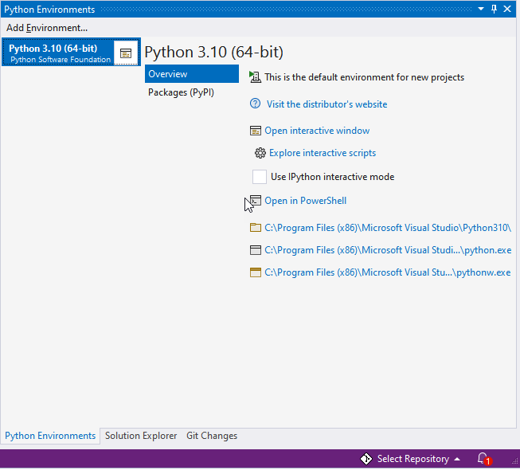
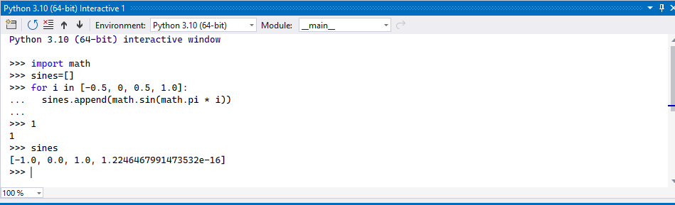
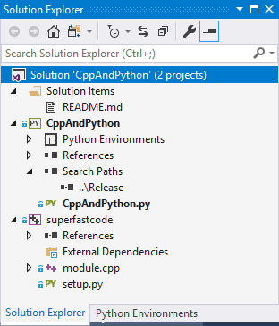
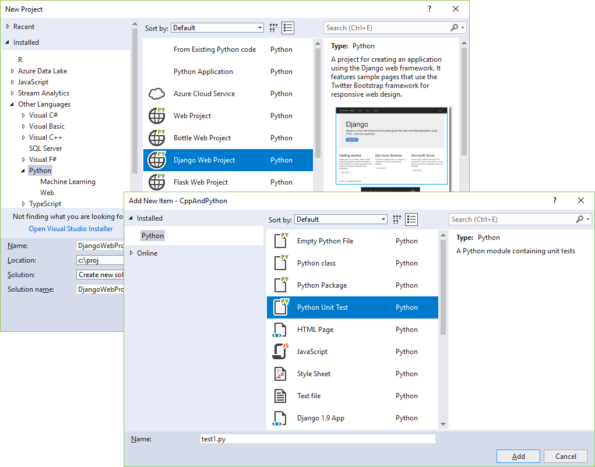

# Work with Python in Visual Studio on Windows

 [!INCLUDE [Visual Studio](~/includes/applies-to-version/vs-windows-only.md)]

Python is a popular programming language that is reliable, flexible, easy to learn, free to use on all operating systems, and supported by both a strong developer community and many free libraries. Python supports all manners of development, including web applications, web services, desktop apps, scripting, and scientific computing. Scientists, casual developers, professional developers, and many universities alike use Python for programming. You can learn more about the language on [python.org](https://www.python.org) and [Python for Beginners](https://www.python.org/about/gettingstarted/).

Visual Studio is a powerful Python IDE on Windows. Visual Studio provides [open-source](https://github.com/Microsoft/ptvs) support for the Python language through the **Python Development** and **Data Science** workloads (Visual Studio 2017 and later) and the free Python Tools for Visual Studio extension (Visual Studio 2015 and earlier).

Visual Studio doesn't support Python on Mac now. But it's available on Mac and Linux through Visual Studio Code. (see [questions and answers](#questions-and-answers)).

To get started:

- Follow the [installation instructions](installing-python-support-in-visual-studio.md) to set up the Python workload.
- Familiarize yourself with the Python capabilities of Visual Studio through the sections in this article.

- Go through one or more of the Quickstarts to create a project. If you're unsure, start with [Quickstart: Open and run Python code in a folder](quickstart-05-python-visual-studio-open-folder.md) or [Create a web app with Flask](../ide/quickstart-python.md?toc=/visualstudio/python/toc.json&bc=/visualstudio/python/_breadcrumb/toc.json).

- Follow the [Work with Python in Visual Studio](tutorial-working-with-python-in-visual-studio-step-01-create-project.md) tutorial for a full end-to-end experience.

## Support for multiple interpreters

Visual Studio's **Python Environments** window (shown below in a wide, expanded view) gives you a single place to manage all of your global Python environments, conda environments, and virtual environments. Visual Studio automatically detects installations of Python in standard locations, and allows you to configure custom installations. With each environment, you can easily manage packages, open an interactive window for that environment, and access environment folders.

::: moniker range="vs-2019"

   
::: moniker-end

:::moniker range=">=vs-2022"

   
:::moniker-end

Use the **Open interactive window** command to run Python interactively within the context of Visual Studio. Use the **Open in PowerShell** command to open a separate command window in the folder of the selected environment. From that command window you can run any python script.

For more information:

- [Manage Python environments](managing-python-environments-in-visual-studio.md)
- [Python Environments reference](python-environments-window-tab-reference.md)

## Rich editing, IntelliSense, and code comprehension

Visual Studio provides a first-class Python editor, including syntax coloring, autocomplete across all your code and libraries, code formatting, signature help, refactoring, linting, and type hints. Visual Studio also provides unique features like class view, **Go to Definition**, **Find All References**, and code snippets. Direct integration with the [Interactive window](#interactive-window) helps you quickly develop Python code that's already saved in a file.

   

For more information:

- Docs: [Edit Python code](editing-python-code-in-visual-studio.md)
- Docs: [Format code](formatting-python-code.md)
- Docs: [Refactor code](refactoring-python-code.md)
- Docs: [Use a linter](linting-python-code.md)
- General Visual Studio feature docs: [Features of the code editor](../ide/writing-code-in-the-code-and-text-editor.md)

## Interactive window

For every Python environment known to Visual Studio, you can easily open the same interactive (REPL) environment for a Python interpreter directly within Visual Studio, rather than using a separate command prompt. You can easily switch between environments as well. (To open a separate command prompt, select your desired environment in the **Python Environments** window, then select the **Open in PowerShell** command as explained earlier under [Support for multiple interpreters](#support-for-multiple-interpreters).)

:::moniker range="<=vs-2019"
   
:::moniker-end

:::moniker range=">=vs-2022"
   
:::moniker-end

Visual Studio also provides tight integration between the Python code editor and the **Interactive** window. The **Ctrl**+**Enter** keyboard shortcut conveniently sends the current line of code (or code block) in the editor to the **Interactive** window, then moves to the next line (or block). **Ctrl**+**Enter** lets you easily step through code without having to run the debugger. You can also send selected code to the **Interactive** window with the same keystroke, and easily paste code from the **Interactive** window into the editor. Together, these capabilities allow you to work out details for a segment of code in the **Interactive** window and easily save the results in a file in the editor.

Visual Studio also supports IPython/Jupyter in the REPL, including inline plots, .NET, and Windows Presentation Foundation (WPF).

For more information:

- [Interactive window](python-interactive-repl-in-visual-studio.md)
- [IPython in Visual Studio](interactive-repl-ipython.md)

## Project system, and project and item templates

> [!Note]
> Visual Studio 2019 supports opening a folder containing Python code and running that code without creating Visual Studio project and solution files. For more information, see [Quickstart: Open and run Python code in a folder](quickstart-05-python-visual-studio-open-folder.md). There are, however, benefits to using a project file, as explained in this section.

::: moniker range="vs-2022"
> [!Note]
> Visual Studio 2022 supports opening a folder containing Python code and running that code without creating Visual Studio project and solution files. For more information, see [Quickstart: Open and run Python code in a folder](quickstart-05-python-visual-studio-open-folder.md). There are, however, benefits to using a project file, as explained in this section.
::: moniker-end

Visual Studio helps you manage the complexity of a project as it grows over time. A *Visual Studio project* is much more than a folder structure: it includes an understanding of how different files are used and how they relate to each other. Visual Studio helps you distinguish app code, test code, web pages, JavaScript, build scripts, and so on, which then enable file-appropriate features. A Visual Studio solution, moreover, helps you manage multiple related projects, such as a Python project and a C++ extension project.

   

Project and item templates automate the process of setting up different types of projects and files, saving you valuable time and relieving you from managing intricate and error-prone details. Visual Studio provides templates for web, Azure, data science, console, and other types of projects, along with templates for files like Python classes, unit tests, Azure web configuration, HTML, and even Django apps.

   

For more information:

- Docs: [Manage Python projects](managing-python-projects-in-visual-studio.md)
- Docs: [Item templates reference](python-item-templates.md)
- Docs: [Python project templates](managing-python-projects-in-visual-studio.md#project-templates)
- Docs: [Work with C++ and Python](working-with-c-cpp-python-in-visual-studio.md)
- General Visual Studio feature docs: [Project and item templates](../ide/creating-project-and-item-templates.md#visual-studio-templates)
- General Visual Studio feature docs: [Solutions and projects in Visual Studio](../ide/solutions-and-projects-in-visual-studio.md)

## Full-featured debugging

One of Visual Studio's strengths is its powerful debugger. For Python in particular, Visual Studio includes Python/C++ mixed-mode debugging, remote debugging on Linux, debugging within the **Interactive** window, and debugging Python unit tests.

   

::: moniker range="vs-2019"

In Visual Studio 2019, you can run and debug code without having a Visual Studio project file. See [Quickstart: Open and run Python code in a folder-2019](quickstart-05-python-visual-studio-open-folder.md) for an example.
::: moniker-end

::: moniker range=">=vs-2022"

In Visual Studio 2022, you can run and debug code without having a Visual Studio project file. See [Quickstart: Open and run Python code in a folder-2022](quickstart-05-python-visual-studio-open-folder.md) for an example.
::: moniker-end

For more information:

- Docs: [Debug Python](debugging-python-in-visual-studio.md)
- Docs: [Python/C++ mixed-mode debugging](debugging-mixed-mode-c-cpp-python-in-visual-studio.md)
- Docs: [Remote debugging on Linux](debugging-python-code-on-remote-linux-machines.md)
- General Visual Studio feature docs: [Feature tour of the Visual Studio Debugger](../debugger/debugger-feature-tour.md)

## Profiling tools with comprehensive reporting

Profiling explores how time is being spent within your application. Visual Studio supports profiling with CPython-based interpreters and includes the ability to compare performance between different profiling runs.

   

For more information:

- Docs: [Python profiling tools](profiling-python-code-in-visual-studio.md)
- General Visual Studio feature docs: [Profiling Feature Tour](../profiling/profiling-feature-tour.md). (Not all Visual Studio profiling features are available for Python).

## Unit testing tools

Discover, run, and manage tests in Visual Studio **Test Explorer**, and easily debug unit tests.

   

For more information:

- Docs: [Unit testing tools for Python](unit-testing-python-in-visual-studio.md)
- General Visual Studio feature docs: [Unit test your code](../test/unit-test-your-code.md).

## Azure SDK for Python

The Azure libraries for Python simplify consuming Azure services from Windows, macOS X, and Linux apps. You can use them to create and manage Azure resources, and to connect to Azure services.

For more information, see [Azure SDK for Python](/azure/python/) and [Azure libraries for Python](/azure/developer/python/sdk/azure-sdk-overview)
.

## Questions and answers

**Q. Is Python support available with Visual Studio for Mac?**

A. Not at this time, but you can up vote the request on [Developer Community](https://developercommunity.visualstudio.com/content/idea/351820/python-tools-for-visual-studio-mac.html). The [Visual Studio for Mac](/visualstudio/mac/) documentation identifies the current types of development that it does support. In the meantime, Visual Studio Code on Windows, Mac, and Linux [works well with Python through available extensions](https://code.visualstudio.com/docs/languages/python).

**Q. What can I use to build UI with Python?**

A. The main offering in this area is the [Qt Project](https://www.qt.io/qt-for-application-development/), with bindings for Python known as [PySide (the official binding)](https://wiki.qt.io/PySide) (also see [PySide downloads](https://download.qt.io/official_releases/pyside/.)) and [PyQt](https://wiki.python.org/moin/PyQt). Python support in Visual Studio doesn't include any specific tools for UI development.

**Q. Can a Python project produce a stand-alone executable?**

A. Python is generally an interpreted language, with which code is run on demand in a suitable Python-capable environment such as Visual Studio and web servers. Visual Studio itself doesn't now provide the means to create a stand-alone executable, which essentially means a program with an embedded Python interpreter. However, the Python community supplied different means to create executables as described on [StackOverflow](https://stackoverflow.com/questions/5458048/how-to-make-a-python-script-standalone-executable-to-run-without-any-dependency). CPython also supports being embedded within a native application, as described on the blog post, [Using CPython's embeddable zip file](https://devblogs.microsoft.com/python/cpython-embeddable-zip-file/).

