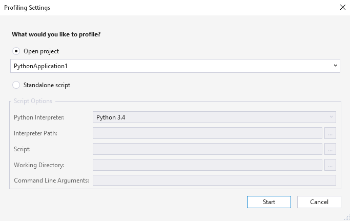

# Profile Python code

You can profile a Python application when using CPython-based interpreters. (See [Features matrix - profiling](overview-of-python-tools-for-visual-studio.md#matrix-profiling) for the availability of this feature for different versions of Visual Studio.)

## Profiling for CPython-based interpreters

Profiling is started through the **Debug** > **Launch Python Profiling** menu command, which opens a configuration dialog:

When you select **OK**, the profiler runs and opens a performance report through which you can explore how time is spent in the application:

> [!Note]
> When you profile a Python application Visual Studio collects data for the lifetime of the process. At present, it is not possible to pause profiling. We do want to hear your feedback on future capabilities. Use the **Product feedback** button at the bottom of this page.

## Profiling for IronPython

Because IronPython is not a CPython-based interpreter, the profiling feature above does not work.

Instead, use the Visual Studio .NET profiler by launching *ipy.exe* directly as the target application, using the appropriate arguments to launch your startup script. Include `-X:Debug` on the command line to ensure that all of your Python code can be debugged and profiled. This argument generates a performance report including time spent both in the IronPython runtime and your code. Your code is identified using mangled names.

Alternately, IronPython has some of its own built-in profiling but there's currently no good visualizer for it. See [An IronPython Profiler](/archive/blogs/curth/an-ironpython-profiler) (MSDN blogs) for what's available.