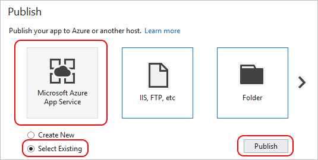
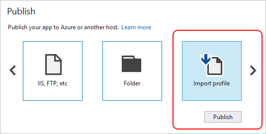

# Publishing to Azure App Service

You can get started quickly building a Python web site in Visual Studio and publish it to Azure App Service through the following steps:

- [Create an Azure App Service](#create-an-azure-app-service)
- [Create and test the initial project](#create-and-test-the-initial-project)
- [Publish to Azure App Service](#publish-to-azure-app-service)

## Create an Azure App Service

Publishing to Azure requires an Azure subscription, or you can use a temporary site.

If you don't already have a subscription, start with a [free full Azure account](https://azure.microsoft.com/en-us/free/), which includes generous credits for Azure services. Also consider signing up for [Visual Studio Dev Essentials](https://azure.microsoft.com/en-us/pricing/member-offers/vs-dev-essentials/), which gives you $25 credit every month for a full year.

Once you have a subscription, create an App Service with an empty Web App through the Azure portal to use for this walkthrough.

To create a temporary App Service without needing an Azure subscription:

1. Open your browser to [try.azurewebsites.net](https://try.azurewebsites.net).
1. Select **Web App** for the app type, then select **Next**.
1. Select **Empty Site**, followed by **Create**.
1. Sign in with a social login of your choice, and after a short time your site is ready at the displayed URL.
1. Select **Download publishing profile** and save the `.publishsettings` file, which you use later.

## Configure Python on Azure App Service

Once you have an App Service with an empty Web App running, make sure that Python is installed by following the instructions on [Managing Python on Azure App Service](managing-python-on-azure-app-service.md). You can also manually install the `bottle` package using the process in those instructions, but that step is included later in this walkthrough.

## Create and test the initial project

1. In Visual Studio, select **File > New > Project**, search for "Bottle", select the **Bottle Web Project**, and click **OK**.    

1. When prompted to install external packages, select **Install into a virtual environment**. Note the **Show required packages** control at the bottom of the dialog that shows which packages will be installed:

  

1. Select your preferred base interpreter for the virtual environment (for example, **Python 2.7** or **Python 3.4**) and click **Create**:

  

1. Once the project is created, test it locally by selecting **Debug > Start Debugging** or pressing F5. By default, the application uses an in-memory repository that doesn't require any configuration. All data is lost when the web server is stopped.

1. Click around in the application to familiarize yourself with its operation.

1. Stop the debugger when you're finished (**Debug > Stop Debugging** or Shift-F5).

## Publish to Azure App Service

Publishing to Azure App Service is a process of copying the necessary files to the server and setting up appropriate `web.config` files. Visual Studio 2015 automates much of this process, including creation of `web.config` files, but this automation limits long-term flexibility and control. Visual Studio 2017 requires more manual steps but provides more exact control over your Python environment. For background, see the blog post, [Publish to Azure in Visual Studio 2017](https://blogs.msdn.microsoft.com/pythonengineering/2016/12/12/publish-to-azure-in-vs-2017/).

> [!Tip]
> To enable remote debugging with either Visual Studio 2017 or 2015, right-click the project in **Solution Explorer**, select **Add > New Item...**, and select the "Azure Remote debugging web.config" template. This template adds a debugging `web.debug.config` file to your project along with a `ptvsd` folder containing debugging tools. Once you deploy these, you can follow the [Azure Remote Debugging](https://docs.microsoft.com/visualstudio/python/debugging-azure-remote) instructions.


### Visual Studio 2017

Publishing to Azure App Service from Visual Studio 2017 only copies the projects in your file to the server. It's necessary, therefore, to add several additional necessary files to the project and to ensure that the server environment is fully configured.

1. In Visual Studio **Solution Explorer**, right-click the project and select **Add > New Item...*. In the dialog that appears, selecting the "Azure web.config (Fast CGI)" template and select OK. This creates a `web.config` file in your project root. 
 
1. Modify the `WSGI_HANDLER` entry in `web.config` to add parentheses after `app.wsgi_app` as shown below. This is necessary because that object is a function (see app.py) rather than a variable:
 
    ```xml
    <add key="WSGI_HANDLER" value="app.wsgi_app()"/>
    ```

1. Modify the `PythonHandler` entry in `web.config` so that the path matches the Python installation on the server. For example, for Python 3.6.1 x64 the entry should appear as follows:
    
    ```xml
    <system.webServer>
      <handlers>
        <add name="PythonHandler" path="*" verb="*" modules="FastCgiModule" scriptProcessor="D:\home\Python361x64\python.exe|D:\home\Python361x64\wfastcgi.py" resourceType="Unspecified" requireAccess="Script"/>
      </handlers>
    </system.webServer>
    ```

    Refer to [Managing Python on Azure App Service](managing-python-on-azure-app-service.md) for details on finding the exact path for your Python version.

1. In **Solution Explorer**, right-click the `static` folder, select **Add > New Item...**, select the "Azure static files web.config" template, and select OK. This action creates another `web.config` in the `static` folder to disable Python processing for that folder. This allows the default web server to handle requests for static files rather than using the Python application.
  
1. Save your project, then in Visual Studio **Solution Explorer**, right-click the project and select **Publish**. 

1. In the **Publish** tab that appears, select the publishing target:

    a. Your own Azure subscription: select **Microsoft Azure App Service**, then **Select Existing** followed by **Publish**. A dialog appears in which you can select the appropriate subscription and app service.
    
    

    b. If you're using a temporary App Service on try.azurewebsites.net, select the **>** control to find **Import profile**, select that option, then select **Publish**. This prompts for the location of the `.publishsettings` file downloaded earlier.

        

1.  You see publishing status in a "Web Publish Activity" window and the Publish window. Once publishing is complete, the default browser opens on the site URL. The URL is also shown in the Publish window.

1. When the browser opens, you may see the message, "The page cannot be displayed because an internal server error has occurred." This message indicates that your Python environment on the server is not completely configured. Refer again to [Managing Python on Azure App Service](managing-python-on-azure-app-service.md), making sure that you have an appropriate Python extension installed. Then double-check the path to the Python interpreter in your `web.config` file.     
 
     Also use the Kudu console to upgrade any packages listed in your app's `requirements.txt` file. Navigate to your Python folder, such as `/home/python361x64`, and run the following command as described in the [Kudu console](managing-python-on-azure-app-service.md#azure-app-service-kudu-console) section:

    ```
    python -m pip install --upgrade -r /home/site/wwwroot/requirements.txt
    ```          

    You may also need to restart the App Service after installing new packages. A restart is not necessary when changing `web.config`, as App Service does an automatic restart whenever `web.config` changes.

> [!Tip] 
> If you make any changes to your app's `requirements.txt` file, be sure to again use the Kudu console to install any packages that are now listed in that file. 

### Visual Studio 2015

> [!Note] 
> A short video of this process can be found on [Visual Studio Python Tutorial: Building a Website](https://www.youtube.com/watch?v=FJx5mutt1uk&list=PLReL099Y5nRdLgGAdrb_YeTdEnd23s6Ff&index=6) (youtube.com, 3m10s). 

1. In **Solution Explorer**, right-click the project select **Publish**. 

1. In the **Publish** dialog, select **Microsoft Azure App Service**:

  

1. Select a target:

    - If you have an Azure subscription, select **Microsoft Azure App Service** as the publishing target, then in the following dialog select an existing App Service or select **New** to create a new one.
    - If you're using a temporary site from try.azurewebsites.net, select **Import** as the publishing target, then browse for the `.publishsettings` file downloaded from the site and select **OK**.

1. The App Service details appear in the **Publish** dialog's **Connection** tab below.

  

1. Select **Next >** as needed to review additional settings. If you plan to [remotely debug your Python code on Azure](debugging-azure-remote.md), you must set **Configuration** to **Debug**

1. Select **Publish**. Once your application is deployed to Azure, your default browser opens on that site. 

As part of this process, Visual Studio also does the following steps:

- Create a `web.config` file on the server that contains appropriate pointers to the app's `wsgi_app` function and to App Service's default Python 3.4 interpreter.
- Turn off processing for files in the project's `static` folder (rules for this are in `web.config`).
- Publish the virtual environment to the server.
- Add a `web.debug.config` file and the ptvsd debugging tools to enable remote debugging.
 
As noted earlier, these automatic steps simplify the publishing process but make it more difficult to control the Python environment. For example, the `web.config` file is created only on the server but not added to your project. The publishing process also takes longer because it's also copying the whole virtual environment from your development computer. Eventually you may want to maintain your own `web.config` file and use `requirements.txt` to maintain packages on the server directly. Using `requirements.txt`, in particular, guarantees that your development and server environments always match.