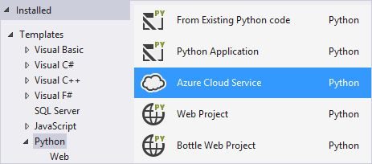
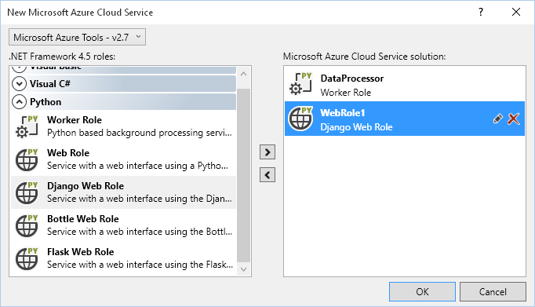
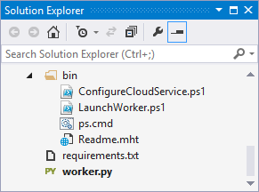

# Azure cloud service projects for Python

Visual Studio provides templates to help you get started creating Azure Cloud Services using Python.

A [cloud service](/azure/cloud-services/) consists of any number of *worker roles* and *web roles*, each of which performs a conceptually separate task but can be separately replicated across virtual machines as needed for scaling. Web roles provide hosting for front-end web applications. Where Python is concerned, any web framework that supports WSGI can be used to write such an application (as supported by the [Web project template](python-web-application-project-templates.md)). Worker roles are intended for long-running processes that do not interact directly with users. They typically make use of the packages within the "azure" package, which is installed with [`pip install azure`](https://pypi.org/project/azure).

This article contains details about the project template and other support in Visual Studio 2017 and later (earlier versions are similar, but with some differences). For more about working with Azure from Python, visit the [Azure Python Developer Center](/azure/python/).

## Create a project

1. Install the [Azure .NET SDK for Visual Studio](https://visualstudio.microsoft.com/vs/azure-tools/), which is required to use the cloud service template.
1. In Visual Studio, select **File** > **New** > **Project**, then search for "Azure Python" and select **Azure Cloud Service** from the list:

    

1. Select one or more roles to include. Cloud projects may combine roles written in different languages, so you can easily write each part of your application in the most suitable language. To add new roles to the project after completing this dialog, right-click **Roles** in **Solution Explorer** and select one of the items under **Add**.

    

1. As the individual role projects are created, you may be prompted to install additional Python packages, such as the Django, Bottle, or Flask frameworks if you selected a role that uses one of those.

1. After adding a new role to your project, configuration instructions appear. Configuration changes are usually unnecessary, but may be useful for future customization of your projects. Note that when adding multiple roles at the same time, only the instructions for the last role remain open. However, you can find the instructions and troubleshooting tips for the other roles in their respective *readme.mht* files, located either in the role's root or in the *bin* folder.

1. A project's *bin* folder also contains one or two PowerShell scripts that are used to configure the remote virtual machine, including installing Python, any [*requirements.txt*](#dependencies) file in your project, and setting up IIS if necessary. You may edit these files as desired to your deployment, though most common options can be managed in other ways (see [Configure role deployment](#configure-role-deployment) below). We do not suggest removing these files, as a legacy configuration script is used instead if the files are not available.

    

    To add these configuration scripts to a new project, right-click the project, select **Add** > **New Item**, and select either **Web Role Support Files** or **Worker Role Support Files**.

## Configure role deployment

The PowerShell scripts in a role project's *bin* folder control the deployment of that role and may be edited to customize the configuration:

- *ConfigureCloudService.ps1* is used for web and worker roles, typically to install and configure dependencies and set the Python version.
- *LaunchWorker.ps1* is used only for worker roles and is used to change startup behavior, add command-line arguments, or add environment variables.

Both files contain instructions for customization. You can also install your own version of Python by adding another task to the main cloud service project's *ServiceDefinition.csdef* file, setting the `PYTHON` variable to its installed *python.exe* (or equivalent) path. When `PYTHON` is set, Python is not installed from NuGet.

Additional configuration can be accomplished as follows:

1. Install packages using `pip` by updating the *requirements.txt* file in the root directory of your project. The *ConfigureCloudService.ps1* script installs this file on deployment.
1. Set environment variables by modifying your *web.config* file (web roles) or the `Runtime` section of your *ServiceDefinition.csdef* file (worker roles).
1. Specify the script and arguments to use for a worker role by modifying the command line in the `Runtime/EntryPoint` section of your *ServiceDefinitions.csdef* file.
1. Set the main handler script for a web role through the *web.config* file.

## Test role deployment

While writing your roles, you can test your cloud project locally using the Cloud Service Emulator. The emulator is included with the Azure SDK Tools and is a limited version of the environment used when your cloud service is published to Azure.

To start the emulator, first ensure your cloud project is the startup project in your solution by right-clicking and selecting **Set as startup project**. Then select **Debug** > **Start Debugging** (**F5**) or **Debug** > **Start without Debugging** (**Ctrl**+**F5**).

Note that due to limitations in the emulator it is not possible to debug your Python code. We thus recommend you debug roles by running them independently, and then use the emulator for integration testing before publishing.

## Deploy a role

To open the **Publish** wizard, select the role project in **Solution Explorer** and select **Build** > **Publish** from the main menu, or right-click the project and select **Publish**.

The publishing process involves two phases. First, Visual Studio creates a single package containing all the roles for your cloud service. This package is what's deployed to Azure, which initializes one or more virtual machines for each role and deploys the source.

As each virtual machine activates, it executes the *ConfigureCloudService.ps1* script and installs any dependencies. This script by default installs a recent version of Python from [NuGet](https://www.nuget.org/packages?q=Tags%3A%22python%22+Authors%3A%22Python+Software+Foundation%22) and any packages specified in a *requirements.txt* file.

Finally, worker roles execute *LaunchWorker.ps1*, which starts running your Python script; web roles initialize IIS and begin handling web requests.

## Dependencies

For Cloud Services, the *ConfigureCloudService.ps1* script uses `pip` to install a set of Python dependencies. Dependencies should be specified in a file named *requirements.txt* (customizable by modifying *ConfigureCloudService.ps1*). The file is executed with `pip install -r requirements.txt` as part of initialization.

Note that cloud service instances do not include C compilers, so all libraries with C extensions must provide pre-compiled binaries.

pip and its dependencies, as well as the packages in *requirements.txt*, are downloaded automatically and may count as chargeable bandwidth usage. See [Manage required packages](managing-required-packages-with-requirements-txt.md) for details on managing *requirements.txt* files.

## Troubleshooting

If your web or worker role does not behave correctly after deployment, check the following:

- Your Python project includes a *bin\\* folder with (at least):

  - *ConfigureCloudService.ps1*
  - *LaunchWorker.ps1* (for worker roles)
  - *ps.cmd*

- Your Python project includes a *requirements.txt* file listing all dependencies (or alternately, a collection of wheel files).
- Enable Remote Desktop on your cloud service and investigate the log files.
- Logs for *ConfigureCloudService.ps1* and *LaunchWorker.ps1* are stored in *C:\Resources\Directory\%RoleId%.DiagnosticStore\LogFiles* folder on the remote computer.
- Web roles may write additional logs to a path configured in *web.config*, namely the path in the `WSGI_LOG` appSetting. Most regular IIS or FastCGI logging also works.
- Currently, the *LaunchWorker.ps1.log* file is the only way to view output or errors displayed by your Python worker role.
