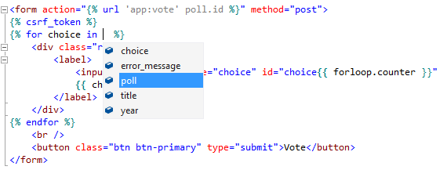
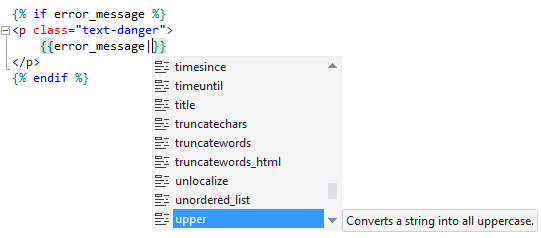
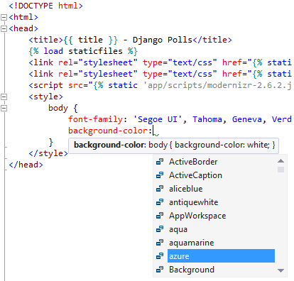
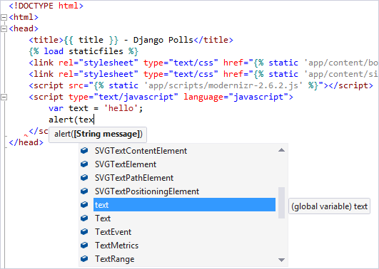
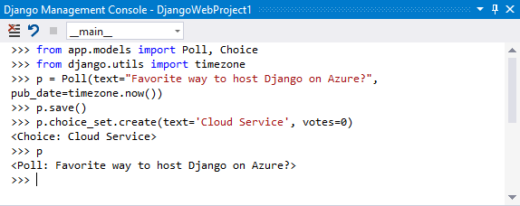
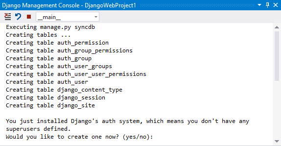
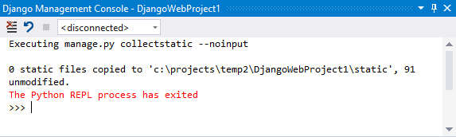

# Django web project template
::: moniker range="vs-2017"
[Django](https://www.djangoproject.com/) is a high-level Python framework designed for rapid, secure, and scalable web development. Python support in Visual Studio provides several project templates to set up the structure of a Django-based web application. To use a template in Visual Studio, select **File** > **New** > **Project**, search for "Django", and select from the **Blank Django Web Project**, **Django Web Project**, and **Polls Django Web Project** templates. See the [Learn Django tutorial](learn-django-in-visual-studio-step-01-project-and-solution.md) for a walkthrough of all the templates.
::: moniker-end
::: moniker range=">=vs-2019"
[Django](https://www.djangoproject.com/) is a high-level Python framework designed for rapid, secure, and scalable web development. Python support in Visual Studio provides several project templates to set up the structure of a Django-based web application. To use a template in Visual Studio, select **File** > **New** > **Project**, search for "Django", and select from the **Blank Django Web Project** and **Django Web Project** templates. See the [Learn Django tutorial](learn-django-in-visual-studio-step-01-project-and-solution.md) for a walkthrough of all the templates.
::: moniker-end
Visual Studio provides full IntelliSense for Django projects:

- Context variables passed into the template:

    

- Tagging and filtering for both built-ins and user-defined:

    

- Syntax coloring for embedded CSS and JavaScript:

    

    

Visual Studio also provides full [debugging support](debugging-python-in-visual-studio.md) for Django projects:

It's typical for Django projects to be managed through their *manage.py* file, which is an assumption that Visual Studio follows. If you stop using that file as the entry point, you essentially break the project file. In that case you need to [recreate the project from existing files](managing-python-projects-in-visual-studio.md#create-a-project-from-existing-files) without marking it as a Django project.

## Django management console

The Django management console is accessed through various commands on the **Project** menu or by right-clicking the project in **Solution Explorer**.

- **Open Django Shell**: opens a shell in your application context that enables you to manipulate your models:

    

- **Django Sync DB**: executes `manage.py syncdb` in an **Interactive** window:

    

- **Collect Static**: executes `manage.py collectstatic --noinput` to copy all the static files to the path specified by `STATIC_ROOT` in your *settings.py*.

    

- **Validate**: executes `manage.py validate`, which reports any validation errors in the installed models specified by `INSTALLED_APPS` in your *settings.py*:

    

## See also

- [Learn Django tutorial](learn-django-in-visual-studio-step-01-project-and-solution.md)
- [Publish to Azure App Service](publishing-python-web-applications-to-azure-from-visual-studio.md)
