# Python Environments window tabs reference

To open the **Python Environments** window:

- Select the **View** > **Other Windows** > **Python Environments** menu command.
- Right-click the **Python Environments** node for a project in **Solution Explorer** and select **View All Python Environments**.

If you expand the **Python Environments** window wide enough, these options are shown as tabs, which you may find more convenient to work with. For clarity, the tabs in this article are shown in the expanded view.

::: moniker range="vs-2017"
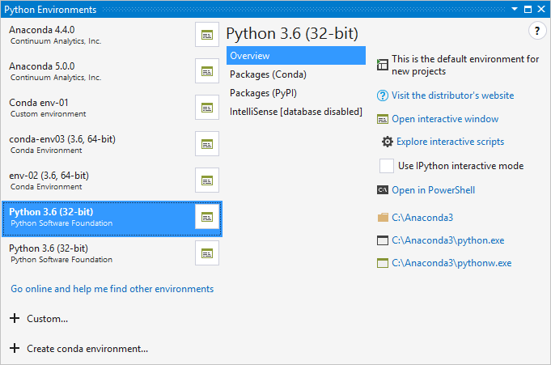
::: moniker-end
::: moniker range=">=vs-2019"
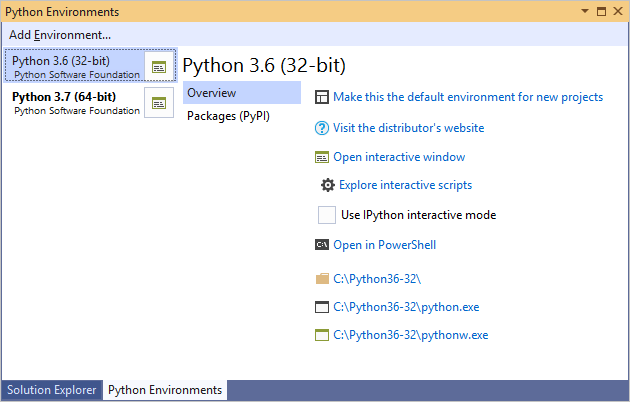
::: moniker-end

## Overview tab

Provides basic information and commands for the environment:

::: moniker range="vs-2017"

::: moniker-end
::: moniker range=">=vs-2019"
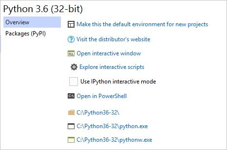
::: moniker-end

| Command | Description |
| --- | --- |
| **Make this environment the default for new projects** | Sets the active environment, which may cause Visual Studio (2017 version 15.5 and earlier) to briefly become non-responsive while it loads the IntelliSense database. Environments with many packages may be non-responsive for longer. |
| **Visit the distributor's website** | Opens a browser to the URL provided by the Python distribution. Python 3.x, for example, goes to python.org. |
| **Open interactive window** | Opens the [interactive (REPL) window](python-interactive-repl-in-visual-studio.md) for this environment within Visual Studio, applying any [startup scripts (see below)](#startup-scripts). |
| **Explore interactive scripts** | See [startup scripts](#startup-scripts). |
| **Use IPython interactive mode** | When set, opens the **Interactive** window with IPython by default. This enables inline plots as well as the extended IPython syntax such as `name?` to view help and `!command` for shell commands. This option is recommended when using an Anaconda distribution, as it requires extra packages. For more information, see [Use IPython in the Interactive window](interactive-repl-ipython.md). |
| **Open in PowerShell** | Starts the interpreter in a PowerShell command window. |
| (Folder and program links) | Provide you quick access to the environment's installation folder, the *python.exe* interpreter, and the *pythonw.exe* interpreter. The first opens in Windows Explorer, the latter two open a console window. |

### Startup scripts

As you use interactive windows in your everyday workflow, you likely develop helper functions that you use regularly. For example, you may create a function that opens a DataFrame in Excel, and then save that code as a startup script so that it's always available in the **Interactive** window.

Startup scripts contain code that the **Interactive** window loads and runs automatically, including imports, function definitions, and literally anything else. Such scripts are referenced in two ways:

1. When you install an environment, Visual Studio creates a folder *Documents\Visual Studio \<version>\Python Scripts\\\<environment>* where &lt;version&gt; is the Visual Studio version (such as 2017 or 2019) and &lt;environment&gt; matches the name of the environment. You can easily navigate to the environment-specific folder with the **Explore interactive scripts** command. When you start the **Interactive** window for that environment, it loads and runs whatever *.py* files are found here in alphabetical order.

1. The **Scripts** control in **Tools** > **Options** > **Python** > **Interactive Windows** tab (see [Interactive windows options](python-support-options-and-settings-in-visual-studio.md#interactive-windows-options)) is intended to specify an additional folder for startup scripts that are loaded and run in all environments. However, this feature doesn't work at present.

## Configure tab

If available, the **Configure** tab contains details as described in the table below. If this tab isn't present, it means that Visual Studio is managing all the details automatically.

::: moniker range="vs-2017"
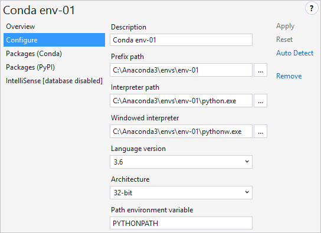
::: moniker-end
::: moniker range=">=vs-2019"
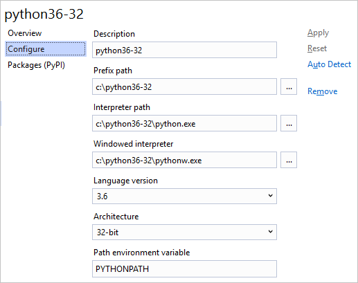
::: moniker-end

| Field | Description |
| --- | --- |
| **Description** | The name to give the environment. |
| **Prefix path** | The base folder location of the interpreter. By filling this value and clicking **Auto Detect**, Visual Studio attempts to fill in the other fields for you. |
| **Interpreter path** | The path to the interpreter executable, commonly the prefix path followed by **python.exe** |
| **Windowed interpreter** | The path to the non-console executable, often the prefix path followed by **pythonw.exe**. |
| **Library path** (if available) | Specifies the root of the standard library, but this value may be ignored if Visual Studio is able to request a more accurate path from the interpreter. |
| **Language version** | Selected from the drop-down menu. |
| **Architecture** | Normally detected and filled in automatically, otherwise specifies **32-bit** or **64-bit**. |
| **Path environment variable** | The environment variable that the interpreter uses to find search paths. Visual Studio changes the value of the variable when starting Python so that it contains the project's search paths. Typically this property should be set to **PYTHONPATH**, but some interpreters use a different value. |

## Packages tab

*Also labeled "pip" in earlier versions.*

Manages the packages installed in the environment using pip (the **Packages (PyPI)** tab) or conda (the **Packages (Conda)** tab, for conda environments in Visual Studio 2017 version 15.7 and later). In this tab you can also search for and install new packages, including their dependencies.

Packages that are already installed appear with controls to update (an up arrow) and uninstall (the X in a circle) the package:

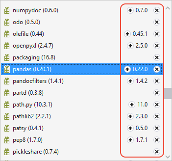

Entering a search term filters the list of installed packages as well as packages that can be installed from PyPI.

::: moniker range="vs-2017"
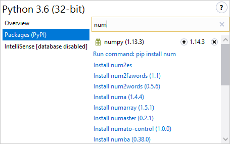
::: moniker-end
::: moniker range=">=vs-2019"
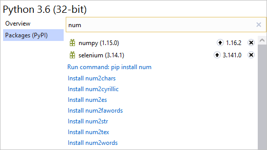
::: moniker-end

As you can see in the image above, the search results show a number of packages that match the search term; the first entry in the list, however, is a command to run **pip install \<name>** directly. If you're on the **Packages (Conda)** tab, you instead see **conda install \<name>**:

::: moniker range="vs-2017"
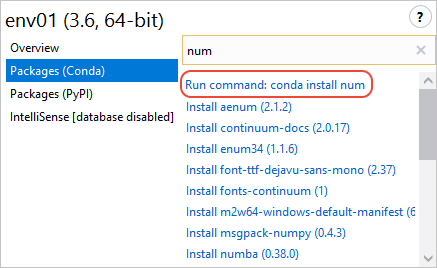
::: moniker-end
::: moniker range=">=vs-2019"
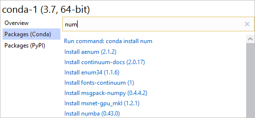
::: moniker-end

In both cases, you can customize the install by adding arguments in the search box after the name of the package. When you include arguments, the search results shows **pip install** or **conda install** followed by the contents of the search box:

::: moniker range="vs-2017"
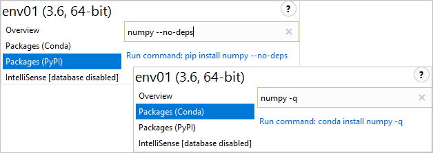
::: moniker-end
::: moniker range=">=vs-2019"
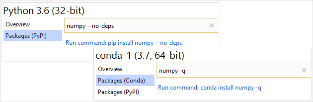
::: moniker-end

Installing a package creates subfolders within the environment's *Lib* folder on the file system. For example, if you have Python 3.6 installed in *c:\Python36*, packages are installed in *c:\Python36\Lib*; if you have Anaconda3 installed in *c:\Program Files\Anaconda3* then packages are installed in *c:\Program Files\Anaconda3\Lib*. For conda environments, packages are installed in that environment's folder.

### Grant administrator privileges for package install

When installing packages into an environment that's located in a protected area of the file system, such as *c:\Program Files\Anaconda3\Lib*, Visual Studio must run `pip install` elevated to allow it to create package subfolders. When elevation is required, Visual Studio displays the prompt, **Administrator privileges may be required to install, update or remove packages for this environment**:

**Elevate now** grants administrative privileges to pip for a single operation, subject also to any operating system prompts for permissions. Selecting **Continue without Administrator privileges** attempts to install the package, but pip fails when trying to create folders with output such as **error: could not create 'C:\Program Files\Anaconda3\Lib\site-packages\png.py': Permission denied.**

Selecting **Always elevate when installing or removing packages** prevents the dialog from appearing for the environment in question. To make the dialog appear again, go to **Tools** > **Options** > **Python** > **General** and select the button, **Reset all permanently hidden dialogs**.

In that same **Options** tab, you can also select **Always run pip as administrator** to suppress the dialog for all environments. See [Options - General tab](python-support-options-and-settings-in-visual-studio.md#general-options).

### Security restrictions with older versions of Python

When using Python 2.6, 3.1 and 3.2, Visual Studio shows the warning, **Due to new security restrictions, installing from the internet may not work on this version of Python**:

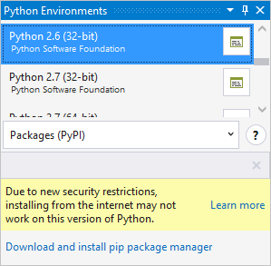

The reason for the warning is that with these older versions of Python, `pip install` doesn't contain support for the Transport Security Layer (TLS) 1.2, which is required for downloading packages from the package source, pypi.org. Custom Python builds may support TLS 1.2 in which case `pip install` might work.

It may be possible to download the appropriate *get-pip.py* for a package from [bootstrap.pypa.io](https://bootstrap.pypa.io/), manually download a package from [pypi.org](https://pypi.org/), and then install the package from that local copy.

The recommendation, however, is to simply upgrade to a recent version of Python, in which case the warning does not appear.

::: moniker range="vs-2017"
## IntelliSense tab

Shows the current status of the IntelliSense completion database:

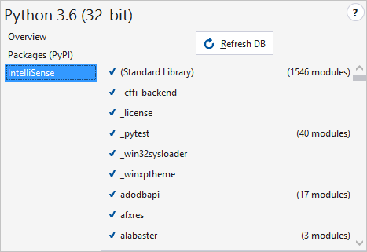

- In Visual Studio 2017 version 15.5 and earlier, IntelliSense completions depend on a database that's been compiled for that library. Building the database is done in the background when a library is installed, but can take some time and may not be complete when you start writing code.
- Visual Studio 2017 version 15.6 and later uses a faster method to provide completions that do not depend on the database by default. For this reason the tab is labeled **IntelliSense [database disabled]**. You can enable the database by clearing the option  **Tools** > **Options** > **Python** > **Experimental** > **Use new style IntelliSense for environments**.

When Visual Studio detects a new environment (or you add one), it automatically begins to compile the database by analyzing the library source files. This process can take anywhere from a minute to an hour or more depending on what's installed. (Anaconda, for example, comes with many libraries and takes some time to compile the database.) Once complete, you get detailed IntelliSense and don't need to refresh the database again (with the **Refresh DB** button) until you install more libraries.

Libraries for which data haven't been compiled are marked with a **!**; if an environment's database isn't complete, a **!** also appears next to it in the main environment list.

::: moniker-end

## See also

- [Manage Python environments in Visual Studio](managing-python-environments-in-visual-studio.md)
- [Select an interpreter for a project](selecting-a-python-environment-for-a-project.md)
- [Use requirements.txt for dependencies](managing-required-packages-with-requirements-txt.md)
- [Search paths](search-paths.md)
