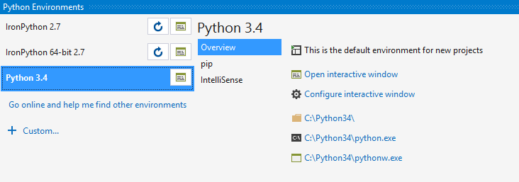
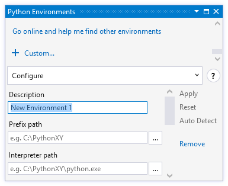
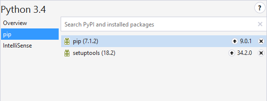
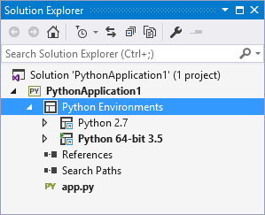
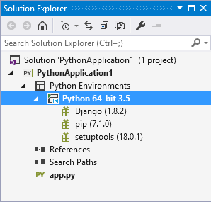
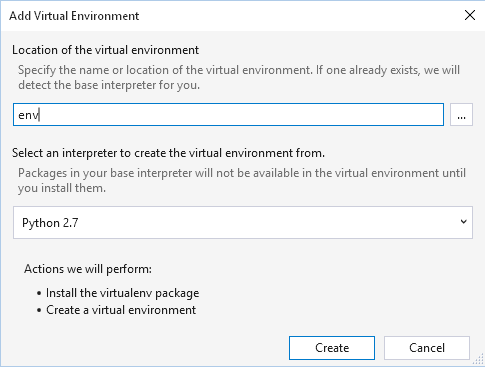
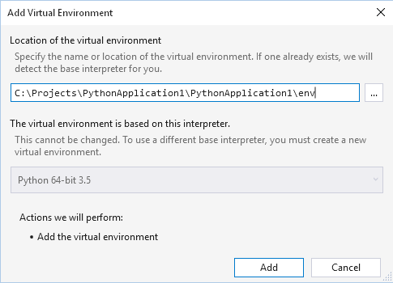
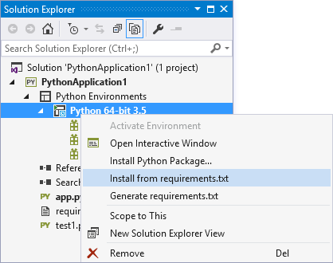
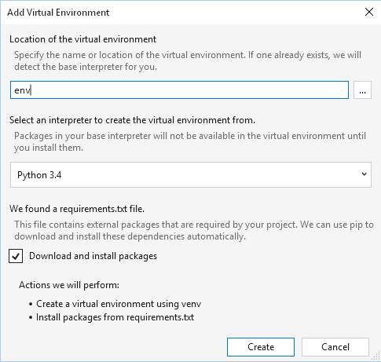

# Python Environments

Python code always runs within a particular Python *environment*, consisting of an interpreter, a library (typically the Python Standard Library), and a set of installed packages. Together these determine which language constructs and syntax are valid, what operating-system functionality you can access, and which packages you can use.

The Python Tools for Visual Studio (PTVS) make it easy to manage multiple Python environments and easily switch between them for different projects.

For a video introduction (13m27s), see the following:

[]](https://youtu.be/KY1GEOo3qy0)

Oftentimes, developers use only a single, global Python environment but others need to manage multiple global environments, project-specific environments, and perhaps also virtual environments as explained in this topic:

- [Selecting and installing Python interpreters](#selecting-and-installing-python-interpreters)
- [Managing Python environments in Visual Studio](#managing-python-environments-in-visual-studio)
- [Global environments](#global-environments)
- [Project-specific environments](#project-specific-environments)
- [Virtual environments](#virtual-environments)
- [Managing required packages](#managing-required-packages)

## Selecting and installing Python interpreters

PTVS does not come with a Python interpreter, so you need to install one of the following to run your code. In general, PTVS will automatically detect newly-installed interpreters and set up an environment for them. If it does not, see [Creating an environment for an existing interpreter](#creating-an-environment-for-an-existing-interpreter) below.

| Interpreter | Description | 
| --- | --- | 
| [CPython](https://www.python.org/) | The "native" and most commonly-used interpreter, available in 32- and 64-bit versions (32-bit recommended with PTVS). Includes the latest language features, maximum Python package compatibility, full debugging support within PTVS, and interop with [IPython](http://ipython.org/). See also: [Should I use Python 2 or Python 3?](http://wiki.python.org/moin/Python2orPython3) |
| [IronPython](http://ironpython.codeplex.com/) | A .NET implementation of Python, available in 32- and 64-bit versions, providing C#/F#/Visual Basic interop, standard Python debugging with PTVS (but not C++ mixed-mode debugging), and mixed IronPython/C# debugging. | 
| [Anaconda](https://www.continuum.io) | An open data science platform powered by Python, and includes the latest version of CPython and most of the difficult-to-install packages. We recommend it if you can't otherwise decide. |
| [PyPy](http://www.pypy.org/) | A high-performance tracing JIT implementation of Python. Works with PTVS but with limited support for advanced debugging features. |
| [Jython](http://www.jython.org/) | An implementation of Python on the JVM.  Works with PTVS but with limited support for advanced debugging features. |
| [Canopy](https://www.enthought.com/products/canopy/) | A comprehensive Python analysis environment with many core scientific packages. |

Developers that want to provide new forms of detection for Python environments with PTVS, see [PTVS Environment Detection](https://github.com/Microsoft/PTVS/wiki/Extensibility-Environments) (github.com).

## Managing Python environments in Visual Studio

To open the PTVS Python Environments window, do one of the following:

1. Select the **View > Other Windows > Python Environments** menu command.
1. Right-click the **Python Environments** for a project in Solution Explorer and select **View All Python Environments**:

    
    
In either case, the Python Environments window appears as a sibling tab to Solution Explorer:


In the example above, we have Python 3.4 (32-bit CPython) installed along with 32- and 64-bit versions of IronPython. The default environment in boldface is Python 3.4, which will be used for any new projects. If you don't see any environments listed, it means that you've installed PTVS but haven't installed a Python interpreter (ee [Selecting and installing Python interpreters](#selecting-and-installing-python-interpreters) above).

> [!Tip]
> When the **Python Environments* window is narrow, as shown above, the environments are listed on the top and the various tabs on the bottom. If you expand the window enough, however, you'll see a wide view that you may find more convenient to work with.
>
> 

PTVS normally locates an installed Python interpreter by checking the registry, it but may not find it if the interpreter is installed in a non-standard fashion. In such cases, you can point PTVS directly to the interpreter as follows:

1. Select **+ Custom...** in the Environments Window, which creates a new environment and opens the [**Configure** tab]()#configure-tab) described below.)

    

1. Enter a name for the environment in the **Description** field.
1. Enter or browse to the path of the interpreter in the **Prefix path** field.
1. Select **Auto Detect** to have PTVS complete the remaining fields, or complete them manually.
1. Select **Apply** to save the environment.
1. If you need to remove the environment, select the **Remove** command on the **Configure** tab.

> [!Note]
> Although the system-site-packages option will be respected, there is no way to set or change this from within Visual Studio.

### Overview tab

Provides basic information and commands for the environment such as setting it as the default, opening an [interactive (REPL) window](interactive-window.md) with that environment, and jumping to the dialog to configure the interactive window (identical to the **Tools > Options** menu command, selecting **Python Tools > Interactive Windows** and the name of the environment).


> [!Note]
> Changing the active environment may cause Visual Studio to briefly become non-responsive while the IntelliSense database is loaded. Environments with many packages may be non-responsive for longer.

### Configure tab

If shown, contains details as described in the table below. If this tab isn't present, it means that PTVS is managing all the details automatically.


| Field | Description |
| --- | --- |
| **Description** | The name to give the environment. |
| **Prefix path** | The base folder location of the interpreter. By filling this in and clicking **Auto Detect**, PTVS will attempt to fill in the other fields for you. |
| **Interpreter path** | The path to the interpreter executable, commonly the prefix path followed by `python.exe` |
| **Windowed interpreter** | Tthe path to the non-console executable, often the prefix path followed by `pythonw.exe`. |
| **Library path** | Specifies the root of the standard library, but this value may be ignored if PTVS is able to request a more accurate path from the interpreter. |
| **Language version** | Selected from the drop down menu. |
| **Architecture** | Normally detected and filled in automatically, otherwise specifies 32-bit or 64-bit. |
| **Path environment variable** | The environment variable that the interpreter uses to find search paths. PTVS will change the value of the variable when starting Python so that it contains the project's search paths. Typically this property should be set to `PYTHONPATH`, but some interpreters use a different value. |

### pip tab

Manages the packages installed in the environment, allowing you also to and search for and install new ones. Searching will filter your currently installed packages as well as searching [PyPI](https://pypi.python.org). You can also enter any `pip install` command in the search box, including flags such as `--user` or `--no-deps`.



### IntelliSense tab

Shows the current status of the IntelliSense completion database:


The database contains metadata for all the environment's libraries and improves IntelliSense speed and reduces memory usage. When PTVS detects a new environment (or you add one), it automatically begins to compile the database by analyzing the library source files. This process can take anywhere from a minute to an hour or more depending on what's installed. (Anaconda, for example, comes with many libraries and takes some time to compile the database.) Once complete, you'll get detailed IntelliSense and won't have to refresh the database again (with the **Refresh DB** button) until you install more libraries.

Libraries for which data haven't been compiled are marked with a **!**; if an environment's database isn't complete, a **!** also appears next to it in the main environment list.

## Global environments

Global (or system-wide) environments are available to all of your projects on a machine. PTVS will usually detect global environments automatically, and they can be viewed in the Python Environments window. If not, you can add an environment manually as described earlier under [Managing Python environments in Visual Studio](#managing-python-environments-in-visual-studio).

PTVS will use the default environment for all new projects for executing, debugging, checking syntax, displaying import and member completions, and any other tasks that require an environment. Changing the default environment will affect all projects that have not had a [project-specific environment](#project-specific-environments) added, as described next.

## Project-specific environments

Project-specific environments ensure that a project always runs in a particular environment, ignoring the default global environment. For example, if the global default environment is CPython but a project requires IronPython and certain libraries that aren't installed in the global environment, then a project-specific environment is necessary.

Project environments are listed in Solution Explorer under the Python Environments node. The bold entry is currently active, and will be used for debugging, import and member completions, syntax checking, and any other tasks that require an environment:



To activate a different environment for the project, right-click that envionment and select **Activate Environment**.

Any global environment can be added as a project environment by right-clicking **Python Environments** and selecting **Add/Remove Python Environments...**. From the displayed list you can select or deselect those that are available in your project.


In Solution Explorer, you can also expand the environment to show its installed packages (those you can import and use in your code when the environment is active):



To install new packages, right-click the environment, select **Install Python Package...**, and enter the name of the desired package. Packages are downloaded from the [Python Package Index (PyPI)](https://pypi.python.org/pypi), where you can also search for available packages. Visual Studio's status bar and output window shows information about the install. To uninstall a package, right-click it select **Remove**.

> [!Note]
> Python's package management support is currently under development by the core Python development team. The displayed entries may not always be accurate, and installation and uninstallation may not be reliable or available. PTVS uses the pip package manager if available, and will download and install it when required.PTVS can also use the easy_install package manager. Packages installed using pip or easy_install from the command line are also displayed in PTVS.

One common situation where pip will fail to install a package is when the package includes source code for native components (`*.pyd` files). Without the required version of Visual Studio installed (typically VS 2008 for Python versions earlier than 3.3), pip will not be able to compile these components. The error message displayed in this situation is `error: Unable to find vcvarsall.bat.` `easy_install` is often able to download pre-compiled binaries, and you can download a suitable compiler for older versions of Python from [http://aka.ms/VCPython27](http://aka.ms/VCPython27).


## Virtual Environments

Because packages installed into a global environment are available to all projects that use it, conflicts may occur when two projects require incompatible packages or different versions of the same package. To avoid such conflicts, PTVS provides the ability to create virtual environments.

Like any other Python environment, a virtual environment consists of a Python interpreter, a library, and a set of packages. The interpreter and library, however, are shared with a base interpreter selected from your global environments, which minimizes the virtual environment's footprint to approximately the size of its packages. You can essentially think about a virtual environment as a private folder of packages in your project.

To create a virtual environment:

1. Right-click **Python Environments** in Solution Explorer and select **Add Virtual Environment...**, which brings up the following:

    

1. Specify a name to create the virtual environment in your project path, or a full path to create it elsewhere. (To ensure maximum compatibility with other tools, use only letters and numbers in the name.)

1. Select a global environment as the base interpreter and click **Create**. If `pip` and `virtualenv` or `venv` packages are not available, they will be downloaded and installed.

    If the provided path is an existing virtual environment, the base interpreter will be detected and the create button will change to **Add**:

    

An existing virtual environment can also be added by right-clicking **Python Environments** in Solution Explorer and selecting **Add Existing Virtual Environment...**. PTVS automatically detects the base interpreter using the `orig-prefix.txt` file in the environment's `lib` directory.

Once a virtual environment is added to your project, it appears in the **Python Environments** window, you can activate it like any other environment, and you can manage its packages. Right-clicking it and selecting **Remove** either removes the reference to the environment, or deletes the environment and all its files on disk (but not the base interpreter, of course).


## Managing required packages

If you're sharing a project with others, using a build system, or plan to [publish it to Microsoft Azure](projects-cloud-service.md), you'll need to specify the external packages it requires. The recommended approach is to use a [requirements.txt file](http://pip.readthedocs.org/en/latest/user_guide.html#requirements-files) (readthedocs.org) that contains a list of commands for pip that will install the required versions of dependent packages.

Any filename may be used, and specifying `-r "<full path to file>"` in the Install Package tool will install it. However, for files named `requirements.txt` in the root directory of the project, there is specific support in PTVS. The **Install from requirements.txt** command appears on environments and uses pip to install the packages listed in the `requirements.txt` file. When you have installed all the packages required, you can use **Generate requirements.txt** to update the file. If it already exists, the dialog below will allow you to select how to update the contents of the file.



Replacing the entire file will remove all items, comments, and options that exist. Refreshing existing entries will detect package requirements and update the version specifiers to match the version you currently have installed. Updating and adding entries refreshes any requirements that are found, and adds all other packages to the end of the file.


Because `requirements.txt` files are intended to freeze the requirements of your project, all installed packages are written with precise versions. This ensures you can easily reproduce your environment on another machine. Packages are included even if they were installed with a version range, as a dependency of another package, or with an installer other than pip.

When adding a new virtual environment, if a` requirements.txt` file exists, the **Add Virtual Environment** dialog will display an option to install the packages automatically. This is the easiest way to recreate an environment on another machine.



If a package cannot be installed by pip and it appears in a `requirements.txt` file, the entire installation to fail. In this case, manually edit the file to exclude this package or to use [pip's options](http://pip.readthedocs.org/en/latest/reference/pip_install.html#requirements-file-format) to refer to an installable version of the package. For example, you may prefer to use [`pip wheel`](http://pip.readthedocs.org/en/latest/reference/pip_wheel.html) to compile a dependency and add the `--find-links <path>` option to your `requirements.txt`:

```Output
    C:\Project>pip wheel azure
    Downloading/unpacking azure
      Running setup.py (path:C:\Project\env\build\azure\setup.py) egg_info for package azure

    Building wheels for collected packages: azure
      Running setup.py bdist_wheel for azure
      Destination directory: c:\project\wheelhouse
    Successfully built azure
    Cleaning up...

    C:\Project>type requirements.txt
    --find-links wheelhouse
    --no-index
    azure==0.8.0

    C:\Project>pip install -r requirements.txt -v
    Downloading/unpacking azure==0.8.0 (from -r requirements.txt (line 3))
      Local files found: C:/Project/wheelhouse/azure-0.8.0-py3-none-any.whl
    Installing collected packages: azure
    Successfully installed azure
    Cleaning up...
      Removing temporary dir C:\Project\env\build...
```
