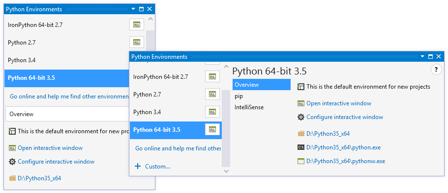
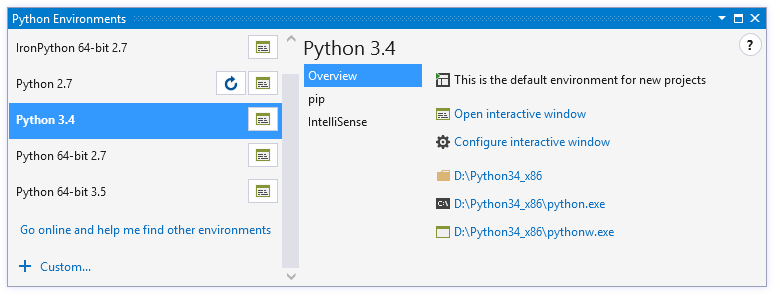
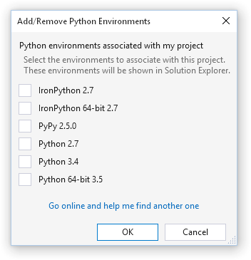
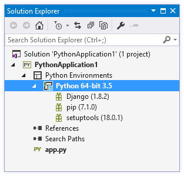
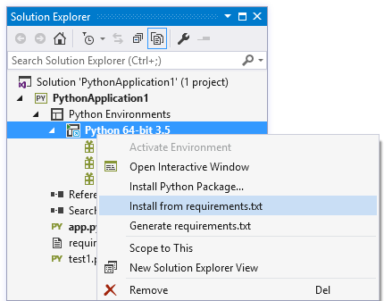
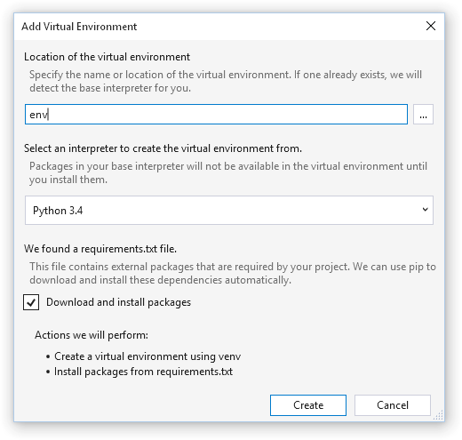

# Python Environments

Python code always runs within a particular Python environment, which consists of an interpreter, a library (typically the Python Standard Library), and a set of installed packages. Together these determine which language constructs and syntax are valid, what operating-system functionality you can access, and which packages you can use.

Generally speaking, the Python environment that gets used when you run code is determined by the location of `python.exe` that you invoke. Because the Python Tools for Visual Studio (PTVS) runs code without your having to type `python.exe`, however, it has its own Python Environments window to manage environments. You open it through the **View > Other Windows > Python Environments** menu command, or by right-clicking **Python Environments** in Solution Explorer and selecting **View All Python Environments**. In either case, the Python Environments window appears:



In the above, you can see that there are several Interpreters installed, including IronPython. Python 3.4 is the current default, and Python 2.7 needs to have its completion database refreshed because of a newly installed package.

If you don't see any environments listed, it means that you've installed PTVS but haven't installed a Python interpreter. See [Selecing and installing Python interpreters](selecting-and-installing-python-interpreters.md).

> [!Note]
> Interpreter databases improve IntelliSense speed and reduce memory usage for libraries. Analyzing the available library source files can take anywhere from a minute to an hour or more, depending on what's installed. Once complete, you'll get detailed IntelliSense and won't have to refresh the database again until you install more libraries.

The Python Environments feature, as explained in this topic, is also demonstrated in the following video:

[](https://youtu.be/KY1GEOo3qy0)

Oftentimes, developers will be using only a single, global Python environment, as described in the next section. Others, however, will want to manage multiple global environments, project-specific environments, and perhaps also virtual environments as explained below.

## Global environments

Global or system-wides environments are available to all of your projects on a machine. PTVS will usually detect global environments automatically, and they can be viewed in the Python Environments window. PTVS will use the default environment for all new projects for executing, debugging, checking syntax, displaying import and member completions, and any other tasks that require an environment. Changing the default environment will affect all projects that have not had a [project environment](#project-specific-environments) added (see below).

For any given environment, the **Overview** tab displays the location of the interpreter and allows quick access to the Interactive Window and to change options associated with the environment:



The **pip** tab allows you to manage your installed packages, including updating or uninstalling, and search for and install new ones. Searching will filter your currently installed packages as well as searching [PyPI](https://pypi.python.org). You can also enter any `pip install` command here, including flags such as `--user` or `--no-deps`.


The **IntelliSense** tab shows the current completion database status; packages for which the IntelliSense database is not complete may not have code suggestions available in the editor.

]

New environments are typically discovered automatically when you install them onto your machine. If this does not happen, however, then follow the instructions in [Pointing PTVS to an existing interpreter](selecting-and-installing-python-interpreters.md#pointing-ptvs-to-an-existing-interpreter).

To add a global environment manually, you can open Environment Options from anywhere in the Python Environments window (or through Tools, Options, Python Tools) and click 'Add Environment'.


## Project-specific environments

Project-specific environments ensure that a project always runs in a supported environment, ignoring the default global environment. For example, if the global default environment is CPython but a project requires IronPython, a project-specific environment is necessary.

Project environments are listed in Solution Explorer under the Python Environments node. The bold entry is currently active, and will be used for debugging, import and member completions, syntax checking, and any other tasks that require an environment. A different environment is actiated by right-clicking and selecting **Activate Environment**, and this choice is saved with the project and applied across sessions:


Any global environment can be added as a project environment by right-clicking **Python Environments** and selecting **Add/Remove Python Environments...**. From the displayed list you can select or deselect those that are available in your project.



In Solution Explorer, you can also expand the environment to show the installed packages for that environment, which you can import and use in your code when the environment is active:



To install new packages, right-click the environment and select **Install Python Package**. (Packages are downloaded from the Python Package Index (PyPI) by specifying the name of the package - visit [https://pypi.python.org/pypi](https://pypi.python.org/pypi) to search available packages.) The status bar and output window in Visual Studio shows information about the install. Once installed, a package can be uninstalled by right-clicking it and selecting **Remove**.

> [!Note]
> Python's package management support is currently under development by the core Python development team. The displayed entries may not always be accurate, and installation and uninstallation may not be reliable or available. PTVS uses the pip package manager if available, and will download and install it when required. The `easy_install` package manager is also available to install packages that pip cannot. Packages installed with these tools from the command-line are also displayed in PTVS.

One common situation where pip will fail to install a package is when the package includes source code for native components (`*.pyd` files). Without the required version of Visual Studio installed (typically VS 2008 for Python versions earlier than 3.3), pip will not be able to compile these components. The error message displayed in this situation is `error: Unable to find vcvarsall.bat.` `easy_install` is often able to download pre-compiled binaries, and you can download a suitable compiler for older versions of Python from [http://aka.ms/VCPython27](http://aka.ms/VCPython27).


## Virtual Environments

Because packages installed into a global environment are available to all projects that use it, conflicts may occur. For example, two projects may require incompatible packages or different versions of the same package. To avoid this issue, you can use an isolated virtual environment for projects that require particular packages.

Like any other Python environment, a virtual environment consists of a Python interpreter, a library, and a set of packages. The interpreter and library, however, are shared with a base interpreter selected from your global environments, which minimizes the virtual environment's footprint to approximately the size of the packages that you install into that environment. In a way, a virtual environment is like having a private folder of packages in your project.

To create a virtual environment, right-click **Python Environments** in Solution Explorer and select **Add Virtual Environment...**, which brings up the following:


Specify a name to create the virtual environment in your project path, or a full path to create it elsewhere. (To ensure maximum compatibility with other tools, use only letters and numbers in the name.) Then select a global environment as the base interpreter and click **Create**. If `pip` and `virtualenv` or `venv` packages are not available, they will be downloaded and installed.

If the provided path is an existing virtual environment, the base interpreter will be detected and the create button will change to **Add**:


Alternatively, an existing virtual environment can be added by right-clicking **Python Environments** in Solution Explorer and selecting **Add Existing Virtual Environment...**. PTVS automatically detects the base interpreter using the orig-prefix.txt file in the environment's lib directory.

Once a virtual environment is added to your project, it appears in the **Python Environments** window, you can activate it like any other environment, and you can manage its packages. Right-clicking it and selecting **Remove** will allow you to either remove the reference to the environment, or delete the environment and all the files on disk.

## Managing Required Packages

If you're sharing a project with others or plan to [publish it to Microsoft Azure](cloud-project.md), you'll need to specify the external packages it requires. The recommended approach is to use a [requirements.txt](http://pip.readthedocs.org/en/latest/user_guide.html#requirements-files) file that contains a list of commands for pip that will install the required versions of dependent packages.

Any filename may be used, and specifying `-r "<full path to file>"` in the Install Package tool will install it. However, for files named `requirements.txt` in the root directory of the project, there is specific support in the IDE. The **Install from requirements.txt** command appears on environments and uses pip to install the packages listed in the `requirements.txt` file. When you have installed all the packages required, you can use **Generate requirements.txt** to update the file. If it already exists, the dialog below will allow you to select how to update the contents of the file.



Replacing the entire file will remove all items, comments, and options that exist. Refreshing existing entries will detect package requirements and update the version specifiers to match the version you currently have installed. Updating and adding entries refreshes any requirements that are found, and adds all other packages to the end of the file.


Because `requirements.txt` files are intended to freeze the requirements of your project, all installed packages are written with precise versions. This ensures you can easily reproduce your environment on another machine. Packages are included even if they were installed with a version range, as a dependency of another package, or with an installer other than pip.

When adding a new virtual environment, if a` requirements.txt` file exists, the **Add Virtual Environment** dialog will display an option to install the packages automatically. This is the easiest way to recreate an environment on another machine.



If a package cannot be installed by pip and it appears in a `requirements.txt` file, this will cause the entire installation to fail. In this case, you can manually edit the file to exclude this package or to use [pip's options](http://pip.readthedocs.org/en/latest/reference/pip_install.html#requirements-file-format) to refer to an installable version of the package. For example, you may prefer to use [`pip wheel`](http://pip.readthedocs.org/en/latest/reference/pip_wheel.html) to compile a dependency and add the `--find-links <path>` option to your requirements.txt:

```Output
  C:\Project>pip wheel azure
  Downloading/unpacking azure
    Running setup.py (path:C:\Project\env\build\azure\setup.py) egg_info for package azure

  Building wheels for collected packages: azure
    Running setup.py bdist_wheel for azure
    Destination directory: c:\project\wheelhouse
  Successfully built azure
  Cleaning up...

  C:\Project>type requirements.txt
  --find-links wheelhouse
  --no-index
  azure==0.8.0

  C:\Project>pip install -r requirements.txt -v
  Downloading/unpacking azure==0.8.0 (from -r requirements.txt (line 3))
    Local files found: C:/Project/wheelhouse/azure-0.8.0-py3-none-any.whl
  Installing collected packages: azure
  Successfully installed azure
  Cleaning up...
    Removing temporary dir C:\Project\env\build...
```

## Known Issues

- Changing the active environment may cause Visual Studio to briefly become non-responsive while the IntelliSense database is loaded. Environments with lots of packages may be non-responsive for longer.
- Although the system-site-packages option will be respected, there is no way to set or change this from within Visual Studio.
