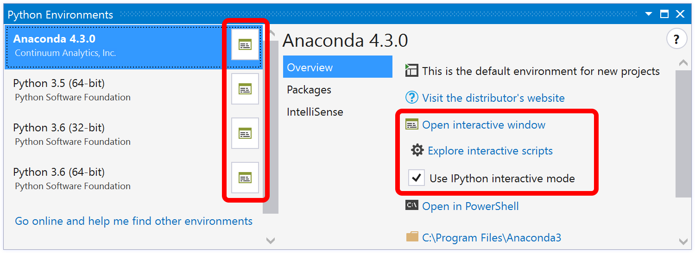
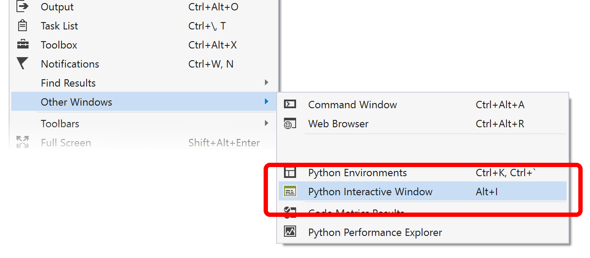
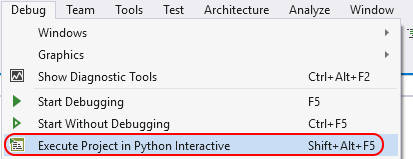
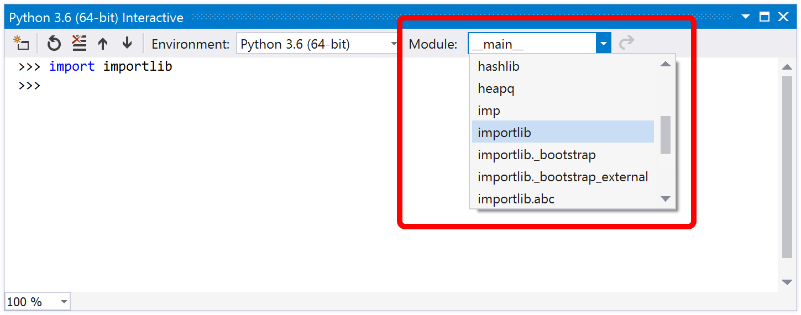
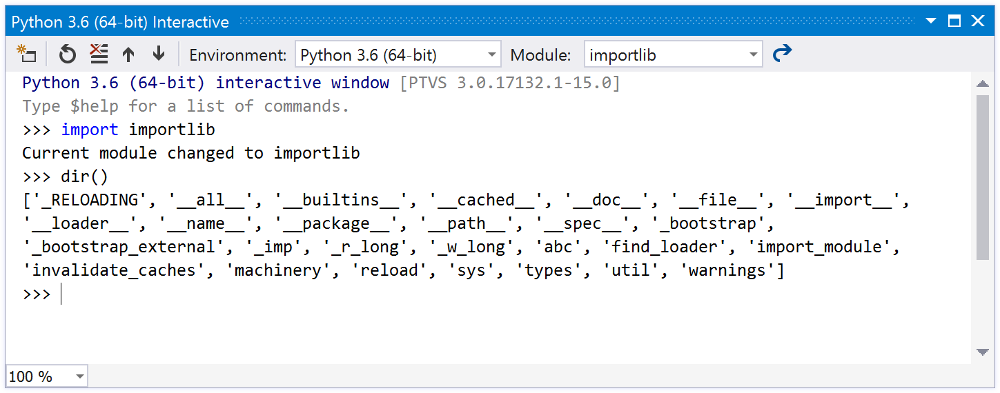
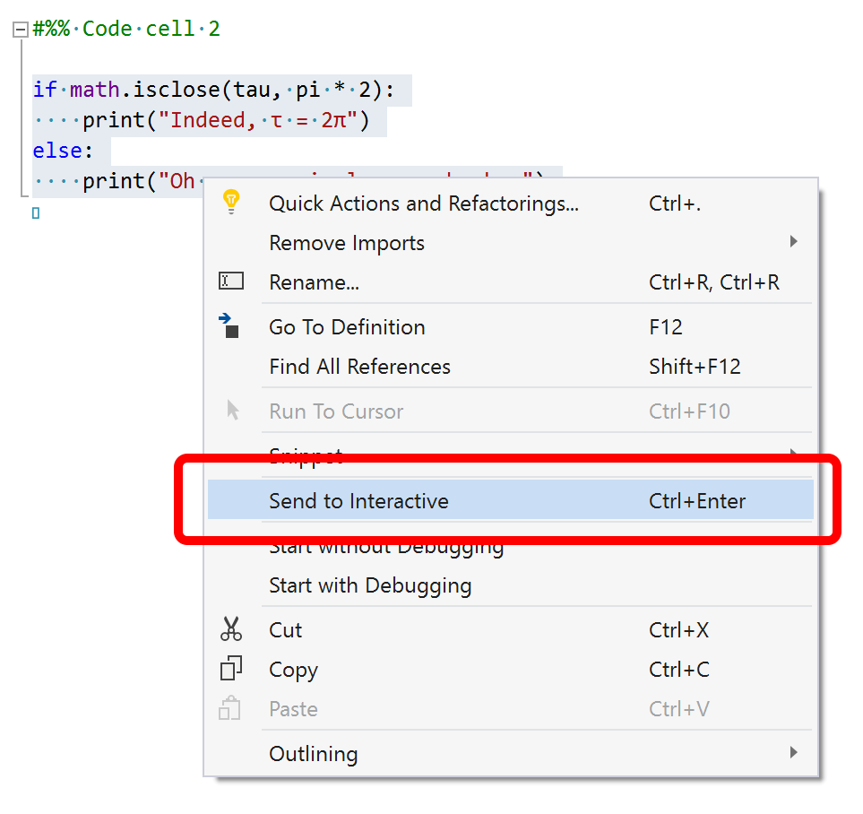
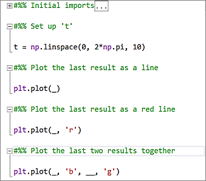

# Work with the Python Interactive window

Visual Studio provides an interactive read-evaluate-print loop (REPL) window for each of your Python environments, which improves upon the REPL you get with *python.exe* on the command line. The **Interactive** window (opened with the **View** > **Other Windows** > **&lt;environment&gt; Interactive** menu commands) lets you enter arbitrary Python code and see immediate results. This way of coding helps you learn and experiment with APIs and libraries, and to interactively develop working code to include in your projects.

Visual Studio has a number of Python REPL modes to choose from:

| REPL | Description | Editing | Debugging | Images |
| --- | --- | --- | --- | --- |
| Standard | Default REPL, talks to Python directly | Standard editing (multiline, etc.). | Yes, via `$attach` | No |
| Debug | Default REPL, talks to debugged Python process | Standard editing | Only debugging | No |
| IPython | REPL talks to IPython backend | IPython commands, Pylab conveniences | No | Yes, inline in REPL |
| IPython w/o Pylab | REPL talks to IPython backend | Standard IPython | No | Yes, separate window |

This article describes the **Standard** and **Debug** REPL modes. For details on IPython modes, see [Use the IPython REPL](interactive-repl-ipython.md).

For a detailed walkthrough with examples, including the interactions with the editor such as **Ctrl**+**Enter**, see [Tutorial Step 3: Use the Interactive REPL window](tutorial-working-with-python-in-visual-studio-step-03-interactive-repl.md).

## Open an Interactive window

There are several ways to open the **Interactive** window for an environment.

First, switch to the Python Environments window (**View** > **Other Windows** > **Python Environments** or **Ctrl**+**K** > **Ctrl**+**`**) and select the **Open Interactive Window** command or button for a chosen environment.

Second, near the bottom of the **View** > **Other Windows** menu, there's a **Python Interactive Window** command for your default environment, as well as a command to switch to the **Environments** window:

Third, you can open an **Interactive** window on the startup file in your project, or for a stand-alone file, by selecting the **Debug** > **Execute \<Project | File> in Python Interactive** menu command (**Shift**+**Alt**+**F5**):

Finally, you can select code in file and use the [**Send to Interactive** command](#send-to-interactive-command) described below.

## Interactive window options

You can control various aspects of the **Interactive** window through **Tools** > **Options** > **Python** > **Interactive Windows** (see [Options](python-support-options-and-settings-in-visual-studio.md)):

## Use the Interactive window

Once the **Interactive** window is open, you can start entering code line-by-line at the **\>\>\>** prompt. The **Interactive** window executes each line as you enter it, which includes importing modules, defining variables, and so on:

The exception is when additional lines of code are needed to make a complete statement, such as when a `for` statement ends in a colon as shown above. In these cases, the line prompt changes to **...** indicating that you need to enter additional lines for the block, as shown on the fourth and fifth lines in the graphic above. When you press **Enter** on a blank line, the **Interactive** window closes the block and runs it in the interpreter.

> [!Tip]
> The **Interactive** window improves upon the usual Python command-line REPL experience by automatically indenting statements that belong to a surrounding scope. Its history (recalled with the up arrow) also provides multiline items, whereas the command-line REPL provides only single lines.

The **Interactive** window also supports several meta-commands. All meta-commands start with `$`, and you can type `$help` to get a list of the meta-commands and `$help <command>` to get usage details for a specific command.

| Meta-command | Description |
| --- | --- |
| `$$` | Inserts a comment, which is helpful to comment code throughout your session. |
| `$attach` | Attaches the Visual Studio debugger to the REPL window process to enable debugging. |
| `$cls`, `$clear` | Clears the contents of the editor window, leaving history and execution context intact. |
| `$help` | Display a list of commands, or help on a specific command. |
| `$load` | Loads commands from file and executes until complete. |
| `$mod` | Switches the current scope to the specified module name. |
| `$reset` | Resets the execution environment to the initial state, but keeps history. |
| `$wait` | Waits for at least the specified number of milliseconds. |

Commands are also extensible by Visual Studio extensions by implementing and exporting `IInteractiveWindowCommand` ([example](https://github.com/Microsoft/PTVS/blob/master/Python/Product/PythonTools/PythonTools/Repl/InteractiveWindowCommands.cs#L85)).

## Switch scopes

By default, the **Interactive** window for a project is scoped to the project's startup file as if you ran it from the command prompt. For a stand-alone file, it scopes to that file. At any time during your REPL session, however, the drop-down menu along the top of the **Interactive** window lets you change scope:

Once you import a module, such as typing `import importlib`, options appear in the drop-down to switch into any scope in that module. A message in the **Interactive** window also indicates the new scope, so you can track how you got to a certain state during your session.

Entering `dir()` in a scope displays valid identifiers in that scope, including function names, classes, and variables. For example, using `import importlib` followed by `dir()` shows the following:

## Send to Interactive command

In addition to working within the **Interactive** window directly, you can select code in the editor, right-click, and choose **Send to Interactive** or press **Ctrl**+**Enter**.

This command is useful for iterative or evolutionary code development, including testing your code as you develop it. For example, once you've sent a piece of code to the **Interactive** window and seen its output, you can press the up arrow to show the code again, modify it, and test it quickly by pressing **Ctrl**+**Enter**. (Pressing **Enter** at the end of input executes it, but pressing **Enter** in the middle of input inserts a newline.) Once you have the code you want, you can easily copy it back into your project file.

> [!Tip]
> By default, Visual Studio removes **>>>** and **...** REPL prompts when pasting code from the **Interactive** window into the editor. You can change this behavior on  the **Tools** > **Options** > **Text Editor** > **Python** > **Advanced** tab using the **Paste removes REPL prompts** option. See [Options - Miscellaneous options](python-support-options-and-settings-in-visual-studio.md#miscellaneous-options).

<!-- After 15.3 is released, you can also press **Undo** after pasting to restore prompts. Press **Undo** a second time to remove the pasted code entirely. -->

## Work with code cells

Code cells can be used in data analysis and are supported by a variety of text editors.

For example, when using a code file as a scratchpad, you often have a small block of code you want to send all at once. To group code together, mark the code as a *code cell* by adding a comment starting with `#%%` to the beginning of the cell, which ends the previous one. Code cells can be collapsed and expanded, and using **Ctrl**+**Enter** inside a code cell sends the entire cell to the **Interactive** window and moves to the next one.

Visual Studio also detects code cells starting with comments like `# In[1]:`, which is the format you get when exporting a Jupyter notebook as a Python file. This detection makes it easy to run a notebook from [Azure Notebooks](https://notebooks.azure.com/) by downloading as a Python file, opening in Visual Studio, and using **Ctrl**+**Enter** to run each cell.

## IntelliSense behavior

The **Interactive** window includes IntelliSense based on the live objects, unlike the code editor in which IntelliSense is based on source code analysis only. These suggestions are more correct in the **Interactive** window, especially with dynamically generated code. The drawback is that functions with side-effects (such as logging messages) may impact your development experience.

If this behavior is a problem, change the settings under **Tools** > **Options** > **Python** > **Interactive Windows** in the **Completion Mode** group, as described on [Options - Interactive windows options](python-support-options-and-settings-in-visual-studio.md#interactive-windows-options).
