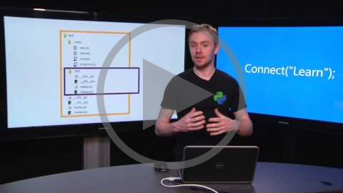
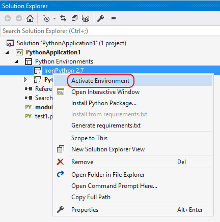

# Python Projects in Visual Studio

Python applications are typically defined using only folders and files, but this can become complex as applications become larger and perhaps involve auto-generated files, JavaScript for web applications, and so on. To help manage this complexity, the Python Tools for Visual Studio (PTVS) allow you to create projects (.pyproj files) using the Visual Studio project system. A project identifies all the source and content files associated with your project, contains build information for each file, contains the necessary information to integrate with source-control systems, and helps you organize your application into logical components.

In addition, projects are always managed within a Visual Studio *solution*, which can contain any number of projects that might reference one another. For example, a Python project can reference a C++ project for an extension module, such that Visual Studio will automatically build the C++ project (if necessary) when you start debugging the Python project. (For a general discussion, see [Solutions and Projects in Visual Studio](../ide/solutions-and-projects-in-visual-studio.md).)


PTVS provides a variety of project templates to quickly set up a number of application structures, including a template to create a project from an existing folder tree and a template to create a clean, empty project. See [Project templates](#project-templates) below for an index.

The following videos provide an introduction to Python projects in Visual Studio (3m18s) and a deep dive on using Git and Team Foundation Version Control with Python.

The following video (3m18s) provides an introduction to Python projects in Visual Studio:

[](https://youtu.be/KHPoVpL7zHg?list=PLReL099Y5nRdLgGAdrb_YeTdEnd23s6Ff)

Also see the deep-dive video (8m55s) on using source control with Python projects:

[](https://youtu.be/Aq8eqApnugM)

In this topic:

- [Adding files, assigning a startup file, and setting environments](#adding-file-assigning-a-startup-file-and-setting-environments)
- [Project templates](#project-templates)
- [Linked files](#linked-files)
- [Search paths](#search-paths)
- [References](#references)

> [!Tip]
> Python Tools for Visual Studio works well without having a Visual Studio project, as you can open a Python file by itself and enjoy auto-complete, IntellSense, and debugging (by right-clicking in the editor and selecting **Start [with | without] Debugging**. Because such code will always use the default global environment, you may see incorrect completions or errors if the code is mean for a different environment. Furthermore, PTVS will analyze all files and packages in the folder from which the single file is opened, which could consume considerable CPU time.
> It's a simple matter to create a Visual Studio project from existing code, as described below in [Creating a project from existing files](#creating-a-project-from-existing-files).


## Adding files, assigning a startup file, and setting environments

As you develop your application, you'll typically need to add new files of different types to the project. This is easily done by right-clicking the project and selecting **Add > Existing Item...**, with which you browse for a file to add, or **Add > Existing Item...**, which brings up a dialog with a variety of item templates including empty python files, a python class, a unit test, and various files related to web applications. We encourage you to explore these options with a test project to learn what's available in your version of PTVS.

Each Python project has one assigned start-up file, shown in boldface in Solution Explorer. This is the file that's run when you start debugging (F5 or **Debug > Start Debugging**) or execute your project in the interactive window (Shift+Alt+F5 or **Debug > Execute Project in Python Interactive**). To change it, right-click the new file and select **Set as Startup File**.

A new project is always associated with the default global Python environment. To associate the project with a different environment (including virtual environments), right-click with **Python Environments** node in the project, select **Add/Remove Python Environments**, and select the ones you want. To change the active environment, right click the desired environment and select **Activate Environment**:



For more details, see [Python Environments](python-environments.md#project-specific-environments).

## Project templates

PTVS gives you a number of ways to set up a Python project, either from scratch or from existing code. To use a template, select the **File > New > Project...** menu command or right-click the solution in Solution Explorer and select **Add > New Project...", both of which bring up the **New Project** dialog below. To see Python-specific templates, either search on "Python" or select the **Templates > Other Languages > Python** node:


The following table summarizes the templates available in the current release of PTVS (not all templates are available in all versions):

| Template | Description | 
| --- | --- |
| [From Existing Python Code](#creating-a-project-from-existing-files) | Creates a Visual Studio project from existing Python code in a folder structure.  |
| Python Application | A basic project structure for a new Python application with a single, empty source file. By default, the project runs in the console interpreter of the default global environment, which you can change by [assigning a different environment](python-environments.md#project-specific-environments). |
| Azure Cloud Service | A project for an Azure Cloud Service written in Python. See [Azure Cloud Service Projects for Python](template-azure-cloud-service.md). |
| Web Project<br/>Bottle Web Project<br/>Django Web Project<br/>Flask Web Project<br/>Flask/Jade Web Project | Projects for web servers based on various frameworks. See [Web Project Template](template-web.md) and [Django Web Project Template](template-django.md) for details, along with the following tutorials: <ul><lu>[Bottle and Azure Table Storage on Azure](Bottle-and-Azure-Table-Storage-on-Azure)</li><li>[Bottle and MongoDB on Azure](Bottle-and-MongoDB-on-Azure)</li><li>[Flask and Azure Table Storage on Azure](Flask-and-Azure-Table-Storage-on-Azure)</li><li>[Flask and MongoDB on Azure](Flask-and-MongoDB-on-Azure)</li><li>[Django and SQL Database on Azure](Django-and-SQL-Database-on-Azure)</li><li>[Django and MySQL on Azure](Django-and-MySQL-on-Azure)</li> |
| IronPython Application | Similar to the Python Application template, but uses IronPython by default enabling .NET interop and mixed-mode debugging with .NET languages. |
| IronPython WPF Application | A project structure using IronPython with Windows Presentation Foundation XAML files for the application's user interface. Visual Studio provides a XAML UI designer, code-behind can be written in Python, and the application runs without displaying a console. |
| IronPython Silverlight Web Page | An IronPython project that runs in a browser using Silverlight. The application's Python code is included in the web page as script. A boilerplate script tag pulls down some JavaScript code which initializes IronPython running inside of Silverlight, from which your Python code can interact with the DOM. |
| IronPython Windows Forms Application | A project structure using IronPython withUI created using code with Windows Forms. The application runs without displaying a console. |
| Background Application (IoT) | Supports deploying Python projects to run as background services on devices.
Visit the [Windows IoT Dev Center](https://dev.windows.com/en-us/iot) for more information. |


### Creating a project from existing files

PTVS can create a Visual Studio project from existing Python code without having to move the code around:

1. Select the **File > New > Project...** menu, then select the **From Existing Python Code** template.
1. In the following dialog, set the path to your existing code, a filter for file types, and any search paths that your project requires, then select **Next**:

    

1. Choose an environment for the project and the startup file, then press **Next**. (Note that the dialog shows only files in the root of the folder tree; if the file you want is in a subfolder, leave the startup file blank and set it later in Solution Explorer).

    

1. Select the location to save the project file (this does not move or copy the original source files, so if you want a copy you should make one before using the template). In this dialog you can also include auto-detection of virtual environments and customize the project for different web frameworks.


1.  Select **Finish** and PTVS will create the project and open it in Solution Explorer. If you want to move the .pyproj file elsewhere, select it in Solution Explorer and choose **File > Save As**. This updates file references in the project but will not move any code file.

## Linked files

Linked files are those that are brought into a project but typically reside outside of the application's project folders. They appear in Solution Explorer as normal files with a overlayed shortcut icon.


Linked files are specified in the .pyproj file using the normal `<Compile Include="...">` element.

They can be implicit linked files if they use a relative path outside of the directory structure or they can be explicit link files by specifying their path within Solution Explorer:

```xml
<Compile Include="..\test2.py">
    <Link>X\test2.py</Link>
</Compile>
```

Linked files specified in a project file will be ignored under the following conditions:

* The linked file contains Link metadata and the path specified in the Include attribute lives within the project directory, or
* The linked file duplicates a file which exists within the project hierarchy, or
* The linked file contains Link metadata and the Link path is a relative path outside of the project hierarchy, or
* The link path is rooted

### Working with Linked Files

To add an existing item as a link, use the Project -> Add Existing Item command (or the context menu), select a file, and choose "Add as Link" from the drop down on the Add button.
As long as there are no conflicting files, this will create a link in the folder selected in Solution Explorer.
If there is already a file with the same name, or if a link to the file is already in the project, the link will not be added.

Because you can't add a link to a file that is already within the project hierarchy, such a file will be added to the project in the correct location as a normal file instead of a link.

To convert a file into a link, use File->Save As to save the file to a location outside of the project hierarchy.
It will be automatically converted to a link.
Similarly, a link can be converted back by using File->Save As to save the file somewhere within the project hierarchy.
The file will appear in Solution Explorer in the same location it exists on disk; files in a project must match their actual location.

If you move a linked file in Solution Explorer, the link will be moved but the actual file is unaffected.
Similarly, deleting a link will remove the link without affecting the file.
Linked files cannot be renamed.


## References


Visual Studio projects support adding references to projects and extensions.
Typically they indicate dependencies between projects and are used to provide IntelliSense at design time or linking at compile time.
Python Tools for Visual Studio also uses references in a similar fashion, but due to the dynamic nature of Python they are primarly used at design time to provide improved IntelliSense.They can also be used for deployment to Microsoft Azure to install additional dependencies.

### Extension Modules

A reference to a .pyd file enables IntelliSense against the generated module.
These references point directly at the .pyd file which you'd like to have completions for.
The .pyd file will be loaded into the Python interpreter and the types and functions will be introspected.
PTVS will attempt to parse the doc strings for functions to provide signature help.
If the extension module is updated on disk PTVS will re-analyze the module in the background.

This has no effect on runtime behavior - the only impact is on what completions are available.
You may also need to add a Search Path to the folder containing the module.

### .NET Projects

When working with IronPython you can add references to .NET assemblies.
This could be a .NET project which is part of your solution, but it can also be a .DLL that you've downloaded and want to use with IronPython.

To enable IntelliSense against a project you can right click on the References node in your Python project, select Add Reference, and then choose either the Projects or Browse tab.
The Projects tab will enable you to add a reference to a C# or VB.NET project in your solution.
The Browse tab will allow you to select any DLL on disk and add a reference to it.

Because in IronPython references are not available until a call to `clr.AddReference('AssemblyName')` you will also need to add a clr.AddReference call to the assembly.
The reference inside of Visual Studio will ensure that PTVS can find the assembly and provide completions for it.

### WebPI Projects


You can also add references to WebPI product entries.
This is currently used only for deployment to Microsoft Azure Cloud Service where you can install additional components via the WebPI feed.
By default, the feed displayed is Python specific and includes Django, CPython, and other core components.
You can also select your own feed.

When publishing to Microsoft Azure a setup task will run which will install all of the referenced products.
