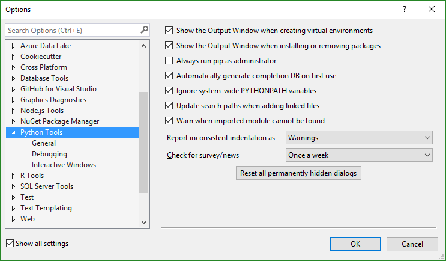
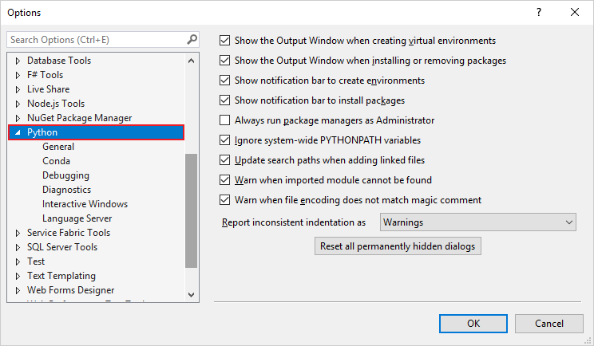
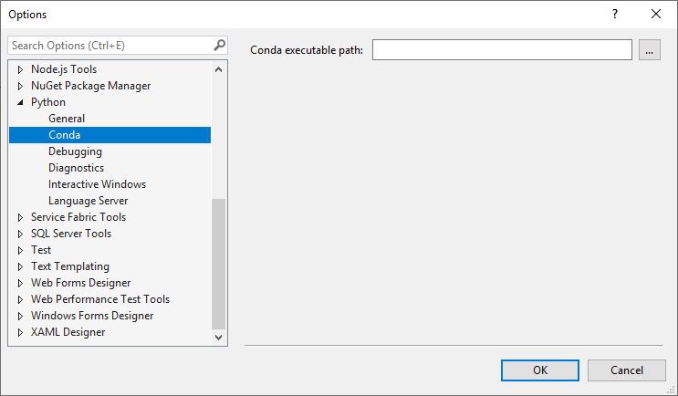
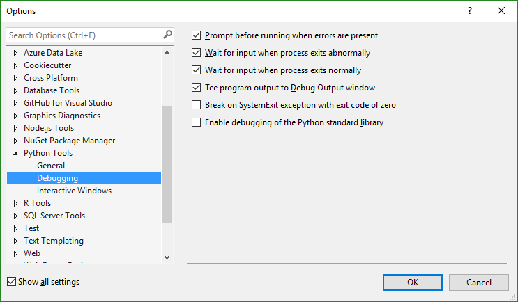
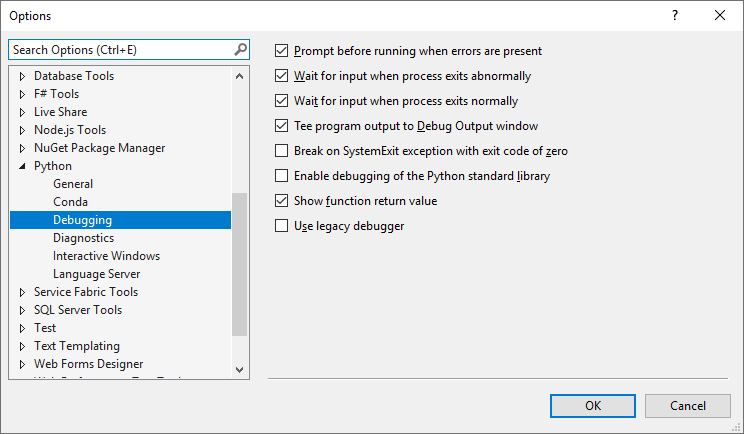
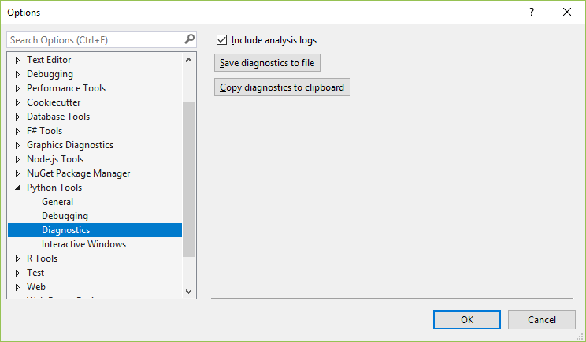
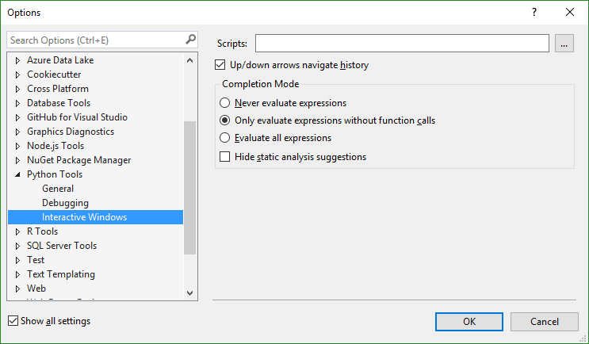
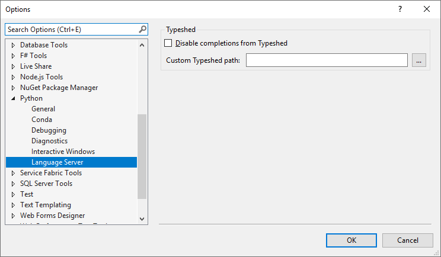
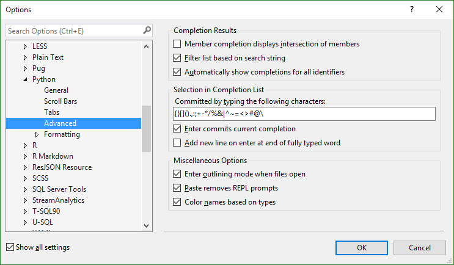
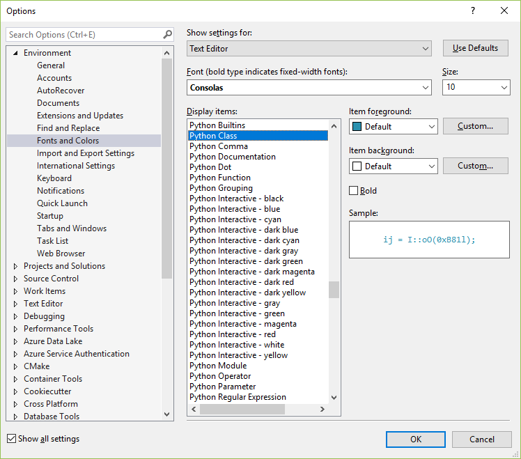

# Options for Python in Visual Studio

To view Python options, use the **Tools** > **Options** menu command, make sure **Show all settings** is selected, and then navigate to **Python**:

::: moniker range="vs-2017"

::: moniker-end
::: moniker range=">=vs-2019"

::: moniker-end

There are also additional Python-specific options on the **Text Editor** > **Python** > **Advanced** tab, and on the **Environment** > **Fonts and Colors** tab within the **Text Editor** group.

> [!Note]
> The **Experimental** group contains options for features that are still under development and are not documented here. They are often discussed in posts on the [Python engineering at Microsoft blog](https://devblogs.microsoft.com/python/).

## General options

(**Tools** > **Options** > **Python** tab.)

| Option | Default | Description |
| --- | --- | --- |
| **Show the Output Window when creating virtual environments**| On | Clear to prevent the **Output** window from appearing. |
| **Show the Output Window when installing or removing packages** | On | Clear to prevent the **Output** window from appearing. |
| **Show notifications bar to create environments** | On | *Visual Studio 2019 only.* When this option is set and the user opens a project that contains a *requirements.txt* or *environment.yml* file, Visual Studio displays an information bar with suggestions to create a virtual environment or conda environment, respectively, instead of using the default global environment. |
| **Show notifications bar to install packages** | On | *Visual Studio 2019 only.* When this option is set and the user opens a project that contains a *requirements.txt* file (and is not using the default global environment) Visual Studio compares those requirements with packages installed in the current environment. If any packages are missing, Visual Studio displays a prompt to install those dependencies. |
| **Always run package managers as administrator** | Off | Always elevates `pip install` and similar package manager operations for all environments. When installing packages, Visual Studio prompts for administrator privileges if the environment is located in a protected area of the file system such as *c:\Program Files*. In that prompt you can choose to always elevate the install command for just that one environment. See [Packages tab](python-environments-window-tab-reference.md#packages-tab). |
| **Automatically generate completion DB on first use** | On | *Applies to Visual Studio 2017 version 15.5 and earlier and to later versions when using an IntelliSense database.* Prioritizes completion of the database for a library when you write code that uses it. For more information, see [Intellisense tab](python-environments-window-tab-reference.md?view=vs-2017#intellisense-tab). |
| **Ignore system-wide PYTHONPATH variables** | On | PYTHONPATH is ignored by default because Visual Studio provides a more direct means to specify search paths in environments and projects. See [Search paths](search-paths.md) for details. |
| **Update search paths when adding linked files** | On | When set, adding a [linked file](managing-python-projects-in-visual-studio.md#linked-files) to a project updates [Search paths](search-paths.md) so that IntelliSense can include the contents of the linked file's folder in its completion database. Clear this option to exclude such content from the completion database. |
| **Warn when imported module cannot be found** | On | Clear this option to suppress warnings when you know an imported module isn't presently available but doesn't otherwise affect code operation. |
| **Report inconsistent indentation as** | **Warnings** | Because the Python interpreter depends heavily on proper indentation to determine scope, Visual Studio by default issues warnings when it detects inconsistent indentations that might indicate coding errors. Set to **Errors** to be even more strict, which causes the program to exit in such cases. To disable this behavior altogether, select **Don't**. |
| **Check for survey/news** | **Once a week** | *Visual Studio 2017 and earlier.* Sets the frequency at which you allow Visual Studio to open a window containing a web page with Python-related surveys and news items, if available. Options are **Never**, **Once a day**, **Once a week**, and **Once a month**. |
| **Reset all permanently hidden dialogs** button | n/a | Different dialog boxes provide options such as **Don't show me this again**. Use this button to clear those options and cause the dialogs to reappear. |

::: moniker range="vs-2017"

::: moniker-end
::: moniker range=">=vs-2019"

::: moniker-end

::: moniker range=">=vs-2019"
## Conda options

(**Tools** > **Options** > **Python** > **Conda** tab.)

| Option | Default | Description |
| --- | --- | --- |
| **Conda executable path** | (blank) | Specifies an exact path to the *conda.exe* executable rather than relying on the default Miniconda installation that's included with the Python workload. If another path is given here, it takes precedence over the default installation and any other conda.exe executables specified in the registry. You might change this setting if you manually install a newer version of Anaconda or Miniconda, or want to use a 32-bit distro rather than the default 64-bit distro. |

::: moniker-end

## Debugging options

(**Tools** > **Options** > **Python** > **Debugging** tab.)

| Option | Default | Description |
| --- | --- | --- |
| **Prompt before running when errors are present** | On | When set, prompts you to confirm that you want to run code that contains errors. Clear this option to disable the warning. |
| **Wait for input when process exits abnormally**  **Wait for input when process exits normally** | On (for both) | A Python program started from Visual Studio runs in its own console window. By default, the window waits for you to press a key before closing it regardless of how the program exits. To remove that prompt and close the window automatically, clear either or both of these options. |
| **Tee program output to Debug Output window** | On | Displays program output in both a separate console window and the Visual Studio **Output** window. Clear this option to show output only in the separate console window. |
| **Break on SystemExit exception with exit code of zero** | Off | If set, stops the debugger on this exception. When clear, the debugger exits without breaking. |
| **Enable debugging of the Python standard library** | Off | Makes it possible to step into the standard library source code while debugging, but increases the time it takes for the debugger to start.|
| **Show function return value** | On | *Visual Studio 2019 only.* Displays function return values in the **Locals** window then stepping over a function call in the debugger (F10) |
| **Use legacy debugger** | Off | *Visual Studio 2019 only.* Instructs Visual Studio to use the legacy debugger by default. For more information, see [Debugging - Use the legacy debugger](debugging-python-in-visual-studio.md#use-the-legacy-debugger). |

::: moniker range="vs-2017"

::: moniker-end
::: moniker range=">=vs-2019"

::: moniker-end

## Diagnostics options

(**Tools** > **Options** > **Python** > **Diagnostics** tab.)

| Option | Default | Description |
| --- | --- | --- |
| **Include analysis logs** | On | Includes detailed logs relating to analysis of installed Python environments when saving diagnostics to a file or copying them to the clipboard using the buttons. This option may significantly increase the size of the generated file, but is often required to diagnose IntelliSense issues. |
| **Save diagnostics to file** button | n/a | Prompts for a filename, then saves the log to a text file. |
| **Copy diagnostics to clipboard** button | n/a | Places the entirety of the log on the clipboard; this operation may take some time depending on the size of the log. |

## Interactive Windows options

(**Tools** > **Options** > **Python** > **Interactive Windows** tab.)

| Option | Default | Description |
| --- | --- | --- |
| **Scripts** | n/a | Specifies a general folder for startup scripts to apply to **Interactive** windows for all environments. See [Startup scripts](python-environments-window-tab-reference.md#startup-scripts). Note, however, that this feature does not currently work. |
| **Up/down arrows navigate history** | On | Uses the arrow keys to navigate through history in the **Interactive** window. Clear this setting to use the arrow keys to navigate within the **Interactive** window's output instead. |
| **Completion mode** | **Only evaluate expressions without function calls** | The process of determining the available members on an expression in the **Interactive** window may require evaluating the current unfinished expression, which can result in side-effects or functions being called multiple times. The default setting, **Only evaluate expressions without function calls** excludes expressions that appear to call a function, but evaluates other expressions. For example, it evaluates `a.b` but not `a().b`.  **Never evaluate expressions** prevents all side-effects, using only the normal IntelliSense engine for suggestions. **Evaluate all expressions** evaluates the complete expression to obtain suggestions, regardless of side effects. |
| **Hide static analysis suggestions** | Off | When set, displays only suggestions that are obtained by evaluating the expression. If combined with the **Completion mode** value **Never evaluate expressions**, no useful completions appear in the **Interactive** window. |

::: moniker range=">=vs-2019"
## Language server options

(**Tools** > **Options** > **Python** > **Language server** tab.)

| Option | Default | Description |
| --- | --- | --- |
| **Disable completions from Typeshed** | Off | Visual Studio IntelliSense normally uses a bundled version of Typeshed (a set of *.pyi* files) to find type hints for standard library and third-party libraries for both Python 2 and Python 3. Setting this option disables the bundled TypeShed behavior. |
| **Custom Typeshed path** | (blank) | If set, Visual Studio uses the Typeshed files at this path instead of its bundled version. Ignore if **Disable completions from Typeshed** is set. |

::: moniker-end

## Advanced Python editor options

(**Tools** > **Options** > **Text Editor** > **Python** > **Advanced** tab.)

### Completion Results

| Option | Default | Description |
| --- | --- | --- |
| **Member completion displays intersection of members** | Off | When set, shows only completions that are supported by all possible types. |
| **Filter list based on search string** | On | Applies filtering of completion suggestions as you type (default is checked). |
| **Automatically show completions for all identifiers** | On | Clear this option to disable completions in both the editor and **Interactive** windows. |

### Selection in Completion List

| Option | Default | Description |
| --- | --- | --- |
| **Committed by typing the following characters** | **{}\[\]().,:;+-*/%&&#124;^~=<>#@\\** | These characters typically follow an identifier that one might select from a completion list, so it's convenient to commit the completion simply by typing a character. You can remove or add specific characters to the list as desired.  |
| **Enter commits current completion** | On | When set, the **Enter** key chooses and applies the currently selected completion as with the characters above (but of course, there isn't a character for **Enter** so it couldn't go into that list directly!). |
| **Add new line on enter at end of fully typed word** | Off | By default, if you type the entire word that appears in the completion popup and press **Enter**, you commit that completion. By setting this option, you effectively commit completions when you finish typing the identifier, such that **Enter** inserts a new line. |

### Miscellaneous Options

| Option | Default | Description |
| --- | --- | --- |
| **Enter outlining mode when files open** | On | Automatically turn on Visual Studio's outlining feature in the editor when opening a Python code file. |
| **Paste removed REPL prompts** | On | Removes **>>>** and **...** from pasted text, allowing easy transfer of code from the **Interactive** window to the editor. Clear this option if you need to retain those characters when pasting from other sources. |
| **Color names based on types** | On | Enables syntax coloring in Python code. |

## Fonts and Colors options

(**Environment** > **Fonts and Colors** tab within the **Text Editor** group.)

The names of the Python options are all prefixed with **Python** and are self-explanatory. The default font for all Visual Studio color themes is 10pt Consolas regular (not bold). The default colors vary by theme. Typically, you change a font or color if you find it difficult to read text with the default settings.

