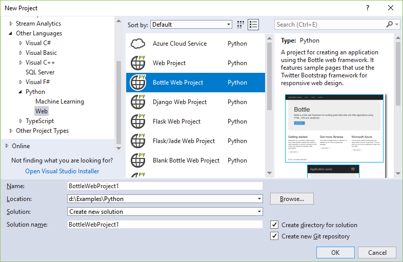
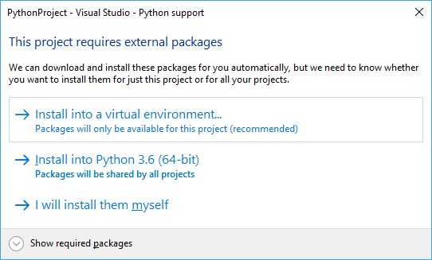
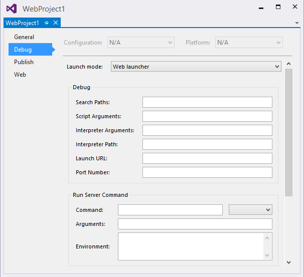
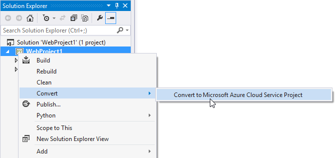

# Python web application project templates

Python in Visual Studio supports developing web projects in Bottle, Flask, and Django frameworks through project templates and a debug launcher that can be configured to handle various frameworks. These templates include a *requirements.txt* file to declare the necessary dependencies. When creating a project from one of these templates, Visual Studio prompts you to install those packages (see [Install project requirements](#install-project-requirements) later in this article).

You can also use the generic **Web Project** template for other frameworks such as Pyramid. In this case, no frameworks are installed with the template. Instead, install the necessary packages into the environment you're using for the project (see [Python environments window - Package tab](python-environments-window-tab-reference.md#packages-tab)).

For information on deploying a Python web app to Azure, see [Publish to Azure App Service](publishing-python-web-applications-to-azure-from-visual-studio.md).

## Use a project template

You create a project from a template using **File** > **New** > **Project**. To see templates for web projects, select **Python** > **Web** on the left side of the dialog box. Then select a template of your choice, providing names for the project and solution, set options for a solution directory and Git repository, and select **OK**.

The generic **Web Project** template, mentioned earlier, provides only an empty Visual Studio project with no code and no assumptions other than being a Python project. For details on the **Azure Cloud Service** template, see [Azure cloud service projects for Python](python-azure-cloud-service-project-template.md).

All the other templates are based on the Bottle, Flask, or Django web frameworks, and fall into three general groups as described in the following sections. The apps created by any of these templates contain sufficient code to run and debug the app locally. Each one also provides the necessary [WSGI app object](https://www.python.org/dev/peps/pep-3333/) (python.org) for use with production web servers.

### Blank group

All **Blank \<framework> Web Project** templates create a project with more or less minimal boilerplate code and the necessary dependencies declared in a *requirements.txt* file.

| Template | Description |
| --- | --- |
| **Blank Bottle Web Project** | Generates a minimal app in *app.py* with a home page for `/` and a `/hello/<name>` page that echoes `<name>` using a very short inline page template. |
| **Blank Django Web Project** | Generates a Django project with the core Django site structure but no Django apps. For more information, see [Django templates](python-django-web-application-project-template.md) and [Learn Django Step 1](learn-django-in-visual-studio-step-01-project-and-solution.md). |
| **Blank Flask Web Project** | Generates a minimal app with a single "Hello World!" page for `/`. This app is similar to the result of following the detailed steps in [Quickstart: Use Visual Studio to create your first Python web app](../ide/quickstart-python.md?toc=/visualstudio/python/toc.json&bc=/visualstudio/python/_breadcrumb/toc.json). Also see [Learn Flask Step 1](learn-flask-visual-studio-step-01-project-solution.md).

### Web group

All **\<Framework> Web Project** templates create a starter web app with an identical design regardless of the chosen framework. The app has Home, About, and Contact pages, along with a nav bar and responsive design using Bootstrap. Each app is appropriately configured to serve static files (CSS, JavaScript, and fonts), and uses a page template mechanism appropriate for the framework.

| Template | Description |
| --- | --- |
| **Bottle Web Project** | Generates an app whose static files are contained in the *static* folder and handled through code in *app.py*. Routing for the individual pages is contained in *routes.py*, and the *views* folder contains the page templates.|
| **Django Web Project** | Generates a Django project and a Django app with three pages, authentication support, and a SQLite database (but no data models). For more information, see [Django templates](python-django-web-application-project-template.md) and [Learn Django Step 4](learn-django-in-visual-studio-step-04-full-django-project-template.md). |
| **Flask Web Project** | Generates an app whose static files are contained in the *static* folder. Code in *views.py* handles routing, with page templates using the Jinja engine contained in the *templates* folder. The *runserver.py* file provides startup code. See [Learn Flask Step 4](learn-flask-visual-studio-step-04-full-flask-project-template.md). |
| **Flask/Jade Web Project** | Generates the same app as with the **Flask Web Project** template but using the Jade extension for the Jinja templating engine. |

### Polls group

The **Polls \<framework> Web Project** templates create a starter web app through which users can vote on different poll questions. Each app builds upon the structure of the **Web** project templates to use a database to manage the polls and user responses. The apps include appropriate data models and a special app page (/seed) that loads polls from a *samples.json* file.

| Template | Description |
| --- | --- |
| **Polls Bottle Web Project** | Generates an app that can run against an in-memory database, MongoDB, or Azure Table Storage, which is configured using the `REPOSITORY_NAME` environment variable. The data models and data store code are contained in the *models* folder, and the *settings.py* file contains code to determine which data store is used. |
| **Polls Django Web Project** | Generates a Django project and a Django app with three pages and a SQLite database. Includes customizations to the Django administrative interface to allow an authenticated administrator to create and manage polls. For more information, see [Django templates](python-django-web-application-project-template.md) and [Learn Django Step 6](learn-django-in-visual-studio-step-06-polls-django-web-project-template.md). |
| **Polls Flask Web Project** | Generates an app that can run against an in-memory database, MongoDB, or Azure Table Storage, which is configured using the `REPOSITORY_NAME` environment variable. The data models and data store code are contained in the *models* folder, and the *settings.py* file contains code to determine which data store is used. The app uses the Jinja engine for page templates. See [Learn Flask Step 5](learn-flask-visual-studio-step-05-polls-flask-web-project-template.md). |
| **Polls Flask/Jade Web Project** | Generates the same app as with the **Polls Flask Web Project** template but using the Jade extension for the Jinja templating engine. |

## Install project requirements

When creating a project from a framework-specific template, a dialog appears to help you install the necessary packages using pip. We also recommend using a [virtual environment](selecting-a-python-environment-for-a-project.md#use-virtual-environments) for web projects so that the correct dependencies are included when you publish your web site:

If you're using source control, you typically omit the virtual environment folder as that environment can be recreated using only *requirements.txt*. The best way to exclude the folder is to first select the **I will install them myself** in the prompt shown above, then disable auto-commit before creating the virtual environment. For details, see [Learn Django Tutorial - Steps 1-2 and 1-3](learn-django-in-visual-studio-step-01-project-and-solution.md#step-1-2-examine-the-git-controls-and-publish-to-a-remote-repository) and [Learn Flask Tutorial - Steps 1-2 and 1-3](learn-flask-visual-studio-step-01-project-solution.md#step-1-2-examine-the-git-controls-and-publish-to-a-remote-repository).

When deploying to Microsoft Azure App Service, select a version of Python as a [site extension](https://aka.ms/PythonOnAppService) and manually install packages. Also, because Azure App Service does **not** automatically install packages from a *requirements.txt* file when deployed from Visual Studio, follow the configuration details on [aka.ms/PythonOnAppService](https://aka.ms/PythonOnAppService).

Microsoft Azure Cloud Services *does* support the *requirements.txt* file. See [Azure cloud service projects](python-azure-cloud-service-project-template.md) for details.

## Debugging

When a web project is started for debugging, Visual Studio starts a local web server on a random port and opens your default browser to that address and port. To specify additional options, right-click the project, select **Properties**, and select the **Web Launcher** tab:

In the **Debug** group:

- **Search Paths**, **Script Arguments**, **Interpreter Arguments**, and **Interpreter Path**: these options are the same as for [normal debugging](debugging-python-in-visual-studio.md).
- **Launch URL**: specifies the URL that is opened in your browser. It defaults to `localhost`.
- **Port Number**: the port to use if none is specified in the URL (Visual Studio selects one automatically by default). This setting allows you to override the default value of the `SERVER_PORT` environment variable, which is used by the templates to configure the port the local debug server listens on.

The properties in the **Run Server Command** and **Debug Server Command** groups (the latter is below what's shown in the image) determine how the web server is launched. Because many frameworks require the use of a script outside of the current project, the script can be configured here and the name of the startup module can be passed as a parameter.

- **Command**: can be a Python script (*\*.py* file), a module name (as in, `python.exe -m module_name`), or a single line of code (as in, `python.exe -c "code"`). The value in the drop-down indicates which of these types is intended.
- **Arguments**: these arguments are passed on the command line following the command.
- **Environment**: a newline-separated list of \<NAME>=\<VALUE> pairs specifying environment variables. These variables are set after all properties that may modify the environment, such as the port number and search paths, and so may overwrite these values.

Any project property or environment variable can be specified with MSBuild syntax, for example: `$(StartupFile) --port $(SERVER_PORT)`.
`$(StartupFile)` is the relative path to the startup file and `{StartupModule}` is the importable name of the startup file. `$(SERVER_HOST)` and `$(SERVER_PORT)` are normal environment variables that are set by the **Launch URL** and **Port Number** properties, automatically, or by the **Environment** property.

> [!Note]
> Values in **Run Server Command** are used with the **Debug** > **Start Server** command or **Ctrl**+**F5**; values in the **Debug Server Command** group are used with the **Debug** > **Start Debug Server** command or **F5**.

### Sample Bottle configuration

The **Bottle Web Project** template includes boilerplate code that does the necessary configuration. An imported bottle app may not include this code, however, in which case the following settings launch the app using the installed `bottle` module:

- **Run Server Command** group:
  - **Command**: `bottle` (module)
  - **Arguments**: `--bind=%SERVER_HOST%:%SERVER_PORT% {StartupModule}:app`

- **Debug Server Command** group:
  - **Command**: `bottle` (module)
  - **Arguments** `--debug --bind=%SERVER_HOST%:%SERVER_PORT% {StartupModule}:app`

The `--reload` option is not recommended when using Visual Studio for debugging.

### Sample Pyramid configuration

Pyramid apps are currently best created using the `pcreate` command-line tool. Once an app has been created, it can be imported using the [**From existing Python code**](managing-python-projects-in-visual-studio.md#create-a-project-from-existing-files) template. After doing so, select the **Generic Web Project** customization to configure the options. These settings assume that Pyramid is installed into a virtual environment at `..\env`.

- **Debug** group:
  - **Server Port**: 6543 (or whatever is configured in the *.ini* files)

- **Run Server Command** group:
  - Command: `..\env\scripts\pserve-script.py` (script)
  - Arguments: `Production.ini`

- **Debug Server Command** group:
  - Command: `..\env\scripts\pserve-script.py` (script)
  - Arguments: `Development.ini`

> [!Tip]
> You likely need to configure the **Working Directory** property of your project because Pyramid apps are typically one folder below the project root.

### Other configurations

If you have settings for another framework that you would like to share, or if you'd like to request settings for another framework, open an [issue on GitHub](https://github.com/Microsoft/PTVS/issues).

## Convert a project to Azure Cloud Service

The **Convert to Microsoft Azure Cloud Service Project** command (image below) adds a cloud service project to your solution. This project includes the deployment settings and configuration for the virtual machines and services to be used. Use the **Publish** command on the cloud project to deploy to Cloud Services; the **Publish** command on the Python project still deploys to Web Sites. For more information, see [Azure cloud service projects](python-azure-cloud-service-project-template.md).

## See also

- [Python item templates reference](python-item-templates.md)
- [Publish to Azure App Service](publishing-python-web-applications-to-azure-from-visual-studio.md)
