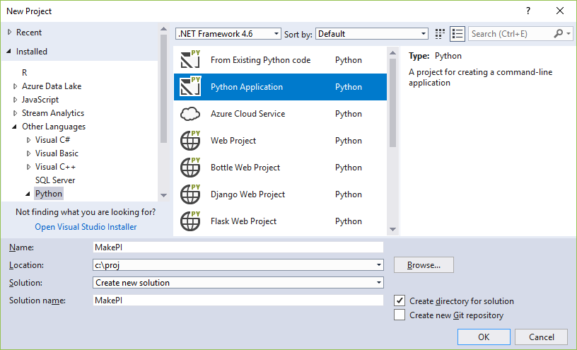
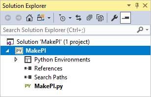

# Quickstart: create a Python project from a template in Visual Studio

Once you've [installed Python support in Visual Studio 2017](installing-python-support-in-visual-studio.md), it's easy to create a new Python project using a variety of templates.

1. Launch Visual Studio.

1. Select **File > New > Project** (Ctrl+Shift+N). In the **New Project** dialog, search for "Python", and select the template you want. Note that selecting a template displays a short description of what the template provides. (Also see [Python projects](managing-python-projects-in-visual-studio.md#project-templates).)

    

1. For this Quickstart, select the "Python Application" template, give the project a name (such as "MakePI") and location, and select **OK**. 

1. Visual Studio creates the project file (a `.pyproj` file on disk) along with any other files as described by the template. With the "Python Application" template, the project contains only one empty file named the same as your project. The file is open in the Visual Studio editor by default.

    

1. Add some code to the open file, such as the code below that calculates and displays 1000 digits of PI:

    ```python
    """ Print digits of PI; code adapted from the second, shorter solution
    at http://www.codecodex.com/wiki/Calculate_digits_of_pi#Python
    """

    from time import perf_counter

    def pi_digits_Python(digits):
        scale = 10000
        maxarr = int((digits / 4) * 14)
        arrinit = 2000
        carry = 0
        arr = [arrinit] * (maxarr + 1)
        output = ""

        for i in range(maxarr, 1, -14):
            total = 0
            for j in range(i, 0, -1):
                total = (total * j) + (scale * arr[j])
                arr[j] = total % ((j * 2) - 1)
                total = total / ((j * 2) - 1)

            output += "%04d" % (carry + (total / scale))
            carry = total % scale

        return output;

    def test_py():
        digits = 1000;

        start = perf_counter()
        output = pi_digits_Python(digits);
        elapsed = perf_counter() - start;

        print("PI to " + str(digits) + " digits in " + str(int(elapsed * 10000)/10000) + " seconds:")

        ## replace inserts the decimal point
        print(output.replace("3", "3.", 1))

    if __name__ == "__main__":
        test_py();
    ```

1. Run the program by pressing Ctrl+F5 or selecting **Debug > Start Without Debugging** on the menu. The results are displayed in a console window.

## Next steps

> [!div class="nextstepaction"]
> [Tutorial: Working with Python in Visual Studio](tutorial-working-with-python-in-visual-studio-step-01-create-project.md)

## See also

- [Creating an environment for an existing Python interpreter](managing-python-environments-in-visual-studio.md#creating-an-environment-for-an-existing-interpreter).
- [Install Python support in Visual Studio 2015 and earlier](installing-python-support-in-visual-studio.md).
- [Install locations](installing-python-support-in-visual-studio.md#install-locations).
