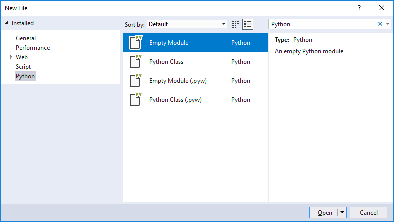

# Quickstart: Python projects in Visual Studio

Once you've install Python support in Visual Studio 2017, it's easy to work with existing Python code or want to start a new Python project.

Visual Studio uses *projects* to organize source files, build settings, and configurations.

1. Launch Visual Studio.

1. To create a new project, select **File > New > Project** (Ctrl+Shift+N). In the **New Project** dialog, search for "Python", select the "Python Application" template, give the project a name and location, and select **OK**. The resulting project will have a single blank `.py` file in which you can start writing code. 

    

1. To open an existing Python program as a project, select **File > New > Project**. In the **New Project** dialog, search for "Python", select the "From Existing Python code" template, give the project a name and location, and select **OK**. This brings up a wizard to walk you through the process (explained fully on [Creating a project from existing files](python-projects.md#creating-a-project-from-existing-files):

    

1. To generate code from a Cookiecutter template, including many published to GitHub, select **File > New > From Cookiecutter...**. This opens a window in Visual Studio where you can browse templates. Double-click on one of your choice to generate a project from the template.

    

1. To start with just a single file, select **File > New > File...** (Ctrl+N). In the dialog that appears, search for "Python" or select "Python" on the left side to see a list of choices. "Empty module" gives you an empty file in which you can start writing code.

    

1. To open code from a repository, select **View > Team Explorer...** to open the **Team Explorer** window in which you can connect to GitHub or Visual Studio Team Services, or clone a repository.

    

    > [!Tip]
    > To show GitHub in Team Explorer, run the Visual Studio installer, select **Modify**, and select the **Individual components** tab. Scroll down to the **Code tools** section, select **GitHub extension for Visual Studio**, and select **Modify**.
    >
    > 

## Next Steps

> [!div class="nextstepaction"]
> [Tutorial: Working with Python in Visual Studio](vs-tutorial-01-01.md)

## See Also

- [Creating an environment for an existing Python interpreter](python-environments.md#creating-an-environment-for-an-existing-interpreter).
- [Install Python support in Visual Studio 2015 and earlier](installation.md).
- [Install locations](installation.md#install-locations).
