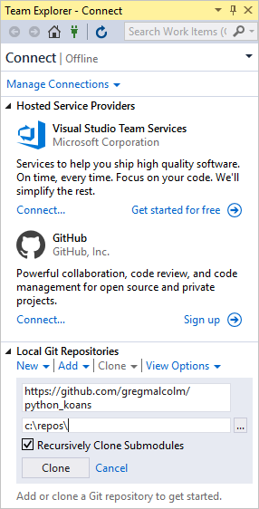
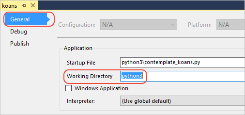
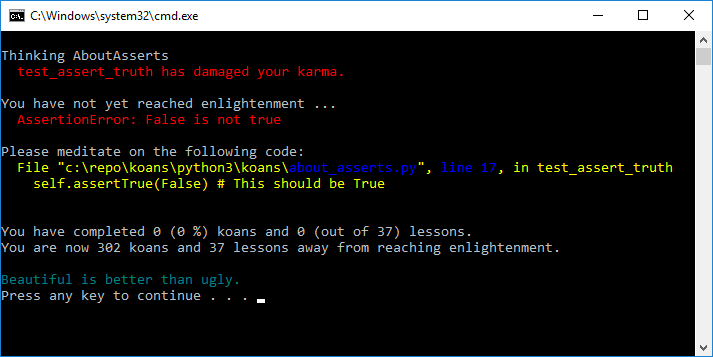
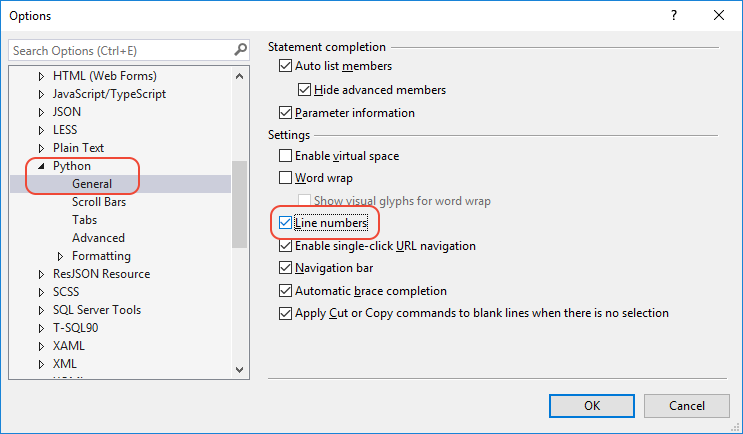

# Quickstart: Clone a repository of Python code in Visual Studio

Once you've [installed Python support in Visual Studio](installing-python-support-in-visual-studio.md), you can add the GitHub Extension for Visual Studio. The extension lets you easily clone a repository of Python code and create a project from it from within the IDE. You can always clone repositories on the command line as well, and then work with them in Visual Studio.

## Install the GitHub Extension for Visual Studio

[!INCLUDE[install-github-extension](includes/install-github-extension.md)]

## Work with GitHub in Visual Studio

1. Launch Visual Studio.

1. Select **View** > **Team Explorer** to open the **Team Explorer** window in which you can connect to GitHub or Azure Repos, or clone a repository. (If you don't see the **Connect** page shown below, select the plug icon on the top toolbar, which takes you to that page.)

    

1. Under **Local Git Repositories**, select the **Clone** command, then enter `https://github.com/gregmalcolm/python_koans` in the URL field, enter a folder for the cloned files, and select the **Clone** button.

    > [!Tip]
    > The folder you specify in **Team Explorer** is the exact folder to receive the cloned files. Unlike the `git clone` command, creating a clone in **Team Explorer** does not automatically create a subfolder with the name of the repository.

1. When cloning is complete, the repository name appears in the **Local Git Repositories** list. Double-click that name to navigate to the repository dashboard in **Team Explorer**.

1. Under **Solutions**, select **New**.

    

1. In the **New Project** dialog that appears, navigate to the **Python** language (or search on "Python"), select **From Existing Python Code**, specify a name for the project, set **Location** to the same folder as the repository, and select **OK**. In the wizard that appears, select **Finish**.

1. Select **View** > **Solution Explorer** from the menu.

1. In **Solution Explorer**, expand the **python3** node, right-click **contemplate_koans.py**, and select **Set as Startup File**. This step tells Visual Studio which file it should use when running the project.

1. Select **Project** > **Koans Properties** from the menu, select the **General** tab, and set **Working Directory** to "python3". This step is necessary because by default Visual Studio sets the working directory to the project root rather than the location of the startup file (*python3\contemplate_koans.py*, which you can see in the project properties as well). The program code looks for a file *koans.txt* in the working folder, so without changing this value you see a runtime error.

    

1. Press **Ctrl**+**F5** or select **Debug** > **Start without Debugging** to run the program. If you see a **FileNotFoundError** for *koans.txt*, check the working directory setting as described in the previous step.

1. When the program runs successfully, it displays an assertion error on line 17 of *python3/koans/about_asserts.py*. This is intentional: the program is designed to teach Python by having you correct all the intentional errors. (More details are found on [Ruby Koans](https://rubykoans.com/), which inspired Python Koans.)

    

1. Open *python3/koans/about_asserts.py* by navigating to it in **Solution Explorer** and double-clicking the file. Notice that line numbers do not appear by default in the editor. To change this, select **Tools** > **Options**, select **Show all settings** at the bottom of the dialog, then navigate to **Text Editor** > **Python** > **General** and select **Line numbers**:

    

1. Correct the error by changing the `False` argument on line 17 to `True`. The line should read as follows:

    ```python
    self.assertTrue(True) # This should be True
    ```

1. Run the program again. If Visual Studio warns you about errors, respond with **Yes** to continue running the code. You then see that the first check passes and the program stops on the next koan. Continue correcting the errors and the program again as you want.

> [!Important]
> In this Quickstart, you created a direct clone of the *python_koans* repository on GitHub. Such a repository is protected by its author from direct changes, so attempting to commit changes to the repository fails. In practice, developers instead fork such a repository to their own GitHub account, make changes there, and then create pull requests to submit those changes to the original repository. When you have your own fork, use its URL instead of the original repository URL used earlier.

## Next steps

> [!div class="nextstepaction"]
> [Tutorial: Work with Python in Visual Studio](tutorial-working-with-python-in-visual-studio-step-01-create-project.md)

## See also

- [Manually identify an existing Python interpreter](managing-python-environments-in-visual-studio.md#manually-identify-an-existing-environment)
- [How to install Python support in Visual Studio on Windows](installing-python-support-in-visual-studio.md)
- [Install locations](installing-python-support-in-visual-studio.md#install-locations)
