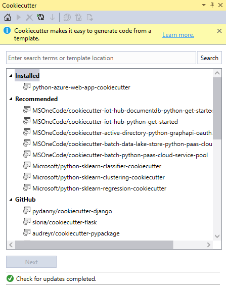
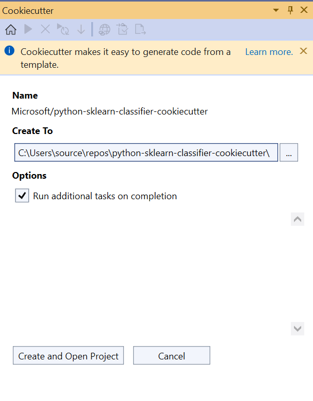
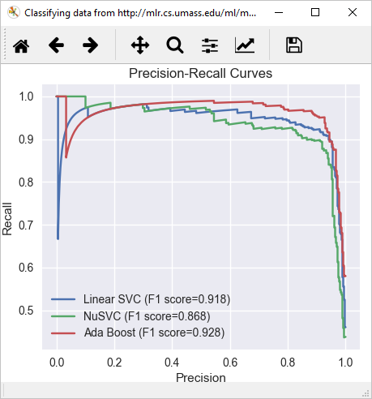

# Quickstart: Create a project from a Cookiecutter template

Once you've [installed Python support in Visual Studio](installing-python-support-in-visual-studio.md), it's easy to create a new project from a Cookiecutter template, including many that are published to GitHub. [Cookiecutter](https://cookiecutter.readthedocs.io/en/latest/) provides a graphical user interface to discover templates, input template options, and create projects and files. It's included with Visual Studio 2017 and later and can be installed separately in earlier versions of Visual Studio.

1. For this quickstart, first install the Anaconda3 Python distribution, which includes the necessary Python packages for the Cookiecutter template shown here. Run the Visual Studio installer, select **Modify**, expand the options for **Python development** on the right side, and select **Anaconda3** (either 32-bit or 64-bit). Note that installation may take some time depending on your Internet speed, but this is the simplest way to install the needed packages.

1. Launch Visual Studio.

1. Select **File** > **New** > **From Cookiecutter**. This command opens a window in Visual Studio where you can browse templates.

    

1. Selected the **Microsoft/python-sklearn-classifier-cookiecutter** template, then select **Next**. (The process may take several minutes the first time you use a particular template, as Visual Studio installs the required Python packages.)

1. In the next step, set a location for the new project in the **Create To** field, then select **Create and Open Project**.

    

1. When the process is complete, you see the message **Successfully created files using template...**. The project is opened in Solution Explorer automatically.

1. Press **Ctrl**+**F5** or select **Debug** > **Start without Debugging** to run the program.

    

## Next steps

> [!div class="nextstepaction"]
> [Tutorial: Work with Python in Visual Studio](tutorial-working-with-python-in-visual-studio-step-01-create-project.md)

## See also

- [Use the Cookiecutter extension](using-python-cookiecutter-templates.md)
- [Manually identify an existing Python interpreter](managing-python-environments-in-visual-studio.md#manually-identify-an-existing-environment)
- [Install Python support in Visual Studio 2015 and earlier](installing-python-support-in-visual-studio.md)
- [Install locations](installing-python-support-in-visual-studio.md#install-locations)
