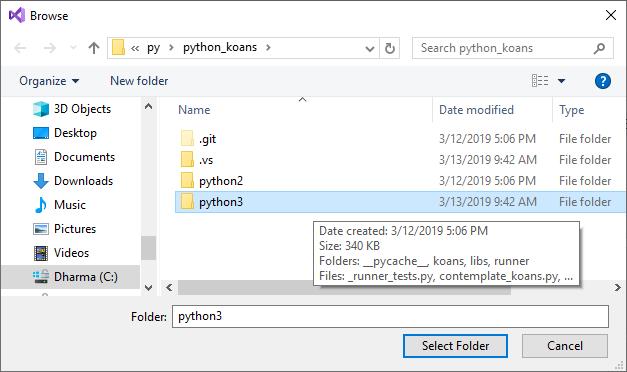
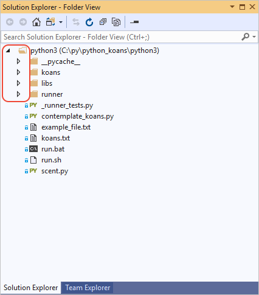
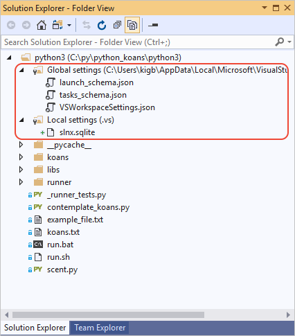
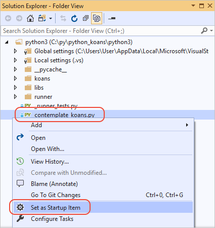
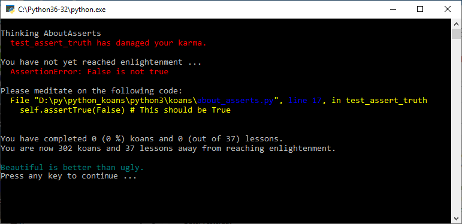
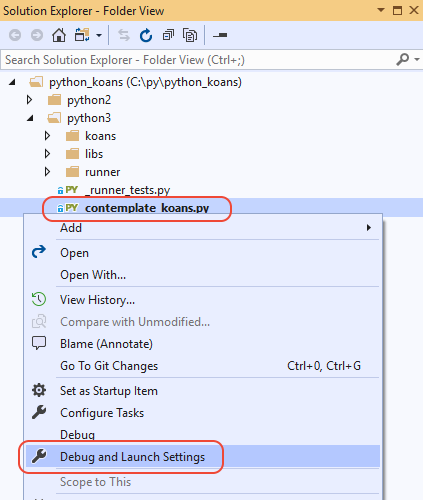
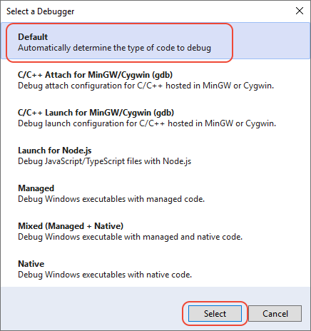

# Quickstart: Open and run Python code in a folder

Once you've [installed Python support in Visual Studio 2019](installing-python-support-in-visual-studio.md), it's easy to run existing Python code in Visual Studio 2019 without creating a Visual Studio project.

> [!Note]
> Visual Studio 2017 and earlier require you to create a Visual Studio project to run Python code, which you can easily do using a built-in project template. See [Quickstart: Create a Python project from existing code](quickstart-01-python-in-visual-studio-project-from-existing-code.md)

1. For this walkthrough, you can use any folder with Python code that you like. To follow along with the example shown here, clone the gregmalcolm/python_koans GitHub repository to your computer using the command `git clone https://github.com/gregmalcolm/python_koans` in an appropriate folder.

1. Launch Visual Studio 2019 and in the start window, select **Open** at the bottom of the **Get started** column. Alternately, if you already have Visual Studio running, select the **File** > **Open** > **Folder** command instead.

    

1. Navigate to the folder containing your Python code, then choose **Select Folder**. If you're using the python_koans code, make sure to select the `python3` folder within the clone folder.

    

1. Visual Studio displays the folder in **Solution Explorer** in what's called **Folder View**. You can expand and collapse folders using the arrows on the left edges of the folder names:

    

1. When opening a Python folder, Visual Studio creates several hidden folders to manage settings related to the project. To see these folders (and any other hidden files and folders, such as the *.git* folder), select the **Show All Files** toolbar button:

    

1. To run the code, you first need to identify the startup or primary program file. In the example shown here, the startup file *contemplate-koans.py*. Right-click that file and select **Set as Startup Item**.

    

    > [!Important]
    > If your startup item is not located in the root of the folder you opened, you must also add a line to the launch configuration JSON file as described in the section, [Set a working directory](#set-a-working-directory).

1. Run the code by pressing **Ctrl**+**F5** or selecting **Debug** > **Start without Debugging**. You can also select the toolbar button that shows the startup item with a play button, which runs code in the Visual Studio debugger. In all cases, Visual Studio detects that your startup item is a Python file, so it automatically runs the code in the default Python environment. (That environment is shown to the right of the startup item on the toolbar.)

    

1. The program's output appears in a separate command window:

    

1. To run the code in a different environment, select that environment from the drop-down control on the toolbar, then launch the startup item again.

1. To close the folder in Visual Studio, select the **File** > **Close folder** menu command.

## Set a working directory

By default, Visual Studio runs a Python project opened as a folder in the root of that same folder. The code in your project, however, might assume that Python is being run in a subfolder. For example, suppose you open the root folder of the python_koans repository and then set the *python3/contemplate-koans.py* file as startup item. If you then run the code, you see an error that the *koans.txt* file cannot be found. This error happens because *contemplate-koans.py* assumes that Python is being run in the *python3* folder rather than the repository root.

In such cases, you must also add a line to the launch configuration JSON file to specify the working directory:

1. Right-click the Python (*.py*) startup file in **Solution Explorer** and select **Debug and Launch Settings**.

    

1. In the **Select debugger** dialog box that appears, select **Default** and then choose **Select**.

    

    > [!Note]
    > If you don't see **Default** as a choice, be sure that you right-clicked a Python *.py* file when selecting the **Debug and Launch Settings** command. Visual Studio uses the file type to determine while debugger options to display.

1. Visual Studio opens a file named *launch.vs.json*, which is located in the hidden *.vs* folder. This file describes the debugging context for the project. To specify a working directory, add a value for `"workingDirectory"`, as in  `"workingDirectory": "python3"` for python-koans example:

    ```json
    {
      "version": "0.2.1",
      "defaults": {},
      "configurations": [
        {
          "type": "python",
          "interpreter": "(default)",
          "interpreterArguments": "",
          "scriptArguments": "",
          "env": {},
          "nativeDebug": false,
          "webBrowserUrl": "",
          "project": "python3\\contemplate_koans.py",
          "name": "contemplate_koans.py",
          "workingDirectory": "python3"
        }
      ]
    }
    ```

1. Save the file and launch the program again, which now runs in the specified folder.

## Next steps

> [!div class="nextstepaction"]
> [Tutorial: Work with Python in Visual Studio](tutorial-working-with-python-in-visual-studio-step-01-create-project.md)

## See also

- [Quickstart: Create a Python project from existing code](quickstart-01-python-in-visual-studio-project-from-existing-code.md)
- [Quickstart: Create a Python project from a repository](quickstart-03-python-in-visual-studio-project-from-repository.md)
- [Manually identify an existing Python interpreter](managing-python-environments-in-visual-studio.md#manually-identify-an-existing-environment)
