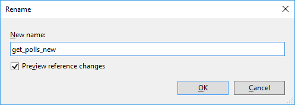
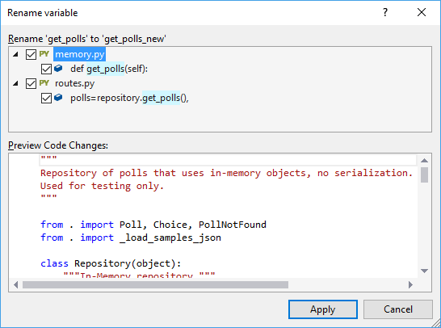
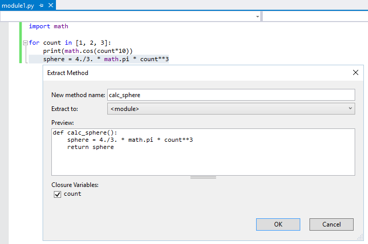
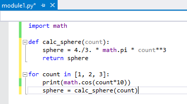
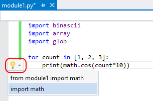
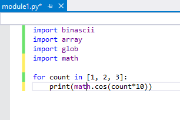
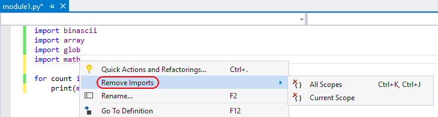
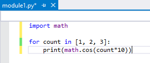

# Refactor Python code

Visual Studio provides several commands for automatically transforming and cleaning up your Python source code:

- [Rename](#rename) renames a selected class, method, or variable name
- [Extract method](#extract-method) creates a new method from the selected code
- [Add import](#add-import) provides a smart tag to add a missing import
- [Remove unused imports](#remove-unused-imports) removes unused imports

## Rename

1. Right-click the identifier you wish to rename and select **Rename**, or place the caret in that identifier and select the **Edit** > **Refactor** > **Rename** menu command (**F2**).
2. In the **Rename** dialog that appears, enter the new name for the identifier and select **OK**:

   

3. In the next dialog, select the files and instances in your code to which to apply the renaming; select any individual instance to preview the specific change:

   

4. Select **Apply** to make the changes to your source code files. (This action can be undone.)

## Extract method

1. Select the lines of code or the expression to extract into a separate method.
2. Select the **Edit** > **Refactor** > **Extract method** menu command or type **Ctrl**+**R** > **M**.
3. In the dialog that appears, enter a new method name, indicate where to extract it to, and select any closure variables. Variables not selected for closure are turned into method arguments:

   

4. Select **OK** and the code is modified accordingly:

   

## Add import

When you place the caret on an identifier that lacks type information, Visual Studio provides a smart tag (the lightbulb icon to the left of the code) whose commands add the necessary `import` or `from ... import` statement:

Visual Studio offers `import` completions for top-level packages and modules in the current project and the standard library. Visual Studio also offers `from ... import` completions for submodules and subpackages as well as module members. Completions include functions, classes, or exported data. Selecting either option adds the statement to at the top of the file after other imports, or into an existing `from ... import` statement if the same module is already imported.

Visual Studio attempts to filter out members that aren't actually defined in a module, such as modules that are imported into another but aren't children of the module doing the importing. For example, many modules use `import sys` rather than `from xyz import sys`, so you don't see a completion for importing `sys` from other modules even if the modules are missing an `__all__` member that excludes `sys`.

Similarly, Visual Studio filters functions that are imported from other modules or from the built-in namespace. For example if a module imports the `settrace` function from the `sys` module, then in theory you could import it from that module. But it's best to use `import settrace from sys` directly, and so Visual Studio offers that statement specifically.

Finally, if something would normally be excluded but has other values that would be included (because the name was assigned a value in the module, for example), Visual Studio still excludes the import. This behavior assumes that the value shouldn't be exported because it is defined in another module, and thus the additional assignment is likely to be a dummy value that is also not exported.

## Remove unused imports

When writing code, it's easy to end up with `import` statements for modules that aren't being used at all. Because Visual Studio analyzes your code, it can automatically determine whether an `import` statement is needed by looking at whether the imported name is used within the scope below where the statement occurs.

Use right-click anywhere in the editor and select **Remove Imports**, which gives you options to remove from **All Scopes** or just the **Current Scope**:

Visual Studio then makes the appropriate changes to the code:

Note that Visual Studio does not account for control flow; using a name before an `import` statement is treated as if the name was in fact used. Visual Studio also ignores all `from __future__` imports, imports that are performed inside of a class definition, as well from `from ... import *` statements.
