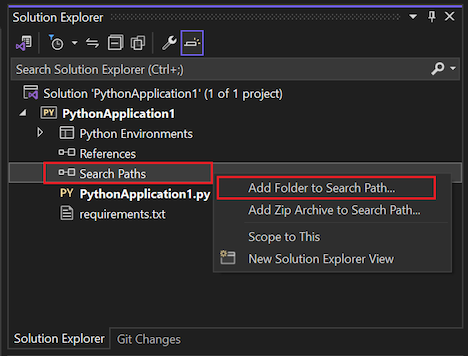
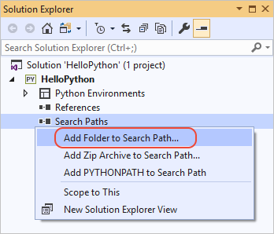

# How Visual Studio uses Python search paths

With typical Python usage, the `PYTHONPATH` environment variable (or `IRONPYTHONPATH`, etc.) provides the default search path for module files. That is, when you use an `from <name> import...` or `import <name>` statement, Python searches the following locations in order for a matching name:

1. Python's built-in modules.
1. The folder containing the Python code you're running.
1. The "module search path" as defined by the applicable environment variable. (See [The Module Search Path](https://docs.python.org/2/tutorial/modules.html#the-module-search-path) and [Environment variables](https://docs.python.org/2/using/cmdline.html#envvar-PYTHONPATH) in the core Python documentation.)

Visual Studio ignores the search path environment variable, however, even when the variable is set for the entire system. It's ignored, in fact, precisely *because* it's set for the entire system and thus raises certain questions that cannot be answered automatically: Are the referenced modules meant for Python 2.7 or Python 3.6+? Are they going to override standard library modules? Is the developer aware of this behavior or is it a malicious hijacking attempt?

Visual Studio thus provides a means to specify search paths directly in both environments and projects. Code that you run or debug in Visual Studio receives search paths in the value of `PYTHONPATH` (and other equivalent variables). By adding search paths, Visual Studio inspects the libraries in those locations and builds IntelliSense databases for them when needed (Visual Studio 2017 version 15.5 and earlier; constructing the database may take some time depending on the number of libraries).

To add a search path, go to **Solution Explorer**, expand your project node, right-click on **Search Paths**, and select **Add Folder to Search Path**:

::: moniker range="vs-2017"

::: moniker-end
::: moniker range=">=vs-2019"

::: moniker-end

This command displays a browser in which you then select the folder to include.

If your `PYTHONPATH` environment variable already includes the folder(s) you want, use the **Add PYTHONPATH to Search Paths** as a convenient shortcut.

Once folders are added to the search paths, Visual Studio uses those paths for any environment associated with the project. (You may see errors if the environment is based on Python 3 and you attempt to add a search path to Python 2.7 modules.)

Files with a *.zip* or *.egg* extension can also be added as search paths by selecting **Add Zip Archive to Search Path** command. As with folders, the contents of these files are scanned and made available to IntelliSense.

## See also

- [Manage Python environments in Visual Studio](managing-python-environments-in-visual-studio.md)
- [Select an interpreter for a project](selecting-a-python-environment-for-a-project.md)
- [Use requirements.txt for dependencies](managing-required-packages-with-requirements-txt.md)
- [Python Environments window reference](python-environments-window-tab-reference.md)
