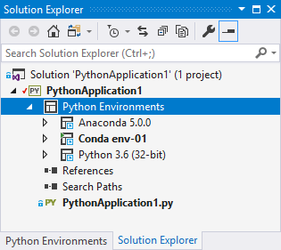
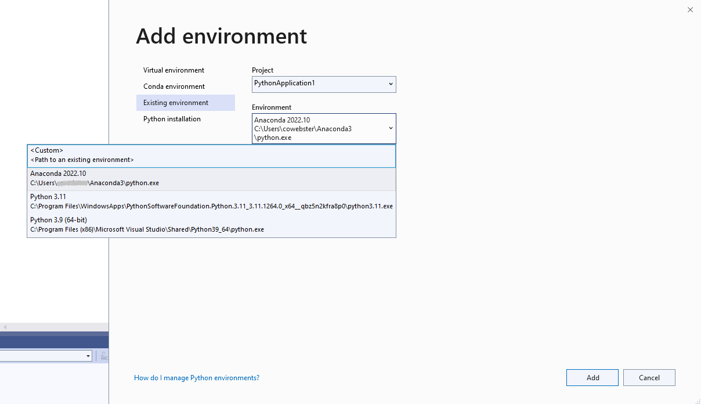
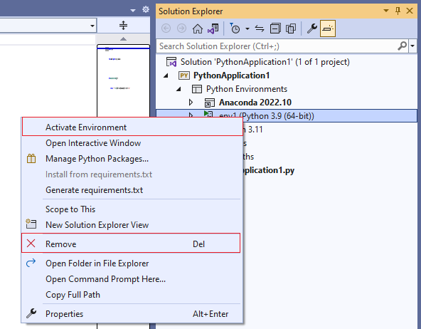
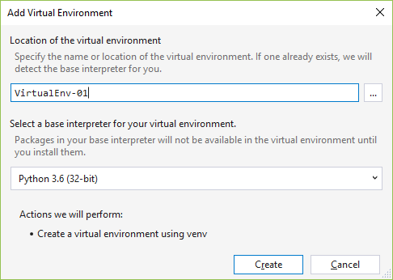
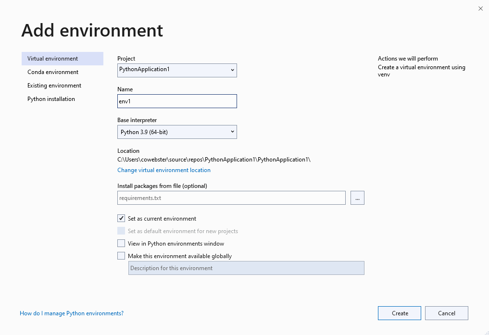
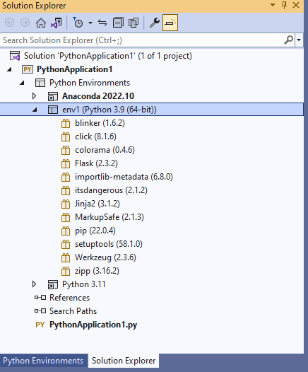

# How to select a Python environment for a project

All code in a Python project runs within the context of a specific environment, such as a global Python environment, an Anaconda environment, a virtual environment, or a conda environment. Visual Studio also uses that environment for debugging, import and member completions, syntax checking, and any other tasks that require language services that are specific to the Python version and a set of installed packages.

All new Python projects in Visual Studio are initially configured to use the default global environment, which appears under the **Python Environments** node in **Solution Explorer**:

::: moniker range="vs-2017"
To change the environment for a project, right-click the **Python Environments** node and select **Add/Remove Python Environments**. From the displayed list, which includes global, virtual, and conda environments, select all the ones you want to appear under the **Python Environments** node:

Once you select **OK**, all the selected environments appear under the **Python Environments** node. The currently activated environment appears in bold:

To quickly activate a different environment, right-click that environment name and select **Activate environment**. Your choice is saved with the project and that environment is activated whenever you open the project in the future. If you clear all the options in the **Add/Remove Python Environments** dialog, Visual Studio activates the global default environment.

The context menu on the **Python Environments** node also provides additional commands:

| Command | Description |
| --- | --- |
| **Add Virtual Environment** | Begins the process of creating a new virtual environment in the project. See [Create a virtual environment](#create-a-virtual-environment). |
| **Add Existing Virtual Environment** | Prompts you to select a folder containing a virtual environment and adds it to the list under **Python Environments**, but does not activate it. See [Activate an existing virtual environment](#activate-an-existing-virtual-environment). |
| **Create Conda environment** | Switches to the **Python Environments** *window* in which you enter a name for the environment and specify its base interpreter. See [Conda environments](managing-python-environments-in-visual-studio.md#conda-environments). |
::: moniker-end

::: moniker range=">=vs-2019"
To change the environment for a project, right-click the **Python Environments** node and select **Add Environment**. You can also select **Add Environment** from the environment drop-down in the Python toolbar.

Once in the **Add Environment** dialog box, select the **Existing environment** tab, then select a new environment from the **Environment** drop down list:

If you already added an environment other than the global default to a project, you may need to activate a newly added environment. Right-click that environment under the **Python Environments** node and select **Activate Environment**. To remove an environment from the project, select **Remove**.

::: moniker-end

## Use virtual environments

A virtual environment is a unique combination of a specific Python interpreter and a specific set of libraries that is different from other global and conda environments. A virtual environment is specific to a project and is maintained in a project folder. That folder contains the environment's installed libraries along with a *pyvenv.cfg* file that specifies the path to the environment's *base interpreter* elsewhere on the file system. (That is, a virtual environment doesn't contain a copy of the interpreter, only a link to it.)

A benefit to using a virtual environment is that as you develop project over time, the virtual environment always reflects the project's exact dependencies. (A shared global environment, on the other hand, contains any number of libraries whether you use them in your project or not.) You can then easily create a *requirements.txt* file from the virtual environment, which is then used to reinstall those dependencies on another development or production computer. For more information, see [Manage required packages with requirements.txt](managing-required-packages-with-requirements-txt.md).

When you open a project in Visual Studio that contains a *requirements.txt* file, Visual Studio automatically gives you the option to recreate the virtual environment. On computers where Visual Studio isn't installed, you can use `pip install -r requirements.txt` to restore the packages.

Because a virtual environment contains a hard-coded path to the base interpreter, and because you can recreate the environment using *requirements.txt*, you typically omit the entire virtual environment folder from source control.

The following sections explain how to activate an existing virtual environment in a project and how to create a new virtual environment.

In Visual Studio, a virtual environment can be activated for a project like any other through the **Python Environments** node in **Solution Explorer**.

Once a virtual environment is added to your project, it appears in the **Python Environments** window. You can then activate it like any other environment, and you can manage its packages.

::: moniker range="vs-2017"
### Create a virtual environment

You can create a new virtual environment directly in Visual Studio as follows:

1. Right-click **Python Environments** in **Solution Explorer** and select **Add Virtual Environment**, which brings up the following dialog box:

    

1. In the **Location of the virtual environment** field, specify a path for the virtual environment. If you specify a name only, the virtual environment is created within the current project in a subfolder with that name.

1. Select an environment as the base interpreter and select **Create**. Visual Studio displays a progress bar while it configures the environment and downloads any necessary packages. Upon completion, the virtual environment appears in the **Python Environments** window for the containing project.

1. The virtual environment is not activated by default. To activate the virtual environment for the project, right-click it and select **Activate Environment**.

> [!Note]
> If the location path identifies an existing virtual environment, Visual Studio detects the base interpreter automatically (using the *orig-prefix.txt* file in the environment's *lib* directory) and changes the **Create** button to **Add**.
>
> If a *requirements.txt* file exists when adding a virtual environment, the **Add Virtual Environment** dialog displays an option to install the packages automatically, making it easy to recreate an environment on another computer:
>
> 
>
> Either way, the result is the same as if you'd used the **Add Existing Virtual Environment** command.

### Activate an existing virtual environment

If you've already created a virtual environment elsewhere, you can activate it for a project as follows:

1. Right-click **Python Environments** in **Solution Explorer** and select **Add Existing Virtual Environment**.

1. In the **Browse** dialog that appears, navigate to and select the folder that contains the virtual environment, and select **OK**. If Visual Studio detects a *requirements.txt* file in that environment, it asks whether to install those packages.

1. After a few moments, the virtual environment appears under the **Python Environments** node in **Solution Explorer**. The virtual environment is not activated by default, so right-click it and select **Activate Environment**.
::: moniker-end

::: moniker range=">=vs-2019"
### Create a virtual environment

You can create a new virtual environment directly in Visual Studio as follows:

1. Right-click **Python Environments** in **Solution Explorer** and select **Add Environment**, or select **Add Environment** from the environments drop down list on the Python toolbar. In the **Add Environment** dialog that appears, select the **Virtual Environment** tab:

    

1. Specify a name for the virtual environment, select a base interpreter, and verify its location. Under **Install packages from file**, provide the path to a *requirements.txt* file if desired.

1. Review the other options in the dialog:

    | Option | Description |
    | --- | --- |
    | Set as current environment | Activates the new environment in the selected project after the environment is created. |
    | Set as default environment for new projects | Automatically sets and activates the virtual environment in any new projects created in Visual Studio. When using this option, the virtual environment should be placed in a location outside of a specific project.  |
    | View in Python Environments window | Specifies whether to open the **Python Environments** window after creating the environment. |
    | Make this environment available globally | Specifies whether the virtual environment also acts as a global environment. When using this option, the virtual environment should be placed in a location outside of a specific project. |

1. Select **Create** to finalize the virtual environment. Visual Studio displays a progress bar while it configures the environment and downloads any necessary packages. Upon completion, the virtual environment is activated and appears in the **Python Environments** node in **Solution Explorer** and the **Python Environments** window for the containing project.

### Activate an existing virtual environment

If you've already created a virtual environment elsewhere, you can activate it for a project as follows:

1. Right-click **Python Environments** in **Solution Explorer** and select **Add Environment**.

1. In the **Browse** dialog that appears, navigate to and select the folder that contains the virtual environment, and select **OK**. If Visual Studio detects a *requirements.txt* file in that environment, it asks whether to install those packages.

1. After a few moments, the virtual environment appears under the **Python Environments** node in **Solution Explorer**. The virtual environment is not activated by default, so right-click it and select **Activate Environment**.
::: moniker-end

### Remove a virtual environment

1. In **Solution Explorer**, right-click the virtual environment and select **Remove**.

1. Visual Studio asks whether to remove or delete the virtual environment. Selecting **Remove** makes it unavailable to the project but leaves it on the file system. Selecting **Delete** both removes the environment from the project and deletes it from the file system. The base interpreter is unaffected.

## View installed packages

In Solution Explorer, expand any specific environment's node to quickly view the packages that are installed in that environment (meaning that you can import and use those packages in your code when the environment is active):

::: moniker range="vs-2017"
To install new packages, right-click the environment and select **Install Python Package** to switch to the appropriate **Packages** tab in the **Python Environments** window. Enter a search term (usually the package name) and Visual Studio displays matching packages.
::: moniker-end
::: moniker range=">=vs-2019"
To install new packages, right-click the environment and select **Manage Python Packages** (or use the package button on the Python toolbar) to switch to the appropriate **Packages** tab in the **Python Environments** window. Once in the **Packages** tab, enter a search term (usually the package name) and Visual Studio displays matching packages.
::: moniker-end

Within Visual Studio, packages (and dependencies) for most environments are downloaded from the [Python Package Index (PyPI)](https://pypi.org), where you can also search for available packages. Visual Studio's status bar and output window show information about the install. To uninstall a package, right-click it and select **Remove**.

The conda package manager generally uses `https://repo.continuum.io/pkgs/` as the default channel, but other channels are available. For more information see [Manage Channels](https://docs.conda.io/projects/conda/en/latest/user-guide/tasks/manage-channels.html) (docs.conda.io).

Be aware that the displayed entries may not always be accurate, and installation and uninstallation may not be reliable or available. Visual Studio uses the pip package manager if available, and downloads and installs it when required. Visual Studio can also use the easy_install package manager. Packages installed using `pip` or `easy_install` from the command line are also displayed.

Also note that Visual Studio does not presently support using `conda` to install packages into a conda environment. Use `conda` from the command line instead.

> [!Tip]
> A common situation where pip fails to install a package is when the package includes source code for native components in *\*.pyd* files. Without the required version of Visual Studio installed, pip cannot compile these components. The error message displayed in this situation is **error: Unable to find vcvarsall.bat**. `easy_install` is often able to download pre-compiled binaries, and you can download a suitable compiler for older versions of Python from [https://python.en.uptodown.com/windows/versions](https://python.en.uptodown.com/windows/versions). For more details, see [How to deal with the pain of "unable to find vcvarsallbat"](https://devblogs.microsoft.com/python/unable-to-find-vcvarsall-bat/) on the Python tools team blog.

## See also

- [Manage Python environments in Visual Studio](managing-python-environments-in-visual-studio.md)
- [Use requirements.txt for dependencies](managing-required-packages-with-requirements-txt.md)
- [Search paths](search-paths.md)
- [Python Environments window reference](python-environments-window-tab-reference.md)
