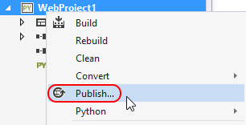
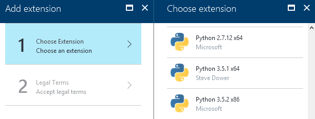
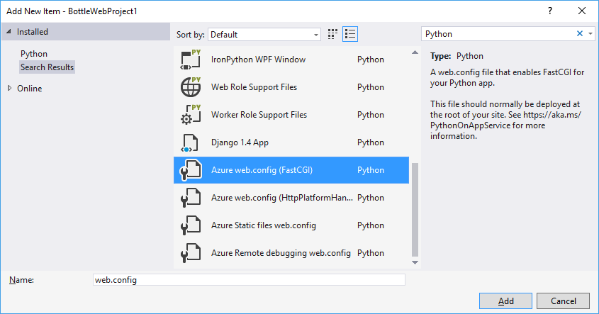
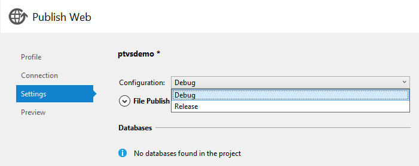

# Python web project templates

Python in Visual Studio supports developing web projects in Bottle, Flask, and Django frameworks through project templates and a debug launcher that can be configured to handle various frameworks. You can also use the generic **Web Project** template for other frameworks such as Pyramid.

Visual Studio does not include the frameworks themselves. You must install frameworks separately by right-clicking the project and selecting **Python > Install/upgrade framework...**.

When run, a project created from a template (as accessed through **File > New > Project...**) launches a web server with a randomly selected local port, opens your default browser when debugging, and allows direct publishing to Microsoft Azure.


The Bottle, Flask, and Django templates each include a starter site with some pages and static files. This code is sufficient to run and debug the server locally (where some settings need to be obtained from the environment) and to deploy to Microsoft Azure (where a [WSGI app](http://www.python.org/dev/peps/pep-3333/) object needs to be provided).

When creating a project from a framework-specific template, a dialog appears to help you install the necessary packages using pip. We also recommend using a [virtual environment](managing-python-environments-in-visual-studio.md#global-and-virtual-environments) for web projects so that the correct dependencies are included when you publish your web site:


When deploying to Microsoft Azure App Service, select a version of Python as a [site extension](https://aka.ms/PythonOnAppService) and manually install packages. Also, because Azure App Service does **not** automatically install packages from a `requirements.txt` file when deployed from Visual Studio, follow the configuration details on [aka.ms/PythonOnAppService](https://aka.ms/PythonOnAppService).

Microsoft Azure Cloud Services *does* support the `requirements.txt` file. [Azure cloud service Projects](template-azure-cloud-service.md) for details.

## Debugging

When a web project is started for debugging, Visual Studio starts the web server locally and opens your default browser to that address and port. To specify additional options, right-click the project, select **Properties**, and select the **Web Launcher** tab:

  

In the **Debug** group:

- **Search Paths**, **Script Arguments**, **Interpreter Arguments**, and **Interpreter Path**: these options are the same as for [normal debugging](debugging.md)
- **Launch URL**: specifies the URL that is opened in your browser. It defaults to `localhost`.
- **Port Number**: the port to use if none is specified in the URL (Visual Studio selects one automatically by default). This setting allows you to override the default value of the `SERVER_PORT` environment variable, which is used by the templates to configure the port the local debug server listens on.

The properties in the **Run Server Command** and **Debug Server Command** groups (the latter is below what's show in the image) determine how the web server is launched. Because many frameworks require the use of a script outside of the current project, the script can be configured here and the name of the startup module can be passed as a parameter.

- **Command**: can be a Python script (`*.py` file), a module name (as in, `python.exe -m module_name`), or a single line of code (as in, `python.exe -c "code"`). The value in the dropdown indicates which of these types is intended.
- **Arguments**: these arguments are passed on the command line following the command.
- **Environment**: a newline-separated list of `NAME=VALUE` pairs specifying environment variables. These variables are set after all properties that may modify the environment, such as the port number and search paths, and so may overwrite these values.

Any project property or environment variable can be specified with MSBuild syntax, for example: `$(StartupFile) --port $(SERVER_PORT)`.
`$(StartupFile)` is the relative path to the startup file and `{StartupModule}` is the importable name of the startup file. `$(SERVER_HOST)` and `$(SERVER_PORT)` are normal environment variables that are set by the **Launch URL** and **Port Number** properties, automatically, or by the **Environment** property.

> [!Note]
> Values in **Run Server Command** are used with the **Debug > Start Server** command or Ctrl-F5; values in the **Debug Server Command** group are used with the **Debug > Start Debug Server** command or F5.

### Sample Bottle configuration

The **Bottle Web Project** template includes boilerplate code that does the necessary configuration. An imported bottle app may not include this code, however, in which case the following settings launch the app using the installed `bottle` module:

- **Run Server Command** group:
  - **Command**: `bottle` (module)
  - **Arguments**: `--bind=%SERVER_HOST%:%SERVER_PORT% {StartupModule}:app`

- **Debug Server Command** group:
  - **Command**: `bottle` (module)
  - **Arguments** `--debug --bind=%SERVER_HOST%:%SERVER_PORT% {StartupModule}:app`

The `--reload` option is not recommended when using Visual Studio for debugging.

### Sample Pyramid configuration

Pyramid apps are currently best created using the `pcreate` command-line tool. Once an app has been created, it can be imported using the [From existing Python code](managing-python-projects-in-visual-studio.md#creating-a-project-from-existing-files) template. After doing so, select the **Generic Web Project** customization to configure the options. These settings assume that Pyramid is installed into a virtual environment at `..\env`.

- **Debug** group:
  - **Server Port**: 6543 (or whatever is configured in the .ini files)

- **Run Server Command** group:
  - Command: `..\env\scripts\pserve-script.py` (script)
  - Arguments: `Production.ini`

- **Debug Server Command** group:
    - Command: `..\env\scripts\pserve-script.py` (script)
    - Arguments: `Development.ini`

> [!Tip]
> You'll likely need to configure the **Working Directory** property of your project because Pyramid apps are typically one directory level deeper than the top of the source tree.

### Other configurations

If you have settings for another framework that you would like to share, or if you'd like to request settings for another framework, open an [issue on GitHub](https://github.com/Microsoft/PTVS/issues).

## Publishing to Azure App Service

There are two primary ways to publish to Azure App Service. First, deployment from source control can be used in the same way as for other languages, as described in the [Azure documentation](http://azure.microsoft.com/en-us/documentation/articles/web-sites-publish-source-control/). To publish direct from Visual Studio, right-click the project and select **Publish**:



After selecting the command, a wizard walks you through creating a web site or importing publish settings, previewing modified files, and publishing to a remote server.

When you create a site on App Service, you need to install Python and any packages your site depends upon. You can publish your site first, but it won't run until you have configured Python.

To install Python on App Service, we recommend using the [site extensions](http://www.siteextensions.net/packages?q=Tags%3A%22python%22) (siteextensions.net). These extensions are copies of the [official releases](https://www.python.org) of Python, optimized and repackaged for Azure App Service.

A site extension can be deployed through the [Azure portal](https://portal.azure.com/). Select the **Development Tools > Extensions** blade for your App Service, select **Add**, and scroll the list to find the Python items:



If you are using JSON deployment templates, you can specify the site extension as a resource of your site:

```json
{
    "resources": [
    {
        "apiVersion": "2015-08-01",
        "name": "[parameters('siteName')]",
        "type": "Microsoft.Web/sites",
        ...
    },
    "resources": [
    {
        "apiVersion": "2015-08-01",
        "name": "python352x64",
        "type": "siteextensions",
        "properties": { },
        "dependsOn": [
            "[resourceId('Microsoft.Web/sites', parameters('siteName'))]"
        ]
    },
    ...
}
```

Finally, you can log in through the [development console](https://github.com/projectkudu/kudu/wiki/Kudu-console) and install a site extension from there.

Currently, the recommended way to install packages is to use the development console after installing the site extension and executing pip directly. Using the full path to Python is important, or you may execute the wrong one, and there is generally no need to use a virtual environment. For example:

```command
c:\Python35\python.exe -m pip install -r D:\home\site\wwwroot\requirements.txt

c:\Python27\python.exe -m pip install -r D:\home\site\wwwroot\requirements.txt
```

When deployed to Azure App Service, your site runs behind Microsoft IIS. To enable your site to work with IIS, you need to add at least a `web.config` file. There are templates available for some common deployment targets available by right-clicking the project and selecting **Add > New Item...** (see dialog below), and these configurations can be easily modified for other uses. See the [IIS Configuration Reference](https://www.iis.net/configreference) for information about the available configuration settings.



The available items include:

- Azure web.config (FastCGI): adds a `web.config` file for when your app provides a [WSGI](https://wsgi.readthedocs.io/en/latest/) object to handle incoming connections.
- Azure web.config (HttpPlatformHandler): adds a `web.config` file for when your app listens on a socket for incoming connections.
- Azure Static files web.config: when you have one of the above `web.config` files, add the file to a subdirectory to exclude it from being handled by your app.
- Azure Remote debugging web.config: adds the files necessary for remote debugging over WebSockets.
- Web Role Support Files: contains the default deployment scripts for cloud service web roles.
- Worker Role Support Files: contains the default deployment and launch scripts for cloud service worker roles.

If you add the debugging `web.config` template to your project and plan to use Python remote debugging, you need to publish the site in "Debug" configuration. This setting is separate from the current active solution configuration and always defaults to "Release." To change it, open the **Settings** tab and use the **Configuration** combo box in the publish wizard (see the [Azure documentation](https://azure.microsoft.com/develop/python/) for more information on creating and deploying to Azure Web Apps):



The **Convert to Microsoft Azure Cloud Service Project** command (image below) adds a cloud service project to your solution. This project includes the deployment settings and configuration for the virtual machines and services to be used. Use the **Publish** command on the cloud project to deploy to Cloud Services; the **Publish** command on the Python project still deploys to Web Sites. See [Azure cloud service Projects](template-azure-cloud-service.md) for more details.


