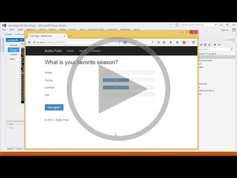
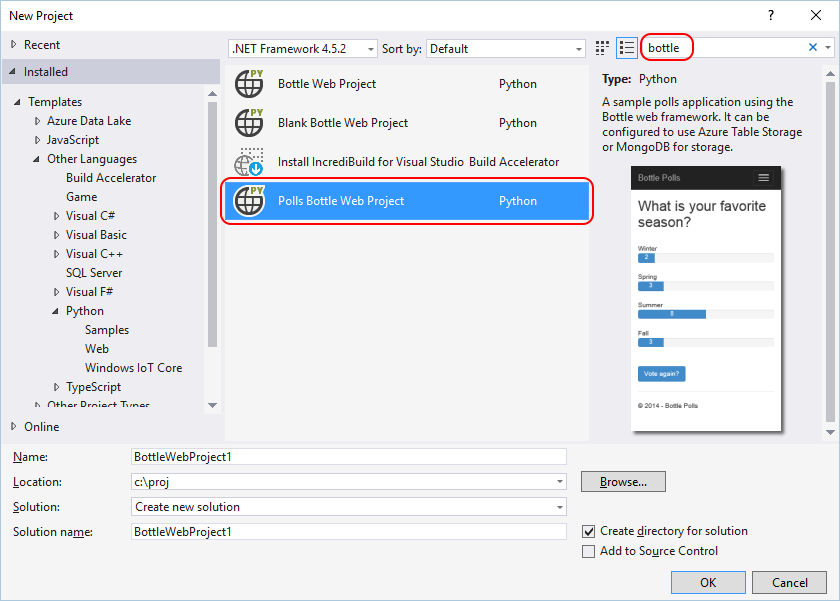
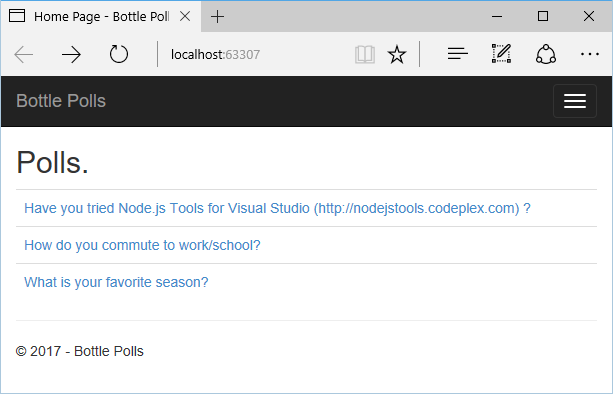
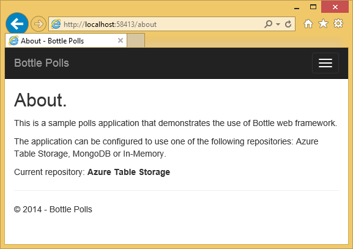
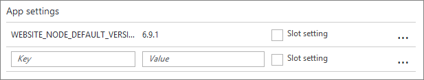
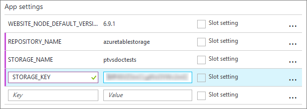

# Tutorial: Bottle and Azure Table Storage on Azure

In this tutorial, we'll create a simple polls (voting) application using Python for Visual Studio (PTVS) and a sample project template.

The application defines an abstraction for its repository, so you can easily switch between different types of repositories. Here we'll use a local, in-memory repository first, then switch over to Azure Table Storage as we publish the application to Azure App Service. The following video provides a walkthrough of the process:

[](http://www.youtube.com/watch?v=GJXDGaEPy94)

In this topic:

+ [Prerequisites](#prerequisites)
+ [Create the project](#create-the-project)
+ [Create an Azure Storage Account](#create-an-azure-storage-account)
+ [Configure the project](#configure-the-project)
+ [Explore the Azure Table Storage](#explore-the-azure-table-storage)
+ [Publish to Azure App Service](#publish-to-azure-app-service)
+ [Configure the site](#configure-the-site)


[!INCLUDE[include](../includes/tutorial-prereqs.md)]

 ## Create the project

In this section we'll create the Visual Studio project, create a virtual environment for Python, and install required packages into that environment. We'll then run the application locally using the default in-memory repository. The virtual environment is helpful when we later deploy to Azure.

1. In Visual Studio, select **File > New > Project**, search for "Bottle", select the **Polls Bottle Web Project**, and click **OK**. If you don't see the Polls project template, you may not have installed the PTVS Sample Pack, and you may need to restart Visual Studio.
   
  

[!INCLUDE[include](../includes/tutorial-environment-setup-test.md)]

1. Click **Create Sample Polls**, then click on a poll and vote:

  

1. Stop the debugger when you're finished (**Debug > Stop Debugging** or Shift-F5).

## Create an Azure Storage Account

Follow the instructions on [Create a storage account](https://docs.microsoft.com/en-us/azure/storage/storage-create-storage-account#create-a-storage-account) in the Azure documentation, using the default settings (a **General Purpose** storage account includes tables) and choosing a geographic region close to your own. Record the name that you enter for the storage account here, as it's the host name that you use to access the storage.

## Configure the Project

Next we'll configure the application to use the storage account created above, then run the application locally:

1. Follow the instructions on[] Manage your storage account](https://docs.microsoft.com/en-us/azure/storage/storage-create-storage-account#manage-your-storage-account) in the Azure documentation, specifically the section "View and copy storage access keys." Keep the browser open to this page as we'll need one of the keys in a moment.

1. In Visual Studio, right-click on your project node in Solution Explorer, select **Properties**, click on the **Debug** tab, and scroll down to the **Debug Server Command** group.

1. In the **Environment** box, enter the following:

  ```
    REPOSITORY_NAME=azuretablestorage
    STORAGE_NAME=<storage_account_name>
    STORAGE_KEY=<primary_access_key>
  ```

  where you replace &lt;storage_account_name&gt; with the name you entered in the Azure portal, and replace &lt;primary_access_key&gt; with the first access key from the Azure portal in step 1 above.

  

  These values set the environment variables when you use **Debug > Start Debugging** or F5.  To set the same variables when running without debugging, copy the values to the **Run Server Command > Environment** field as well.

  Alternatively, you can define environment variables using the Windows Control Panel.  This is a better option if you want to avoid storing credentials in the project file.  Note that you will need to restart Visual Studio for the new environment values to be available to the application.

1. Run the application with **Debug > Start Debugging** or F5. Provided that your configuration is correct, data is now being saved in Azure Table Storage. You can verify this by answering the various polls with different answers, and noting that the votes accumulate. You can also browse to the **About** page and note the **Current repository**:

  

1. Stop the debugger when you're finished.

> [!Tip]
> The code that manages the repository is found in `models/azuretablestorage.py`. For details on what this code is doing, see [How to Use Table Storage (Python)](http://azure.microsoft.com/en-us/documentation/articles/storage-python-how-to-use-table-storage/) in the Azure documentation.

[!INCLUDE[include](../includes/tutorial-explore-azure-table-storage.md)]

## Publish to Azure App Service

PTVS provides an easy way to deploy your web application to a website in Azure App Service. You can use an existing App Service if you like, or create one in the process.

1. In **Solution Explorer**, right-click the project select **Publish**. 

1. In the **Publish** dialog, select **Microsoft Azure App Service**:

  

1. In the **App Service** dialog, select an existing App Service or click **New** to create one, specifying a name for the web app along with your subscription, resource group, and App Service Plan. Once you've selected an App Service, its details will appear in the **Publish** dialog's **Connection** tab:

  

1. Click **Next >** to review additional settings, then click **Publish**. Once your application is deployed to Azure, your default browser will open on that site. However, if you look at the **About** page you'll see that the site is using an in-memory repository instead of your Azure Table Storage. This is because we need to set the environment variables in the application's code, which we'll do in the next section.

## Configure the Azure App service

In this section you'll configure the Azure App Service with environment variables that point to your Azure Table Storage account. These values will be loaded by the code in the application's `settings.py` file. 

1. In the Azure portal, navigate to the App Service to which you deployed the application in the previous step.
1. Select the **Settings > Application settings** blade and scroll down to **App settings**.

  

1. In the blank key/value fields, add the following pairs, identical to those you used in the project's environment settings earlier:

  | Key | Value |
  | --- | --- |
  | REPOSITORY_NAME | azuretablestorage |
  | STORAGE_NAME | (your storage account name) |
  | STORAGE_KEY | (the storage access key) |
  
  
  
1. Select **Save** to apply the settings, which will update the live web app.

1. Browse to the web site's **About** page again (refreshing if necessary), and you should see that it's now using **Azure Table Storage**.