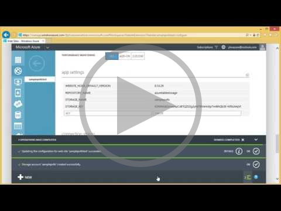
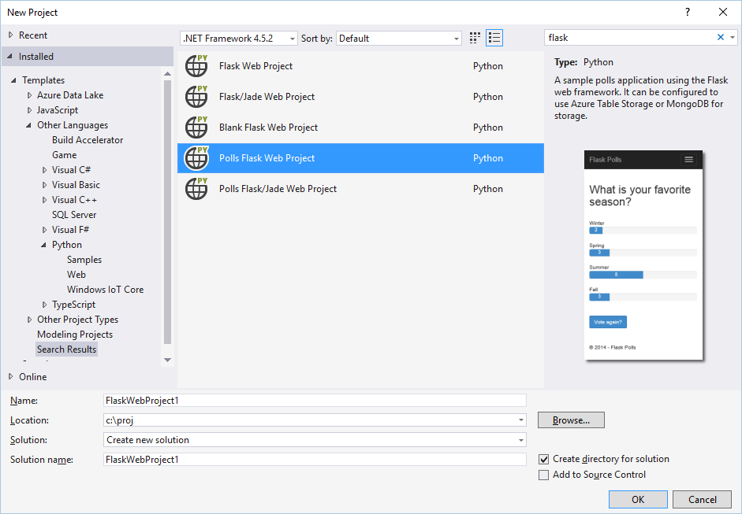

# Tutorial: Flask and Azure Table Storage on Azure

[!INCLUDE[include](includes/tutorial-azure-storage-intro.md)]

[!INCLUDE[include](includes/tutorial-topic-toc-prereqs.md)]

[!INCLUDE[include](includes/tutorial-create-intro.md)]

1. In Visual Studio, select **File > New > Project**, search for "Flask", select the **Polls Flask Web Project**, and click **OK**. If you don't see the Polls project template, you may not have installed the PTVS Sample Pack, and you may need to restart Visual Studio.
   
  

[!INCLUDE[include](includes/tutorial-environment-setup-test.md)]

[!INCLUDE[include](includes/tutorial-azure-storage-configure-project.md)]

[!INCLUDE[include](includes/tutorial-explore-azure-table-storage.md)]

[!INCLUDE[include](includes/tutorial-publish-configure-app-service.md)]